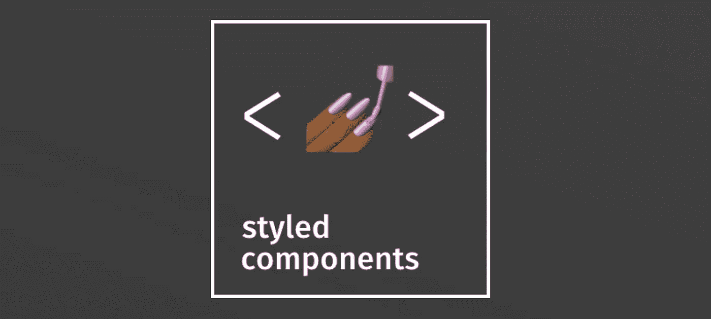
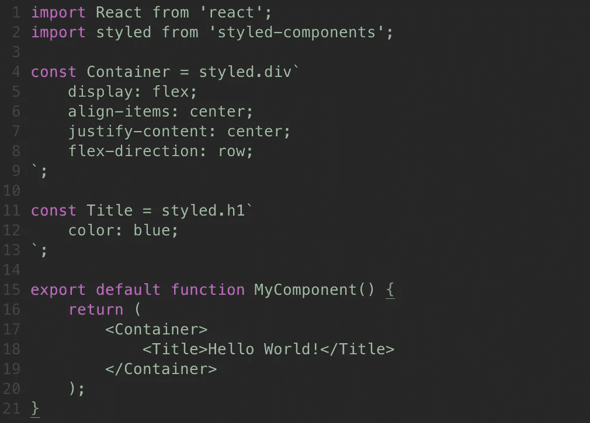
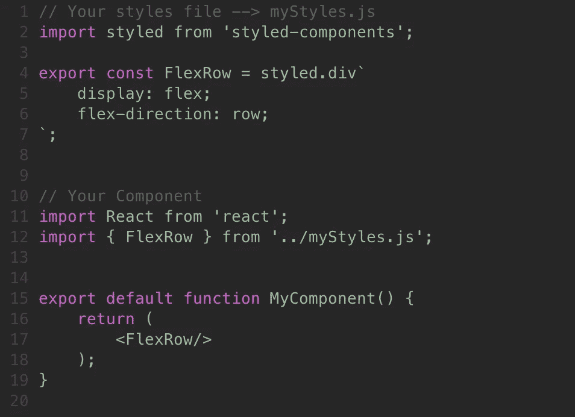
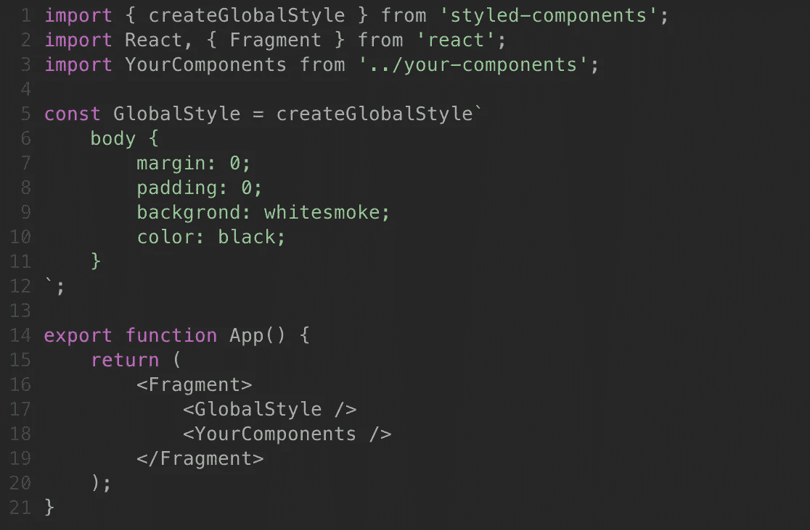

# 在 React 中使用样式化组件。射流研究…

> 原文：<https://medium.com/geekculture/using-styled-components-in-react-js-250e99da8d7d?source=collection_archive---------5----------------------->



# 什么是样式组件？

Styled components 是一个库，它允许您编写 javascript 代码，使用 JSX 语法对 react 组件进行样式化，而不是使用传统的样式表添加类或标签。

> 要安装，您可以运行以下命令:

```
npm i styled-components
```

# 让我们看一些示例代码



## 在我们开始一些更复杂的样式化组件用例之前，让我们先分解一下这段代码！

因此，就像任何其他软件包一样，一旦你安装了它，我们将从“样式-组件”中导入它。

本质上，我们可以使用这个样式化的对象来创建一个特定的“HTML 标签”并应用样式指南，就像在 CSS 中一样！

例如，我们正在制作一个 *div* ，并将其命名为*容器。*您可以选择任何您喜欢的名字，但是为了遵循标准命名惯例，您应该始终大写第一个字符。

然后在几个反勾号内``我们写的正是我们用 CSS 写的！

最后，我们可以在 return/render 语句中将它们作为 JSX 标签返回！

# 现在让我们来看看一些很酷的功能！

## #1 —动态道具


Styled-Components 允许我们将动态属性传递给我们的 JSX 标签，它可以用来改变组件的行为和样式！

在上面的例子中，我们创建了一个简单的<box>,当我们点击它时，我们希望它切换颜色。</box>

我们通过向我们的<box>传递一个适当的参数来实现这一点，就像我们将 props 向下传递给一个子组件一样，然后我们在我们的样式声明中获得对 props 值的访问。</box>

让我们来看看我们可以声明道具的一些方法！

#1 —作为一个变量

```
<Box color={someVariable} />// In our styled code it will be available as colorconst Box = styled.div`
    background-color: ${props => props.color};
`;
```

#2 —作为静态值

```
<Box maxHeight={'50px'} />// In our styled code it will be available as maxHeightconst Box = styled.div`
    max-height: ${props => props.maxHeight};
`;
```

#3 —使用标签作为布尔值

```
<Box green />// By writing just green, there is a prop green that is a truthy valueconst Box = styled.div`
    background-color: ${props => props.green ? 'green' : 'red'};
`;
```

## #2—样式表/可重复使用的组件

通常情况下，您会有一些想要在整个应用程序中使用的样式化对象。像在传统的 CSS 中一样，你可以有一个特定的文件，你可以在其中声明，然后导出它们以供使用。

下面是一个可视化示例的示例片段。



## #3—全局样式

有时，您可能希望在整个应用程序中实施一组样式规则。幸运的是，对于样式化组件，这非常简单！

下面是一个简单的例子，然后我将遍历代码。



为了访问全局样式，我们将从名为 **createGlobalStyle 的“styled-components”中导入一个方法。**

当我们创建我们的全局样式时，如你所见，我们可以对它应用 CSS 类，在这个例子中是对主体的一些简单修改。

然后，在我们的< GlobalStyle / >下呈现的任何组件都将应用这些规则，所以在大多数情况下，您会希望这些规则位于组件树的顶部。

# 继续样式化组件

非常感谢您阅读这个关于样式化组件的例子！对于每一项技术，我不可能在几分钟时间内完全掌握，但我希望这对你们中的许多人来说是一个很好的切入点。

> 官方文件:[https://styled-components.com/](https://styled-components.com/)