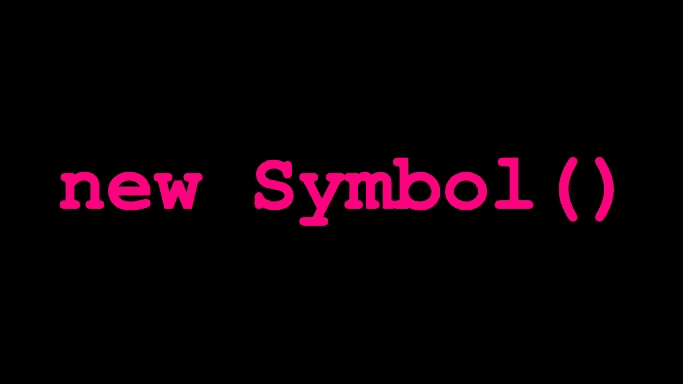

# 在 TypeScript 中使用符号

> 原文：<https://medium.com/geekculture/using-symbols-in-typescript-b477d79e104f?source=collection_archive---------2----------------------->

由于 JavaScript 在 ECMAScript 2015 中引入了一个名为`symbol`的原语类型，TypeScript 也原生支持它。用这种静态类型语言编码的优势使开发人员有可能使用类型来加强某些界限，从而加速开发过程。今天我将介绍一下`symbol`类型最流行的用法，它们可以增强读者的工作流程。

The most basic constructor invocation for a symbol.

# 属性反序列化缓解

由于管理原语和包装类型检查的复杂规则，JavaScript 中的序列化可能很容易变得棘手，尤其是在讨论`typeof`操作符时。依赖于正确完成序列化的项目通常使用一个经过良好测试的外部库来完成这项工作。不幸的是，专用库的使用可能并不总是涵盖所有敏感的情况。

我认为反序列化(将保存在某个介质中的对象转换成内存中的表示)应该总是从输入中去除未说明的属性。如果没有发生这种情况，系统的一些组件可能会将一个*恶意结果对象*移动到相关代码库的特权部分，这可能会导致严重的损害，具体取决于暴露程度。由于 TypeScript 没有一个纯粹的名义类型系统，而是一个结构化的系统，即使对于经验丰富的开发人员来说，跟踪上述问题也是一件非常困难的事情。

例如，一个允许非员工用户注册的系统在某个端点的请求体中需要两个字符串参数`username`和`password`。在反序列化之后，它的控制器将结果传递给一个函数，该函数能够创建接受一个对象的用户，该对象包含三个参数:`username`、`password`和一个可选的布尔值`staff`。如果反序列化没有从请求正文中删除附加属性，则恶意代理可以显式发送参数`staff`(设置为 true)以获得更多权限，如下例所示:

An example of malicious privilege escalation.

使用符号键属性是解决上述安全威胁的众多解决方案之一。由于符号并不隐式地与反序列化一起工作，因此前面引用的函数可以期望一个特殊的属性，该属性使用符号作为其键来定义，用于受控的权限提升。为了说明这一变化，我写了下面的一个片段:

An example of verified privilege escalation.

正如我以前所写的，一些序列化库赋予用户移除未定义属性的可能性。我最喜欢的库，叫做 *io-ts* ，用`exact`编解码器生成器支持上述特性。我通常将它与`readonly`和`type`构建器结合使用来创建对象编解码器。

# *属性序列化缓解*

如上所述，序列化(或者说 JSON stringifying)省略了符号。这个事实允许在对象中定义隐藏的属性，而不用担心它们最终的暴露。我准备了一个简单的片段来展示前面提到的想法:

An example of symbol-based attributes not being serialized.

存在多种公开秘密信息的方式，即已经提到的序列化(包括)、将对象记录到控制台(不能打印符号键属性)或枚举键(与前面相同)。可以使用上述技术来传递元数据信息，而无需在封送处理期间显式移除这些属性。在应用这种模式之前，我建议读者考虑它在手工任务方面的实用性——如果应用和管理正确，隐含可能对一个人有利。

# 名义上的强制打字

正如我之前所说的，TypeScript 的行为不像一种名义类型语言。存在某些例外(例如`enums`)，但是我发现首先把它作为一种结构化的语言是最合理的方法。TypeScript 开发人员可以在某种程度上实现名义类型，如下例所示:

An example of nominal typing in TypeScript.

上面的代码片段展示了`User`和`UserDto`类型如何使用不同的符号键来区分彼此，尽管它们共享相同的数据属性。为了减轻开发人员将正确的符号注入到相应对象中的负担，我创建了两个简单的助手函数(读者可以将它们视为*构造函数*),它们在构建时不会暴露任何基于符号的逻辑。由于 TypeScript 将这两种结构视为不同的类型，因此我证明了所讨论的语言确实支持名义类型的某些方面。

# 摘要

如前所述，TypeScript 采用了 JavaScript 中的符号类型，并将其视为其类型系统的一等公民，这允许开发人员利用符号和设计模式来构建解决其架构问题的结构。基于符号的构造可以保护开发人员不导入或导出可能有害的信息，并使他们可以声明名义类型。亲爱的读者，如果你知道如何在日常编码中使用符号的另一个例子，请在本文的评论部分分享。