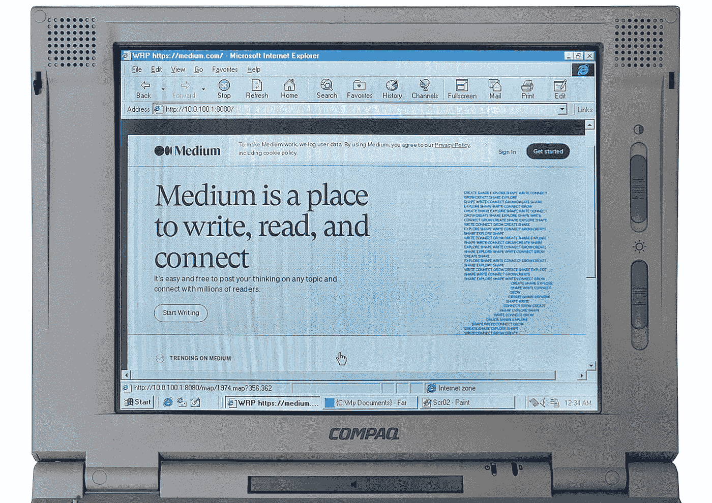

# 修复和使用 1997 年价值 5000 美元的 Compaq LTE 笔记本电脑

> 原文：<https://medium.com/geekculture/using-the-5-000-compaq-lte-laptop-from-1997-bfb6e55bef30?source=collection_archive---------7----------------------->

如今，几乎每个人都能买得起笔记本电脑，价格从 50 美元左右开始。但不久前，它还是一种奢侈品。使用这样的机器感觉如何？得到答案的唯一方法是尝试。

# 五金器具

那些对技术细节不感兴趣的人，可以跳过这一部分继续…