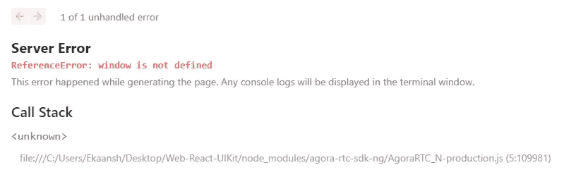

# 使用带有 Next.js 的 Agora Web UIKit 构建一个视频聊天应用程序

> 原文：<https://medium.com/geekculture/using-the-agora-web-uikit-with-next-js-build-a-video-chat-app-97a3bfc1d125?source=collection_archive---------9----------------------->

我在之前的博客[中写过关于使用](https://www.agora.io/en/blog/agora-web-uikit-add-video-calling-or-live-streaming-to-your-website-in-minutes/) [Agora Web UIKit](https://github.com/AgoraIO-Community/Web-React-UIKit/) 为你的网站添加直播或视频通话功能。在这篇博文中，我将描述如何在你的 [Next.js](https://nextjs.org/) web 应用中使用 Agora Web UIKit。

当使用服务器端渲染(SSR)或静态站点生成(SSG)时，我们将使用[动态导入](https://nextjs.org/docs/advanced-features/dynamic-import)来导入带有 Next.js 的 Agora SDK(不会遇到`“window is not defined”`错误)。

# 让我们以 React 为例

当我尝试从我的 Next.js 应用程序中的 [Agora Web UIKit repo](https://github.com/AgoraIO-Community/Web-React-UIKit/) 导入使用`create-next-app`创建的 [React 示例组件](https://github.com/AgoraIO-Community/Web-React-UIKit/blob/main/example/src/App.tsx)时，如下所示:

我得到了`“window is not defined”`错误:

如果我们查看调用堆栈，我们可以看到错误是由 Agora SDK 抛出的。

# 为什么我会看到这个错误？

Next.js 使用 SSR 和 SSG——当 Agora 库被导入时(直接或通过 Agora Web UIKit ),它访问浏览器上可用的[窗口](https://developer.mozilla.org/en-US/docs/Web/API/Window)对象。Next.js 要么在服务器上预先呈现 web 页面(SSG)，要么为每个请求呈现 web 页面(SSR)。这将导致一个错误，因为在服务器上无法访问窗口对象。因此出现了`“window is not defined”`错误。

# 解决方法是什么？

修复非常简单:我们希望只有当页面在浏览器中呈现时才导入 Agora Web UIKit。您可以使用对窗口对象的条件检查来破解解决方案，但是 Next.js 提供了一个更干净的解决方案— [没有 SSR 的动态导入](https://nextjs.org/docs/advanced-features/dynamic-import#with-no-ssr)。

我现在可以通过使用`dynamic()`函数调用来替换我的视频通话导入。第一个参数接受一个函数，该函数只从我们的文件中导入组件。第二个参数接受一个对象，其中我们将`ssr`标记为 false，因为我们不想在服务器端包含这个模块。

一旦我们在`Videocall`组件中更新了 Agora 应用 ID，我们就可以让这个例子工作了。而现在我们的 Next.js web app 有视频通话了！

# 结论

你可以在这里查看例子 Next.js Web UIKit 项目。如果你想更深入地了解，你可以阅读这篇博文来深入了解这个例子。您还可以查看 Web UIKit [GitHub Repo](https://github.com/AgoraIO-Community/Web-React-UIKit) 以及 [API 参考](https://agoraio-community.github.io/Web-React-UIKit/)。

我们有适用于 [Android](https://github.com/AgoraIO-Community/Android-UIKit) 、 [iOS](https://github.com/AgoraIO-Community/iOS-UIKit) 、 [React Native](https://github.com/AgoraIO-Community/ReactNative-UIKit) 和 [Flutter](https://github.com/AgoraIO-Community/Flutter-UIKit) 的 UIKits。你也可以去看看。如果您在使用 Agora Web UIKit 时有任何问题，我邀请您加入 [Agora 开发者 Slack 社区](https://agora.io/en/join-slack)。你可以在`#web-help-me channel`里提出你的问题。