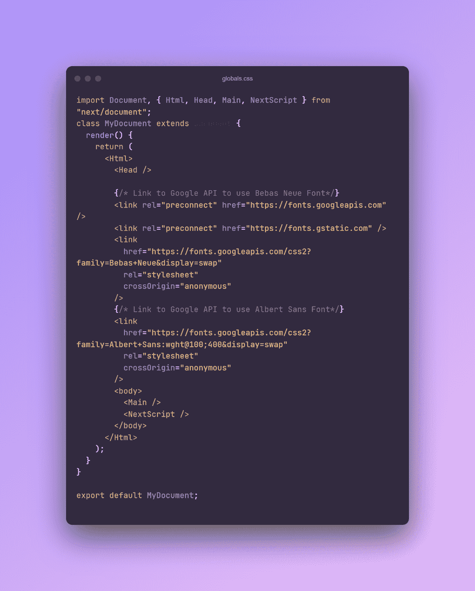
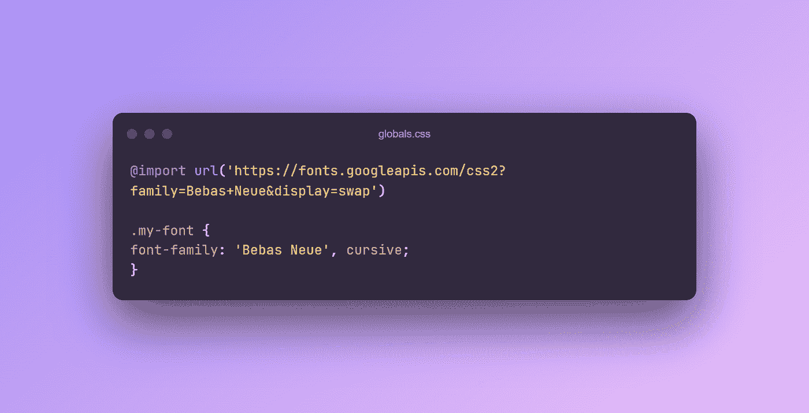

# 以正确的方式使用 Google Fonts API 和 Next.js 和 TypeScript。

> 原文：<https://medium.com/geekculture/using-the-google-fonts-api-with-next-js-and-typescript-the-right-way-ce343d5bce20?source=collection_archive---------7----------------------->

## 字体是你项目中不可或缺的一部分，拥有自己的选择并知道如何实现它会让你对继续进行这个项目感到非常兴奋。


## 先决条件—只有两个

*   用 TypeScript 初始化的 Next.js 项目。

```
npx create-next-app@latest --ts
// or
yarn create next-app --typescript
```

*   要应用字体的文本。

在 NextJs 项目中，使用 CDN 并不是一个真正可行的做法，因为乍看起来不像 React，没有 index.html 文件(应用入口点)。像 Tailwind 和 AntCSS 这样的流行库将 npm 包作为用框架构建的 web 应用程序中的“最佳实践”。

然而，也有例外，其中之一就是谷歌字体。让我们探讨一下在您的项目中实现 Google 字体的两种方法:

1.  **使用 _document.tsx 文件(推荐)**



*下一个样本 js _document.tsx 文件*

这里我们像普通的 HTML 项目一样使用字体 CDN，但是像这样的链接要放入一个 _document.tsx(jsx)文件中

**2。导入字体 Url**

如果你有自己的字体文件，这并不特别管用，但是除了谷歌字体上没有的字体，我强烈推荐第一种方法。这里我们通过生成的 [google fonts 站点](https://fonts.google.com/specimen/Bebas+Neue)导入字体，然后在 CSS 中声明它们。

**注意:**这要在项目的 globals.css 文件中完成，因为这个 css 文件是您的通用文件，这里的更改会影响整个应用程序中的所有页面

