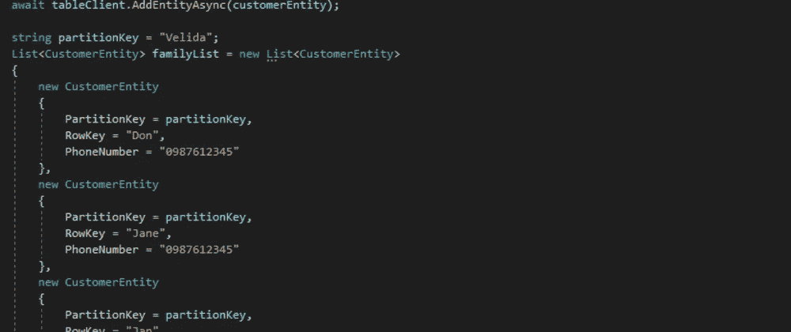
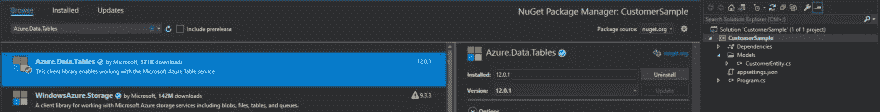
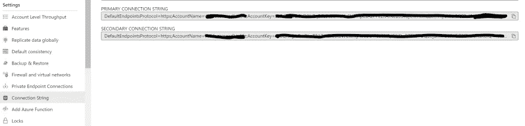
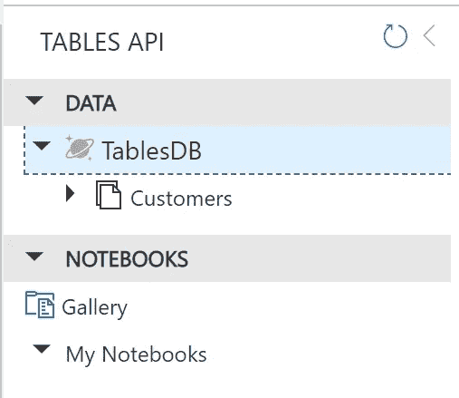
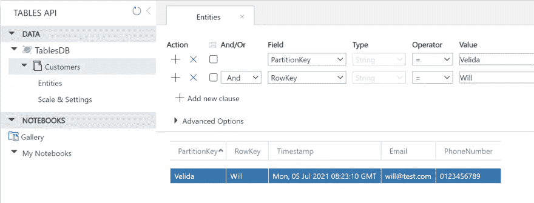
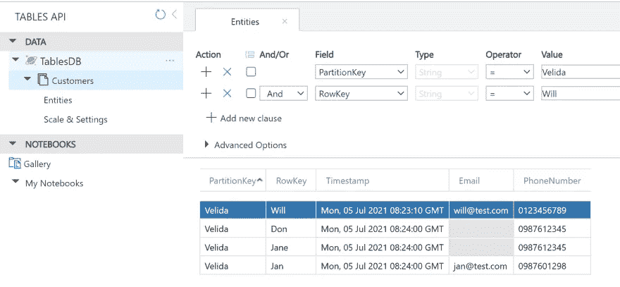
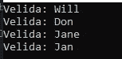
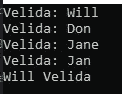
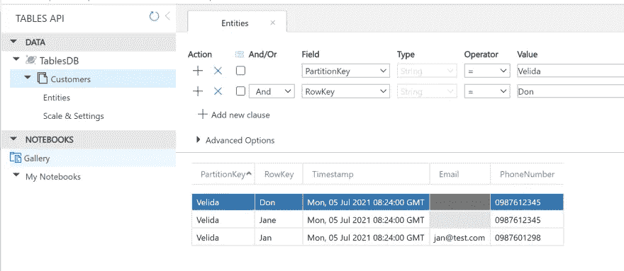

# 使用新的 C# Azure。带有 Azure Cosmos DB 的数据表 SDK

> 原文：<https://medium.com/geekculture/using-the-new-c-azure-data-tables-sdk-with-azure-cosmos-db-786085ac8190?source=collection_archive---------2----------------------->

## 在本文中，我将向您展示我们如何使用新的 Azure 对 Azure Cosmos DB Table API 帐户执行简单的操作。表 C# SDK。



上个月， [Azure SDK 团队发布了一个新的 Azure Tables 库。NET，Java，JS/TS 和 Python](https://devblogs.microsoft.com/azure-sdk/announcing-the-new-azure-data-tables-libraries/) 。这个版本使 Table SDK 与其他[Azure SDK](https://aka.ms/azsdk/guide)保持一致，它们使用特定的 Azure 核心包来处理请求、错误和凭证。

[Azure Cosmos DB 提供了一个 Table API](https://docs.microsoft.com/en-us/azure/cosmos-db/table-introduction) 产品，本质上是 Azure Table Storage 的兴奋剂！如果你需要一个全球分布的表存储服务，Azure Cosmos DB 应该是你的首选。

如果你要在 Azure Cosmos DB Table API 和常规 Azure Table 存储之间做出选择，我建议你阅读下面的[文章](https://docs.microsoft.com/en-us/azure/cosmos-db/table-introduction#table-offerings)。

在本文中，我将向您展示我们如何使用新的 Azure 对 Azure Cosmos DB Table API 帐户执行简单的操作。表 C# SDK。具体来说，我们将回顾:

*   安装 SDK💻
*   连接到我们的表客户机并创建一个表🔨
*   定义我们的实体🧾
*   添加实体➕
*   执行事务性批处理操作💰
*   查询我们的表❓
*   删除实体❌

让我们开始吧！

# 安装 SDK💻

安装 SDK 非常简单。我们可以通过运行下面的 *dotnet* 命令来做到这一点:

```
dotnet add package Azure.Data.Tables
```

如果你更喜欢使用 UI 来安装 NuGet 包，我们可以在 Visual Studio 中右键单击我们的 C#项目，单击管理 NuGet 包并搜索 **Azure。数据表**包:



# 连接到我们的表客户机并创建一个表🔨

SDK 为我们提供了两个客户端来与服务进行交互。一个 *TableServiceClient* 用于在帐户级别与我们的表进行交互。

我们这样做是为了创建表、设置访问策略等。

我们也可以使用一个 *TableClient* 。这用于在我们的实体上执行操作。我们还可以使用 *TableClient* 来创建如下表格:

```
TableClient tableClient = new TableClient(config["StorageConnection"], "Customers");
            await tableClient.CreateIfNotExistsAsync();
```

为了创建我们的表客户端，我从 Azure 传入我的存储连接字符串和我想要与之交互的表的名称。在下面一行中，如果表不存在，我们就创建它。

要获取存储连接字符串，我们可以从我们的 Cosmos DB 帐户的**连接字符串**下进行:



当我们第一次运行这段代码时，我们可以看到已经在数据浏览器中创建了这个表:



# 定义我们的实体🧾

在表存储中，我们在表中创建需要一个*分区键*和一个*行键*的实体。这些的组合需要在我们的表中是唯一的。

实体有一组属性，强类型实体需要从 *ITableEntity* 接口扩展，该接口公开分区键、行键、ETag 和时间戳属性。ETag 和 Timestamp 会由 Cosmos DB 生成，所以我们不需要设置这些。

对于本教程，我将使用上述属性和两个字符串属性(Email 和 PhoneNumber)来组成一个 **CustomerEntity** 类型。

```
public class CustomerEntity : ITableEntity
{
    public string PartitionKey { get; set ; }
    public string RowKey { get; set; }
    public string Email { get; set; }
    public string PhoneNumber { get; set; }
    public DateTimeOffset? Timestamp { get; set; }
    public ETag ETag { get; set; }
}
```

# 添加实体➕

要向我们的表中添加一个新实体，我们需要实例化它并简单地调用*。AddEntityAsync()* 方法来插入它:

```
CustomerEntity customerEntity = new CustomerEntity()
{
     PartitionKey = "Velida",
     RowKey = "Will",
     PhoneNumber = "0123456789",
     Email = "will@test.com"
};await tableClient.AddEntityAsync(customerEntity);
```

回到 Cosmos DB 中的 Customers 表，我们可以看到实体被成功插入。



# 执行事务性批处理操作💰

表服务允许我们在一个批处理请求中进行多个操作。

事务是“全有或全无”，这意味着如果我们批处理中的一个操作失败，**它们都将失败！**事务可以混合执行创建、删除、更新和更新操作。

请注意，一个事务中的所有操作都需要以同一个分区键为目标。

在下面的代码片段中，我正在创建一个 *CustomerEntity* 对象的列表，我将把这些对象作为一个批处理创建操作插入到我的表中。

然后，我们创建一个类型为 *TableTransactionAction* 的新列表，并将我们希望包含在批处理操作中的实体列表添加到其中。然后我们使用*。SubmitTransactionAsync()* 提交批处理操作的方法:

```
string partitionKey = "Velida";
List<CustomerEntity> familyList = new List<CustomerEntity>
{
      new CustomerEntity
      {
            PartitionKey = partitionKey,
            RowKey = "Don",
            PhoneNumber = "0987612345"
      },
      new CustomerEntity
      {
            PartitionKey = partitionKey,
            RowKey = "Jane",
            PhoneNumber = "0987612345"
      },
      new CustomerEntity
      {
            PartitionKey = partitionKey,
            RowKey = "Jan",
            PhoneNumber = "0987601298",
            Email = "jan@test.com"
      }
};List<TableTransactionAction> addFamilyBatch = new List<TableTransactionAction>();addFamilyBatch.AddRange(familyList.Select(f => new TableTransactionAction(TableTransactionActionType.Add, f)));Response<IReadOnlyList<Response>> response = await tableClient.SubmitTransactionAsync(addFamilyBatch);
```

回到我们的表中，我们可以看到实体已经成功地插入到我们的表中:



# 查询我们的表❓

我们可以用几种方法查询表存储中的数据。下面的代码片段使用了一个 OData 表达式。

使用 OData 查询过滤器可能是一件痛苦的事情，但是 SDK 提供了一个帮助器库，使它变得稍微容易一些。使用*。CreateQueryFilter()* ，我们可以这样编写我们的 OData 查询:

```
Pageable<TableEntity> oDataQueryEntities = tableClient.Query<TableEntity>(filter: TableClient.CreateQueryFilter($"PartitionKey eq {partitionKey}"));foreach (TableEntity entity in oDataQueryEntities)
{
    Console.WriteLine($"{entity.GetString("PartitionKey")}:{entity.GetString("RowKey")}");
}
```

运行这段代码，我们可以看到我们的实体*分区键*和*行键*的连接，如下所示:



我们还可以使用 LINQ 表达式来查询我们的表。这里，我使用 LINQ 查询来检索一个 *CustomerEntity* ，其 *RowKey* 值为“Will”:

```
Pageable<CustomerEntity> linqEntities = tableClient.Query<CustomerEntity>(customer => customer.RowKey == "Will");foreach (var entity in linqEntities)
{
     Console.WriteLine($"{entity.RowKey} {entity.PartitionKey}");
}
```

当这段代码运行时，我们可以看到打印出来的实体:



# 删除实体❌

从我们的表中删除实体只是一个简单的*。DeleteEntityAsync()* 调用。我们需要做的就是像这样传入我们的*分区键*和*行键*值:

```
await tableClient.DeleteEntityAsync(partitionKey, "Will");
```

检查我们的表，我们可以看到我们的实体已被成功删除:



# 包扎

希望读完这篇文章后，你能理解使用 Azure。Data.Tables SDK 非常简单。我喜欢 Azure SDK 团队采取的使其 SDK 彼此更加一致的方法。

使用天蓝色。Data.Tables SDK，我们可以构建同时使用 Azure Cosmos DB 表存储和常规表存储的应用程序，因此如果您发现您正在使用常规表存储构建应用程序，并且您正在努力扩展，您可以切换到 Cosmos DB，而无需任何代码更改！

如果你想了解更多关于 Azure 的知识。Data.Tables library，看看[这篇博文](https://devblogs.microsoft.com/azure-sdk/announcing-the-new-azure-data-tables-libraries/)和[这篇 GitHub repo](https://github.com/Azure/azure-sdk-for-net/tree/main/sdk/tables/Azure.Data.Tables/samples) ！

希望这篇文章对你有用！一如既往，如果你有任何问题，欢迎在下面评论或在 [Twitter](https://twitter.com/willvelida) 上问我！

编码快乐！💻👨‍💻👩‍💻