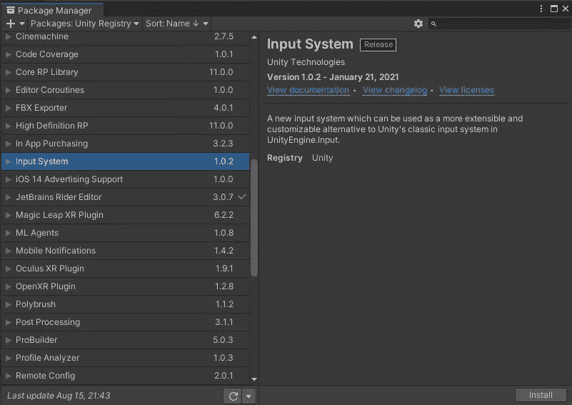
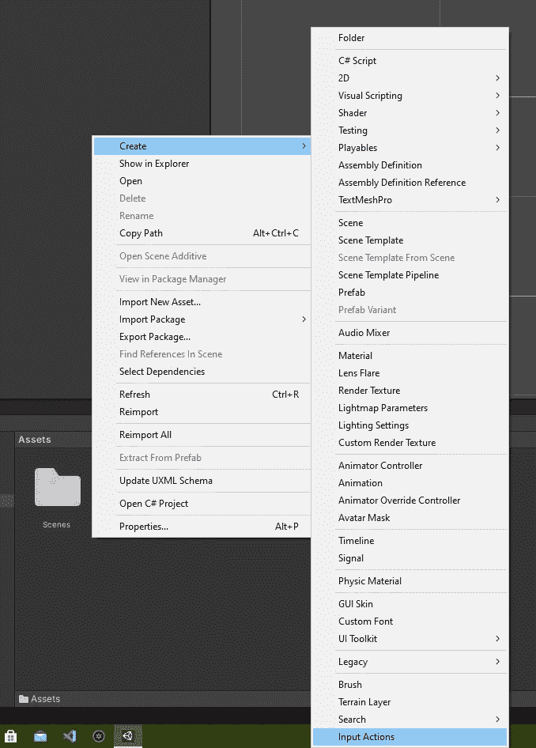
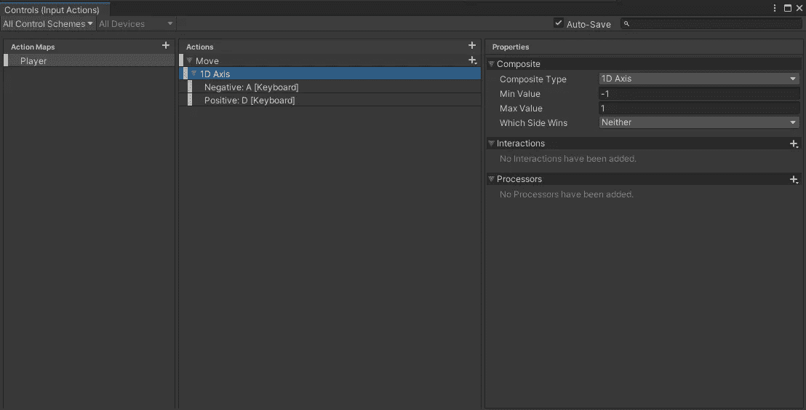
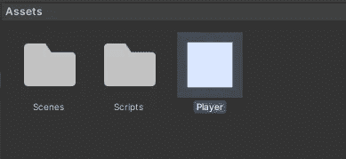
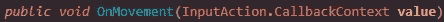
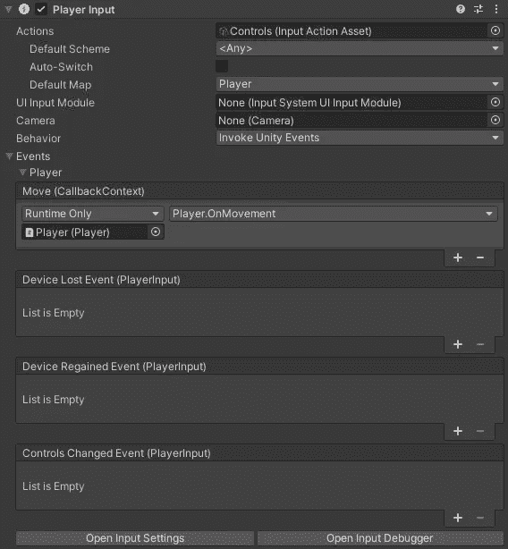

# 在多人游戏中使用新的 Unity 输入系统和 MLAPI(第 1 部分)

> 原文：<https://medium.com/geekculture/using-the-new-unity-input-system-with-mlapi-in-a-multiplayer-game-part-1-eabd244b47e?source=collection_archive---------11----------------------->

Photo by [Hello Lightbulb](https://unsplash.com/@hellolightbulb?utm_source=medium&utm_medium=referral) on [Unsplash](https://unsplash.com?utm_source=medium&utm_medium=referral)

MLAPI 是 unity 的新中级网络库。这减少了网络代码，并通过提供网络的高级抽象消除了重复的网络任务，让我们专注于游戏开发。MLAPI 是开源的，没有附加成本或限制，全部免费提供。

该输入系统实现了一种使用任何输入设备来控制统一内容的新方法。它旨在成为 Unity 经典输入管理器的更强大、更灵活、更可配置的替代品。

在本指南中，我将展示使用新的 Unity 输入系统为使用 MLAPI 的多人游戏开发一个有效的多平台控件的每个步骤。

本指南分为 2 个部分，第一部分展示了如何配置 Unity 新输入系统，第二部分展示了通过 MLAPI 实现多人游戏和网络玩家的移动，这第二部分可在以下链接中找到:

 [## 在多人游戏中使用新的 Unity 输入系统和 MLAPI(第二部分)

### 再次你好，这是指南的第二部分(也是最后一部分)来实现使用 Unity 新…

brandres.medium.com](https://brandres.medium.com/using-the-new-unity-input-system-with-mlapi-in-a-multiplayer-game-part-2-c4e455933532) 

**您可以在下面看到指南各部分的详细内容:**

# 第 1 部分的内容:

*   **安装输入系统包。**
*   **创建输入动作。**
*   创建玩家预设。
*   **创建玩家动作脚本。**

# **第二部分内容:**

*   **安装 MLAPI 包。**
*   **创建网络管理器对象。**
*   **创建世界管理器对象和脚本。**
*   **实施网络化运动。**
*   **测试游戏**

此外，您可以通过以下链接查看本指南的整个 Unity 项目:

 [## GitHub-brand RES/ml API-input system-示例

### 通过在 GitHub 上创建帐户，为 brand RES/ml API-input system-Example 开发做出贡献。

github.com](https://github.com/brandres/MLAPI-InputSystem-Example) 

## **安装输入系统包**

首先我们要通过 Unity 的包管理器来安装新的输入系统包，包管理器是从菜单:**窗口>包管理器打开的。**我们需要在顶部的 Packages 菜单中选择 Unity Registry 中的包，从列表中选择输入的**系统**包，点击**安装**。

## 创建输入操作

安装输入系统包后，我们必须通过右击资产窗口并在菜单中选择**创建>输入动作**来创建输入动作资产:

这将创建输入操作资产，并让我们选择资产的名称。在项目浏览器中双击该资源，或者在该资源的检查器中选择**编辑资源**按钮，打开动作编辑器，您可以在其中编辑动作设置以满足项目的需要。

> 默认情况下，当您存储项目时，Unity 不会存储您在“动作资源”窗口中所做的编辑。要保存您的更改，在窗口的工具栏中选择**保存资产**。要放弃您的更改，请关闭窗口并在出现提示时选择**不要保存**。或者，您可以通过启用工具栏中的**自动保存**复选框来打开自动保存。这将保存对该资产的任何更改。

**以本指南**为例，使用两个键(A 和 D)在 X 轴上从左向右移动角色。为了实现这个特定的例子，在**动作编辑器**中，我将配置播放器的动作和绑定，以便“A”键返回正值,“D”键总是返回负值。这样，我们可以知道在任何给定的时刻哪个键被按下，并相应地移动角色。

如你所见，我使用左窗格*、*上的+按钮创建了一个名为*玩家*的**动作图**，这个动作图只是可以批量启用或禁用的动作集合。然后我使用中间窗格上的+按钮添加了一个名为*移动*的**动作**，这个名称反映了将要对关联的*绑定做什么动作。*在这种情况下，此操作有一个关联的 1D 轴组合，它有两个绑定，A 键绑定返回负值，D 键绑定返回正值。

这是一个设备(键盘)的所有绑定配置，但如果你想让它成为多设备，你必须为你想在游戏中使用的每个设备添加一个控制方案。这可以在顶部菜单中完成:**所有控制方案>添加新的控制方案。**

我建议只使用一种控制方案，因为当你在多人游戏中有多个设备时，它会有问题。这个问题包括当网络管理器实例化每个玩家预置时错误的设备分配，因为每个克隆具有分配给它的不同设备，而当克隆具有分配给它们的相同设备是正确的，并且对所有克隆进行设备改变，使得它们总是具有分配给它们的相同设备。

## 创建玩家预设

接下来，如果尚未创建播放器，则需要创建播放器。在我的例子中，我将作为玩家创建一个 2D 广场。

现在我们必须将玩家输入组件添加到玩家预设中，然后将之前创建的输入动作资产添加到玩家输入组件的动作属性中，如下所示:

此外，我们必须在玩家输入组件中建立 behavior 属性，在这里您可以选择最方便的方式，在我的例子中，我将选择 invoke unity events behaviour。这意味着组件的某些事件将执行我们稍后分配的回调。这些事件取决于我们如何设计输入动作资产，但是其他默认事件总是会出现。

## 创建玩家运动脚本

下一步取决于你如何实现玩家的移动，你需要为你在动作编辑器中创建的每个动作准备一个函数，每个动作必须被路由到一个目标方法，通过它的参数你可以获得触发动作的控件的值。

正如我们已经知道的，在我的例子中，我只有一个称为移动的动作，它有一个 1D 轴合成，其中 A 键向负方向拉动(最小值:-1)，D 键向正方向拉动(最大值:1)。这意味着当 A 或 D 键被按下时，移动动作回调方法将被触发，当 A 键被按下时，从参数 it 获得的值将为-1，当 D 键被按下时，为 1。

考虑到所有这些，我创建了名为 **Player.cs** 的玩家移动脚本资产，在其中我实现了 OnMovement 方法来处理移动动作。

*一旦我们创建了动作脚本和动作方法处理程序，* ***我们必须将脚本作为组件添加到玩家预设*** *。*

接下来，我将 OnMovement 方法分配给玩家预置的玩家输入组件中的移动玩家事件:

现在，OnMovement 方法将在我每次按下 A 或 D 键时执行，通过参数-1 指示 A 键是否被按下，或 1 指示 D 键是否被按下。

**这是第一部分的全部内容，现在我们必须使用 MLAPI 完成所有必要的多人游戏配置，并使用 Unity 的新输入系统创建网络移动逻辑，我将在本指南的第二部分介绍所有这些内容，您可以通过以下链接访问:**

 [## 在多人游戏中使用新的 Unity 输入系统和 MLAPI(第 1 部分)

### MLAPI 是 unity 的新中级网络库。这减少了网络代码并消除了重复的…

brandres.medium.com](https://brandres.medium.com/using-the-new-unity-input-system-with-mlapi-in-a-multiplayer-game-part-1-eabd244b47e) 

如果你对这一部分有任何疑问或建议，你可以毫无问题地向我提出意见😉。

我希望这有所帮助👍

干杯。

## 有关本指南主题的更多信息，请访问以下链接:

*   [https://unity.com/features/input-system](https://unity.com/features/input-system)
*   [http://docs . unity 3d . com/Packages/com . unity . input system @ 1.1/manual/index . html](http://docs.unity3d.com/Packages/com.unity.inputsystem@1.1/manual/index.html)
*   [http://docs . unity 3d . com/Packages/com . unity . input system @ 1.1/manual/installation . html](http://docs.unity3d.com/Packages/com.unity.inputsystem@1.1/manual/Installation.html)
*   [http://docs . unity 3d . com/Packages/com . unity . input system @ 1.1/manual/quick start guide . html](http://docs.unity3d.com/Packages/com.unity.inputsystem@1.1/manual/QuickStartGuide.html)
*   [http://docs . unity 3d . com/Packages/com . unity . input system @ 1.1/manual/action assets . html # editing-input-action-assets](http://docs.unity3d.com/Packages/com.unity.inputsystem@1.1/manual/ActionAssets.html#editing-input-action-assets)
*   [http://docs . unity 3d . com/Packages/com . unity . input system @ 1.1/manual/action bindings . html](http://docs.unity3d.com/Packages/com.unity.inputsystem@1.1/manual/ActionBindings.html)
*   [http://docs . unity 3d . com/Packages/com . unity . input system @ 1.1/manual/components . html](http://docs.unity3d.com/Packages/com.unity.inputsystem@1.1/manual/Components.html)

## 此外，下面的视频教程非常好，也非常有趣，因为它与指南的第一部分非常相关: