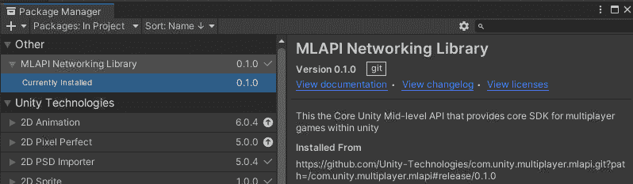
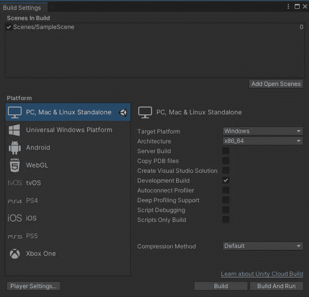

# 在多人游戏中使用新的 Unity 输入系统和 MLAPI(第二部分)

> 原文：<https://medium.com/geekculture/using-the-new-unity-input-system-with-mlapi-in-a-multiplayer-game-part-2-c4e455933532?source=collection_archive---------9----------------------->


Photo by [Hello Lightbulb](https://unsplash.com/@hellolightbulb?utm_source=medium&utm_medium=referral) on [Unsplash](https://unsplash.com?utm_source=medium&utm_medium=referral)

再次您好，这是指南的第二部分(也是最后一部分)在多人游戏中使用 Unity 新输入系统实现玩家的运动，其中网络已经用 MLAPI 构建，

在第一部分中，我们已经看到了如何设置整个输入系统，现在我们将设置 MLAPI、网络对象和实现网络移动逻辑。

**如果您尚未配置和构建入门系统，或者您对入门系统有任何问题，强烈建议您通过以下链接查看本指南的第一部分:**

[](https://brandres.medium.com/using-the-new-unity-input-system-with-mlapi-in-a-multiplayer-game-part-1-eabd244b47e) [## 在多人游戏中使用新的 Unity 输入系统和 MLAPI(第 1 部分)

### MLAPI 是 unity 的新中级网络库。这减少了网络代码并消除了重复的…

brandres.medium.com](https://brandres.medium.com/using-the-new-unity-input-system-with-mlapi-in-a-multiplayer-game-part-1-eabd244b47e) 

**此外，您可以查看本指南** *的整个 Unity 项目(包括脚本、资产、组件等。在向导)* **中显示如下链接:**

[](https://github.com/brandres/MLAPI-InputSystem-Example) [## GitHub-brand RES/ml API-input system-示例

### 通过在 GitHub 上创建帐户，为 brand RES/ml API-input system-Example 开发做出贡献。

github.com](https://github.com/brandres/MLAPI-InputSystem-Example) 

有关更多信息，您可以在下面详细查看本指南两个部分的内容:

# 第 1 部分的内容:

*   **安装输入系统包。**
*   **创建输入动作。**
*   **创建玩家预设。**
*   **创建玩家动作脚本。**

# 第二部分的内容:

*   **安装 MLAPI 包。**
*   **创建网络管理器对象。**
*   **创建世界管理器对象和脚本。**
*   **实施网络化运动。**
*   **测试游戏**

## 安装 MLAPI 包

要安装 MLAPI 包，如果您的 PC 上没有安装 Git，则需要安装 Git。安装完成后，需要重启电脑才能运行。然后我们必须从主菜单**窗口>软件包管理器打开软件包管理器。**在包管理器中点击状态栏中的+按钮，并选择**从 git URL 添加包，**在此输入 Git URL 到下面的 MLAPI 发布包:

```
[https://github.com/Unity-Technologies/com.unity.multiplayer.mlapi.git?path=/com.unity.multiplayer.mlapi#release/0.1.0](https://github.com/Unity-Technologies/com.unity.multiplayer.mlapi.git?path=/com.unity.multiplayer.mlapi#release/0.1.0)
```

安装完成后，软件包如下所示:



## 创建网络管理器对象

首先，我们需要创建网络管理器对象，方法是在 Unity 主窗口的层次选项卡中右键单击并选择 Create Empty。这将创建一个新的`GameObject`，您可以根据需要对其进行重命名，但建议将其重命名为**网络管理器**。

然后选择新的`GameObject` **，**转到检查器选项卡**，**并添加位于 MLAPI 组中的`NetworkManager` **组件**。这个新组件需要选择正确的传输，为此定位`NetworkTransport`字段，点击**选择传输**并选择`UnetTransport`。

接下来，我们必须选择预设玩家，并添加一个网络对象组件。

## 创建世界管理器对象和脚本

在这一步，我将创建一个名为 **WorldManager** 的`GameObject`和一个将添加到其中的**脚本**，其中将实现一个简单的 GUI，包括作为主机、客户端或服务器启动游戏的按钮。因此，**这一步不是强制性的，但强烈建议您这样做。**

与我们之前所做的类似，我们必须在**主 Unity 窗口**的层级选项卡中选择**创建空的**，然后将新的`GameObject`重命名为 **WorldManager** 。此外，如果我们在资产文件夹中创建了一个脚本，我们必须在**资产文件夹或脚本文件夹中创建一个新的脚本。**我们可以随意重命名这个脚本，但是记住这个脚本将作为组件添加到 **WorldManager** `GameObject`中，所以我将它命名为 **WorldManager.cs.**

在这个脚本中，您必须实现按钮的绘制和作为主机、客户机或服务器启动的逻辑，这是通过按相应的按钮来触发的。为了做到这一点，我使用了来自`HelloWorldManager.cs`脚本的代码，该脚本可以在下面的链接中找到[https://docs-multiplayer . unity 3d . com/docs/tutorials/hello world/hello world two](https://docs-multiplayer.unity3d.com/docs/tutorials/helloworld/helloworldtwo)


我做了这个修改来实现 GUI 所需的，您可以从下面的代码中看到或复制它:

[](https://github.com/brandres/MLAPI-InputSystem-Example/blob/master/Assets/Scripts/WorldManager.cs) [## MLAPI-input system-Example/world manager . cs at master brand RES/MLAPI-input system-Example

### 通过在 GitHub 上创建帐户，为 brand RES/ml API-input system-Example 开发做出贡献。

github.com](https://github.com/brandres/MLAPI-InputSystem-Example/blob/master/Assets/Scripts/WorldManager.cs) 

## 实施德联网运动

必须通过同步所有联网连接器客户端上玩家的位置来实现移动。为了实现这一点，我们必须修改播放器脚本(在我的例子中是 Player.cs ),在这个脚本中之前创建了用于处理移动动作的 OnMovement 方法。

在脚本中，我们首先要做的是创建一个`NetworkVariable`来代表这个玩家的联网位置。这取决于你对运动的实现，在我的例子中是`NetworkVariableVector3`，如下图所示:

在继续之前，将继承的类从 MonoBehaviour 更改为 NetworkBehaviour 很重要，这样我们就可以在运动逻辑的实现中使用 NetworkObject 的变量(IsLocalPlayer，IsServer，IsClient，…)。

```
public class Player : NetworkBehaviour
```

接下来，在 OnMovement 方法中，我们必须基于参数值实现移动属性的逻辑，但我们必须控制这仅在播放器实例是本地播放器时执行，这种方式在所有客户端中仅更改本地播放器上的移动属性，而不影响网络播放器。

下面您可以看到，在我的例子中，只有当 IsLocalPlayer 属性为 true 时，我才根据参数值将移动方向更改为向左或向右:

接下来，我们需要根据移动属性设置位置网络变量，但是注意这只能在服务器端完成。然后，我们必须用联网的位置值来设置变换位置，这看起来可能是多余的，或者可以缩短代码，但是所有这些对于在所有客户端中正确的位置同步是必要的。

另一方面，我的移动实现一直在 FixedUpdate 方法中执行，如下所示:

在代码中可以看到，如果变量 IsServer 为 true，我用 Position 的最后一个值和当前方向的和来设置变量 Position。否则，如果 IsServer 变量为 false，我只需通过 RPC 向服务器发送一条消息，根据客户端给出的当前方向设置位置，为此您必须实现 ServerRPC 方法。

> 这个逻辑意味着，如果代码已经在服务器实例中执行，我们可以毫无问题地更改网络变量 Position 的值。否则，如果我们在客户端，我们必须要求服务器进行这种更改，这是通过执行标有[ServerRPC]的方法来完成的，因为具有该标签的每个方法都在服务器实例上执行，而不是在客户端实例上执行，即使后者是调用该方法的那个。

在我的示例中，我实现了 ServerRPC 方法 SetPositionServerRpc，当 IsServer 为 true 时，它以与前面相同的方式分配位置值。

您可以在下面看到 SetPositionServerRpc 方法的实现:

**最后，我用位置值设置了变换位置来执行游戏上的移动，所以现在我们只需要测试游戏是否正常工作。**

**执行所有这些网络属性检查的原因是，来自所有联网实例的独立玩家预设在主机/服务器游戏实例上产生，并且在所有客户端游戏实例上产生，**或者换句话说，MLAPI 为每个连接的实体产生玩家预设。**此外，这意味着每个游戏实例将在实体和游戏实例之间独立地运行每个联网实体的玩家脚本，因此不会在同一实例内或在游戏实例之间共享其任何属性。**

例如，您可以在下图中看到一个多人游戏，其中有一个主机/服务器游戏实例和两个连接的客户端游戏实例，该图显示了所有玩家预设是如何在每个实例中生成的，以及每个联网属性的值:


正如我们所看到的，在**主机/服务器、客户端 1 和客户端 2** 实例中，MLAPI 产生了自己的**玩家**预设以及每个连接的游戏实例，这些预设具有相同的属性，但不共享，并且可能具有不同的值。

玩家脚本为每个预设执行一个实例，因为它将它们作为组件，但是属性和执行在不同的**玩家**预设之间以及游戏实例之间是独立的，如图所示，其中每个预设玩家的网络属性不同。由于这种行为，不可能同步位置值，这就是为什么我使用了 `**NetworkVariableVector3**` **因为这种类型的变量在每个游戏实例的相同玩家预设和脚本之间是同步的。**

在图表中，在主机/服务器玩家脚本中，位置值在**主机/服务器、客户端 1 和客户端 2** 实例上是相同的，但是每个玩家预设都有自己的位置值，它在实例之间是同步的。如果你想在相同实例的预设之间共享信息，也许通过世界管理器是个好主意。

## 测试游戏

为了测试多人游戏，我们需要运行至少两个游戏实例，最简单的方法是运行一个独立的游戏实例和一个 Unity 编辑器。
要运行游戏的独立实例，请遵循以下步骤:

1.  通过**文件>构建设置打开构建设置窗口。**
2.  在构建设置窗口切换到 PC，Mac 和 Linux 独立平台。
3.  点击按钮构建并运行，或者关闭窗口并选择**文件>构建并运行。**



如果一切顺利，在这一点上，网络游戏的运动应该工作和同步正确。配置和编码的最好部分是 MLAPI 和新的输入系统是令人兴奋和有趣的解决方案，目前是 Unity 游戏开发的趋势。

正如我常说的，如果你有任何问题或建议，你可以毫无问题地发表评论😉，或者通过以下链接访问本指南的第一部分:

[](https://brandres.medium.com/using-the-new-unity-input-system-with-mlapi-in-a-multiplayer-game-part-1-eabd244b47e) [## 在多人游戏中使用新的 Unity 输入系统和 MLAPI(第 1 部分)

### MLAPI 是 unity 的新中级网络库。这减少了网络代码并消除了重复的…

brandres.medium.com](https://brandres.medium.com/using-the-new-unity-input-system-with-mlapi-in-a-multiplayer-game-part-1-eabd244b47e) 

最后但同样重要的是，您可以在以下链接找到本指南的整个 Unity 项目(包括脚本、资产、配置等):

[](https://github.com/brandres/MLAPI-InputSystem-Example) [## GitHub-brand RES/ml API-input system-示例

### 通过在 GitHub 上创建帐户，为 brand RES/ml API-input system-Example 开发做出贡献。

github.com](https://github.com/brandres/MLAPI-InputSystem-Example) 

我希望这一切对你有所帮助，或者激励你继续开发你的游戏😃👍

干杯！

# 有关本指南主题的更多信息，请访问以下链接:

*   [https://docs-multiplayer.unity3d.com/docs/migration/install](https://docs-multiplayer.unity3d.com/docs/migration/install)
*   [https://docs-multiplayer . unity 3d . com/docs/tutorials/hello world/hello world trio](https://docs-multiplayer.unity3d.com/docs/tutorials/helloworld/helloworldintro)
*   [https://docs-multiplayer . unity 3d . com/docs/tutorials/hello world/hello world two](https://docs-multiplayer.unity3d.com/docs/tutorials/helloworld/helloworldtwo)
*   [https://github.com/brandres/MLAPI-InputSystem-Example](https://github.com/brandres/MLAPI-InputSystem-Example)