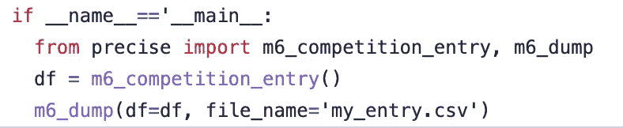
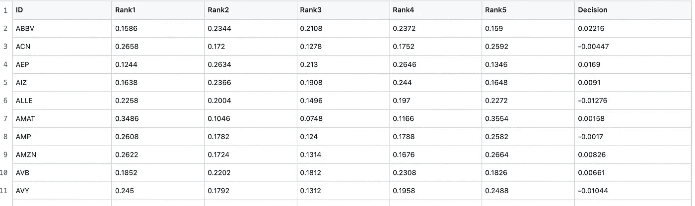
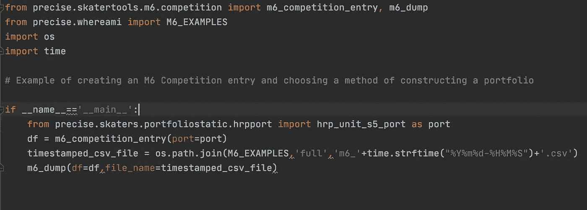
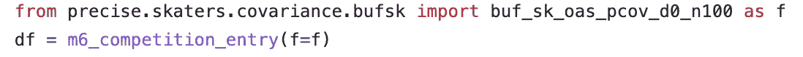
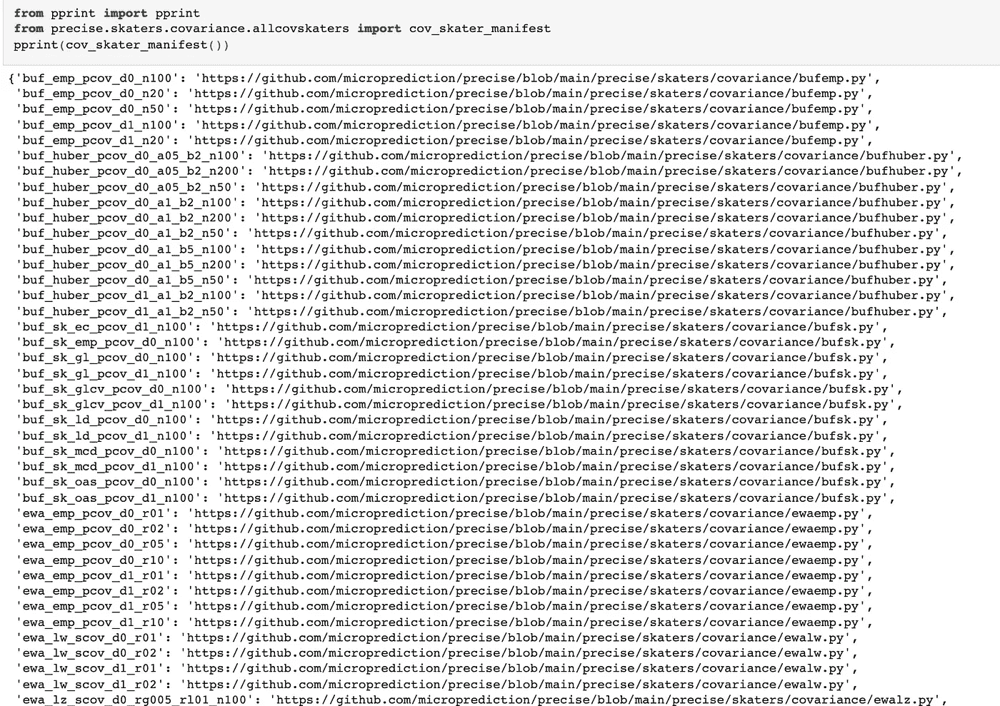
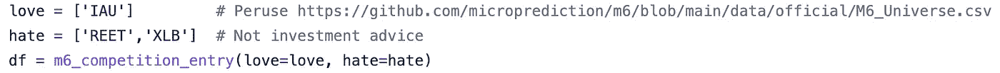

# 用精准包装进入 M6 金融预测大赛

> 原文：<https://medium.com/geekculture/using-the-precise-package-to-enter-the-m6-financial-forecasting-contest-f939dce2dff9?source=collection_archive---------11----------------------->

为了避免我被指责埋没了领先优势，你可以像下面这样简单地创建 [M6 金融预测竞赛](https://mofc.unic.ac.cy/the-m6-competition/#)的参赛作品:

Minimalist creation of an M6 Entry

当然，您可能希望根据您的股票偏好和观点修改该条目。这篇文章解释了如何修改 Python [precise](https://github.com/microprediction/precise) 包提供的基线条目的创建

# 输出

M6 竞赛要求你制作一个包含五分位数概率和投资组合(决策栏)的 CSV 文件。投资组合的绝对值总和应该是 1。五分位数概率的每一行的总和也应该是一。我向你推荐官方[网站](https://mofc.unic.ac.cy/the-m6-competition/)，并邀请你[注册](https://m6competition.com/)。

多元化是一种力量。这个简短的说明旨在鼓励更多的人根据需要输入和上传 CSV 文件。我听你们中的许多人说，你们被创造五分之一概率或投资组合的需要所吓倒。请不要。

我在这里使它变得简单，但是我也希望你把它仅仅当作一个起点，或者甚至更少——只是一组实用程序，这样你就不必重新发明工作流的每一个部分。如果你确实想使用[精确](https://github.com/microprediction/precise)包，那么当然 **pip 安装精确**。这篇文章的剩余部分描述了如何改变默认值。

# 选择投资组合创建方法

这个例子使用了 Marcos Lopez de Prado 发表的分级风险平价法([论文](https://papers.ssrn.com/sol3/papers.cfm?abstract_id=2708678))。

你会在 [precise/skaters](https://github.com/microprediction/precise/tree/main/precise/skaters) 中找到更多的“端口”功能

# 选择协方差估计量

也很简单，如一个[示例脚本](https://github.com/microprediction/precise/blob/main/examples_m6/example_m6_entry_choosing_cov_estimator.py)所示。

Illustrates how to specify a method of estimating stock and ETF covariance

precise 软件包提供了许多估计运行协方差的方法——这是它存在的主要原因。如果你想要所谓的协方差滑板者的完整列表，你应该使用 cov_skater_manifest 函数，如这个 [colab 笔记本](https://github.com/microprediction/precise/blob/main/examples_colab_notebooks/list_all_cov_methods.ipynb)中所示。

事情很不稳定。

# 向或远离滚动条倾斜

当然，您可以对输出做您想做的事情，如前所述，但是您也可以选择提供您喜欢的股票列表和您讨厌的股票列表。

Tilt towards stocks you like, or away

# 更改其他详细信息

嘿，这只是代码。做你喜欢的事。并且探索一下[滑板工具/m6](https://github.com/microprediction/precise/tree/main/precise/skatertools/m6) 和那里提供的功能，看看你还能改变什么。例如，您可以修改用于生成协方差矩阵的历史数据的采样间隔。

# 不要在 Colab 上运行它

一个小提示:不要在 colab 上运行这个。由于数据 API 的限制，它在云中的其他地方也可能失败。建议你本地跑。

# 提问

我的 GitHub [主页](https://github.com/microprediction)包含一个 slack 邀请。有一个 M6 频道。