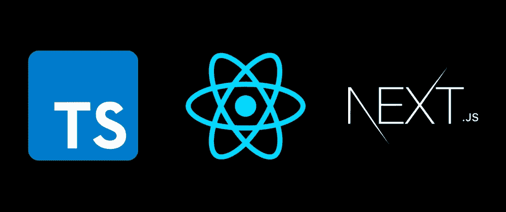

# 在 Next.js 和 TypeScript 中使用 useState 挂钩

> 原文：<https://medium.com/geekculture/using-the-usestate-hook-in-next-js-and-typescript-1df2c088b1aa?source=collection_archive---------5----------------------->

用 React 和它的子集框架构建的最好的部分之一是你使用的钩子，最常用的钩子是 useState 钩子。很好地理解 Next.js 和 hooks 在这里是有帮助的。



如果您正在将 TypeScript 集成到您的 Next.js web 应用程序中，最好的方法就是以正确的方式完成它。

## 初始化:

```
const [name, setName] = useState<string>('John Doe')
```

注意到与普通 js 文件的主要区别了吗？创建状态时，还必须指定将存储在该状态中的数据类型。为什么？
***简答:*** *这使我们在试图更新和使用那个状态及其值时避免了逻辑错误。*

例如，如果您试图在调用 setName 函数时将一个数字放入该状态的括号中。**您会收到类似这样的错误:**
*【number】类型的参数不能赋给 string | (() = > string)* 类型的参数

那么，如果我们在一个状态容器中存储了多种数据类型会怎么样呢？例如，如果我们打算存储一个人的姓名、年龄和状态，它们分别是字符串、数字和布尔值。

实现这一点的最平滑的方法是用列出的那些类型定义一个类型对象，然后用它来初始化你的状态，如下所示。

一种类型的对象看起来像这样:

```
type UserData = {
  name: string,
  age: number,
  status: boolean
}
```

使用 type 对象初始化新状态:

```
type UserData = {
  name: string,
  age: number,
  status: boolean
}
// New State
const [user, setUser] = useState<UserData>({name: 'John Doe'})
```

然而，当你这样做的时候，你会遇到这样的错误:

***Type“{ name:string；“}”缺少类型“UserData”的以下属性:年龄、状态***

问题出在错误说明的最后部分，指出我们不能忽略其他变量，而只能初始化名称和值，因此解决方案如下所示:

```
type UserData = {
  name: string,
  age: number,
  status: boolean
}
// New State
const [user, setUser]=useState<UserData>({name: 'Johnn Doe', age: 12, status: true})
```

但是如果我们一开始就没有虚拟数据，并且我们想在状态没有更新的情况下返回一个空对象而不是占位符，那该怎么办呢？

**解决方案:**在我们的类型对象中，我们简单地在变量名后添加问号

```
type UserData = {
  name?: string,
  age?: number,
  status?: boolean
}
// New State
const [user, setUser]=useState<UserData>({age: 12})
```

注意到问号了吗？这告诉 typescript，每次操作状态时都不需要该变量。

对于更新状态，我将在处理表单的文章中介绍。

提示:传递给这些状态的任何其他数据类型当然都会导致错误。