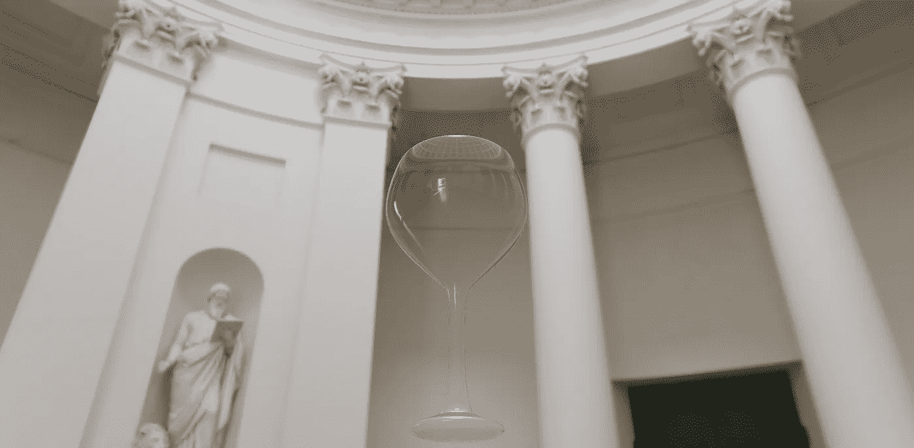
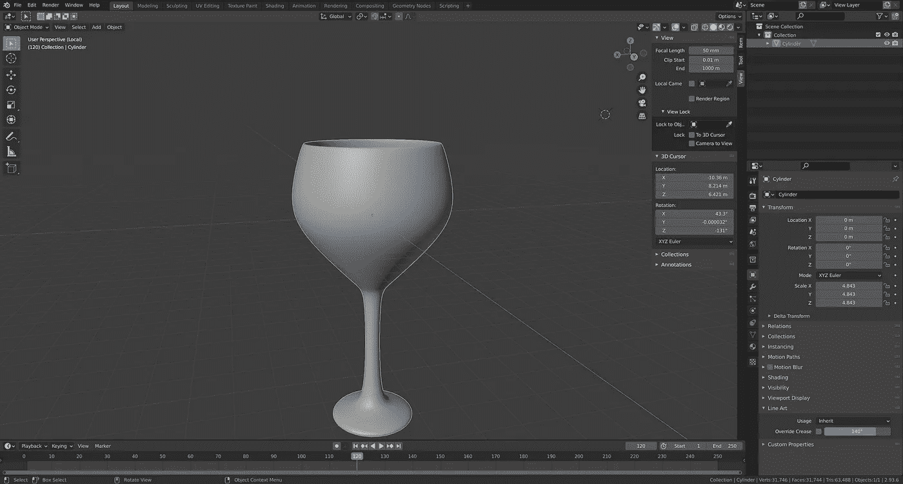
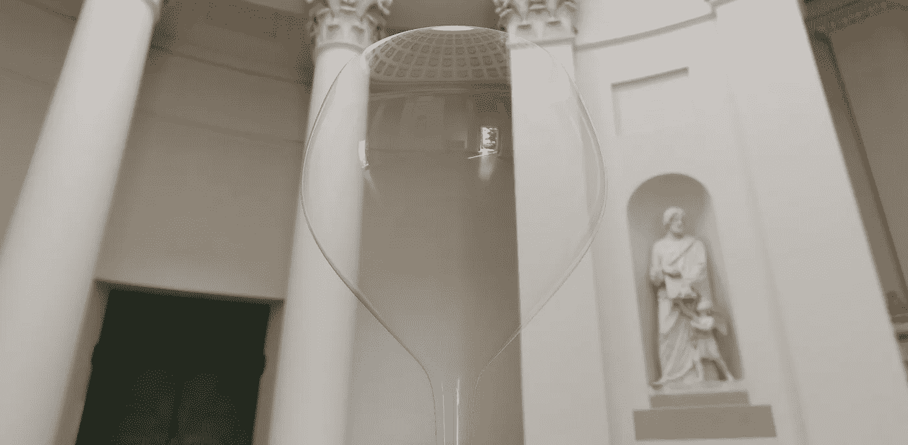

# 使用 Three.js 创建一个晶莹剔透的酒杯

> 原文：<https://medium.com/geekculture/using-three-js-to-create-a-crystal-clear-wine-glass-e2e2d1f64c6?source=collection_archive---------7----------------------->

Isn’t this beautiful?

这是一个相当简单简短的教程，教你如何在 Three.js 场景中创建一个晶莹剔透的酒杯。在下一篇文章中，我可能会使用不同的玻璃对象，并展示如何使用玻璃渲染不同的反射和折射效果。

# 创造酒杯的几何形状

首先，在场景渲染之前，我们需要一个酒杯的几何图形或网格。你可以在 Sketchfab.com 上找到一些免费的酒杯模型，或者走更刺激的路线:自己制作一个！

好吧，伙计们，老实说，我不是一个 3D 平面设计师；我对 3D 图形软件几乎一无所知。但是为了我的目标，我决定学一点搅拌机。

在本文中，我按照 YouTube 教程中的[创建了酒杯的模型。然而，Blender 不是 Microsoft Paint，它是一个相当复杂和强大的 3D 图形软件。因此，我强烈建议你先从 youtube 或在线自学平台学习 Blender 的基础知识，然后再进入我上面粘贴的 youtube Blender 教程链接。](https://www.youtube.com/watch?v=HfCDAIIR2Gc)

我将跳过如何在 blender 中创建酒杯的细节，因为 youtube 教程已经详细解释了这些步骤。但是，如果你想要的只是一个酒杯的纯几何形状，你不必给你的对象一个玻璃材质或者给搅拌机场景添加任何照明。

You just need to have the single wine glass object in your Blender

在将您的酒杯从 Blender 导出为 GLTF(glb)之前，还有两个重要注意事项:

1.  记得在你的酒杯对象的“对象上下文菜单”中选择**“阴影平滑”**选项。该选项允许使用插值顶点法线平滑渲染和显示面。如果未选择此选项，Three.js 中的导入 GLTF 模型可能会有像素化反射，因为顶点之间没有发生插值反射。
2.  记得在导出之前，在 Blender 中将你的**【细分曲面修改器】**应用到你的酒杯对象上。如果你忘了这样做，出口的 GLTF 酒杯将仍然是低聚和尖的物体。

# Three.js 代码

我已经将这个演示的 Three.js 代码放到了我的 github 库中。我不会详细介绍如何加载 GLTF 模型和 HDR 等矩形背景图像。在本文中了解更多关于如何加载 GLTF 模型[的信息。对于 HDR 的东西和其他相关设置，你可以阅读](https://threejs.org/manual/#en/load-gltf)[我以前的文章](/geekculture/understanding-the-three-js-transmission-example-13e952a8ab55)来了解更多，因为这个例子与[官方的 Three.js 传输例子](https://threejs.org/examples/?q=trans#webgl_materials_physical_transmission)非常相似。

这次我设置了`scene.environment = hdrEquirect`，而不是像文档中所说的[那样在`MeshPhysicalMaterial`上设置`envMap`属性:](https://threejs.org/docs/index.html?q=scene#api/en/scenes/Scene.environment)

> 如果不为空，该纹理将被设置为场景中所有物理材质的环境贴图。

请注意，`transmission`属性需要设置为 1 以获得透明的玻璃效果。当`transmission`不为零时，`opacity`应设置为 1。`ior`和`thickness`属性模拟光线穿过透明材料时的真实折射。在这个例子中，这些参数几乎没有影响，因为我们的玻璃应该是薄的。

在项目的根目录下运行`npm run start`会在 Chrome 中打开一个标签，向你展示这种晶莹剔透的美！

Clear reflections and see-through glass effect

这个简短的教程到此结束。希望你也能学到新的东西！