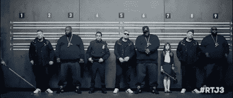
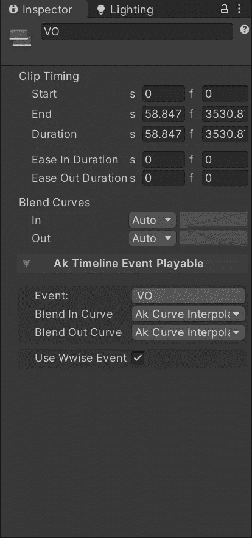

# 使用带音频的时间轴在 Unity 和 Wwise 中构建过场动画

> 原文：<https://medium.com/geekculture/using-timeline-with-audio-to-build-cutscenes-in-unity-and-wwise-8deab938acc4?source=collection_archive---------28----------------------->

时间轴还允许我们添加音频轨道，这样我们就可以在过场动画中加入音乐、对话或音效。传统上，在 Unity 中，**音频源**被添加到时间线窗口，并且可以在某些点被触发，甚至有像平移这样的动画元素。还可以查看音频波形，这可以方便地将音效中的冲击与过场动画中的关键点对齐。

由于我的背景是音频，我倾向于将 **Wwise** 整合到我的项目中，这样我就可以为我的游戏创造更多身临其境的声音。幸运的是，集成允许我们添加 **Wwise 事件。**为此，我们只需在时间轴上添加一个 **AK 时间轴事件轨道**。我们也可以将它附加到一个**游戏对象**中进行定位，但是默认情况下，它被附加到时间轴的父对象上。

然后添加一个**事件**到轨道，我们可以右击并选择“**添加 AK 时间线事件可播放”。**这将在检查器中弹出一个窗口，允许我们选择我们的 **Wwise 事件。**

这些设置还允许我们创建不同类型的淡入淡出。在将 **Wwise 曲目**添加到表单中的时间轴或 **RTPC 曲目时，您可能会注意到另一个选项。**这些是实时参数控制，其值可以在时间线中动画化，以将变量传回 **Wwise** ，从而改变声音。对于创建平移之类的效果非常有用。

在时间线中使用 **Wwise** 的一大缺点是无法查看波形。但实际上，过场动画的声音通常是在动画之外创建的，除了摄像机角度之类的，不需要在 Unity 中排列东西。