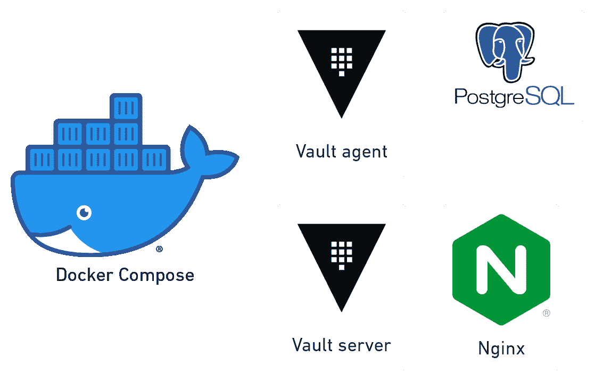
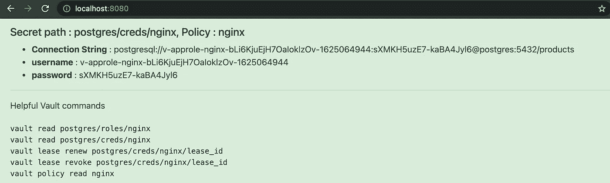
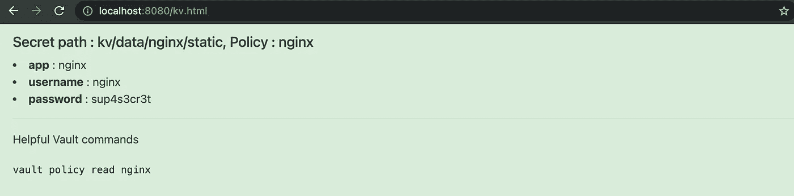
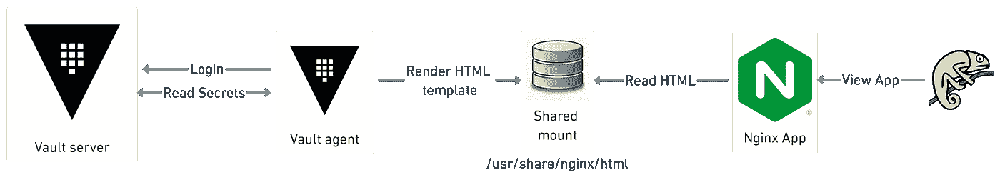

# 将存储库代理与 Docker 合成一起使用

> 原文：<https://medium.com/geekculture/using-vault-agent-with-docker-compose-f410d033026f?source=collection_archive---------0----------------------->

*感谢*[*Kseniia Ryuma*](/@kseniiaryuma)*为金库代理缓存部分*

我发现 [Docker compose](https://docs.docker.com/compose/) 对于本地应用程序栈的测试和演示来说是一个非常有用的工具。对于最近的一个项目，我找不到使用 docker compose 和 [Vault agent](https://www.vaultproject.io/docs/agent) 的好例子，所以我决定写一个并在这里分享。在这篇文章中，我们将看到如何在 Docker compose 中运行 Vault Agent，用数据库和静态密码为 Nginx 编写模板化的 html 文件



We will see how all of these tools can work together

我假设读者已经熟悉 HashiCorp Vault 和 docker compose。作为先决条件，请确保安装了 Docker、Docker compose、Vault CLI ( [安装 vault](https://learn.hashicorp.com/tutorials/vault/getting-started-install) )和 jq ( [下载 jq](https://stedolan.github.io/jq/download/) )。

这个演示项目的 repo 是:[kaw sark/vault-agent-docker](https://gitlab.com/kawsark/vault-agent-docker)。根目录包含一个 *docker-compose.yml* 文件，该文件提供以下服务:Vault 服务器(开发模式)、nginx、Vault 代理和 Postgres。请克隆 repo 并运行 docker compose up 来启动上述服务。

```
git clone [https://gitlab.com/kawsark/vault-agent-docker](https://gitlab.com/kawsark/vault-agent-docker)
cd vault-agent-docker
docker-compose up
```

现在可以在 [http://localhost:8200](http://localhost:8200) 上访问保险库。Vault 的根令牌是“root”(不带引号)。nginx 应用程序可以在 [http://localhost:8080](http://localhost:8080.) 上访问，它将显示默认的 nginx 网页，直到我们执行如下所述的配置步骤 1 和 2。

## 1.Vault:配置策略和密码引擎

在另一个终端中，请运行以下命令为 nginx 应用程序创建一个策略，并配置两个 Secrets 引擎。如果您想走捷径，只需从存储库根目录执行`./00-secrets.sh`脚本。

```
**# Please ensure you are in the repo root directory
# Run ./scripts/00-secrets.sh OR use the commands below**# Setup VAULT_ADDR and VAULT_TOKEN
export VAULT_ADDR=http://localhost:8200
export VAULT_TOKEN=root# Write a Policy:
vault policy write nginx nginx.hcl# Enable the kv Secrets engine and store a secret
vault secrets enable -version=2 kv
vault kv put kv/nginx app=nginx username=nginx password=sup4s3cr3t# Enable the postgres Secrets Engine 
vault secrets enable -path=postgres databasevault write postgres/config/products \
    plugin_name=postgresql-database-plugin \
    allowed_roles="*" \
    connection_url="postgresql://{{username}}:{{password}}[@db](http://twitter.com/db):5432?sslmode=disable" \
    username="postgres" \
    password="password"# Create a Role for nginx
vault write postgres/roles/nginx \
  db_name=products \
  creation_statements="CREATE ROLE \"{{name}}\" WITH LOGIN PASSWORD '{{password}}' VALID UNTIL '{{expiration}}'; \
  GRANT SELECT ON ALL TABLES IN SCHEMA public TO \"{{name}}\"" \
  default_ttl="30s" \
  max_ttl="24h"
```

如果上面的设置成功，您应该能够读取静态和动态的秘密，如下所示。

```
# Test reading a static secret
**vault kv get kv/nginx/static**
====== Metadata ======
Key              Value
---              -----
created_time     2021-06-30T14:48:54.9808961Z
deletion_time    n/a
destroyed        false
version          1====== Data ======
Key         Value
---         -----
app         nginx
password    sup4s3cr3t
username    nginx # Test reading a dynamic secrets Database secret
**vault read postgres/creds/nginx**
Key                Value
---                -----
lease_id           postgres/creds/nginx/jLb7anWBjAWkIdYxYKdsDTGG
lease_duration     30s
lease_renewable    true
password           T1MboM1OBjZ7nz-5qPjD
username           v-token-nginx-yxbrxy61ShDeZXph7GgU-1625064446
```

## **2。保险库:配置认证方法**

请运行以下命令从存储库根目录设置适当的身份验证方法。它将安装 Auth 方法，为 nginx 应用程序创建一个角色，然后导出角色 ID 和秘密 ID 供 nginx 使用。如果您想走捷径，只需从存储库根目录执行`./02-approle.sh`脚本。

```
**# Please ensure you are in the repo root directory
# Run ./scripts/01-approle.sh OR use the commands below**# Enable AppRole and create a role:
vault auth enable approle
vault write auth/approle/role/nginx token_policies="nginx"# Write out a Role ID and Secret ID
vault read -format=json auth/approle/role/nginx/role-id \
  | jq -r '.data.role_id' > vault-agent/nginx-role_idvault write -format=json -f auth/approle/role/nginx/secret-id \
  | jq -r '.data.secret_id' > vault-agent/nginx-secret_id# Restart the vault-agent-demo container
docker restart vault-agent-demo
```

在您的浏览器上访问 [http://localhost:8080](http://localhost:8080) ，您应该能够看到 nginx 应用程序显示一个由 Vault 提供的动态 Postgres 数据库凭证，如下所示。也可以尝试访问[http://localhost:8080/kv](http://localhost:8080/kv)。html 来查看示例静态秘密值。



Example dynamic credential read



Example static credential read

其余步骤显示了用于上述演示的存储库代理和 Docker-compose 配置元素。

## 2.存储库代理:**编写配置文件**

在这种情况下，我们已经编写了一个示例存储库代理配置文件供您审阅:*Vault-agent/nginx-Vault-agent . HCl*文件。它指定了如何使用 auto-auth 节中的 AppRole 来验证 nginx 容器:

```
auto_auth {
  method {
    type = "approle" config = {
        role_id_file_path = "/vault-agent/nginx-role_id"
        secret_id_file_path = "/vault-agent/nginx-secret_id"
        remove_secret_id_file_after_reading = false
    }  }sink {
    type = "file"
    config = { path = "/vault-agent/token" } } 
}
```

它还包括两个`template`节，告诉 Vault Agent 如何以应用程序友好的方式呈现秘密。

```
# Render Database secret
template {
  source = "/vault-agent/postgres.tpl"
  destination = "/usr/share/nginx/html/index.html"
}# Render KV secret
template {
  source = "/vault-agent/kv.tpl"
  destination = "/usr/share/nginx/html/kv.html"
}
```

按照上面的模板节，HTML 文件将呈现在`/usr/share/nginx/html`目录中，由 nginx web 服务器提供服务。

## **3。Vault-agent:编写一个模板文件**

我们包含了两个模板文件， *kv.hcl* 和 *postgres.hcl* ，它们分别告诉 vault agent 如何从密钥/值和数据库机密引擎呈现机密。以下是需要注意的主要事项:

*   从顶部的秘密路径开始，例如:`{{ with secret "postgres/creds/nginx" -}}`用于数据库秘密。
*   然后使用`.Data.<keyword>`格式访问机密。比如`{{ .Data.password }}`。对于键/值秘密引擎版本 2，您需要使用关键字`.Data.data`，因为秘密实际上存储在路径:`<kv-mount>/data`下。比如:`{{ .Data.data.password }}`。
*   如果您不确定关键字，请使用 Vault CLI 检查返回的内容。比如:`vault read postgres/creds/nginx`或者`vault read kv/data/nginx/static`。

## **4。Docker-compose:用应用程序挂载一个共享卷**

使用 Docker-compose 的共享卷允许我们确保 vault-agent 可以在应用程序可以访问的公共目录中呈现机密。对于本演示，本地目录`./nginx`是为 vault-agent 和 nginx 安装的，如下所示

```
volumes:
      - ./nginx:/usr/share/nginx/html
```

下图显示了完整的工作流程。nginx 会立即获取共享目录中发布的任何更新。



Workflow for Vault agent

## (可选)测试存储库代理缓存

Vault agent 还可以为应用程序提供本地代理和[缓存功能](https://www.vaultproject.io/docs/agent/caching)。 *nginx-vault-agent.hcl* 文件包含一个`listener`和一个`cache`块来实现这个功能。侦听器在端口 8200 上启动，该端口映射到 docker 合成文件中的本地主机端口 18200。在另一个终端中，发出以下命令来测试 Vault Agent 缓存行为。

```
unset VAULT_TOKEN
export VAULT_ADDR=[http://localhost:18200](http://localhost:18200)
vault kv get kv/nginx/static
vault read postgres/creds/nginx# Run the command a few times
vault read postgres/creds/nginx
vault read postgres/creds/nginx
```

有几个有趣的项目需要强调:

*   **认证:**我们不需要设置`VAULT_TOKEN`环境变量，因为我们在 *nginx-vault-agent.hcl* 文件中指定了`use_auto_auth_token = true`。
*   **缓存:**存储库代理保持更新数据库租约。因此，如果您重新运行`vault read postgres/creds/nginx`，Vault agent 将继续返回相同的凭证，直到达到最大 TTL，或者缓存被显式清除。发出`docker logs vault-agent-demo`查看更新和缓存响应条目:

```
docker logs vault-agent-demo
2021-07-13T14:41:34.336Z [DEBUG] cache.leasecache: **returning cached response**: path=/v1/postgres/creds/nginx
2021-07-13T14:41:46.812Z [DEBUG] cache.leasecache: **secret renewed**: path=/v1/postgres/creds/nginx
```

*   **缓存清除:**使用下面的命令，通过[缓存清除 API 端点](https://www.vaultproject.io/docs/agent/caching#cache-clear)清除缓存。

```
# Setup environment to work with VAULT_AGENT
unset VAULT_TOKEN
export VAULT_ADDR=[http://localhost:18200](http://localhost:18200)# Read database creds
vault read postgres/creds/nginx
Key                Value
---                -----
**lease_id           postgres/creds/nginx/cN8VAqQg9xVAFNQBF4LNHWM5**
lease_duration     30s
lease_renewable    true
password           ZUjZAa8n7R7hR41-X9aC
username           v-approle-nginx-zUR1sxuxg2a03wzgzvxb-1626183920# Copy the lease id from above
curl --request POST \
       --data '{ "type": "lease", "value": "**postgres/creds/nginx/cN8VAqQg9xVAFNQBF4LNHWM5**" }' \
       $VAULT_ADDR/agent/v1/cache-clear# Re-issue the read command to see different credentials
vault read postgres/creds/nginx
Key                Value
---                -----
lease_id           postgres/creds/nginx/whRBAl2gCRprtWNxILIrw2Dr
lease_duration     30s
lease_renewable    true
password           -5fx1FiT0tRSISzAUOZF
username           v-approle-nginx-vW6CId8X99LUkurp7Klf-1626187012
```

## 清除

要清理，运行`./scripts/cleanup.sh`脚本，或者使用下面的命令。

```
**# Please ensure you are in the repo root directory
# Run ./scripts/cleanup.sh OR use the commands below**docker-compose down
rm -f ./vault-agent/*role_id
rm -f ./vault-agent/*secret_id
rm -f ./vault-agent/token
rm -f ./nginx/index.html
rm -f ./nginx/kv.html
```

# 摘要

Vault 代理可用于代表应用程序委派身份验证和机密检索任务。这篇文章提供了用 Docker Compose 实现这一点所需的各种配置位。我希望这是您构建展示 Vault 与 Docker 集成的酷项目的起点。请在下面留下任何反馈。