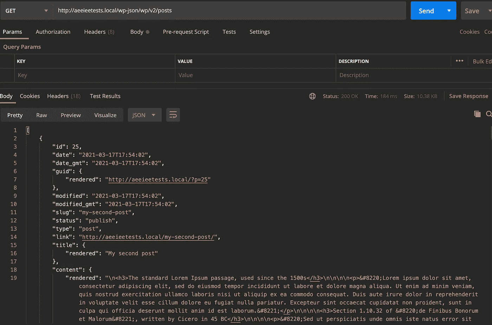
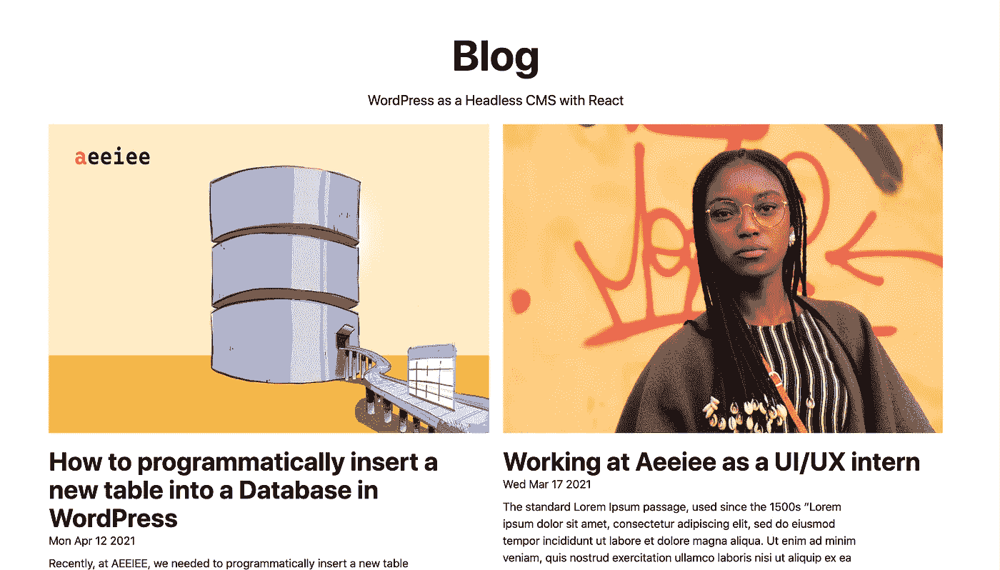
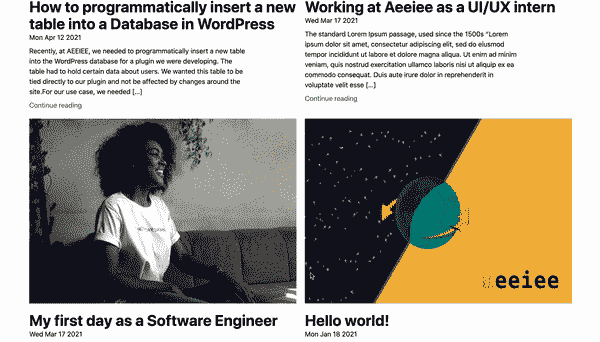

# 用 React/Next.js 将 WordPress 作为一个无头 CMS

> 原文：<https://medium.com/geekculture/using-wordpress-as-a-headless-cms-with-react-next-js-c9b97bfc9ce2?source=collection_archive---------0----------------------->

*本文首发于* [*Aeeiee 博客*](https://www.aeeiee.com/blog/2021/04/28/how-to-use-wordpress-as-a-headless-cms-with-react/) *。*


WordPress as a Headless CMS with React

[React](https://en.wikipedia.org/wiki/React_(JavaScript_library)) ，2013 年在脸书创建的前端框架，拥有超过 165，000 个 GitHub stars，现在是 JavaScript 开发人员最喜欢使用的前端框架之一。React 是一个强大的框架，允许开发人员创建称为组件的可重用代码块，使用虚拟 DOM 来更新 DOM 元素——使 web 应用程序更具性能，并拥有庞大的库集合，使开发人员的生活更轻松。

另一方面，WordPress 是在 React 第一版发布的 10 年前创建的，这个强大的、功能丰富的框架至今仍然存在。WordPress 仍然占据着超过 40%的网络份额，而且不会很快消失。

在本文中，我们将结合两个框架的力量，在前端使用 React 创建一个应用程序，将 WordPress 作为后端——或者更准确地说——作为支持我们应用程序的内容管理系统(CMS)。

# 先决条件

要学习本教程，您需要具备以下基本知识

*   JavaScript，特别是 JSX
*   命令行
*   飞轮控制的本地
*   NPM
*   结节
*   邮递员(可选)

# 设置后端

首先，我们将使用 WordPress 设置后端。对于这个例子，我们将使用飞轮的[本地设置后端。如果你需要在你的机器上设置本地的帮助，你可以参考这篇](https://localwp.com/)[博客文章](https://www.aeeiee.com/blog/2021/02/01/getting-started-with-local-by-flywheel/)。

使用本地设置你的 WordPress 后端，在继续本指南之前，添加一些文章到你的 WordPress 后端。

使用 Postman 向[http://YOUR _ SITE _ name . local/WP-JSON/WP/v2/posts 发出请求。您应该会得到如下回复。](http://YOUR_SITE_NAME.local/wp-json/wp/v2/posts.)



一旦您确认 POSTS 端点正在工作，我们就可以开始了！

你可以使用 WordPress GUI 在后台添加额外的文章，创建自定义的文章类型等。

# 设置前端

接下来我们将使用[构建这个应用程序的前端。JS](https://github.com/vercel/next.js) 和 [TailwindCSS](http://tailwindcss.com) (我一直最喜欢的 CSS 框架)。Next JS 自带图像优化、路由、无服务器功能等开箱即用功能。毫不奇怪，该项目有超过 64k GitHub 明星。TailwindCSS 是一个实用程序优先的框架，它为你在 HTML 中编写 CSS 提供了底层类。

谢天谢地，我们不需要从头开始。NextJS 有一个简单的 CLI 快捷方式，它将为我们生成一个 NextJS + TailwindCSS 样板文件。

要运行下面的命令，请确保您已经在计算机上设置了节点和 NPM。

`yarn create next-app --example with-tailwindcss wordpress-react-app && cd wordpress-react-app`

上面命令末尾的 wordpress-react-app 行在名为 wordpress-react-app 的文件夹中生成示例文件。

安装完成后，进入项目的根目录。在您的 **constants.js** 文件中创建一个名为 **lib > constants.js.** 的文件夹，添加下面这段代码。用你网站的网址替换我们的网址。

```
export const POSTS_API_URL = "http://YOUR_SITE_NAME.local/wp-json/wp/v2/posts"export const AUTHORS_API_URL = "http://YOUR_SITE_NAME.local/wp-json/wp/v2/users"export const MEDIA_API_URL = "http://YOUR_SITE_NAME.local/wp-json/wp/v2/media"
```

# 在前端获取和显示帖子

要向我们的后端 WordPress 服务器发出请求，我们可以使用 JavaScript [Fetch API](https://developer.mozilla.org/en-US/docs/Web/API/Fetch_API) 或 [Axios](https://www.npmjs.com/package/axios) 。就个人而言，我更喜欢使用 axios，因为我认为它的语法更简洁。

我们还需要一个 [HTML 解析器](https://www.npmjs.com/package/html-react-parser)来帮助解析从 WordPress 服务器返回的 HTML 标签。

让我们安装这两个包。

`yarn add axios html-react-parser`

为了使我们的代码更简洁，我们还将创建一些帮助器方法来处理对服务器的请求。在您的 lib 文件夹中，创建一个 **utils.js** 文件。在这个文件中，我们将创建从服务器获取文章、作者和特色图片的方法。

默认情况下，WordPress 公开一个/post/[id]端点，为我们提供一篇文章的信息。这个端点将只给我们一个帖子的 authorId 和 **featuredImageId** ，我们需要向 **/author/[id]** 和 **/media/[id]** 端点发出额外的请求，以获得关于帖子作者和特色图片的额外数据。

添加以下代码块。

完成后，进入**页面> index.js.** 这里，我们将请求从我们的 WordPress 服务器获取所有的帖子，并将它们存储在 React 状态。

如您所见，我们正在呈现一个 **< Post / >** 组件，该组件接收 getAllPostsFromServer 函数返回的 post [prop](https://reactjs.org/docs/components-and-props.html) 。

**让我们创建 Post 组件。**

创建一个名为**组件的新文件夹。**在该组件中创建一个名为 **Post.js** 的文件。我们的 post 组件将接收一个包含媒体和作者 id 的 Post 对象，然后发出后续请求分别获取名称和 url。

请注意，我们在帖子组件模板中构建了每个帖子的链接，即 **/post/${post.id}** 。稍后，我们将创建一个从 URL 中提取 id 的页面，以便从我们的 WordPress 服务器中提取特定的帖子。

现在，您应该可以在登录页面上看到所有帖子。



# 显示单个帖子

接下来，让我们显示单个帖子。NextJS 有内置的路由，允许我们动态呈现页面和内容。你可以在 Nextjs 阅读更多关于[动态路线](https://nextjs.org/docs/routing/dynamic-routes)的内容。我们将使用 getStaticProps 和 getStaticPaths 方法在构建时预先呈现页面。[此处阅读更多内容](https://nextjs.org/docs/basic-features/data-fetching#getstaticprops-static-generation)。构建时预呈现页面意味着，当 Nextjs 构建和部署我们的站点时，每个帖子的页面会在同一时间即时创建。这确保了我们的网站在每次路线改变时加载速度很快，因为当用户试图导航到一个特定的帖子时，它不需要额外的旅行来从我们的 WordPress 服务器获取数据。

让我们开始吧！

在你的 **pages** 文件夹中，创建一个名为 **post** 的文件夹，并在其中创建一个名为**id 的文件。js** 。这将自动生成一条动态路线—**/post/【postId】。js** 。然后，我们将从 URL 中提取 id，并使用该 id 加载文章。

我们需要使用 Nextjs 公开的另外两个方法— **getStaticPaths** 和 **getStaticProps** 。getStaticPaths 方法将在我们的站点被构建和编译时获取所有的 postId。基于从这个方法返回的 id，Nextjs 将自动开始预渲染页面的过程，确保我们的站点保持快速！

接下来，我们调用 **getStaticProps** 方法。该方法将使用从 getStaticPaths 方法传递来的 postId 来获取 post 所需的所有额外参数。 **getStaticProps** 然后将这些参数作为道具传递给我们的前端。

随着所有服务器端工作的完成，我们现在可以像上面开始的那样完成渲染特定帖子的代码编写了。

完成后，我们现在可以测试一切正常！



你可以在这里看到完整的代码