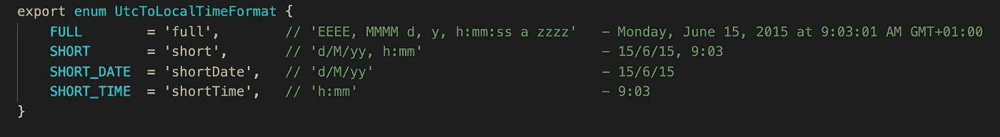
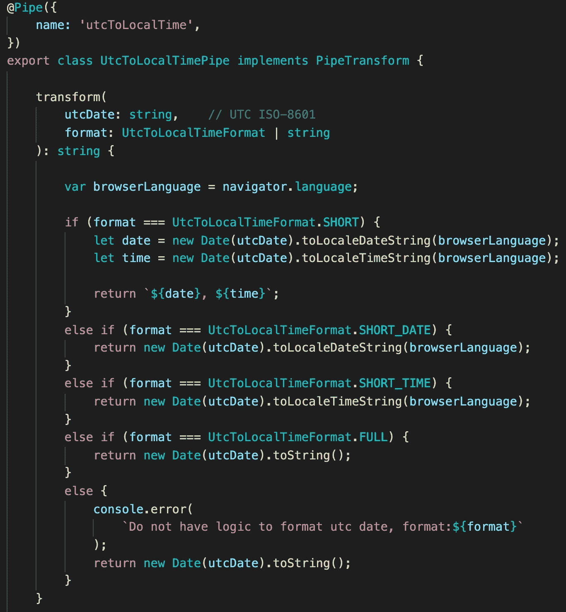
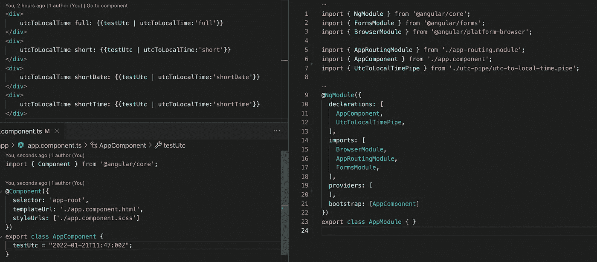
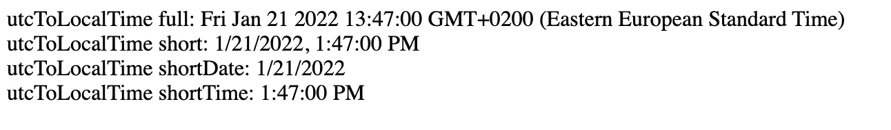

# 将 UTC 转换为以角度表示的本地时间

> 原文：<https://medium.com/geekculture/utc-to-local-time-convert-in-angular-4caac1e31d83?source=collection_archive---------0----------------------->

## 角形管

处理日期可能会很棘手。如果您向位于同一时区的用户显示日期，则完全没有问题。但是如果时区不同，你会显示一个用户不理解的日期。​

我们可以使用 UTC(协调世界时)来代替本地时间。但是，UTC 仍然不是用户友好的。最好的解决方案是向用户显示 UTC 时间，但将其转换为他的时区。在这种情况下，用户将始终了解时间。

我们将创建一个支持 ISO-8601 格式的 UTC 转换器管道。

我们的管道将接受下一个参数。

现在我们知道约会应该是什么样子了。但是我们不知道适合我们用户的日期格式。不同的国家使用不同的日期格式。获取正确日期格式的最简单方法是从浏览器获取语言设置。我们为 JS 日期方法使用一个参数:toLocaleDateString 和 toLocaleTimeString。这些方法会将日期转换为用户本地时间，并将转换为正确的用户日期格式。JS 日期接受 UTC 的 ISO-8601 格式。

我们需要在主模块中添加的 UTC 管道。让我们测试一下我们的烟斗。

现在，用户可以以一种用户友好的方式查看 UTC 日期。

如果你需要仔细看看这个项目[，这里是链接](https://github.com/8Tesla8/utc-to-local-time)。

*原载于 2022 年 1 月 30 日*[*【http://tomorrowmeannever.wordpress.com】*](https://tomorrowmeannever.wordpress.com/2022/01/30/utc-to-local-time-convert-in-angular/)*。*