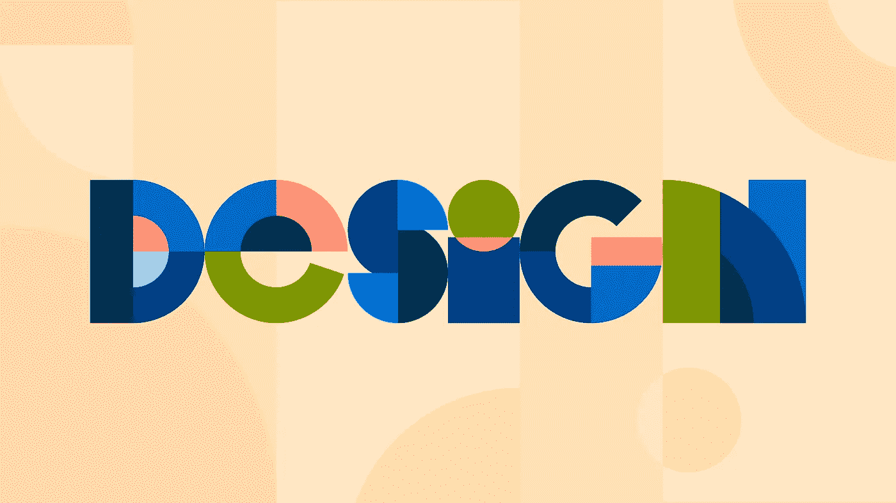
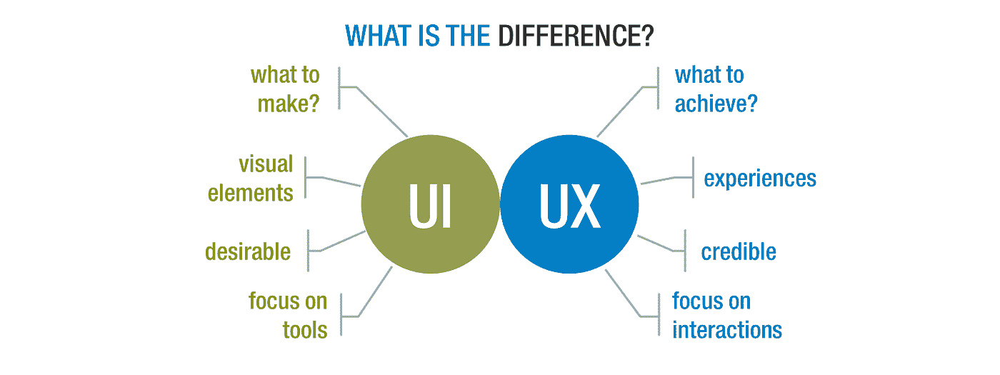
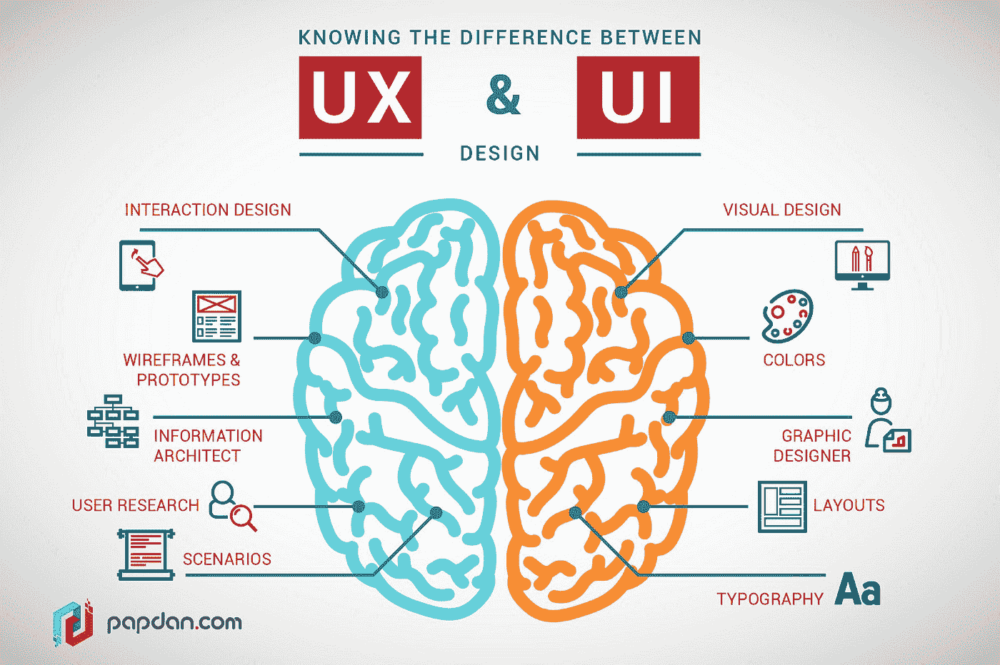

# UX 和 UI 设计流程|它们之间的根本区别

> 原文：<https://medium.com/geekculture/ux-and-ui-design-process-fundamental-difference-between-them-5bd81f7acb30?source=collection_archive---------7----------------------->

用户体验 (UX)和**用户界面设计** (UI)是一个成功产品最重要的两个因素。UX/用户界面设计师一起工作来创造一个易于使用并且具有令人愉悦的美感的交互产品。

对于设计师来说，为了做出最好的产品，了解这两个因素是很重要的。

随着营销和技术之间的差距越来越大，用户体验(UX)和用户界面(UI)设计这两个术语近年来变得越来越流行。

这是因为 **UX 和 UI 设计师**被赋予了一个非常重要的角色:他们为消费者创造你的产品。这是你的产品最明显和最重要的部分，如果做得不好，消费者甚至会在有机会使用你的产品之前就离开。

> 需要注意的是，这些角色不应该与网页设计师混淆。

**UX 和 UI 设计**有一些相似的元素，但是两者之间也有一些主要的区别。UX 关注的是用户体验，而 UI 是基于视觉设计的，它也考虑了事物的外观。

更重要的是，UI 设计师负责通过实现最后的润色，如颜色、字体、图标和图像，对应用程序进行最后的润色。

这篇文章的目的是解释可用性和用户体验(UX)设计之间的区别，然后提供一个 UX 和用户界面设计项目是如何进行的详细概述。

# UX 和用户界面设计之间的 7 个不容忽视的区别。

虽然看起来 UX 和 UI 是一回事，但它们是非常不同的。随着**数字设计**的兴起，很容易创造出一些看起来不错，但并不适合其目标受众的东西。

UX 是以最终用户为中心设计网页和应用程序的过程。这样做是为了确保流畅的用户体验，这可以是任何事情，从快速加载时间到确保你的按钮对于戴眼镜的人来说足够大。

UI 是它漂亮的地方。这是设计与功能相结合的地方。它关注的是事物的外观。这是关于屏幕、按钮和其他元素的视觉外观。

视觉对于吸引用户下载和使用应用程序很重要，但在这发生之前，必须有 [**UX 设计**](https://codersera.com/blog/ux-design-tools/) 来支持。

UX 和 UI 设计经常被混淆为同一个东西，但它们不是。了解这些差异将有助于您创建无缝的用户体验:

1.  UX 设计是关于一个人在使用界面时的感受，而 UI 设计是关于界面的外观。
2.  UX 设计师专注于用户应该做什么来达到他们的目标，而用户界面设计师专注于用户应该如何做。
3.  UX 设计师制作线框、原型和实体模型，看看用户是否能毫无问题地完成他们的目标。UI 设计师关注视觉方面，如颜色、字体和图形来构建界面
4.  UI 是 UX 的一个特定子集，这意味着所有的 UX 设计师都必须对 UI 设计有所了解。然而，并不是所有的 UI 设计师都是 UX 设计师。
5.  UI 设计师可能会参与公司品牌标识的创建，以及广告活动。而 UX 开发者可能与任何活动的开发方面相关联。
6.  用户体验(UX)设计的重点是通过使用以人为中心的设计原则来改善这种感觉。UI 是“用户界面”的首字母缩写，指的是人们访问产品或服务时使用的软件和硬件。
7.  UX 设计师将利用研究和数据为决策提供信息。然而，用户界面设计师将创建数字原型来测试他们的决策反馈。

# UX 或 UI 设计过程:从长远来看什么才是真正重要的。

U **X vs UI:** 这场争论已经持续了多年，我们决定是时候最终解决这个问题了。说到设计，从长远来看什么才是真正重要的？

UX 是最重要的，因为它讲述了一个对用户有价值的故事。这一切都是为了解决问题和创建工作流程，以便人们可以实现目标。UI 也很重要，但只是作为增加 UX 的一种方式，让它对用户更有吸引力。

UX 的设计过程不仅仅是一个流程图。这是一个有意的、精心策划的策略，可以完成工作。另一方面，UI 设计过程是 UX 过程中的一个阶段，设计师将首先创建线框，然后开发交互式原型。

**UX 设计流程**包括创建一个覆盖整个用户体验的计划，包括规划各种形式的输入，如触摸屏、手持设备和桌面设备。这包括规划用户将如何浏览你的网站或应用程序。它还包括布置需要呈现的内容。

UX 和 UI 设计的**过程比看起来更复杂，确保产品成功的最好方法是坚持一个经过验证的过程。整个过程因公司类型和项目而异，但有些事情总是要做的。**

你通常会在项目的前端找到 UX 设计师，他们会考虑用户的行为、动机和期望。

因此，我们相信从长远来看，UX 设计确实起着重要的作用。这很重要，因为大多数时候公司会选择某些 UI 设计的改变，但是 UX 的设计总是保持不变。

# 简单地

用户体验(UX)和用户界面设计(UI)是两件不同的事情，但是它们经常被混为一谈。设计师经常错误地认为 UX 设计是关于网站或应用程序的外观，而 UI 设计是关于它的功能。

> UX vs UI？设计过程中哪个更重要？

在本文中，我们向您展示了这两个学科之间的一些关键差异。这两个学科实际上比那更复杂——设计师的工作是平衡这两者，创造一个有凝聚力的整体。

我们希望你发现这篇文章内容丰富，见解深刻。希望它能帮助你理解 UX 和 UI 设计之间的 D [差异，以及它们能为你的下一个项目带来什么。如果我们能为您提供服务，请立即联系我们！](https://codersera.com/blog/why-a-good-user-interface-is-important/)