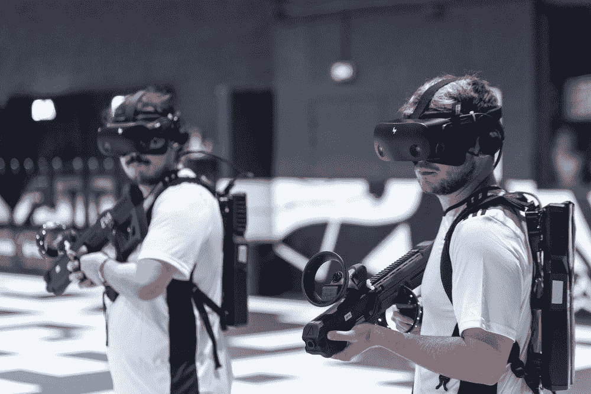

# UX 为元宇宙设计时面临的挑战

> 原文：<https://medium.com/geekculture/ux-challenges-while-designing-for-the-metaverse-ec055dd66b1c?source=collection_archive---------10----------------------->

[https://unsplash.com](https://unsplash.com)

数字全息图。

泽普托。

数字双胞胎。

身临其境的化身。

镜像世界。

好像每天都是新的一天；我们听到更多来自元宇宙的消息。虽然我们曾经只听说过加密货币和 NFTs，但元宇宙正在迅速形成成熟的现实，比预期的要快。

就连贾斯汀比伯也在元宇宙虚拟演唱会现场表演了“ [Ghost](https://www.youtube.com/watch?v=d3vnxPq0meE) ”。

然而，在围绕元宇宙的所有喧嚣之后，人们仍然有一个普遍的问题。

**元宇宙的意义何在？**

https://unsplash.com

*“***被理解为一个图形丰富的虚拟空间，具有某种程度的逼真度，人们可以在这里工作、玩耍、购物、社交——简而言之，做人们在现实生活中喜欢一起做的事情(或者更确切地说，在互联网上)。”**

*这就是为什么比伯先生要独自在一块看起来像混凝土的东西上表演吗？这是人们想要看到的吗——名人做着他们在现实生活中做的事情，除了他们从自己的身体发出白炽粒子？*

*不管你喜不喜欢，元宇宙已经到来，这就是你所能期待的。*

*令人惊讶的是，我们中有多少人似乎无法理解这一点。逃到虚拟现实并不新奇。无论是通过铁拳还是龙与地下城，我们已经尝到了“另一个世界”，事实是——我们想要更多。*

*堡垒之夜在全球有 300 万用户。但是，元宇宙不仅仅是游戏的世界。就像，[堡垒之夜](https://www.epicgames.com/fortnite/en-US/news/what-is-fortnite-beginners-guide)，“这是一个有很多经历的世界。”*

***元宇宙的发行***

***其他元诗句***

*当然，每个人都想分一杯羹。在 SXSW 大会上，马克·扎克伯格告诉鲨鱼池的戴蒙德·约翰，“元宇宙是互联网的下一个篇章。”他进一步补充说，Meta，原名脸书，旨在成为众多虚拟世界绑定者之一。与此同时，他说，如果人们要把他们的虚拟形象带到不同的虚拟世界，互操作性将是所有元宇宙设计的关键。*

***店铺***

*如果消费者想购物，就让他们买吧。是的，虽然在虚拟世界中，你可以支付衣服、鞋子和配件的费用，使你的虚拟角色能够完全装扮起来。到 2021 年 12 月，耐克已经在元宇宙发布了 [Air Jordan IX 酷灰色](https://www.gq.com/story/jordan-11-fortnite)。*

*怎么会？该公司与 Epic Games(《堡垒之夜》的开发商)合作，推出了一系列新的乔丹可穿戴设备(不要与可穿戴技术混淆)。*

***房地产***

*虽然千禧一代因为在有机会(2008 年金融危机)的时候没有买房而受到很多指责，但他们似乎获得了第二次机会。史努比·道格可能以打滚 j 出名，但他不是傻瓜。说唱歌手的数字社区 Snoopverse 位于基于以太坊的平台 Sandbox 中。一位 NFT 收藏家[花了将近 45 万美元](https://www.nme.com/news/music/nft-collector-spends-450000-to-live-as-snoop-doggs-virtual-neighbour-3114160)买了一块虚拟的土地做史努比狗狗的邻居。*

***我们的工作方式***

*你知道吗，像现代和西门子这样的公司用一种互动的、基于虚拟现实的方法彻底改变了他们的招聘流程。我们工作、社交和生活的方式将会发生意想不到的变化。*

*像所有新事物一样，元宇宙也伴随着设计问题和挑战。*

***4 UI 和 UX 在元宇宙的顾虑***

***1)** **设计界面***

*我们所看到的世界和元宇宙在界面方面最大的区别是什么？在现实世界中，界面就在用户面前——你可以看到和触摸到它。在虚拟世界中，用户在界面中。出现的一个问题是，静态设计不再是一个需求，而是一个更具沉浸感的设计的补充。然后，在虚拟世界中设计空间和体验就落在了精通建筑的人的肩上。*

***2)**错位*

*也许，这项技术甚至还不存在，可能需要几年才能到达我们这里。但是，在虚拟世界中，用户不是通过点击或敲击从一个静态页面移动到另一个静态页面——这正是现代 UI 和 UX 设计的载体。相反，用户从一个空间实体转移到另一个空间实体，即使它是一个无形的空间。如果没有从一个阶段到另一个阶段的连续感，虚拟空间对用户来说会很混乱。*

***3)**平视显示器*

*如果你曾经发现自己被吸进了魔兽世界，你会很快意识到 HUD 妨碍了你的进步。它重复了一件事 HUD 越不拥挤，UX 越好。但是什么是平视显示器呢？*

*平视显示器是出现在驾驶员或飞行员视线内并在挡风玻璃上显示信息的面板。在游戏和 UI 中，它是状态栏，其中的信息作为游戏 UI 的一部分呈现给玩家/用户。*

*由于虚拟现实设备将在支持元宇宙方面发挥至关重要的作用，拥挤的 HUD 似乎是不可避免的。想一想；这是一个全新的世界——只对你的眼睛而言。你需要有人帮你导航。有了信息面板、小地图、库存、颜色过滤器、可访问性过滤器等等，hud 将成为你在虚拟世界中需要的向导。UX 的任务是削减脂肪。*

***4)** **虚拟现实病***

*说到虚拟现实设备，虽然它可能是你行走和探索虚拟世界的必经之路，但它也是一个令人担忧的原因，因为它会导致身体不适。VR 头戴设备会导致晕车，因为它们模仿了晕车的动作。当你的大脑静止时，你实际上是在欺骗它运动。这种脱节导致了虚拟现实病。*

*有人甚至会说虚拟现实耳机是性别歧视。由于耳机主要是为男性用户设计的，女性比男性报告更多恶心、头晕和恶心的感觉。这意味着女性被迫适应男性平均头部的尺寸。*

*这不禁让人怀疑。如果我们在现实世界中仍然面临这样的问题，元宇宙是不是有点太早了？*

*虽然为元宇宙设计似乎限制了 UI/UX 设计师，但它也为他们打开了许多可能性。这意味着它给了他们一个[的机会，通过 UI/UX 设计服务创造一个更好的世界](https://builtin.com/design-ux/virtual-world-design-ethics)。这是一个激动人心的时刻，因为界面、计算机和 UX 设计对我们正在创造的新世界变得至关重要。这让我们重新思考“好的设计”，这不仅仅是道德问题。*

*什么时候我们认为一个设计是“好”的？当它易于导航、无缝且直观时。但是元宇宙不仅仅关心用户如何到达最后一步。这也是关于用户在这样做的时候有多投入。所有好的设计都是从“设计思维”开始的。这正是我们在 Pepper Square 创造变革性设计的目的。无论是为现实世界还是元宇宙设计，UX 设计必须将创意与技术融合在一起，才能创造价值。想知道我们的秘密吗？我们谈谈吧。*

***作者简介:** Alka 是 UI UX 设计机构 [Pepper Square](https://www.peppersquare.com/) 的设计总监。她试图通过简化界面来解决现实世界的挑战。她通过写作与业界分享她的见解，并喜欢通过阅读、瑜伽和旅行见证生活的各种色彩。当然，设计仍然是她的第一爱好。*