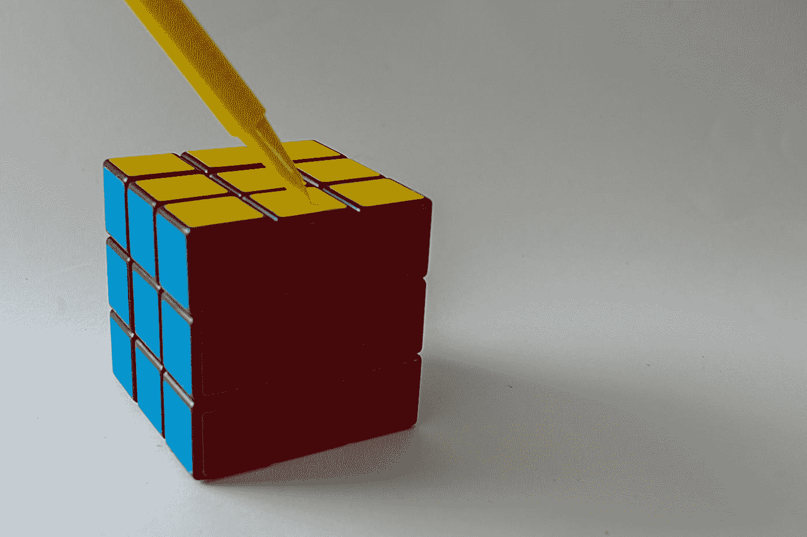

# UX 设计:成为专业人士的 5 个技巧

> 原文：<https://medium.com/geekculture/ux-design-5-tips-to-becoming-a-pro-e3eda91b1846?source=collection_archive---------13----------------------->

## 在 UX 开始职业生涯的提示设计初学者到专业人士！

Photo by [Nick Fewings](https://unsplash.com/@jannerboy62?utm_source=medium&utm_medium=referral) on [Unsplash](https://unsplash.com?utm_source=medium&utm_medium=referral)

UX 的设计是关于用户体验的，这不是每个人的面包和黄油。它需要对细节的关注和对人们行为的理解，从而创造出适合每个人的用户体验。UX 设计师是问题解决者；他们提出问题，进行研究，并且…