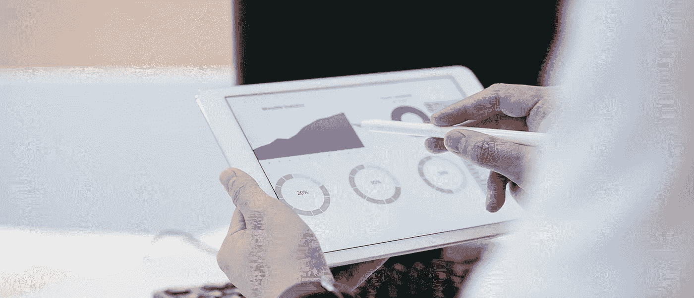
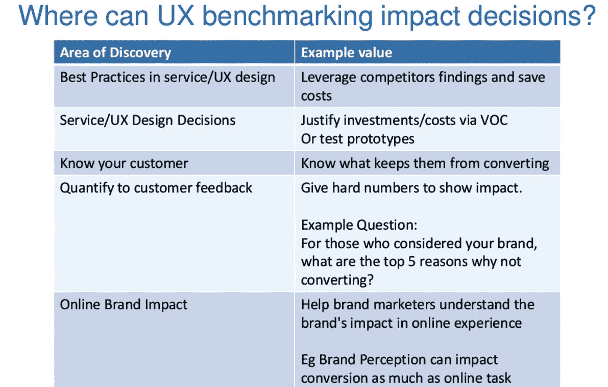
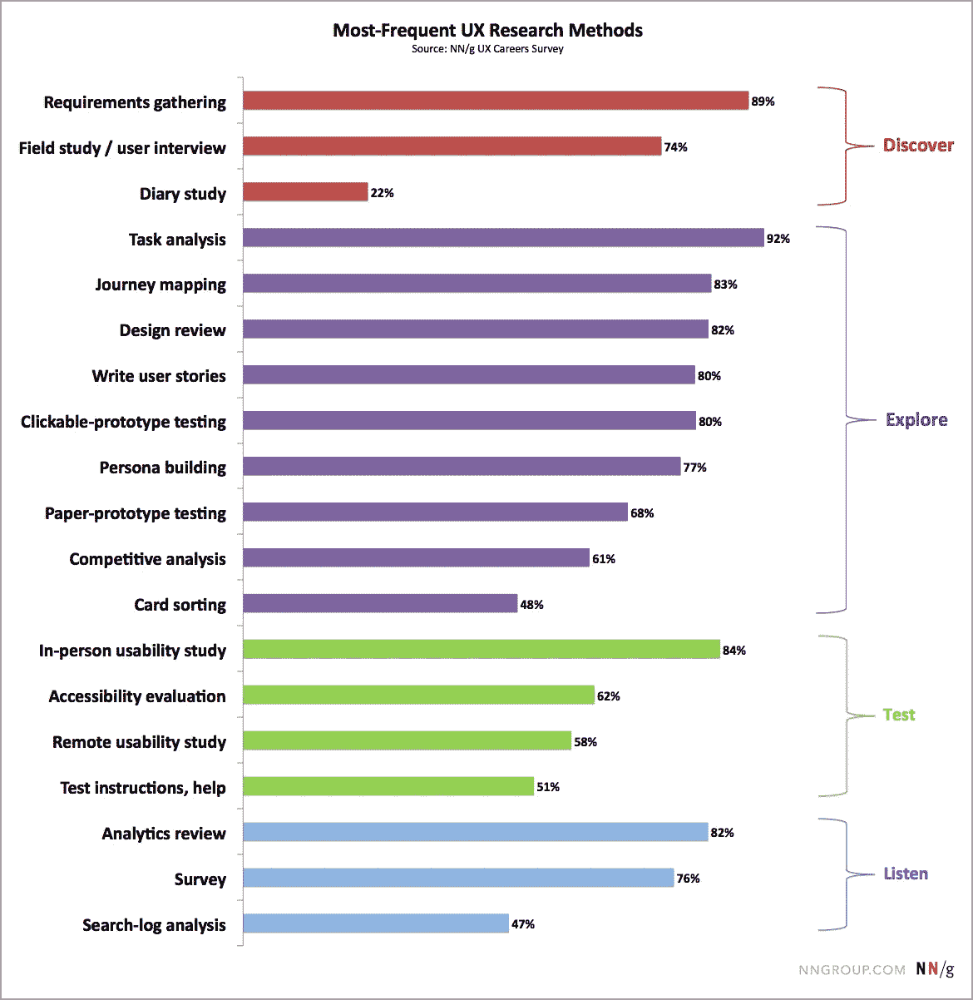
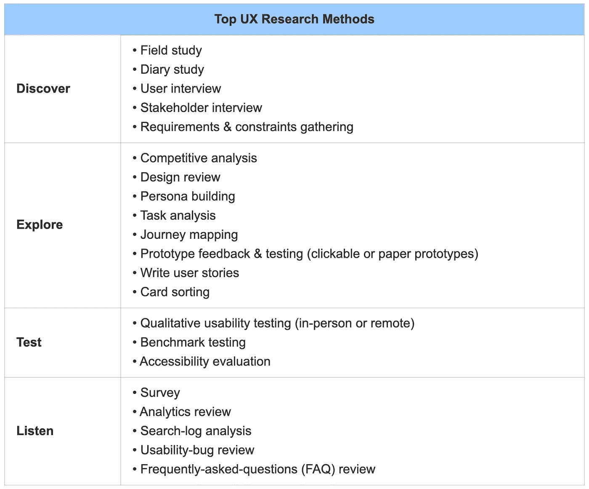

# UX 度量:测量用户体验

> 原文：<https://medium.com/geekculture/ux-metrics-measuring-the-user-experience-163c1c2cef85?source=collection_archive---------18----------------------->

简介[研究表明](https://www.forbes.com/sites/forbestechcouncil/2017/01/23/how-ux-is-transforming-business-whether-you-want-it-to-or-not/?sh=1bfc7be9580e)在 UX 设计上投资一美元会带来 100 美元的收益。通过这种方式，一个设计良好的用户界面可以将你的网站转化率提高 200-400%！

最终，B2B 的真正价值还取决于合作伙伴与您的在线资源界面的交互结果。视觉内容的设计考虑到了最佳用户体验，使网站有效，增加了公司的销售额和 KPI。但是为了提供高质量的 UX，首先需要对其进行评估。这方面的主要标准和 UX 指标是什么？人们如何使用它们？

# 周密计划的重要性

需要进行深入分析，以确定客户购买的障碍以及改进产品的有效方法。这是一次 [UX 的审计](https://angle2.agency/services/design-research-ux/)。

为了提供流畅的后续体验，你需要一个好的衡量用户体验的计划。在实施之前，你需要确定谁是你的客户。

有必要定义什么将被测量，什么将是成功率。评估界面质量和相对有效性的过程是基于特定的用户体验指标。这包括确定评估要使用哪些资源。

# 了解公司的关键绩效指标

除了收入，每个公司还有其他 KPI。这些指标包括客户行为(注册、重复购买)和产品态度(满意度、重复购买的可能性和推荐的可能性)。对于拥有多条产品线的 B2B 组织来说，区分品牌和产品指标非常重要。

# 对 UX 质量的基准看法

一旦你确定了你的 KPI，你就可以通过调查收集它们，并对用户体验的感知质量进行一些测量。SUPR-Q 可以用于网站。SUS、TAM、UMUX-Lite 或其他成熟工具的组合适用于软件。

调查允许收集更传统的指标，如客户满意度和 NPS。在您的调查中包括标准化的 UX 质量指标。将行为数据与 UX 质量管理系统的客户关系数据关联。这将帮助您了解这些变化如何影响公司的 KPI。

# 按主要方面划分的 UX 基准

你需要了解你的产品是如何被使用的，并使这个过程变得更好。针对产品的每个方面，为客户进行优先和关键功能分析。强调激励人们重用解决方案和推荐体验的任务。收集 KPI 时，将关键目标问题纳入客户调查。这通常需要 2-3 分钟。

# KPI 对 UX 设计的影响

对于来自同一个客户的 UX 和 KPI 分数，您应该尝试理解数学关系。例如，经常可以追踪 NPS 和 SUS 之间的显著相关性。为了创建关联，必须逐字检查评论，并通过迭代回归分析了解用户交互的哪些方面最具影响力。

# 评估使用的便利性

一旦您了解了核心挑战，您就可以开始基于解决核心客户需求的产品特性来衡量用户体验。优化最有用的特性，并使用此清单来规划您的基准。

# 定义变革如何提升 KPI

在对用户界面进行更改后，您应该会看到它们对 UX 质量的更高层次感知的影响。随着时间的推移比较 KPI，并查看它们如何影响总体 UX。使用一些简单的统计比较来区分真正的改进和抽样误差，并使用更复杂的方法来帮助理解因果关系。

# 计算盈利能力

关注你的 UX 设计投资回报率是很重要的，弄清楚在产品开发的哪个阶段关注投资回报率，然后让它更高。通过展示变化如何影响企业目标，您可以更有说服力地证明 UX 预算的有效性。

# 创建改进计划

UX KPI 改进计划应包括上下文查询(用于了解客户问题和目标)、卡片分类(客户如何感知标签和短语)、树测试(客户如何查看产品)和可用性测试(客户在完成任务时面临什么问题)。

虽然最好的计划是基于上下文的，但是值得使用多种方法，更早更频繁地迭代，并用一组核心度量标准来度量每个阶段。

无论如何，计划应该是一个程序，而不是一次性事件。包括里程碑，以确保您拥有正确的人员和流程、正确的方法以及潜在市场变化的衡量标准。

# 衡量用户体验

一旦确定了主要目标，就需要度量测量工具。度量值通常从分析、可用性测试和调查的定量收集中获得。

谷歌的心脏框架提供了 UX 指标的快速概览。选择那些长期重要的，因为理想情况下，你会定期跟踪它们。

# A/B 测试

通常通过分析或用户测试来比较两种设计方案。一个非常简单和简洁的测试类型，然而，经受住了时间的考验，并有效地用于定义更有前途的变体。

# 用户测试

我们需要产品质量的客观描述。客户对他们的价值观、认知和经历有深刻的见解。通过以用户为中心的测试，我们与他们讨论我们需要澄清的问题。例如，关于习惯、行为和系统的使用。然后我们在原型/工作站点上给出任务，看看结果如何。

进行定量和定性测试。粗略地说，定性是当我们问“为什么这样和那样”时，而定量(更劳动密集和昂贵)是当许多客户完成任务所花费的时间被测量时，他们的错误被收集，等等。

# 测量

了解客户喜欢这个界面的最简单的方法。这种方法可以带来不同的效率，但它非常便宜，而且可以让你迅速得到反馈。

除了上面提到的方法，还有很多其他的方法，UX 设计师通常决定如何在项目的每个阶段测量用户体验。

# 摘要

每个项目都是独一无二的。严格按照广义的电子商务术语来衡量可用性并不总是适合 B2B 项目。如果无法进行定量研究，就需要创造性的信息收集方法。尽管在大型项目中仍然需要对 UX 进行定性评估，以及定量用户测试，在某些情况下，还需要日记研究。

*原载于 2021 年 4 月 13 日*[*https://angle 2 . agency*](https://angle2.agency/ux-metrics/)*。*