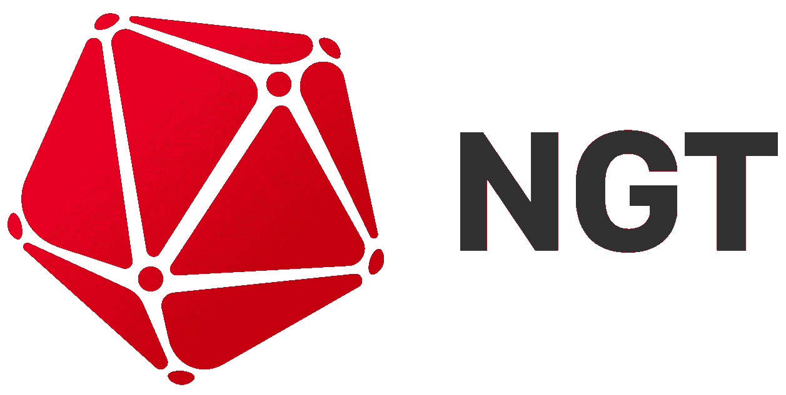

# 瓦尔德。一个高度可扩展的分布式快速近似最近邻密集向量搜索引擎。

> 原文：<https://medium.com/geekculture/vald-a-highly-scalable-distributed-fast-approximate-nearest-neighbour-dense-vector-search-engine-af1946a4a37?source=collection_archive---------24----------------------->

## 数据检索的状态

如今，对信息检索的需求越来越基于文本和各种类型的数据，包括文本、图像、视频和音频。这些技术每年都变得越来越先进。数据的类型和解释方法也在多样化。目前，这些技术在许多领域都有帮助，例如推荐搜索，它包括用户在上下文中的行为，以及图像搜索，它使用图像特征向量来执行类似的搜索。随着这些技术和内容的发展，这些技术的规模每年都在增加。用传统的基于规则的搜索引擎有效地搜索这些数据并不容易。纯文本搜索已经过时了。除了图像搜索之外，文本搜索方法也变得流行，其中使用自然语言处理来处理查询，该自然语言处理准确地解释文本的含义并返回接近有意义的搜索结果。在另一个领域，通过生成图像特征和文本特征的组合，通过图像和文本的多模态搜索变得可用。如上所述，如今可以使用深度学习技术将各种各样的数据表示为向量。因此，向量搜索引擎作为一种与模型无关的搜索技术已经成为一项重要的技术。在这篇博客中，我想介绍一种使用矢量搜索技术中使用的近似最近邻(ANN)搜索的产品。

## 什么是近似最近邻(ANN)

在解释 ANN 之前，我们先来看看 kNN(k-最近邻)。很多专家已经解释过 kNN 了，所以我在这里简单解释一下。kNN 和 ANN 一样是寻找最相似向量的方法之一。这是一种搜索 k 个与查询最近邻的数据的方法。但是，这种方法存在数据量和性能方面的问题。在 kNN 中返回精确邻居的代价是要搜索的数据量随着数据数量的增加而增加，这需要大量的计算时间。这就是为什么 ANN 作为另一种方法出现了。人工神经网络是一种搜索近似邻域或近似邻域中的数据的方法。实现 ANN 的方法有很多，但最常见的是基于图形或树的实现。基于图的人工神经网络不会搜索所有的图边。相反，它通过设置阈值来搜索其中的一部分，以防止随着数据数量的增加计算时间成比例地增加。

人工神经网络方法是计算最近大数据的向量相似性的有效方法。

## 使用向量的近似最近邻搜索的现状

许多公司都在研究向量近似最近邻搜索，如雅虎日本的 NGT、脸书的 Faiss、Spotify 的 are 和微软的 SPTAG。这些库是开源项目。你可以在 GitHub 上查看它们。迄今为止，最平衡和表现最好的引擎是雅虎日本的 NGT。每个基准测试的结果可以在 [ANN-Benchmarks](http://ann-benchmarks.com/index.html) 中找到。

 [## Yahoo 日本/NGT

### 用于索引高维数据的邻域图和树 NGT 提供了命令和库来执行…

github.com](https://github.com/yahoojapan/NGT)  [## facebookresearch/faiss

### Faiss 是一个用于高效相似性搜索和密集向量聚类的库。它包含算法搜索…

github.com](https://github.com/facebookresearch/faiss)  [## Spotify/骚扰

### 是一个带有 Python 绑定的 C++库，用来搜索空间中的点…

github.com](https://github.com/spotify/annoy)  [## 微软/SPTAG

### SPTAG(空间划分树和图)是一个大规模矢量近似最近邻搜索场景的库…

github.com](https://github.com/microsoft/SPTAG) 

## 关于 NGT

NGT 是由雅虎日本的研究员 [@masajiro](https://github.com/masajiro) 开发的。NGT 使用“图形和树”设计进行快速近似 k-最近邻搜索。NGT 有一个名为 NGTD 的服务器实现。它通过 REST 和 gRPC 接口提供了 NGT 的矢量搜索功能。

 [## Yahoo 日本/ngtd

### NGTD 为 NGT 提供服务功能。NGTD 支持 gRPC 和 HTTP 协议，所以你可以用…

github.com](https://github.com/yahoojapan/ngtd) 

NGT 是一个平衡的引擎，支持高性能和高精度的向量近似最近邻搜索。由于将索引保存在内存中的性质，它需要大量内存。特别是在多模态数据中，每个矢量数据的维数往往很高。因此，可以使用的索引数量受限于服务器的最大内存容量。

还有一个问题。假设 NGTD 服务器拥有大量的索引。在这种情况下，用户必须精确地控制复杂的矢量索引工作流，例如插入、搜索、删除、更新、图形索引的提交命令，以及提交操作期间的系统锁定。所以数据量随着提交处理时间的增加而增加，通过用户的 API 锁定动作变得更加频繁。

从这些事情中，我们意识到 NGT/NGTD 有其局限性，集群化的 NGTD 项目的设计开始了。然而，它不能避免这些问题和不便，因为仅仅通过分配不能降低操作成本。我们审查并重新设计了整个现有系统，以改善它。

这就是为什么我们开发了一个名为“Vald”的分布式密集向量近似最近邻搜索引擎。

 [## 瓦尔德

### Vald 是一个高度可扩展的分布式快速近似最近邻密集向量搜索引擎。Vald 旨在…

vald.vdaas.org](https://vald.vdaas.org) 

## Vald 是什么？

Vald 是一个高度可扩展的分布式快速近似最近邻密集向量搜索引擎，具有水平扩展功能，基于微服务架构设计，与 Kubernetes 有很高的亲和力。Vald 是一个 OSS 项目，任何人都可以使用 GitHub 很容易地对它做出贡献。Vald 最初是基于 NGTD 开发的，以支持雅虎日本规模的使用大数据的人工神经网络搜索。它的设计和开发满足了许多要求，如稳定性、灾难恢复能力和性能要求，这就是为什么它经常受到日本大型 It 公司 Yahoo Japan 的测试。

## 1.云-原生向量相似性搜索引擎

*   Vald 可以在容器环境中方便地使用。
*   如果某人有大量数据，我们在 Kubernetes 上支持 Vald，这是一个高度可扩展的矢量引擎。我们也支持 helm 包管理器& helm-operator 用户可以很容易地使用它们进行部署。请检查我们的文档。
*   [舵展开](https://vald.vdaas.org/docs/tutorial/get-started/)
*   [全功能部署(针对专家用户)](https://vald.vdaas.org/docs/tutorial/using-backup-with-scylladb/)
*   [舵配置文件](https://vald.vdaas.org/docs/user-guides/configuration/)
*   [舵操作员文档](https://vald.vdaas.org/docs/user-guides/operations/)
*   如果有人想像使用单服务器 ANN 引擎一样使用 NGTD，我们支持独立的最小部署。请检查我们的文档。
*   [Kubernetes 环境](https://vald.vdaas.org/docs/tutorial/vald-agent-standalone-on-k8s/)
*   [Docker 环境](https://vald.vdaas.org/docs/tutorial/vald-agent-standalone-on-docker/)

## 2.高度可扩展

*   Vald 是为 Kubernetes 环境设计的。可伸缩性是 Kubernetes 集群大小。如果集群规模 Vald 可以使用越来越多的内存(矢量索引)容量，用户可以快速扩展他们的 Kubernetes。
*   Vald 拥有分布式矢量存储算法和基于计算资源的平衡算法，并支持集群范围的优化内存控制

## 3.高度可定制

*   所有 Vald 组件都可以使用 YAML 文件和环境变量进行配置。
*   用户可以自定义许多参数，如 grpc MsgBufferSize 等
*   Vald 架构根据领域特性进行了很好的划分，用户可以很容易地定制 Vald 组件，并且很容易添加新的数据库支持
*   我们在入口和出口都有一个过滤器组件
*   使用入口过滤器组件，用户可以很容易地操纵传入的数据。例如，使用张量流向量维度填充将 blob 数据转换成向量
*   使用 Egress-Filter 组件，用户可以轻松地操作传出的搜索结果。人工神经网络搜索结果是近似的。有时这会给推荐准确性带来问题。Vald 有出口过滤器，用户可以很容易地修改人工神经网络搜索结果。

## 4.自动矢量索引管理

*   自动将索引数据备份到多个位置，如 AWS S3、Google 云存储、Cassandra、MySQL、本地卷。
*   从备份位置自动恢复索引。
*   自动提交索引以获得无阻塞矢量搜索体验。
*   自动重新平衡索引复制以实现稳定性。

## 5.多语言支持

*   支持的语言有 Go，Python，Java，Node，Clojure。
*   我们也有原型文件，许多语言可以使用它们的 gRPC 库连接到 Vald。

## 最后

感谢您花时间阅读这篇博文。您可以从这里开始尝试 Vald。

 [## Vald |开始使用

### Vald 是一个高度可扩展的分布式快速近似最近邻密集向量搜索引擎。Vald 的设计和…

vald.vdaas.org](https://vald.vdaas.org/docs/tutorial/get-started/) 

我们将在未来发布更多关于 Vald 的内容，包括如何使用它和改进您的搜索引擎，请期待下一篇帖子。