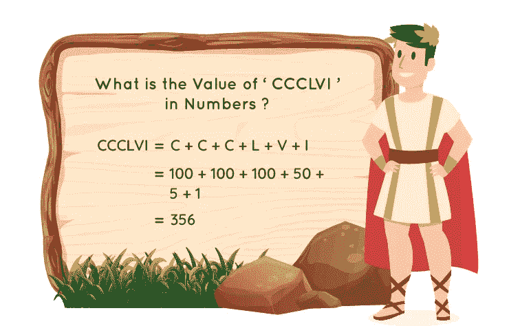
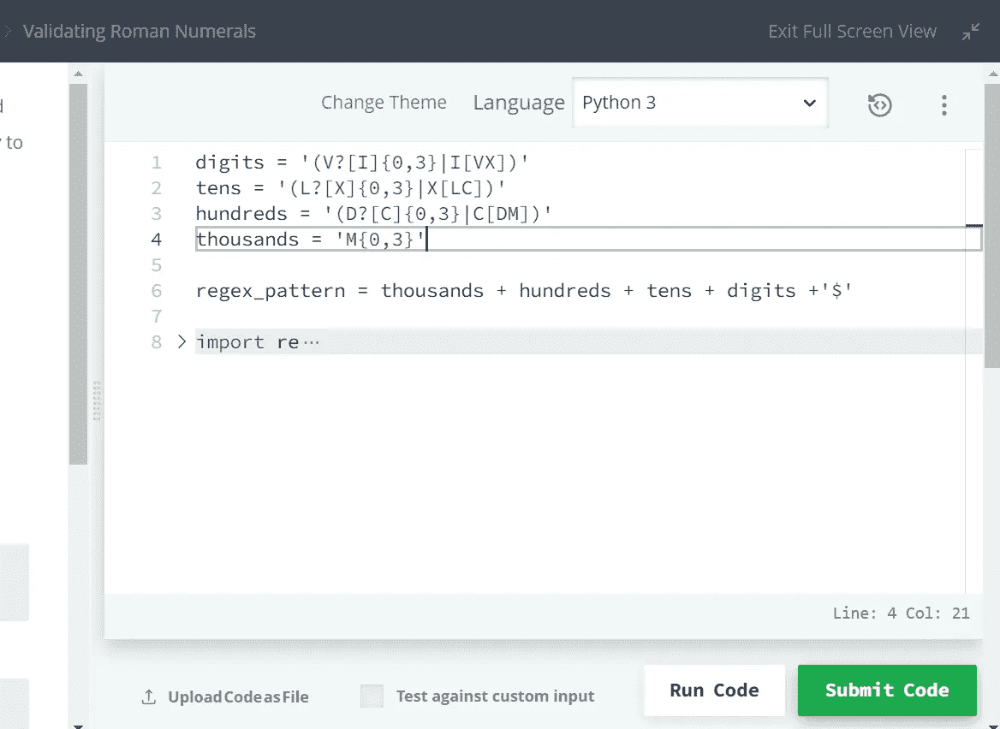
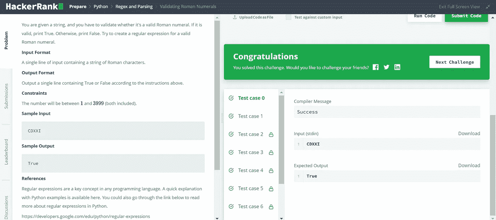

# 验证罗马数字— Hackerrank

> 原文：<https://medium.com/geekculture/validating-roman-numerals-hackerrank-744f73106ebf?source=collection_archive---------4----------------------->



问题陈述:给你一个字符串，你必须验证它是否是一个有效的罗马数字。如果有效，打印 True。否则，打印 False。尝试为有效的罗马数字创建一个正则表达式。

**输入格式:**包含一串罗马字符的单行输入。

**输出格式:**根据上面的指令，输出包含真或假的单行。

**约束:**数字将在 **1** 和 **3999** 之间(包括两者)。

**样本输入**

```
CDXXI
```

**样本输出**

```
True
```

# **解决方案:-**

让我们先了解书写罗马数字的规则:-

# 书写罗马数字的规则

*   重复多少次，符号的值就加多少次。(例如 III-3、XXX-30 和 CCC-300)。
*   一个符号最多可以重复三次，例如 XXX = 30，MMM= 3000，等等。
*   符号 V、L 和 D 是 ***从不*** 重复。
*   当较小值的符号出现在较大值的符号之后时，其值将被相加。比如- VI = V + I = 5 + 1 = 6。
*   当较小值的符号出现在较大值的符号之前时，它将被减去。例如-IX = X—I = 10–1 = 9。
*   符号 **V、L、**和 **D** 从不减去*，因为它们不写在更大值符号之前。*
*   *符号 **I** 只能从 **V** 和 **X** 中减去，符号 **X** 只能从符号 **L、M** 和 **C** 中减去。*

```
*# Roman Numerals# 1    I
# 5    V
# 10   X
# 50   L
# 100  C
# 500  D
# 1000 M# Digits - I II III **IV** V VI VII VIII **IX** X
# Tens - X XX XXX **XL** L LX LXX LXXX **XC** C
# Hundreds - C CC CCC **CD** DC DCC DCCC **CM** M
# Thousands - M MM MMM*
```

*要解决这个问题，我们必须把它分解成几个部分。*

1.  ***数字:**由字母 I、V 和 X 组成，注意上面的粗体字- **I** 后面是 **V** 和 **X** 。另外， **I** 之前只有一个或零个 **V** 。
    I【VX】—**I(最多三个)**由 **V** 和 **X** V 接替？[I]{0，3} — **I** 前面只有 **V(零或一)** 我们用“或”条件组合这两种模式，因为一次只能出现一种。
    于是，digits = '(V？' I]{0，3}|I[VX])'*
2.  ***十位:**由字母 X、L、C 组成，注意上面的粗体字- **X** 后面是 **L** 和 **C** 。还有， **X** 前面只有一个或者零个 L，
    X【LC】—**X(最多三个)**后面是 **L** 和 **C** L？[X]{0，3} — **X** 前面只有 **L(零或一)** 我们用“或”条件组合这两种模式，因为一次只能出现一种。
    于是，tens = '(L？[X]{0，3}|X[LC])'*
3.  ***百位:**同理，百位= '(D？' C]{0，3}|C[DM])'*
4.  *千:我们得到的范围是 1 到 3999(包括 1 和 3999)。所以只能有 1000，2000，3000。
    这意味着，千= 'M{0，3} '*

*现在，组合所有的模式并使用 **'$'** 来匹配字符串的结尾(表示模式的结尾)*

***regex_pattern =千+百+十+位数+'$'***

```
*import reinput_string = str(input())digits = '(V?[I]{0,3}|I[VX])'
tens = '(L?[X]{0,3}|X[LC])'
hundreds = '(D?[C]{0,3}|C[DM])'
thousands = 'M{0,3}'regex_pattern = thousands + hundreds + tens + digits +'$'print(str(bool(re.match(regex_pattern, input_string))))*
```

****

*如果你觉得这篇文章很有帮助，请与你的朋友和同事分享。如果还有其他问题，可以上[*Linkedin*](https://www.linkedin.com/in/shefali-bisht/)*找我。**