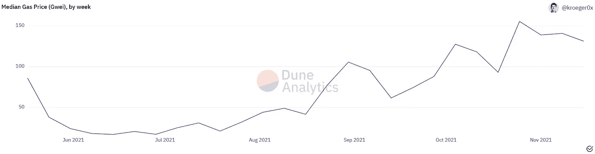
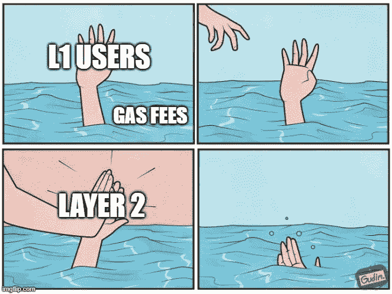
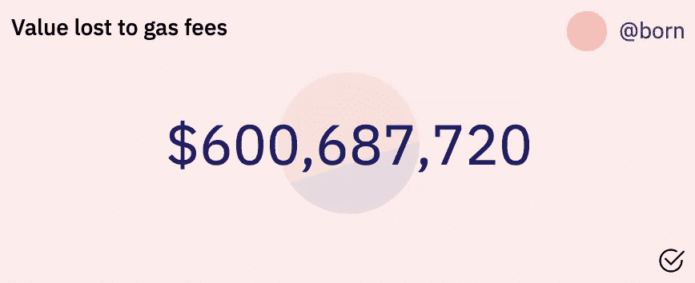
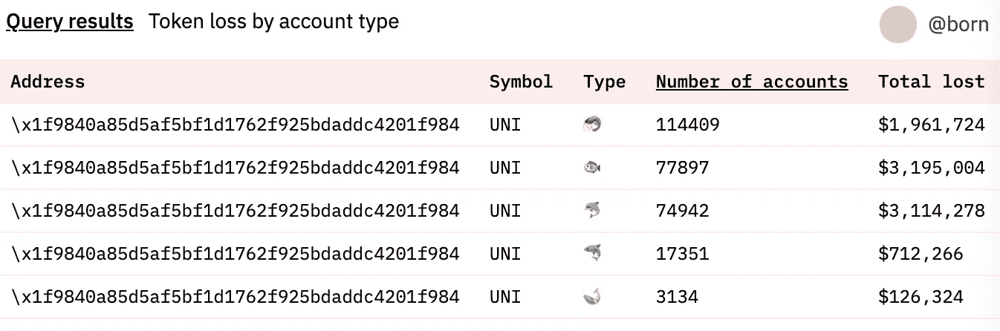
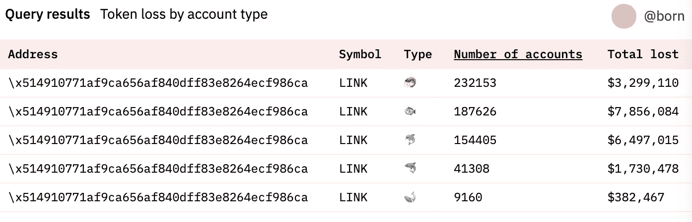
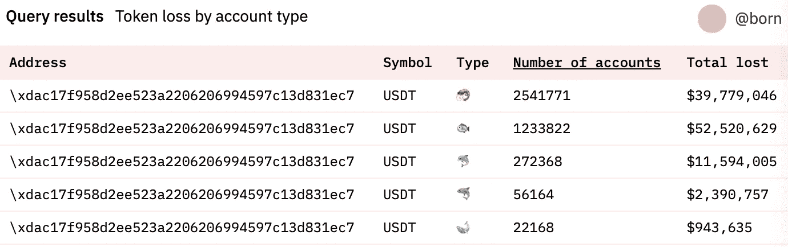
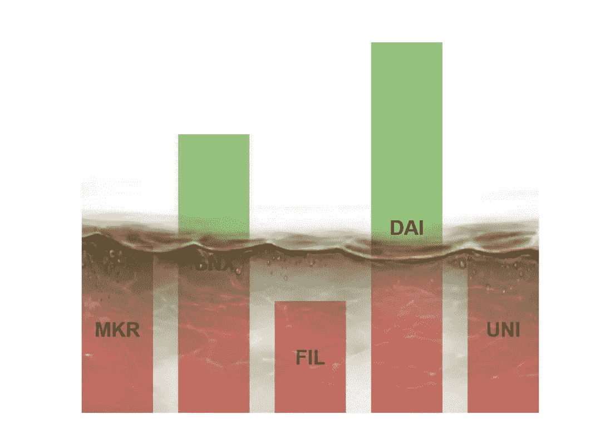
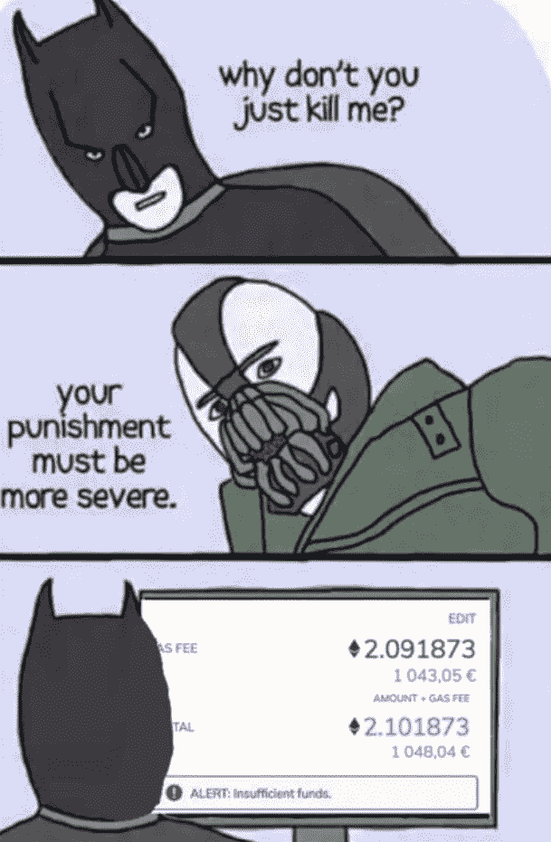

# 价值碎片化

> 原文：<https://medium.com/geekculture/value-fragmentation-8c8336f97cfd?source=collection_archive---------7----------------------->

水涨船高..有时候。

在 Crypto Twitter 上，没有一天有人[不抱怨以太坊上令人难以置信的高油价。很容易看出，这个领域的新手会将此视为宏大加密愿景的失败。花 50 美元的费用去买一杯 10 美元的咖啡是荒谬的(原因有很多)。](https://twitter.com/elwhale/status/1462225557261729793?t=a9Z5nkMyuKoCT7JhpG-ILQ&s=19)

然而，正如大多数密切关注以太坊的人会注意到的，[这个计划](https://ethereum-magicians.org/t/a-rollup-centric-ethereum-roadmap/4698)已经有一段时间了。以太坊有意限制块空间以保持最大程度的分散，因此带宽有限。随着其效用和需求的增加，每笔交易的成本也在增加。换句话说，以太坊是自身成功的受害者。以太坊路线图旨在通过将日常交易转移到 L2s*并使用 L1 作为主要由 L2s 和更大玩家使用的基本结算层来解决这一问题。

*为简单起见，我将交替使用 L2 和汇总

Median gas price (gwei) over time

不幸的是，我们发现自己处于一个尴尬的状态，L2 还没有完全准备好，以太坊的 mainnet 容量需求极高。高昂的油价意味着只有鲸鱼能够使用网络，其他人都被迫袖手旁观，等待费用下降。在费用降低之前，许多人完全被“锁定”在他们的资金之外，因为转移资金的交易费用比资金的实际价值要高。很难预测未来对以太坊 L1 的需求会如何变化，但总有一天，L1 的天然气费永远不会降到以前的水平，大量资金将被永久锁定。这个问题尤其令人遗憾，因为它不成比例地影响了贫困用户。

# 这是一个多大的问题？

为了了解天然气费用损失的当前价值，我利用 Dune Analytics 查询账户代币余额、这些代币的当前价值和当前天然气价格(150 gwei)。我们只看经常账户余额，不看历史余额或交易。截至撰写本文时，仅 ERC20 代币的当前总损失价值为 **$600，687，720** 。

## 哪些项目受影响最大

我们还可以看到哪些项目因燃气费而损失最大。其中既有、、戴等稳定的名字，也有统一等统治的象征，还有、埃隆等迷因的名字。在下面的图表中，我按用户类型对损失进行了细分。

🦐=钱包中少于 100 美元的用户

🐟=钱包中少于 1000 美元的用户

🐬=钱包中少于 10，000 美元的用户

🦈=钱包中少于 100，000 美元的用户

🐋=钱包中有 10 万美元或以上的用户

以下是一些最高锁定令牌及其分布情况:

专注于建立强大社区的项目(例如 Uniswap 和 Chainlink)可能希望考虑受此影响的大量现有社区以及挽救其令牌的潜在解决方案。要查看这如何影响给定的项目，请将令牌地址输入到[这个仪表板](https://dune.xyz/born/Value-lost-to-gas-fees-by-project)中。

如果您想查看您的个人地址目前有多少价值无法访问，请在[这个仪表盘](https://dune.xyz/born/Current-value-lost-to-gas-fees-for-wallet)中输入您的地址。

# 方法和免责声明

为了衡量总损失价值，我查看了每个帐户的每个代币的价值，并将其与转移代币的汽油成本进行了比较。如果油费更高，那么我就加上代币价值，否则我就只加上油费。例如，如果我有 30 美元的 MKR，我花了 40 美元来转移它，那么 30 美元被添加到“丢失”桶中。如果我还有$OHM 中的$50，那么$40(油费)将被添加到“丢失”桶中。所以基本上**6 亿美元**是由于天然气费造成的总损失。如果我们只考虑 100%不可认领(完全在水下)的代币，价值为**$ 7780 万**。

该金额不包括 ETH 或 NFTs。由于 Dune 中的查询限制，ETH 不包括在内。NFT 可能占损失价值的很大一部分，由于很难获得每项独特资产的市场价格，特别是那些目前由于天然气费用而无法获得的资产，因此被排除在外。

对于气体估计，我使用了一个简单的 ERC20 传输 65，000 气体。在现实中，用户可能会向桥梁或交换合同支付更多的天然气费用。

对于一些缺乏流动性的代币来说，由于汽油费而锁定的数量也有可能大大降低供应量，推高代币的价格。这将高估锁定的价值，因为所有这些“解锁”的代币永远不会以实际市场价值出售。

# 解决办法是什么

## 加快 L2 的采用

我们可能无法挽救已经陷入这种情况的 L1 用户，但至少我们可以让新用户更快地进入 L2。交易所和机构正在积极支持直接进入 L2。此外，令牌协议可以提供更强的 L2 迁移激励。迄今为止进展如此缓慢的部分原因是还没有出现明确的 L2 奖得主。协议将不得不适应选择 L2，并在未来可能迁移到不同的解决方案。

## 伟大的象征性营救

这对新用户来说很好，但是已经滞留在 L1 的数亿美元怎么办？不幸的是，我们不能有一个“无汽油日”,让每个人都将他们的价值转移到 L2，同时仍然保留大部分价值。每个应用程序都需要“强制迁移”他们的用户到一个 L2 上，如果他们想要拯救他们的令牌持有者的话。为这些用户铸造 L2 代币是不够的，因为 L1 的汽油费可能会在某个时候回落，给这些用户两倍于他们应该拥有的代币。在铸造 L2 之前，必须先烧掉 L1 代币。为了确保令牌之间的可替换性以及与其他合同的兼容性，很可能需要在 L1 上烧掉所有令牌，然后在 L2 上重新创建。这不是一件简单的工作，但是那些为他们的用户执行这种迁移的平台可能会得到一个忠诚的社区。这篇文章的目的是开始讨论。如果你有解决这个问题的其他想法，请在评论或 Twitter 上分享。

# 沙丘分析

在写这篇文章的时候，我学会了如何使用一个叫做[沙丘分析](https://dune.xyz/blog/get-started-guide)的平台来查询链上数据。他们预先汇总了一些区块链数据流(余额、价格、事件等。)使得开始查询链上数据变得非常容易。你也可以建立在他人的工作之上。如果您想研究一下本文中的数据，您可以进行查询并继续。如果你有，请在评论中分享你的发现！我对 Dune 团队唯一的功能要求是允许付费用户延长查询时间。我运行的大多数查询都超时了，这仅仅是因为我需要处理大量的账户和余额。

 [## 沙丘分析

### 以太坊生态系统分析。探索和分享来自以太坊主网、Matic、乐观…

沙丘. xyz](https://dune.xyz/queries/250393) 

向沙丘团队的 [0xBoxer](https://twitter.com/0xBoxer) 大声喊出来，他帮助回答了我的一些问题。

编辑 11/24—增加了以太坊扩展路线图的清晰度。