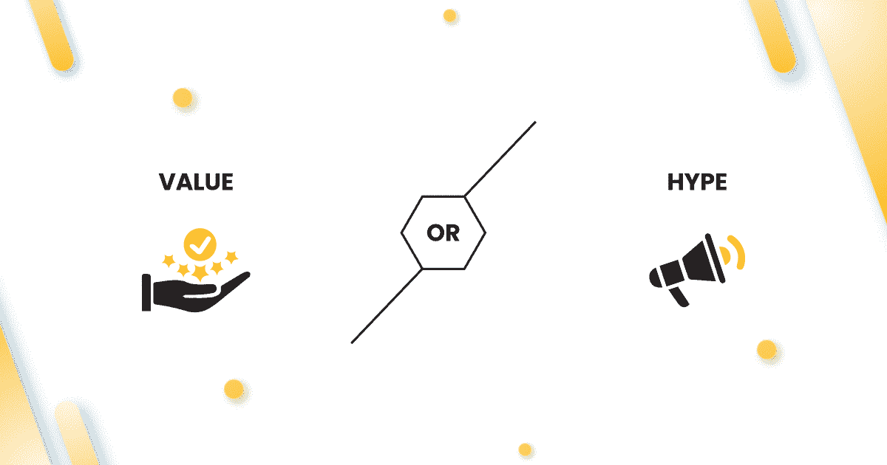

# 价值还是炒作——回答终极困境

> 原文：<https://medium.com/geekculture/value-or-hype-906381b080fb?source=collection_archive---------18----------------------->

## 请继续阅读，了解你应该关注哪些方面，为你的 NFT 系列带来最佳效果。

Value or Hype

客户问我们的一个常见问题是——我是专注于为我的 NFT 创造价值还是大肆宣传？当我们想到 NFT 时，它们只是你向客户销售的任何常规产品或服务。这是一项终身投资，可以根据你的交易方式增加或减少价值。

## **建立社区是成功的关键**

最好专注于围绕你的 NFTs 建立一个社区——没有一个围绕它的社区的项目是成功的。你需要一群对你推广的系列真正感兴趣的人，并对你的产品保持渴望。没有社区，你就无法建立价值，没有重视你内容的人，你就无法制造炒作。让我们来分解一下创建一个稳固的社区的心理，以及你需要关注什么来使你的项目成功。

> 与我们的专家一起构建您的社区。了解更多关于 [NFT 社区营销。](https://www.eon8.com/nft-community-marketing/)

## **从目标受众身上创造价值**

你可以选择成为一个过渡阶段，或者始终为你的观众提供良好的效用。我们先来定义一下炒作。当某样东西变得受欢迎时，人们会越来越热衷于成为它的一部分。

想象一下，名人大肆宣传你的 NFT，它就成了全城的话题。无论投资者走到哪里，他们都会注意到你的广告和关于你的 NFTs 的细节。但是在你发布之后，人们开始复制你的 NFTs，你就失去了你的宣传——你成为了人群中的一员！

## 保值

*   做一些独特的事情来脱颖而出。

## 如果每个人都提供同样的 NFT 艺术品

*   尝试用像素艺术营造怀旧氛围。
*   或者放大到未来的东西，策划一个没有人见过的集合！
*   通过社交媒体内容将你的受众重新导向你的社区和市场。

这个想法是给你的非功能性广告增加一些实用性，这将有利于你的观众，同时也为你的品牌增加优势。您可以通过简讯和电子邮件引入召回价值，并通过精心策划的策略和持续的再销售让您的受众了解最新情况。

## **建立信任和真实性**

讲述你的旅程是展示你自己是一个真实品牌的绝佳方式。努力履行承诺，比如日常公关活动。人们可以看到以你的品牌为特色的新闻文章，知道你正在努力做一些有趣的事情。求助于 ***持续的内容营销*** 让人们相信你是一个了解 NFT 的人。他们还会知道你的 NFT 是合法的，他们可以通过投资你的收藏获得利益。

这背后的关键因素是彻底了解你的目标受众。如果你的 NFT 投资者表现出每周四检查公关活动的频繁行为，一定要在那天发布博客。或者在 Twitter 上创建话题，或者在你知道他们最活跃的时候上线。这给了你品牌意识和品牌价值，以及品牌个性和独特的声音。

> 想知道[如何在 Twitter 上推广你的 nft](https://www.eon8.com/promote-nfts-on-twitter/)为你的 NFT 症患者建立社区

## **短期关注 VS 长期忠诚**

参与是吸引客户并让他们忠诚于袖手旁观的一个好方法。在你的发布会上，人们不仅仅是收听和关注。他们坚持你的品牌是因为你给他们的效用。

想象一下你有一辆 NFT——它可以根据你的喜好进行定制和升级。你能做的就是让它成为元宇宙的一款赛车游戏，并鼓励人们使用他们定制的汽车进行比赛。他们可以通过持续赢得比赛来获得奖励、密码，甚至现金！

1.  这里创造的价值允许用户将他们的时间、才能和技能货币化。
2.  你正在建立一个对收集 NFT 感兴趣的玩家社区。
3.  当你销售你的 NFTs 并获得品牌认知度时，你会受益。

由于这是一个非常小众的受众，你很可能会产生持续的线索，并取得良好的转化。

我们的意思是“价值”,而不仅仅是为你的与竞争对手没有什么不同的非功能性广告创造人气。

# ⭐️ **关键要点**

➡️:如果你用一些独特的东西来创建 NFTs，让你从人群中脱颖而出，那将是最好的。

➡️ ️️Your NFT 系列需要为大众提供实用性。

➡️在各种平台上用一致和独特的内容吸引你的观众，以实现品牌召回。

➡️:如果你能为双方的利益(你的品牌和你的观众的成功和利益)找到一个平衡点，那将会有所帮助。

➡️:这不仅仅是销售你的产品和制造短期炒作。真正的交易是关于创造价值和产生长期线索。

> 想了解更多关于 [NFT 营销服务](https://www.eon8.com/nft-marketing-services/)以及如何做大你的 NFT？