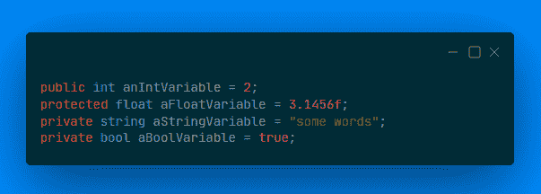
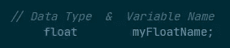
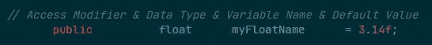
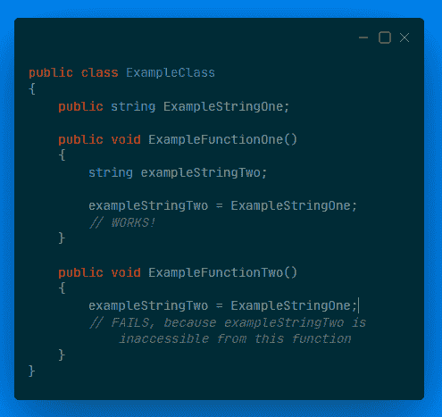
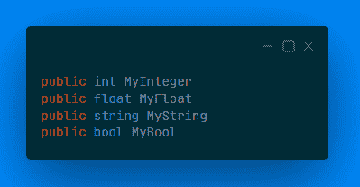
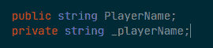
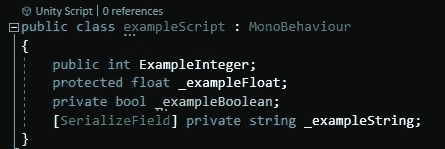
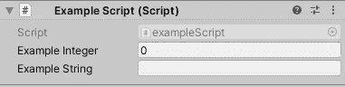

# 变量:编程积木！

> 原文：<https://medium.com/geekculture/variables-programming-building-blocks-43c2e694928c?source=collection_archive---------76----------------------->

Some variable types

# 什么是代码变量？

顾名思义，变量是可以改变的数据的容器。变量可以有许多不同的类型，每种类型都被设计用来保存特定类型的数据。

用 C#编写变量需要两个部分。它们是数据类型和变量名。

Variable parts

此外，还有 2 个额外的可选部件，可在特定情况下使用。这些是访问修饰符和默认值。

Variable parts with optional parts included

# 为什么应该使用它们？

如上所述，**变量**就是数据的存储方式。所以，如果你想存储任何数据，你将需要变量来完成，不管它们是像这些例子一样在类中定义的，还是以一种更临时的方式定义的。除了最基本的代码之外，变量对任何事情都是必不可少的。此外，它们还有一个额外的好处，那就是给你的数据起一个好听的、易于理解的名字，所以不用去记住“ ***3.14f*** ”的意思和作用，你可以知道“***_ animation duration = 3.14 f***”是你的动画的持续时间。

# 不同的部分是什么意思？

## **访问修饰符(可选):**

这些定义了变量的访问方式和位置。有 3 种常见的访问修饰符与 Unity 一起使用。如果变量是在函数中定义的，则不能使用访问修饰符，这意味着它只在函数运行时存在。因此，它不需要修改器，因为它是强制私有的。

Access Modifiers are used for script-wide variables, not function-specific variables

“ ***public*** ”修饰符意味着变量可以被项目中的任何脚本访问，只要它在同一个 ***汇编定义*** (汇编定义是一个完全不同的复杂主题，在大多数项目中很少使用)。

“ ***私有*** ”修饰符意味着变量只能从定义它的脚本**中访问，而不能从任何其他脚本或项目的一部分访问。**

*****“受保护的*** ”修改器在上面 2 的中间某处。这意味着变量只能从定义它的脚本中访问， ***以及*** 从定义它的脚本中继承的任何脚本。**

## **数据类型:**

**数据类型是变量应该并且能够存储的数据类型。Unity 中常用的一些数据类型有:**

*****Int* (整数的简称):**存储整数的数据类型，如 ***1*** ，或 ***18*** ，或 ***38562924*** 。**

*****浮点* :** 存储十进制数的数据类型，如 ***3.14*** ，或 ***46.1*** ，或 ***185.2856*** 。Float 类型的值必须始终后跟小写字母“f ”,以区别于整数。**

*****String* :** 存储一系列字母数字字符的数据类型，如“ ***【文森特】*** ”或“ ***一个随机的句子！*** ”，或“ ***jfhSkuVKmeE*** ”。字符串类型的值必须用引号括起来。**

*****Bool* (布尔的简称):**用于存储 ***真*** 或 ***假*** 值的数据类型，只能是 ***真*** 或 ***假*** 。**

****

**Variable example values**

## **变量名:**

**变量名只是在试图从代码中引用或访问变量时用来标识该变量的名称。有许多行业标准可以确保容易理解的名称和约定，但那是另外一个话题。**

****变量名不能包含空格。****

**一般在 Unity 和 C#中，常用一个叫**骆驼大小写**的标准，上面说**所有名字都要以小写字母**开头。如果名称包含多个单词，**第一个单词之后的任何单词都应以大写字母**开头。任何私有变量在名称的开头都应该有一个下划线(“_”)。**

****

## **默认值(可选):**

**在某些情况下，可以选择将默认值附加到变量定义中。这样做是因为，出于这样或那样的原因，程序员需要用不同于其数据类型设置的默认值来初始化变量。**

****

## **Unity Inspector 示例:**

**如果我们写一个这样的类:**

****

**它出现在 Unity 检查器中，如下所示:**

****

**Default values appear when the script is attached to a GameObject, or when the script component is reset**

## **SerializeField 属性:**

**可以看到上面的“***_ exampleString***”变量前面写有“***【serialize field】***”。这就是所谓的属性，它改变了变量的工作方式或显示方式。**

*****SerializeField*** 属性使通常隐藏在检查器中的私有变量像公共变量一样出现在检查器中。可以在检查器中修改该变量，并保留修改后的值，但是从 ***示例脚本*** 脚本之外的代码中仍然无法访问该变量。**

**它用于允许在检查器中修改变量，同时也防止无意或设计不良的代码修改。**