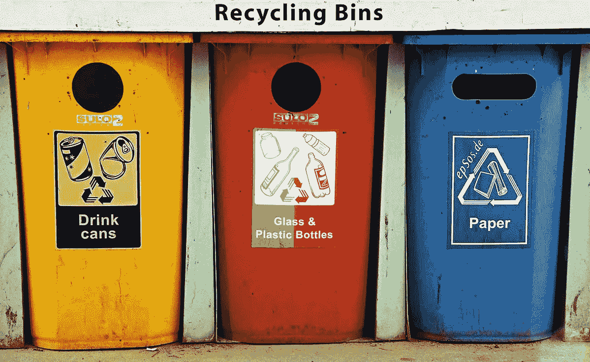

# 变量:编程的小积木

> 原文：<https://medium.com/geekculture/variables-the-little-building-blocks-of-programming-d343aa0f4a80?source=collection_archive---------28----------------------->

Data types and their changing contents.

一想到变量，我就想到人脑中的长期记忆储存。它包含我们需要时保留和访问的基本信息。诸如你的姓名、年龄、体重和位置等数据都是不同的变量。这些变量的值是可以改变的，就像在现实生活中随着年龄的增长，甚至只是四处走动一样。想象你当前的位置是一个有值的变量…