# 可变自动编码器(VAE)

> 原文：<https://medium.com/geekculture/variational-autoencoder-vae-9b8ce5475f68?source=collection_archive---------3----------------------->

作为一种生成模型，VAE 的基本思想很容易理解:通过编码器网络将真实样本转化为理想的数据分布，然后将这种数据分布传递给解码器网络，从而获得生成的样本。如果生成的样本和真实样本足够接近，则训练自动编码器模型。

# 降维、PCA 和自动编码器(AE)

## 主成分分析

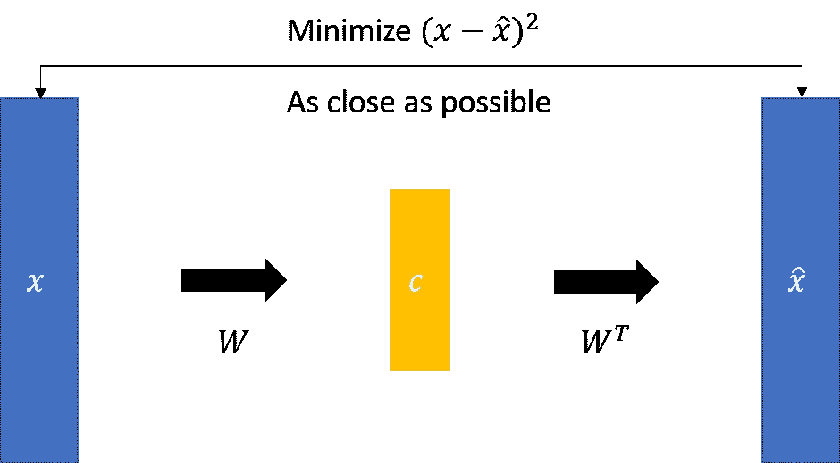

如图所示， *x* 是一个可以通过变换 *W* 成为低维矩阵 *c* 的矩阵。因为这个过程是线性的，所以可以用 *W* 的转置来还原一个 *x* 帽子。PCA 就是通过 SVD(奇异值分解)找到一个 *W* ，使得矩阵 *x* 和 *x* 尽可能的一致。

然而，AE 和 PCA 的区别在于 AE 使用神经网络而不是 SVD。

## 自动编码器

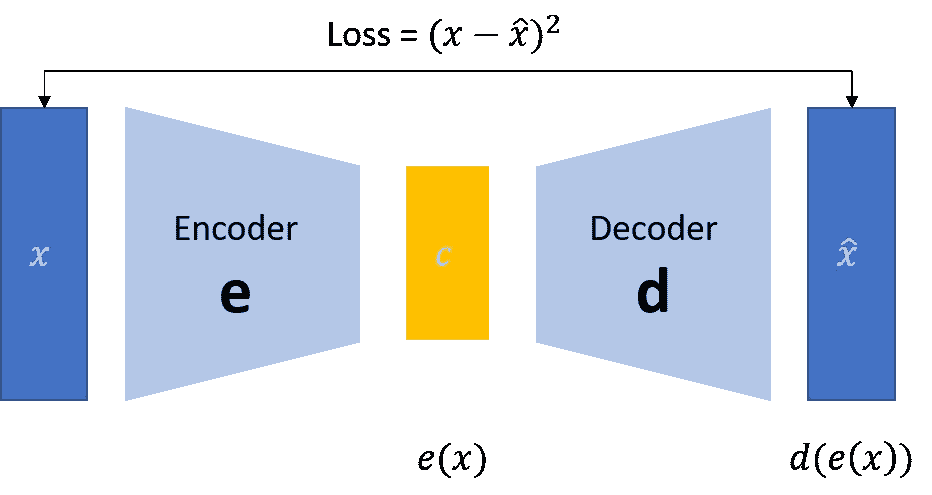

# 可变自动编码器(VAE)

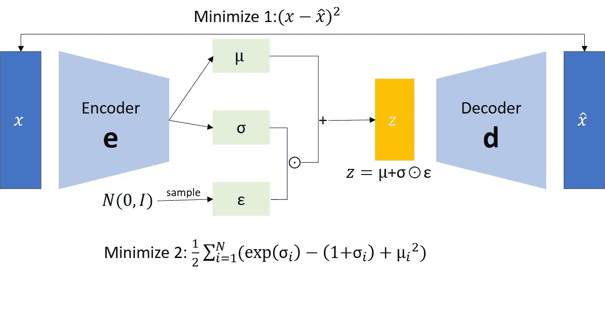

## 编码器

这定义了近似的后验分布***q*(*z | x*)**，其将观察作为输入，并输出一组用于指定潜在表示 ***z*** 的条件分布的参数。在本例中，简单地将分布建模为对角高斯分布，网络输出因子分解高斯分布的均值和对数方差参数。输出对数方差，而不是直接输出方差，以获得数值稳定性。

## 解码器

这定义了观察值***q*(*x | z*)**的条件分布，它以一个潜在样本作为输入，输出观察值的条件分布的参数。将潜在分布先验***P*(*z*)**建模为单位高斯。

## 重新参数化技巧

为了在训练期间为解码器生成样本 ***z*** ，可以从编码器输出的参数定义的潜在分布中采样，给定一个输入观测值 ***x*** 。然而，这种采样操作产生了瓶颈，因为反向传播不能流过随机节点。

要解决这个问题，请使用重新参数化技巧。在我们的示例中，使用解码器参数和另一个参数 **ε** 来近似 ***z*** ，如下所示:

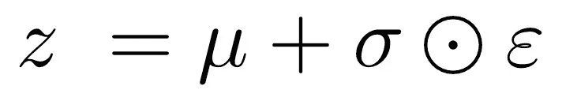

其中 **μ** 和 **σ** 分别代表高斯分布的均值和标准差。它们可以从解码器输出中获得。 **ε** 可以认为是一个随机噪声，用来保持**z的随机性。从标准正态分布生成 **ε** 。
潜变量 ***z*** 现在由 **μ** 、 **σ** 和 **ε** 的函数生成，这将使模型分别通过 **μ** 和 **σ** 反向传播编码器中的梯度，同时通过 **ε** 保持随机性。**

# VAE 是如何运作的？

VAE 的理论基础是[高斯混合模型(GMM)](https://roger010620.medium.com/%E6%A9%9F%E5%99%A8%E5%AD%B8%E7%BF%92-em%E6%BC%94%E7%AE%97%E6%B3%95-expectation-maximization-algorithm-%E4%B8%89-%E9%AB%98%E6%96%AF%E6%B7%B7%E5%92%8C%E6%A8%A1%E5%9E%8Bgaussian-mixture-model-gmm-84286c2d64c7) 。不同的是，我们的代码被一个连续的变量 ***z*** 代替， ***z*** 遵循标准正态分布 ***N* ( *0，1* )** 。
对于每个样本 ***z*** 会有两个变量 ***μ*** 和 ***σ*** ，分别决定 ***z*** 对应的高斯分布的均值和标准差，然后积分域内所有高斯分布的累加就成为原始分布***P***

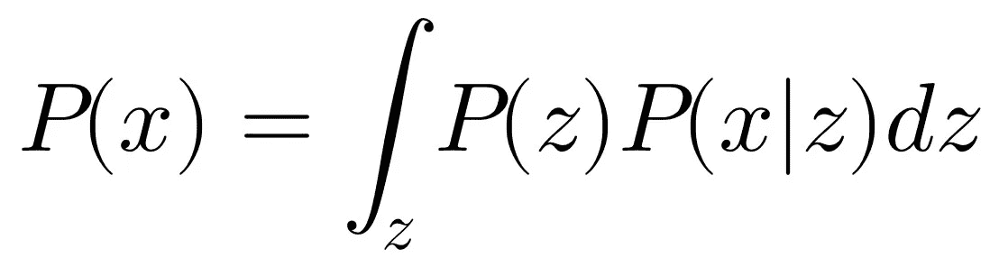

其中 ***z* ~ *N* (0，1)** ，***x*|*z*~*N*(*μ*(*z*)，*σ*(*z*)**，自***P*(*z *以及***x*|*z*~*N*(*μ*(*z*)，*σ*(*z*)**。 我们真正需要求解的是 ***μ*** 和 ***σ*** 的表达式，但是***P*(*x*)**非常复杂，μ和σ很难计算，需要引入两个神经网络来帮助我们求解。：****

我们希望**P(*x*)**越大越好，那么

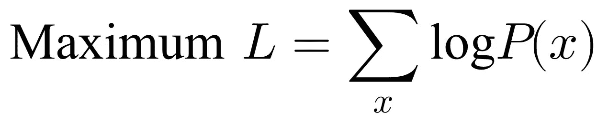

其中**日志 *P* ( *x* )**

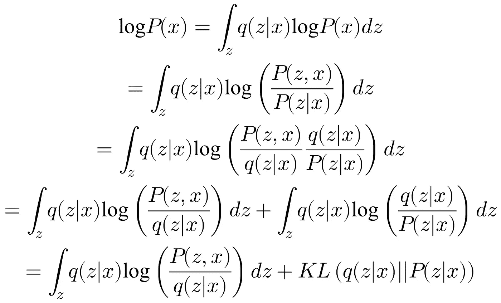

上式的第二项是大于等于 0 的值，所以我们找到了**log*P*(*x*)**的一个下界

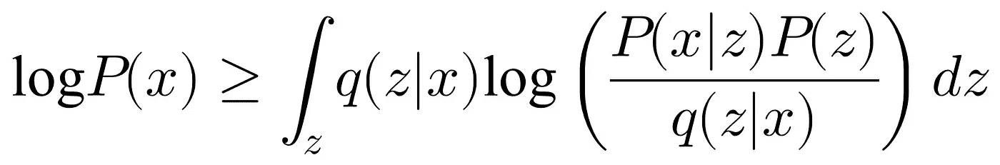

我们将这个下限表示为 ELBO:

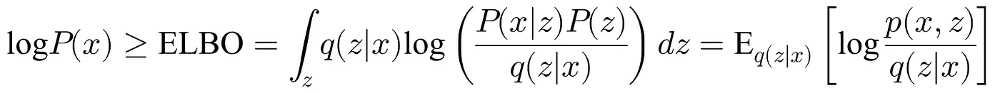

所以我们可以把原来的形式修改为:

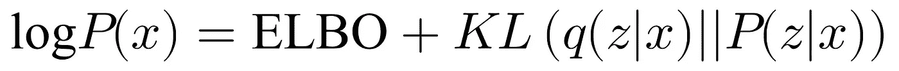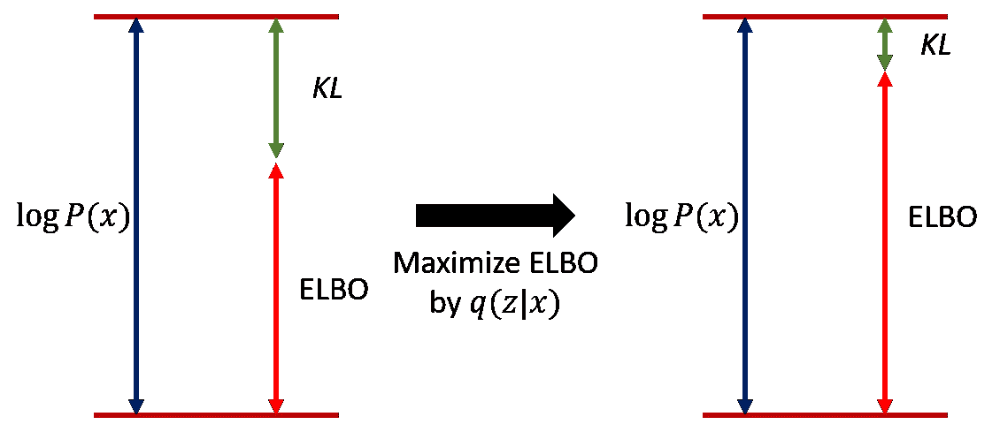

通过调整***q*(*z*|*x*)**让 ELBO 越来越高，KL 散度越来越小。当我们调整***q*(*z*|*x*)**使***q*(*z*|*x*)**和 **P(z|x)** 相同时，KL 发散消失为 0，ELBO 和 **log *可以得出结论，我们总是可以调整 ELBO 等于**log*P*(*x*)**，并且因为 ELBO 是**log*P*(*x*)**的下界，求解最大**log*P*(*x*
调整***P*(*x*|*z*)**是调整解码器，调整***q*(*z*|*x*)**是调整编码器。每次解码器前进时，编码器被调整以与其一致，使得解码器在下一个训练时期之后只会更好。*****

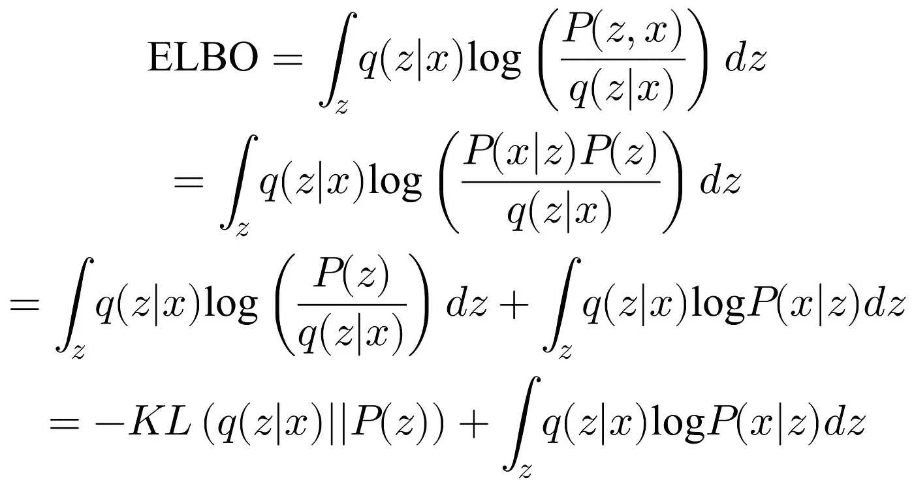

因此，最大化 ELBO 等价于最小化**KL(*q*(*z*|*x*)|*P*(*z*)**并最大化上图第二项的积分方程。

首先，检查上图的第二项:

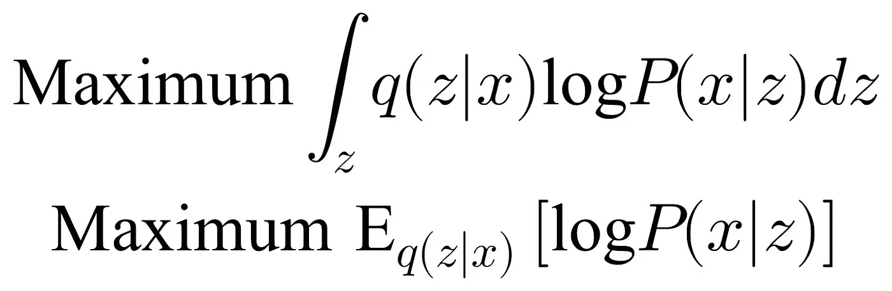

上述期望值是指在给定***q*(*z*|*x*)**(编码器输出)尽可能高的情况下，***P*(*x*|*|*)**(解码器输出)。这类似于 AutoEncoder 的损失函数(重建误差):

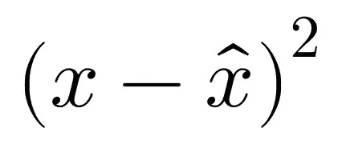

我们来讨论一下**-KL(*q*(*z*|*x*)| |*P*(*z*)**:

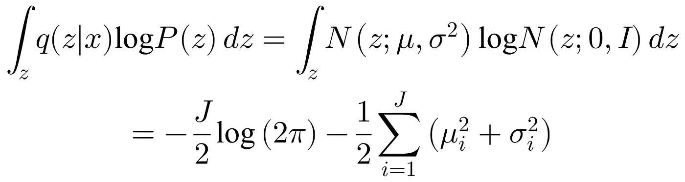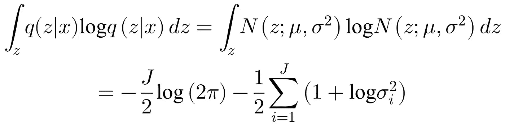

那么，我们可以把**-KL(*q*(*z*|*x*)| |*P*(*z*)**写成:

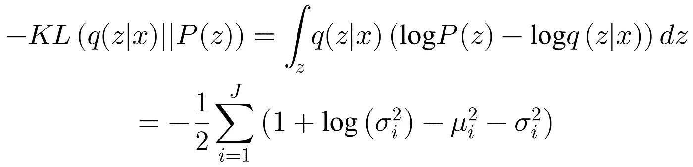

# 结论

EM 和 VAE 都是寻找潜在变量 **z** 的机器学习技术/算法。然而，尽管总体目标甚至**目标函数**都是相同的，但由于模型的复杂性，还是存在差异。EM(及其变体)有两个局限性。这些在金玛最初的 [VAE 论文中提到过。](https://arxiv.org/abs/1312.6114)

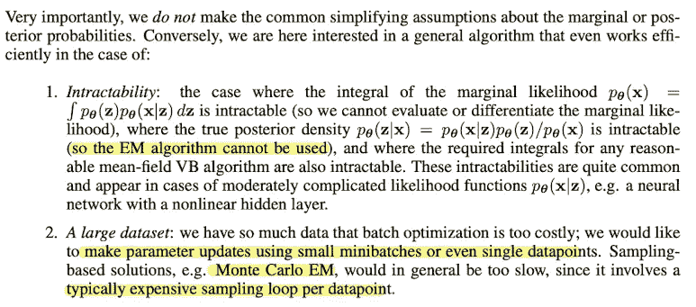

在 EM 算法中，我们可以计算后验概率，而在 VAE 解决的问题中，我们的后验是难以处理的，即无法计算。所以我们必须在 VAE 近似这个后验概率，这就是为什么我们在公式中使用 KL 散度，这个方法实际上是后验概率的变分近似。