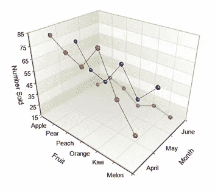
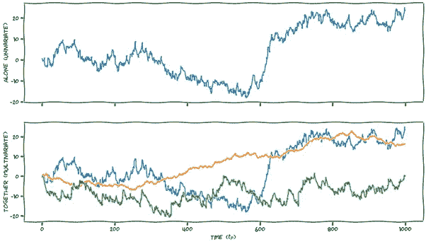
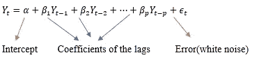
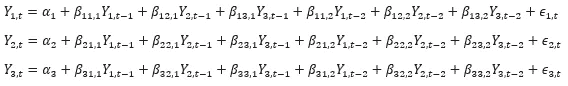
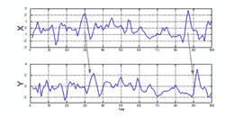
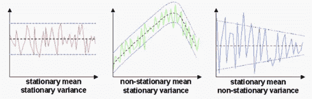
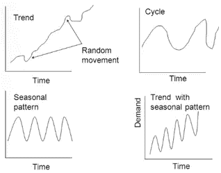
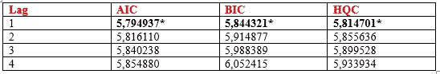
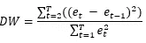

# 多元时间序列预测的向量自回归

> 原文：<https://medium.com/geekculture/vector-auto-regression-for-multivariate-time-series-forecasting-9334d29591f3?source=collection_archive---------3----------------------->

时间是决定一个公司能否崛起的最关键因素之一。这就是为什么我们看到商店或电子商务平台的销售与节日保持一致。我们该如何分析这种数据集？

时间序列数据是一组在相同时间段内有序排列的数据集合。因此，它是一个离散时间数据序列。例如，一个月卖出的水果数量…

**Figure** Example for time series

多元时间序列有多个时间相关变量(时间序列)。每个变量不仅依赖于它过去的值，而且还与其他属性有某种关系。这种相关性对于预测未来值非常有用。哪个模型可用于此目的？

**Figure** Univariate and multivariate graphs for time series

向量自回归是多变量预测算法之一。它利用**两个或多个**时间序列**相互影响**。在此模型中，每个属性都是其自身的过去值和所有其他变量的过去值的线性组合。这些序列的过去值用于预测未来。

让我们看看 VAR 模型的结构。

典型的 AR(p)模型如下:

一个简单的 VAR(p)模型可以写成

和 VAR(2)过程的形式:

对于这个模型，我们有多个相互影响的时间序列，它被建模为一个方程组，每个时间序列有一个方程。如果我们增加模型中时间序列的数量，方程组会自动变大。例如，VAR(3)将如下:

为了构建模型，我们必须检查数据集的一些属性。为了确定一个时间序列是否可以用来预测另一个时间序列，**格兰杰因果检验**是一个很好的选择。这是一种随时间推移的关系。它提供了关于两个系列如何一起移动的信息**。**如果概率值小于显著性水平(0.05)，则假设将在该水平被拒绝。

**Figure** Examples show how the two series move together

为了显示两个或多个时间序列之间存在统计上显著的联系**协整检验**是有帮助的。它是时间序列变量的一个统计属性。我们拥有的所有序列必须是 d 阶积分(使非平稳时间序列平稳所需的差分次数)。如果这个集合的线性组合小于 d，那么这个集合被称为是协整的，这意味着它们具有统计上显著的关系。

检查完这些特性后，我们将数据集分成训练数据和测试数据。平稳性是建立模型的另一个重要问题。我们如何确定数据集是稳定的还是不稳定的？

如果一个时间序列的均值、方差在一段时间内保持不变，而不是一个函数，则称该时间序列是平稳的。大多数时间序列模型都假设时间序列是平稳的。有三个重要的检查点:

1.常数平均值

2.恒定方差

3.不依赖于时间的自动方差

**Figure** Different graphs shows different cases about stationary

使系列%100 静止几乎是不可能的，但我们必须尽可能地接近它。时间序列的非平稳性背后有几个原因。两个常见原因:

趋势

季节性

**图**显示不同非平稳情况的不同图形

我们可以使用以下单位根检验来检验平稳性:

[增强迪基-富勒试验(ADF 试验)](https://www.machinelearningplus.com/time-series/augmented-dickey-fuller-test/)

[KPSS 测试](https://www.machinelearningplus.com/time-series/kpss-test-for-stationarity/)

绘制滚动统计数据

如果发现一个序列是不稳定的，你可以通过对这个序列求一次差来使它稳定，然后再次重复这个测试，直到它稳定为止。差异处理趋势和季节性。

**VAR 订单选择**

在我们可以估计多元 VAR 模型之前，我们需要指定阶 p。模型阶选择的最常见方法涉及选择一个模型阶，该模型阶最小化在一系列模型阶上评估的一个或多个信息标准(AIC、BIC、HQC)。这些标准是:

赤池信息标准(AIC)

贝叶斯信息准则(BIC)

汉南-奎因标准(HQC)

通常，AIC 是最好的标准，因为它具有良好的小样本预测特性。然而，BIC 和 HQ 在较大的数据集中工作良好，并且具有作为一致估计量的优势。

让我们来看一些包含滞后信息标准的表格示例。

我们选择 p=1，因为最低值似乎在这里。

我们选择 p=3。

为了选择 VAR(p)的正确阶数，我们迭代地拟合 VAR 模型的递增阶数，并选择给出具有最小 AIC 的模型的阶数。我们还可以检查 BIC 和 HQIC 的其他最佳比较估计。

另一个测试问题是残差的序列相关性。它用于检查错误中是否有任何剩余模式。如果残差中还有任何相关性，那么，时间序列中仍有一些模式需要模型来解释。在这种情况下，有几个经典动作。

增加模型的阶数— p

说服更多的预测者进入系统

为问题建模搜索不同的算法

杜宾·沃森统计量是检验残差序列相关性的典型方法。

DW 的值可以在 0 和 4 之间变化。

如果接近 0，则为正序列相关

如果接近 2，则没有显著的序列相关性

如果接近 4，则为负序列相关

完成这些操作并确定 p、d 等参数后。，模型就可以应用了。然后将生成预测，但这是模型将使用的训练数据的规模。因此，要将其恢复到原始比例，并按照我们对原始输入数据进行差分的次数对其进行去差分。

参考

[https://online library . Wiley . com/doi/10.1002/9781118625590 . ch7](https://onlinelibrary.wiley.com/doi/10.1002/9781118625590.ch7)

https://en.wikipedia.org/wiki/Cointegration

[https://www . machineellingplus . com/time-series/vector-auto regression-examples-python/](https://www.machinelearningplus.com/time-series/vector-autoregression-examples-python/)

[https://www.r-econometrics.com/timeseries/varintro/](https://www.r-econometrics.com/timeseries/varintro/)

[https://en . Wikipedia . org/wiki/Vector _ auto regression #:~:text = Vector % 20 auto regression % 20(VAR)% 20 is % 20a，允许% 20 for % 20 multi variate % 20 time % 20 series](https://en.wikipedia.org/wiki/Vector_autoregression#:~:text=Vector%20autoregression%20(VAR)%20is%20a,allowing%20for%20multivariate%20time%20series)。

翁贝托·特里亚卡的课堂讲稿——第十八课:构建向量自回归模型