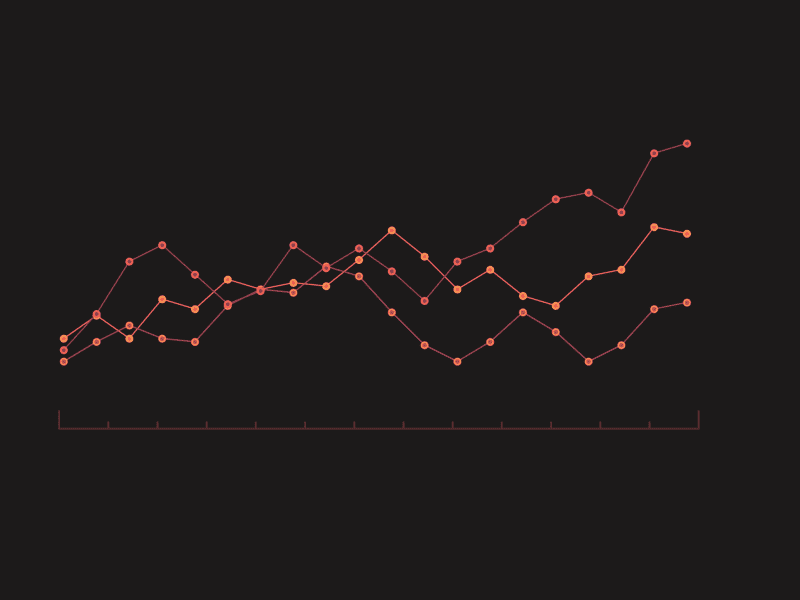
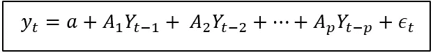
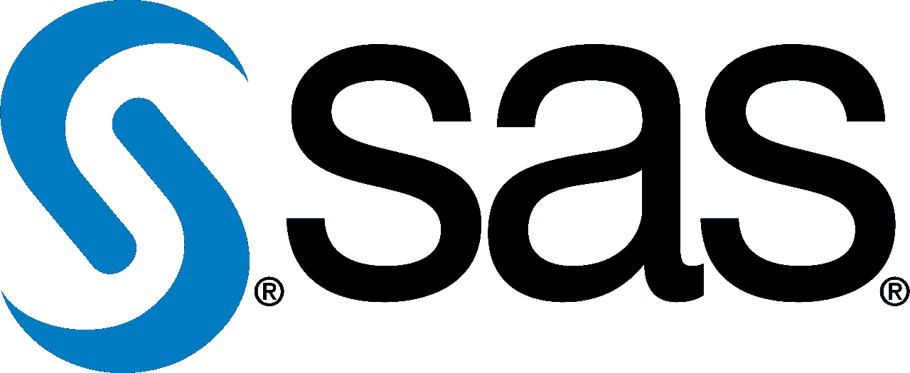
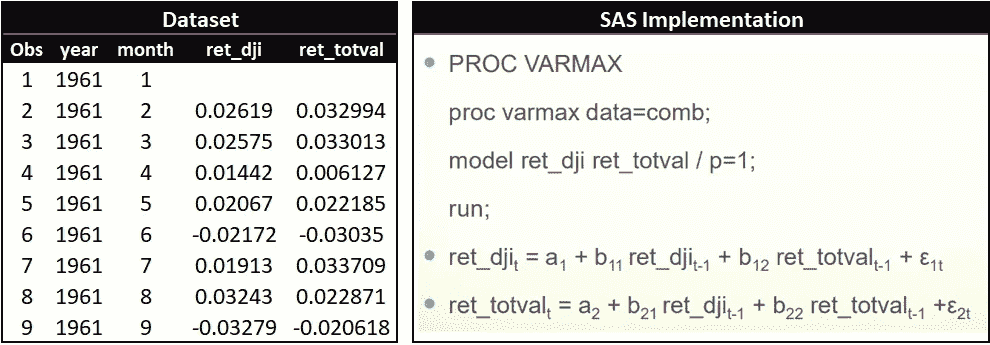
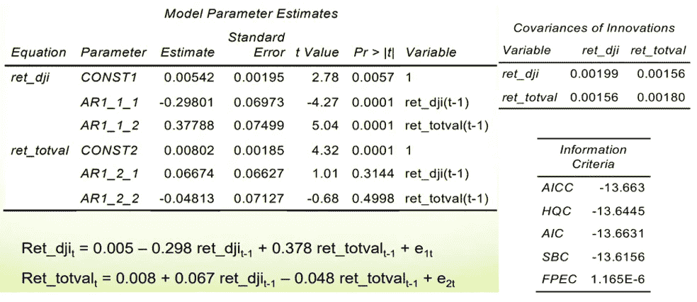

# 多元时间序列预测的向量自回归模型

> 原文：<https://medium.com/geekculture/vector-auto-regressive-var-models-for-multivariate-time-series-forecasting-106bb6f74add?source=collection_archive---------4----------------------->

向量自回归(VAR)模型是分析多元时间序列最成功、最灵活、最易于使用的模型之一。它是单变量自回归模型到动态多变量时间序列的自然延伸。事实证明，风险值模型对于描述经济和金融时间序列的动态行为以及预测特别有用。它通常提供优于单变量时间序列模型和基于理论的复杂联立方程模型的预测。风险值模型的预测非常灵活，因为它们可以以模型中特定变量的潜在未来路径为条件。

除了数据描述和预测，VAR 模型还用于结构推断和政策分析。在结构分析中，对被调查数据的因果结构进行了某些假设，并总结了对特定变量的意外冲击或创新对模型中变量的因果影响。这些因果影响通常用脉冲响应函数和预测误差方差分解来概括。

本文假设我们已经了解基本的时间序列模型，如 ARMA、ARIMA、SARIMAX 等。

# 介绍

向量自回归(VAR)是一种预测算法，当两个或多个时间序列相互影响时，可以使用**，即所涉及的时间序列之间的关系是**双向**。它被认为是一个自回归模型，因为每个变量(时间序列)都被建模为过去值的函数，也就是说，预测值只不过是序列的滞后(时间延迟值)。**

其他自回归模型，如 AR、ARMA 或 ARIMA 模型是单向的，其中预测因子影响 Y，而不是相反。向量自回归(VAR)模型是双向的，即变量相互影响。

# 风险值模型的类型

有三大类型的风险值模型，简化形式，递归形式，和结构风险值模型。

1.  **简化形式的风险值模型:**这些模型认为每个变量都是其自身过去值的函数，所有其他变量的过去值都被考虑在内，还有一个序列不相关的误差项。在这些模型中，误差项将与方程相关。这意味着我们不能考虑个别冲击会对系统产生什么影响。
2.  **递归 VAR 模型:**这些模型包含了简化形式模型的所有组成部分，但也允许一些变量是其他并发变量的函数。通过强加这些短期关系，递归模型允许我们对结构性冲击进行建模。递归 VAR 将每个回归方程中的误差项构造为与前面方程中的误差不相关的
    。这是通过明智地将一些同期值作为回归量来实现的。
3.  **结构风险值模型:**这些模型包括一些限制条件，允许我们识别简化形式或递归模型无法识别的因果关系。这些因果关系可用于模拟和预测个别冲击的影响，如政策决定。

# 定义模型

基本上，VAR 模型意味着*一切都依赖于一切*。VAR 模型可以定义为:

where t = 1,2,…..,T

**假设:**

*   yt:平稳 K 变量向量
*   v: K 常数参数向量
*   Aj: K 乘 K 参数矩阵，j=1，…，p
*   ut: i.i.d.(0，适马)
*   可以包括趋势:delta(t)，其中 delta 是 K 乘 1
*   可以添加外部变量 X

在给定一些假设的情况下，可以使用普通最小二乘法来估计该方程:

*   误差项的条件均值为零。
*   模型中的变量是稳定的。
*   不太可能出现大的异常值。
*   没有完美的多重共线性。

在这些假设下，普通最小二乘法估计:

*   会始终如一。
*   可以使用传统的 t 统计和 p 值进行评估。
*   可用于联合测试多个等式的限制。

VAR 模型是由一个代表多个变量之间关系的方程组组成的。当提到风险值模型时，我们经常使用特殊的语言来说明:

*   内生变量的数量。
*   自回归项的数目。

例如，如果我们有两个内生变量和自回归项，我们说该模型是一个双变量 VAR(2)模型。如果我们有三个内生变量和四个自回归项，我们说这个模型是一个三元 VAR(4)模型。通常，VAR 模型由 n 个方程(代表 n 个内生变量)组成，并包括变量的 p 滞后。

# 滞后选择

滞后选择是 VAR 模型规范的重要方面之一。在实际应用中，我们一般选择一个最大滞后数 p(max)，并评估模型的性能，包括 p = 0，1，…。，p(最大值)。最优模型是模型 VAR(p ),它使一些滞后选择标准最小化。

其中:

*   Yt = (y1t，y2t，…..ynt)是时间序列变量的(n * 1)向量
*   a =截距的(n * 1)个向量
*   Ai (i=1，2，…，p) = (n * n)系数矩阵
*   Ei =不可观察的 i.i.d .零均值误差项(白噪声)的(n * 1)向量

最常用的滞后选择标准是:

*   赤池(AIC)
*   施瓦兹-贝叶斯(BIC)
*   汉南-奎因公司(总部)
*   最终预测误差(FPE)
*   以上平均值

这些方法通常被内置到库中，而标签选择现在几乎完全自动化了。

# 变量选择、预测和评估

内生变量的预测相关性可以用格兰杰因果检验、沃尔德检验等进行检验。如果你有两个以上的变量，你应该考虑使用 VAR 进行多变量格兰杰因果检验。你还应该考虑变量是稳定的还是不稳定的。如果变量是平稳的，你可以在平稳的 VAR 中应用格兰杰因果检验。如果变量是非平稳的，也不是协整的，你可以对变量进行差分，并在差分变量的平稳 VAR 中应用格兰杰因果检验。如果变量是非平稳的，并且是协整的，那么可以在 VECM(包含短期和长期成分)中应用格兰杰因果检验，该 VECM 通过协整或差分转换假设所有数据都是平稳的。如果没有协整，可以排除误差修正项，并通过平稳 VAR 中的 Wald 检验进行检验。或者，你可以使用 Toda 和 Yamamoto (1995)使用非平稳数据的剩余滞后格兰杰因果检验。

VAR 模型最重要的功能之一是生成预测。使用迭代预测算法为风险值模型生成预测:

*   使用每个方程的 OLS 估计风险值模型。
*   计算所有变量的提前一期预测。
*   使用一期提前预测计算两期提前预测。
*   迭代直到计算出 h 步预测。

通常我们对 VAR 模型预测的动态比估计的实际系数更感兴趣。因此，最常见的风险值研究报告是:

*   格兰杰因果统计。
*   脉冲响应函数。
*   预测误差分解

# SAS 中的实施

让我们以 DJIA 指数和总市值为例，看看风险值在 SAS 中是如何工作的。

*   可检验的假设:DJIA 指数必须依赖于自身的滞后和总市值的滞后，反之亦然。
*   使用 DJIA 回报率指数和市值回报率
*   每月观察

数据集和实现如下所示:

关于 python 中的实现，请参考官方文档[stats models . TSA . vector _ ar](https://www.statsmodels.org/dev/vector_ar.html)。

# 批评和有用性

var 面临的一个批评是，他们是理论上的；也就是说，它们不是建立在某种经济理论之上的，这种理论将理论结构强加于方程式之上。假设系统中的每个变量都影响其他变量，这使得直接解释估计的系数变得困难。尽管如此，风险值模型在几种情况下是有用的:

*   预测一组不需要明确解释的相关变量；
*   测试一个变量在预测另一个变量时是否有用(格兰杰因果检验的基础)；
*   脉冲响应分析，分析一个变量对另一个变量的突然但暂时的变化的响应；
*   预测误差方差分解，其中每个变量的预测方差的比例归因于其他变量的影响。

我希望这篇文章能让您对这种处理多变量时间序列数据的先进而有用的技术有所了解。我期待着你的宝贵反馈/意见，因为它有助于我更好地计划和研究我的文章。请随意评论你想让我写的关于机器学习的任何话题。

感谢阅读！注意安全！

*参考:* [【www.aptech.com】](http://www.aptech.com)