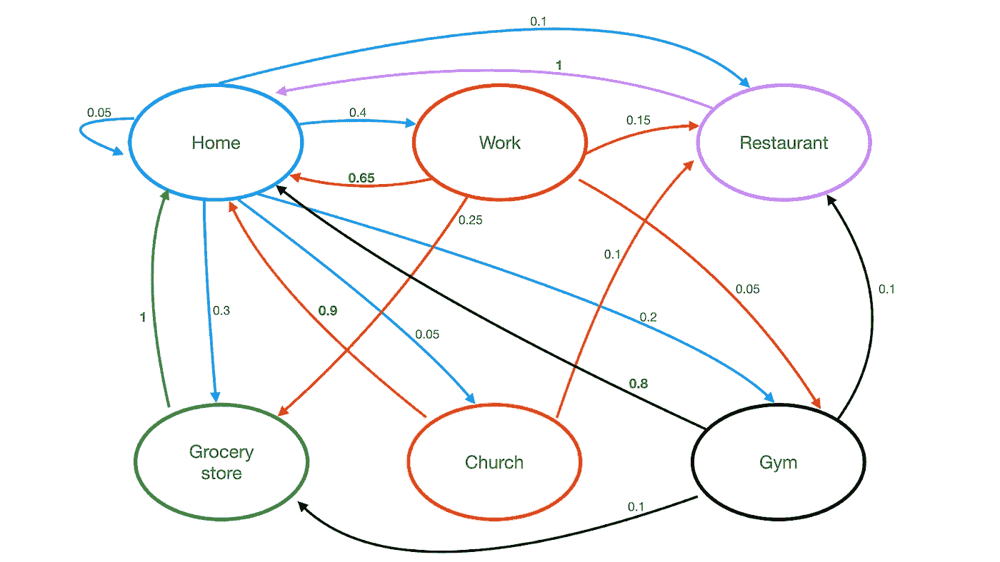
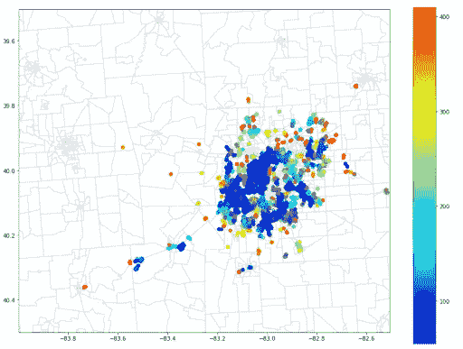
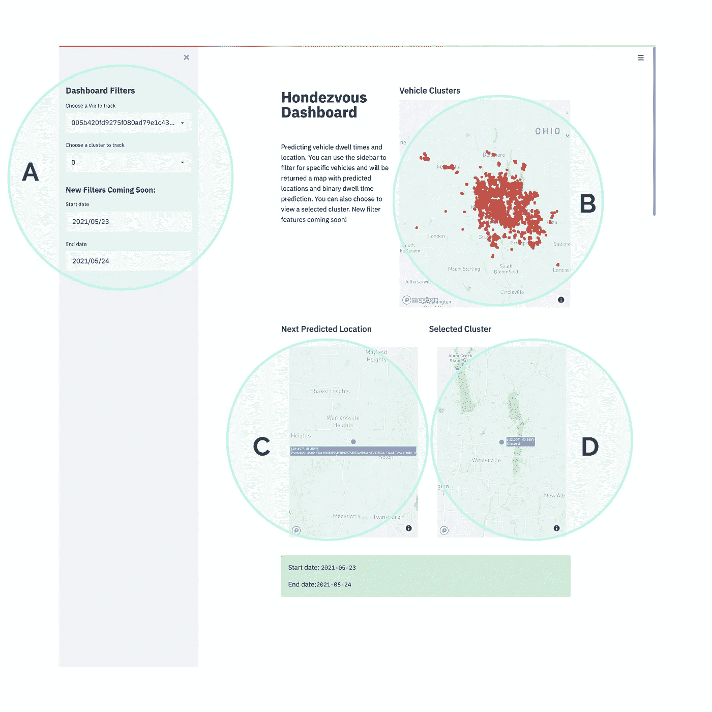

# 车辆位置和停留时间预测

> 原文：<https://medium.com/geekculture/vehicle-location-and-dwell-time-prediction-be1f4255f664?source=collection_archive---------27----------------------->

# 介绍

我们的团队很幸运地被本田和俄亥俄州立大学支持的创新实验室 [99P Labs](https://www.99plabs.com) 选中，开发可以预测车辆未来位置和停留时间(汽车将保持静止多长时间)的机器学习方法，从而实现一系列服务:让汽车成为送货地点，在移动中获得服务，以及让私人汽车进入零工经济以赚取被动收入。

在五个月的过程中，我们开发了两个模型来预测车辆的下一个位置和相关的停留时间。为了根据初始起始位置及时确定给定汽车的目的地，我们开发了一个马尔可夫模型。然后，我们创造性地将 DBScan、K-NN 和 XGboost 算法结合起来，以实现准确的停留时间预测。一旦构建了这两个模型，它们就被整合到服务提供商的高效 UI 中。

# 数据清理和预处理

我们从 99P 实验室开发者门户 API 收集数据。这是一个基于事件的实时数据集，在美国以~毫秒的间隔从汽车中收集时空数据。数据被地理围栏到俄亥俄州哥伦布市，以简化建模工作并防止因城市间差异而可能出现的潜在模型偏差。由于 99PLabs 实现的基于事件的数据收集系统，绝大多数记录都是 NaN 值，因此我们在 API 调用中过滤掉了 NaN 值。为了提取足够的数据来训练和测试我们的模型，我们在 99P 实验室软件工程师实习生汤米·陈的帮助下创建了分页技术。这个过程的数据保留效率不到 1%，这意味着每拉入 100 行，我们保留 1 行。

然后，这些数据被汇总到每辆车的单独行程中。实施进一步的逻辑以提取每个行程序列的开始和结束位置，并且计算发动机循环之间经过的时间(从上一次停止到下一次开始的时间戳的差异)作为停留持续时间。这些持续时间也被放入三个区间的序列中:0-3 小时、3-6 小时、+6 小时，这有效地将我们的模型架构从回归模型改变为分类模型。转向分类问题使我们能够优化产品的准确性，以适应服务提供商的使用情形，而不是试图以低准确性预测连续范围内的数字。

# 位置预测

确定使用哪种模型进行车辆位置预测极具挑战性，但马尔可夫模型是最直观、最常用的位置预测方法。该模型通过具有一组状态来工作，对于该组中的每对状态 *i，j* 具有从状态 *i* 移动到状态 *j* 的相关概率。为了将马尔可夫模型应用于我们的数据，我们首先将位置群集设置为马尔可夫链中的唯一状态，并计算每辆车从当前位置移动到不同位置的概率。为了处理 Markov 模型的数据，我们删除了所有没有停留时间的行，以便只使用已完成的行程，并且只保留起始和结束位置的纬度和经度。

对于模型架构，我们首先设置一个缓冲区，以防止过多的坐标通常位于同一区域(例如，车道与房屋前的街道)，并将这些位置分组到一个州下。在我们找到一辆汽车访问的所有唯一状态(即位置)的集合后，我们编写了一个转移函数，该函数计算在状态集合中所有位置汽车从位置 *i* 开始并在位置 *j* 结束的概率。为此，我们利用了为加州大学伯克利分校的数据课程创建的数据科学库。

在我们计算了每个状态的转移概率后，我们编写了一个函数，它接收汽车的 ID 号，并返回下一个最可能的状态，以及它们相应的概率，给定它在数据集中最后记录的状态。我们希望在最后将所有模型连接在一起，只需输入一个 vin，就可以接收每个模型的位置预测、相应的机会和停留时间。然而，我们无法在给定的时间内将它们全部连接起来，因为我们使用了略有不同的列，并为每个列过滤了数据框。因此，我们决定将马尔可夫链的最终输出从序列格式转换为数据帧格式，并打印出每辆车和行程的顶部下一个位置，其概率总和为 80%。然后，我们将这个最终的大型数据帧转换为 csv 文件，并在单独的列中添加每个数据帧的停留时间，以插入到我们的 Streamlit UI 中，使用户能够查看特定车辆在设定日期范围内的停留时间和位置预测。

Example of a Markov Chain with Transition Probabilities

**马尔可夫链的局限性和潜在的未来方法**

为了指定汽车的状态，我们想要向我们的状态添加额外的变量(例如，一天中的时间、一周中的日期等。)以实现更准确的概率和整体更好的模型性能。然而，我们意识到这可能导致模型过度拟合，特别是如果我们的新变量过于具体，这将对我们的模型的性能产生不利影响，因为它无法用看不见的数据进行有效预测。

为了解决这个问题，如果我们有更多的时间，我们会想要实现另一个称为隐马尔可夫模型的位置预测模型。该模型不同于马尔可夫链，因为它基于整个原始数据集进行预测，而不是基于按每辆车和每次出行分组的简化数据集。正因为如此，该模型将能够识别每次行程之间的变化跳跃，给这些变化一个特定的权重，并随着汽车随着时间的推移继续行驶，用更多的行程来更新这些权重。因此，每行驶一秒钟，每次行程将包括数百次观察，这将有助于模型更有效地了解人口分布。

该模型非常有用的一些原因是，它允许我们识别哪些汽车当前正在飞行，观察驾驶模式的最新变化，并添加时间序列相关数据以进行更准确的预测。它还能够通过最初分析其他司机的行为来预测没有任何存储数据的新车的未来位置。例如，如果一个新用户当前正在飞行，并且一个送货工人想要预测他或她下一步要去哪里，则该模型将查看从同一点出发的其他车辆，确定他们从该起点出发的最常见的最终目的地是哪里，并且预测这辆新车将最有可能遵循该等效路线。

尽管隐马尔可夫模型非常有用和先进，但它需要大量的时间和知识来构建、训练和改进。虽然这将是我们下一步尝试的一项令人兴奋的任务，但我们创建的马尔可夫模型仍然能够根据每辆车的出行历史中的出行比例做出准确的预测。因此，它可以作为进一步实现附加变量和其他模型(如隐马尔可夫模型)的良好起点。

# 停留时间预测

在追求精确的停留时间预测时，采用了两种不同的方法。第一种方法使用时空聚类和监督学习方法。我们创建了一个聚类网络，可以识别位置、时间和停留时间之间的趋势和关联。在建立了这个网络之后，我们实现了一个 K-NN 算法来预测一个新的数据点属于哪个聚类，从而允许预测的聚类作为停留时间预测的辅助。然后，我们可以使用该预测集群的汇总指标来预测新数据点的停留时间，并提供上下文来增强决策制定流程。上下文信息包括预测聚类的中值、众数、平均值和方差。本质上，我们创建一个聚类网络，预测一个新点属于哪个聚类，然后使用该聚类的信息进行最终预测。

## 方法 1: DBScan + KNN

为了基于参数(停留时间、位置和一天中的时间)创建聚类网络，我们实现了 DBScan 聚类算法，该算法基于给定特征之间的模式在 n 维空间中创建数据组。例如，一所学校可能有三个主要停车场:教师停车场、学生停车场和家长下车区。理想情况下，我们的 dbs 模型将拆分学校中的数据点，并根据汽车在给定区域停放的时间、时间以及停放位置来找到这些聚类。另一个例子是机场停车场。也许在一个机场有两个集群，一个是供人们临时停车去接人的，另一个是供人们去度假时把车停在那里的。

Example of generated cluster network for Columbus, Ohio

然后我们训练和调整一个 K-NN 模型来预测一个给定点属于哪个聚类。这样做的困难在于，我们使用的预测维度比创建聚类时少 1 个(新点的停留时间未知)。幸运的是，通过使用 DeepNote 的 GPU 和最强大的 CPU 机器，我们能够在一个大的搜索空间上调整我们模型的超参数，极大地提高了性能。一旦我们有了每个点的预测聚类，我们就预测了其相关聚类的模式停留时间间隔。该模型实现了大约 78%的**测试精度。**

## 方法 2:在二进制区间上 XGBoost

在与自己的竞争中，我们创造了第二种方法，替代第一种方法。我们的第二个模型不依赖于聚类网络进行预测。相反，这种方法在原始数据(位置和时间)上训练 XGBoost(决策树分类器)模型，以直接预测停留时间间隔。此外，我们将结果空间从多类分类问题简化为二进制问题。我们没有将宁滨停留时间分为三个区间，而是训练模型来预测给定汽车的停留时间是大于还是小于某个值 k

随着 k 值的增加，我们的模型实现了更高的准确性，因为更大的停留时间不太常见，并且似乎与位置有更强的关联。最后我们用 10 个小时作为我们的间隔。这一决定是通过分析停留时间的分布以及准确性和可推广性之间的权衡来确定的。该模型实现了 82%的**测试准确度。**

# 用户界面

可解释性是与我们的模型交互的关键。我们使用 Streamlit.io 构建了一个用户界面，让用户能够查看我们所做的聚类，并过滤特定车辆的结果。在下图中突出显示的区域 A 中，我们可以使用侧栏来筛选特定的车辆或集群。在突出显示的区域 B 中，我们可以看到我们在俄亥俄州哥伦布市生成的不同车辆集群。使用侧边栏来过滤特定的 vin，在突出显示的区域 C 中返回交互式的、带标签的地图，该地图具有该车辆的潜在下一个位置，以及二进制相关联的停留时间。类似地，针对特定聚类的过滤在突出显示的区域 D 中生成具有该特定聚类的位置的交互式地图。

我们的用户界面旨在帮助解释我们的模型，这些模型主要是根据过去的数据进行训练的。将我们当前的系统连接到一个持续的数据流将会打开更多可能性的大门。实现到我们的用户界面中，人们可以想象让用户(如亚马逊司机)能够找到当前在他们附近道路上的车辆，并为包裹递送等服务提供足够的停留时间，从而为司机和客户节省时间和资源。

与我们当前的用户界面不同，像 Amazon driver 这样的用户界面会忽略不符合服务提供商要求的结果。例如，停留时间低于 4-6 小时的车辆，以及回家的车辆，将从用户界面中忽略。筛选特定车辆和日期范围的功能也将被删除，但筛选特定聚类中的车辆的功能将保留。简单、清晰和易用是服务提供商的关键。

Hondezvous Dashboard — Built with Streamlit.io

# 结论

## 模型限制和改进

由于我们的模型是专门基于哥伦布地区的数据建立的，因此结果不能外推到美国的其他城市。为了让他们在其他城市工作，需要使用来自给定城市的新数据构建新的集群网络。

尽管我们能够用数百万个数据点来构建模型，但在这种粒度或特定位置预测数据需要更多的信息才能始终准确。理想情况下，在每个城市和建筑中拥有大量的工作点将极大地有助于提高我们预测的准确性。

我们相信，通过增加数据集的特征，可以显著提高我们模型的性能。如果我们可以访问与车辆所有者相关的人口统计数据和其他类似信息，我们可以极大地增强整体模型性能和聚类生成，以实现更精确的停留时间预测。

## 承认

我们要感谢 99P 实验室的 Rajeev Chhajer、Brian Nutwell、汤米·陈、Tony Fontana 和 Kent Broestl 在这个项目上对我们的指导，以及在此过程中提供的重要帮助和建议。

非常感谢 Elizabeth Dlha 和 D [eepnote](http://deepnote.com) 的团队，他们让我们免费使用他们最强大的 GPU 和 CPU 来训练我们的模型。

再次感谢加州大学伯克利分校 Data-X 课程的 Ed Henrich 教授和 Arash Nourian 教授的指导和想法。

## 作者:

[亚当·胡斯](https://medium.com/u/73f72fede5b5?source=post_page-----be1f4255f664--------------------------------)，[查理·杜阿尔特](https://medium.com/u/169d767dd047?source=post_page-----be1f4255f664--------------------------------)，[埃布鲁·奥多克](https://medium.com/u/f962456cfde4?source=post_page-----be1f4255f664--------------------------------)，[伊莎贝尔·扎维安](https://medium.com/u/eb4b08ce1ec5?source=post_page-----be1f4255f664--------------------------------)，[尼克希尔·杜特](https://medium.com/u/bdb2094c8735?source=post_page-----be1f4255f664--------------------------------)，[薛瑞·宋](https://medium.com/u/cdcc2ae3d68b?source=post_page-----be1f4255f664--------------------------------)又名《团队荣誉》