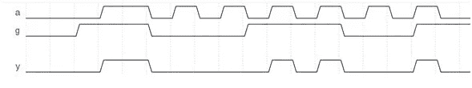

# Verilog 分配

> 原文：<https://medium.com/geekculture/verilog-assignments-edd91e5669c4?source=collection_archive---------56----------------------->

Verilog 分配的几个例子

如果你提到 v2005 LRM，有 2 个有趣的定义，摘录如下-

# 6.1 连续任务

将矢量和标量值驱动到网络上；每当右侧的值发生变化时，就会发生这种分配。下面是一个例子:

**赋值 a = b；**

# 9.2 程序分配

用于更新 reg、integer、time、real、realtime 和 memory 数据类型。程序赋值在围绕它们的程序流结构的控制下更新变量的值。下面是一个例子:

**总是@(b)a = b；**

从功能上讲，以上两个例子对相同的刺激产生了相似的输出。其中一个会持续评估 RHS，并将任何更新应用到 LHS。另一个在灵敏度列表上寻找事件，并立即执行从 RHS 到 LHS 的分配。也就是说，我们不要在这些上花太多时间。然而，我给你看的是来自同一个 LRM 的另一个有趣的定义——粘贴在下面:

# 9.3.1 分配和取消分配程序语句

赋值程序连续赋值语句应覆盖变量的所有程序赋值。去设计程序语句应该结束一个变量的连续程序赋值。

这意味着什么？它是如何建模的？请参见下面的示例，其中 d 是 reg 数据类型:

> **1。总是@(g)开始**
> 
> **2。if (g == 1'b1)赋值 d = a；**
> 
> **3。否则取消设计 d；**
> 
> **4。结束**

这段代码的解释非常简单！

第(1)行说——每当‘g’改变时就开始评估代码块

第(2)行说—如果(g)为真(当第-1 行检测到变化时)，像连续赋值一样将‘a’赋值给‘d’。也就是说，只要‘g’为真，就不断对‘d’求值，不断更新‘a’。

第(3)行说——如果(g)不为真，则取消‘d’的设计。也就是说，因为' d '是' a' reg 数据类型，所以只要 g 为假，它就只保留它被驱动的最后一个值

嗯，真特别！“d”在第(2)行中表现得像一个连续赋值的网络，但在第(3)行中表现得像一个 reg。具体来说，在这个例子中，如果‘g’为真，则‘a’被连续求值并被赋值给‘d’。即使“a”不在 always 块的灵敏度列表中，也会发生这种情况！如果‘g’为假，那么‘a’上的任何新变化都不会影响‘d’的值。

想证实一下我说的话吗？这是一个很好的实践，我强烈鼓励你这样做。请用下面给出的测试刺激自己检查一下。十有八九，你会看到一个类似于我在这篇文章末尾提供的波形。

初始开始 **//控制 a 的值**

> **a = 0；**
> 
> **# 15a = 1；**
> 
> **# 10a = 0；**
> 
> **# 5a = 1；# 5a = 0；**
> 
> **# 5a = 1；# 5a = 0；**
> 
> **# 5a = 1；# 5a = 0；**
> 
> **# 5a = 1；# 5a = 0；**
> 
> **# 5a = 1；# 5a = 0；**
> 
> **# 5a = 1；# 5a = 0；**
> 
> **# 15 $完成；**
> 
> **结束**

初始开始 **//控制 g 的值**

> **g = 0；# 10g = 1；**
> 
> **# 15g = 0；**
> 
> **# 20g = 1；**
> 
> **# 20g = 0；**
> 
> **# 15g = 1；**
> 
> **结束**

注意，如果我们称“g”为门，“a”为输入，“d”为输出，这段代码只是模拟一个高电平有效锁存器。

