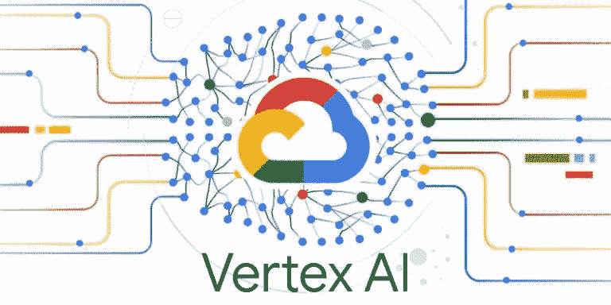
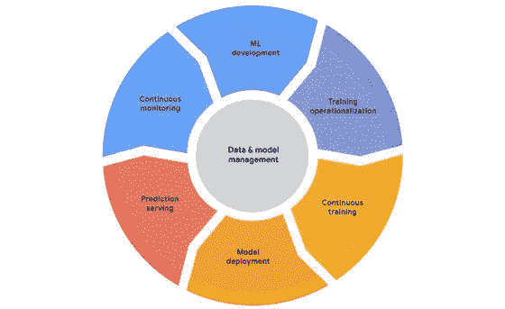
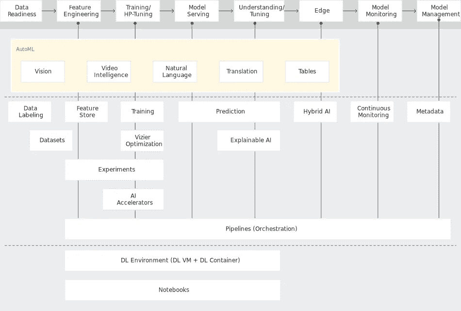

# 顶点人工智能

> 原文：<https://medium.com/geekculture/vertex-ai-ac63e8bbac65?source=collection_archive---------40----------------------->

actuia.com

> 预测 2020 年至 2027 年的人工智能年增长率为 33.2%。

G oogle Cloud 今天在 Google I/O 上公布了 Vertex AI 的全球发布，这是一个受监管的机器学习(ML)平台，可帮助企业加快人工智能(AI)模型的部署和管理。与竞争平台相比，Vertex AI 训练模型所需的代码行数减少了约 80%，允许所有经验水平的数据科学家和 ML 工程师在整个软件生命周期内应用机器学习操作(MLOps)来有效地设计和操作 ML 项目。

Vertex AI 的目的是提供一个环境友好的环境，公司可以在其中看到从研究到开发的框架。

## 顶点 AI 的规格:

Source : Gigazine

使用谷歌云，“你去 AutoML Perception 建立一个模型，但你不能将相同的收集数据用于船上的其他任何东西。

Vertex AI 旨在通过允许高度灵活的接口和提供对开发中模型维护和管理的 MLOps 资源的访问来解决这些问题。它还声称缩短了建立和训练模型所需的时间。该接口将用于开发 ML 的 Google 云服务结合到一个单一的内聚 UI 和 API 中。在统一的环境中工作可以使模型从研究过渡到发现模式和预测变得更加容易。

1.  所有 ML 工作流的通用用户界面
2.  针对计算机视觉、自然语言处理、视频等的预训练 API 可用性。
3.  与数据的端到端集成
4.  支持所有开源框架

## 利用 Vertex AI 的常见方法:

Source: Google AI

## 特征工程:

顶点特征库，一个完全维护的丰富的特征注册表，可用于服务、交换和复制 ML 特征；顶点实验可用于监控、评估和探索 ML 研究，以便更快地选择模型；顶点张量板可用于模拟 ML 假设，顶点流水线可用于通过标准化 ML 流水线的开发和执行来简化 MLOps 过程。

## 超参数的训练和调整:

通过利用 AutoML 为您的图像、表格、文本或视频预测任务确定最佳模型配置，或者通过使用存储库来创建不同的模型，无需编写代码即可创建先进的 ML 模型。顶点训练提供了完全受控的训练工具，而顶点维兹尔有助于超参数优化，以获得最佳预测性能。

## 模型管理和监控:

持续监视会持续观察模型预测输出的迹象，并在出现偏差时向您发出警告，诊断偏差的来源，并触发模型再训练路径或收集适当的训练数据。

Vertex ML 元数据通过自动监控顶点管道中所有模块的输入和输出，便于检查和管理 ML 工作流，以跟踪工件、背景和操作。

## 边缘:

Vertex ML Edge Manager(测试版)旨在跨模块化 API 实现边缘假设和自动化系统的平稳部署和管理，允许您通过私有和公共云网络、内部数据中心和边缘应用传播 AI。

## 模型服务、调整和理解:

顶点预测简化了模型在开发中的部署，无论是通过 HTTP 的数字服务还是批量评分的批量投影。基于任何系统(如 TensorFlow、PyTorch、scikit 或 XGB)的定制模型都可以部署到顶点预测，内置工具可以监控模型输出。

可解释的人工智能提供了全面的模型评估测量和属性假设。可解释的人工智能表明每个输入属性对预测的重要性。AutoML 表、顶点预测和笔记本都有这个现成的特性。

> “机器学习将使大多数人认为只能由人完成的工作自动化。”戴夫·沃特斯