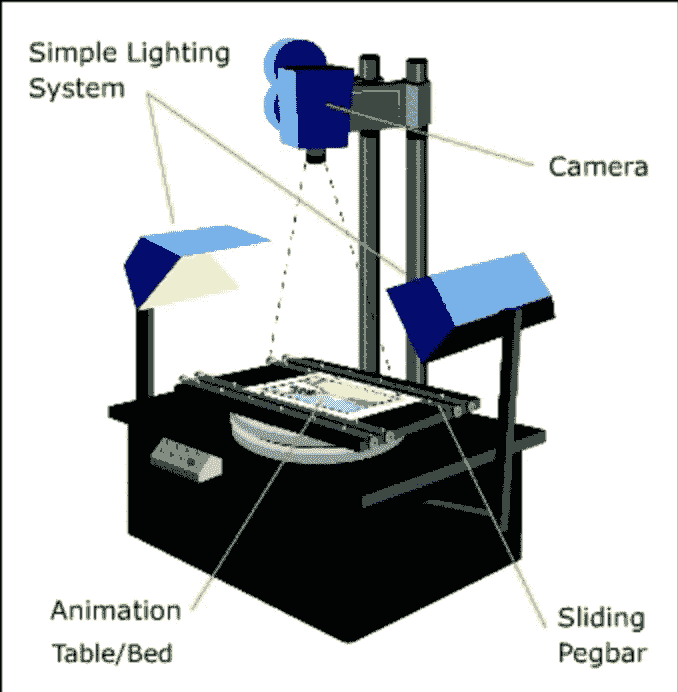

# 使用 p5.js WEBGL 控件的垂直滚动背景和 3D 对象。

> 原文：<https://medium.com/geekculture/vertical-scrolling-background-and-3d-objects-with-controls-using-p5-js-webgl-93ddd1c679c5?source=collection_archive---------15----------------------->

滚动基本上是我们大脑的感知，这使我们认为物体在无限的世界中垂直或水平移动，就像这个 2D 赛车游戏一样。

但实际上，它是背景和物体在相反方向上的运动，产生了视差效果。当物体静止时，这种效果最为明显，背景的反向运动产生了物体运动的错觉。

这个概念被用于计算机图形，电视制作和电影制作。

R 这款相机可以放大、缩小和平移，给人一种静止物体四处移动的错觉。

在这个项目中，我们将使用 P5 制作带有按键控制和垂直滚动背景的 3D 宇宙飞船。JS WEBGL 库。z 轴控件将产生放大和缩小的效果，就像在主席台摄像机中一样。

**制作背景元素:**

首先从创建背景开始，为此我们需要在设置函数中创建一个名为星星的对象数组，并给出 x 轴、y 轴和大小的参数。在 draw 函数中，stars 数组被迭代，星星开始出现在背景中。在这一点上，并非所有的星星都是可见的。

**设计你的飞船:**

接下来，让我们设计我们的宇宙飞船。首先创建 x，y，z 轴和角度全局变量。将角度初始化为 0。在 setup()中，初始化 x、y 和 z 变量。现在在绘图中，使用 translate 函数中的 x、y 和 z 变量来设置飞船的位置。现在按照你喜欢的方式设计飞船。

**制作控件:**

现在制作宇宙飞船的控制器。创建一个新函数“controls()”。在 controls()中，对不同的键码使用条件语句，并在其中递增或递减 x、y 和 z 变量的值。x 值在画布的右侧递减，在画布的左侧递增。而 y 值随着向下移动而增加，随着向上移动而减少。z 值随着进一步向画布内移动而递减，随着向外移动而递增。

**设置边界:**

将飞船限制在画布的边界内。用条件句来设定界限。

**制作滚动背景:**

最后，使'滚动'的全局变量。在设置()中将变量滚动到“0”。现在在 draw()中，将 scrolling 变量添加到 translate 的 y 轴上，使背景垂直滚动。将 translate with scrolling 变量和用于 stars 数组迭代的 for 循环放入 push()和 pop()中。(*不要把飞船物体放在这个 push()和 pop()里面，因为它需要彼此反向移动)。*最后，在 controls()条件语句中添加滚动变量。与飞船运动方向相反的递增和递减(*如果 y+=1，那么后台滚动将是 scrolling -=1* )。

最终代码如下。

编码快乐！！！。

**资源:**

[1-p5.js 入门](https://www.amazon.com/Getting-Started-p5-js-Interactive-JavaScript-ebook/dp/B016VF1G3W?source=post_page---------------------------) -一本关于在 P5 . js 中编程的书。

2- [p5.js 引用](https://p5js.org/reference/?source=post_page---------------------------):所有 p5.js 函数的引用。

3- [主席台摄像头](https://en.wikipedia.org/wiki/Rostrum_camera):引用自维基百科。

4- [本·伯恩斯效应](https://en.wikipedia.org/wiki/Rostrum_camera):参考自维基百科。

5- [滚动效果](https://en.wikipedia.org/wiki/Scrolling)——引用自维基百科。

6- [立体视觉](https://www.vision3d.com/stereo.html):来自视光师网关于人脑如何感知 3D 图像的参考。

7-主席台摄像机图像参考自[https://sielearning.tafensw.edu.au/](https://sielearning.tafensw.edu.au/)

8- [字节大小编码](https://bytesizecoding.com/?source=post_page---------------------------):为孩子和初学者提供免费资源教程的网站。

9- [字节大小编码 YouTube 频道](https://www.youtube.com/channel/UCTWCJh3YwDTQ8hM_4MJ2YJA?view_as=subscriber&source=post_page---------------------------):有很多有趣想法的 YouTube 频道。