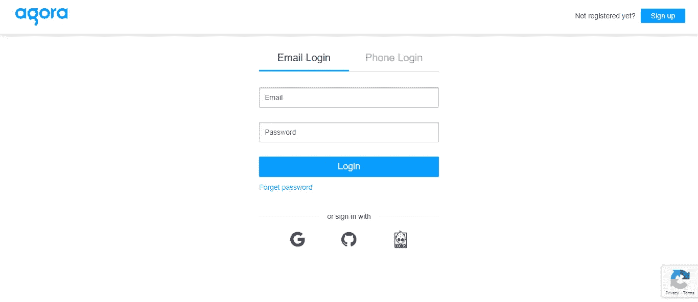
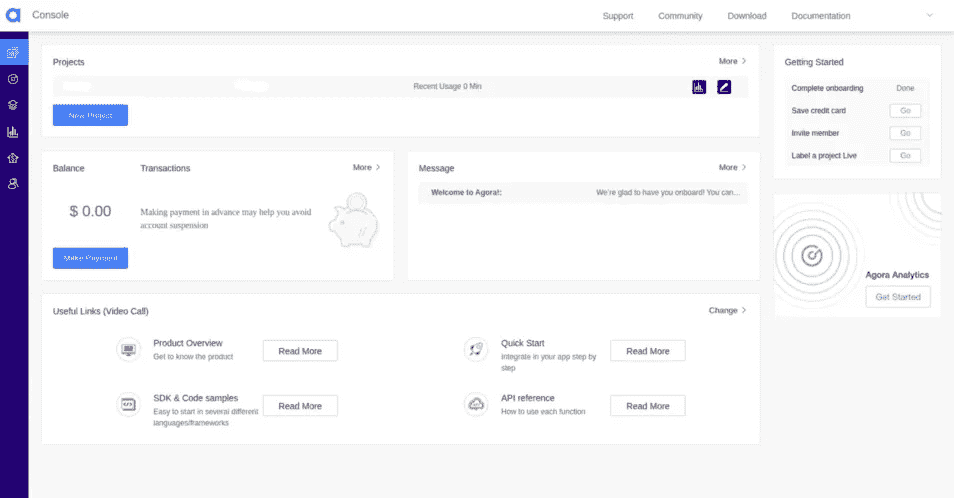
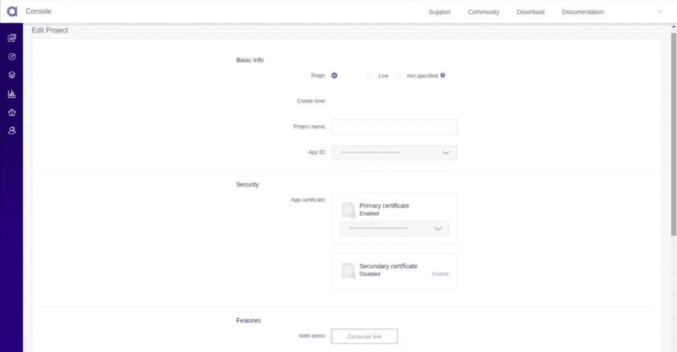
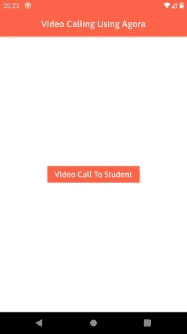
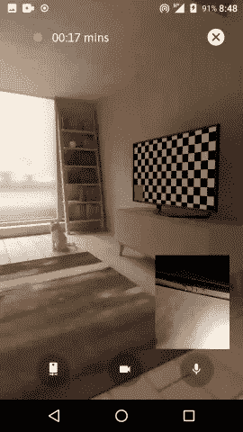
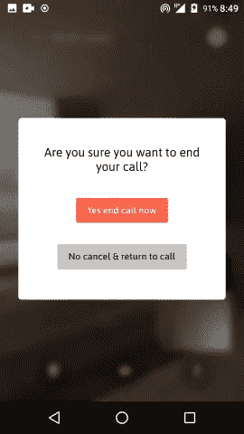
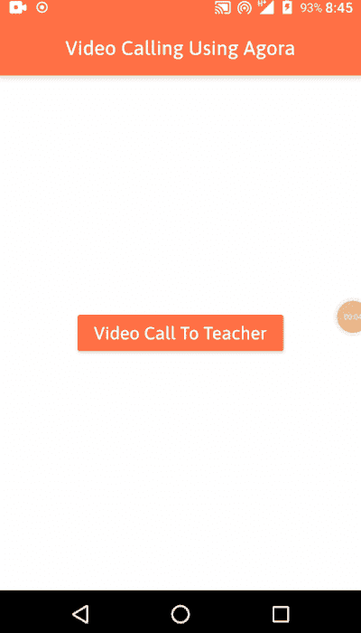
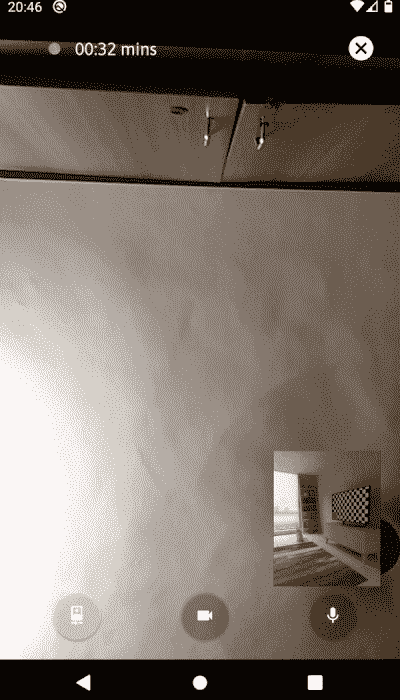

# Flutter 中使用 Agora IO 和 Socket IO 的视频通话集成。

> 原文：<https://medium.com/geekculture/video-calling-integration-using-agora-io-and-socket-io-in-flutter-66b5731c07e?source=collection_archive---------3----------------------->

## 随时随地享受高清视频通信

[Source](https://www.agora.io/en)

Flutter 发展很快，Flutter 应用程序开发也是如此。当谈到在定制应用程序中集成新特性和功能时，Flutter 仍然是世界各地应用程序开发人员的首选。

最近，当我投入到我的一个代表 Flutter 应用程序中视频通话集成的项目任务中时，我浏览了一下 [Agora io](https://www.agora.io/en/) 仪表盘。在做了一些研究之后，我下定决心要发表一篇关于如何用 socket io 在 Flutter 中实现视频通话的文章。

> **Agora.io** 是一个实时互动平台，用于*有意义的人际联系，以便随时随地进行高清视频通信*。

让我们首先记下这些任务:

1.  使用 android studio 或 visual studio 代码作为编辑器进行开发。
2.  在 [Agora.io](https://www.agora.io/en/) 仪表盘上创建一个账户。
3.  [安卓](https://developer.android.com/)原生配置。
4.  [iOS](https://developer.apple.com/) 原生配置。
5.  将 Agora SDK 集成到你的 flutter 代码中，并加入其他与视频通话相关的内容。
6.  从服务器端和其他套接字相关的后端生成 Agora 令牌。

Photo by [Serghei Trofimov](https://unsplash.com/@sergeytrofimov?utm_source=medium&utm_medium=referral) on [Unsplash](https://unsplash.com?utm_source=medium&utm_medium=referral)

让我们开始整合，实现您的里程碑……

# 在 Agora Io 上创建帐户

转到 [Agora IO](https://www.agora.io/en/) 网站，然后注册并登录。

创建 Agora IO 帐户后，转到[仪表板](https://console.agora.io/)。

[Source](https://sso.agora.io/en/login)

请完成在 agora.io 上注册的所有步骤。之后，请导航至仪表板。

[Source](https://console.agora.io/)

从 Agora Dashboard 获取您的**应用 ID** ，该 ID 将用于集成。

[Source](https://console.agora.io/)

Agora 仪表板中 Agora IO 的所有设置和配置都已完成。

Photo by [Jackson Simmer](https://unsplash.com/@simmerdownjpg?utm_source=medium&utm_medium=referral) on [Unsplash](https://unsplash.com?utm_source=medium&utm_medium=referral)

## 为原生 Android 集成 Agora IO 相关配置:

请在`AndroidManifest.xml`中添加以下权限，因为 Agora Video SDK 需要`camera`和`microphone`的权限才能开始视频通话。

## 为原生 iOS 集成 Agora IO 相关配置:

请在 iOS 文件夹的`info.plist`文件中添加以下键和值。

*   `Privacy - Microphone Usage Description`
*   `Privacy - Camera Usage Description`

> 注意:由于 Agora io SDK 使用`PlatformView`，你应该在你的`*info.plist*`中设置`io.flutter.embedded_views_preview`为`YES`

## 将 Agora SDK 集成到您的 dart 代码中:

请将以下插件添加到`pubspec.yaml`文件中。

你可以在这里找到 Agora SDK 相关插件`[agora_rtc_engine](https://pub.dev/packages/agora_rtc_engine)`。

我们必须征得用户对麦克风和摄像头的许可。所以我们必须将这个插件集成到我们的项目中。

众所周知，在来电/视频通话过程中，应该会有任何声音或铃声提示我们正在通话。因此，我们必须添加另一个插件来播放基于特定平台的铃声或声音。这个功能将由`[flutter_ringtone_player](https://pub.dev/packages/flutter_ringtone_player)`插件来完成。

现在还有一个场景，视频通话的时候，整个通话过程都要开着屏幕。因此，我们必须添加另一个插件来实现这个特性，这就是`[wakelock](https://pub.dev/packages/wakelock)`插件。

最重要的插件，以一种简单的方式实现视频通话，接受和拒绝来自另一个用户的呼叫，`[socket_io_client](https://pub.dev/packages/socket_io_client)` 是帮助我们实现这一功能的插件。

首先，Agora 提供了一个启动项目来在您的项目中设置视频通话，但在我们的实际项目中，我们必须做一些启动 GitHub 项目中没有提供的其他事情。所以我认为这将有助于那些不仅仅是从用户体验角度出发的开发者。因此，让我们为视频通话的整个周期添加一些其他功能，从接听电话到视频通话。

首先，我们将实现与套接字相关的东西……

让我们在`socket_constants.dart`文件中声明一些套接字相关的常量。

> 套接字事件和视频通话事件相关的常数

> `socketUrl` : <您的套接字服务器 URL>

> 注意:这是一个示例项目，所以我们将向套接字传递静态 id，但您可以在实时项目中传递授权令牌或唯一 id。

> `agoraAppId` : <您的 Agora 应用 Id >

让我们创建一个 dart 文件来管理所有与套接字相关的事件。

你应该调用`common_screen.dart`的`initState` 方法中的`initSocketManager`方法来初始化套接字。

到目前为止，我们已经实现了基本的套接字相关的东西。现在是时候深呼吸一下，从 UI 部分开始了。

让我们用简单的 3 个步骤来完成:

1.  公共屏幕
2.  拾取屏幕
3.  视频通话屏幕
4.  拒绝呼叫对话框

## 公共屏幕:

我们需要为学生和教师实现一个共同的屏幕，因此，我们必须为相同的像下面做一些用户界面/UX。你可以从`[common_screen.dart](https://github.com/JaimilPatel/AgoraVideoCall/blob/master/lib/ui/common/common_screen.dart)`找到这个文件的代码。

Common Screen

## 拾取屏幕:

我们需要为接受/拒绝呼叫实现一个拾取屏幕。因此，我们必须做一些用户界面/UX，如下图所示。你可以从`[pickup_screen.dart](https://github.com/JaimilPatel/AgoraVideoCall/blob/master/lib/ui/pickup/pickup_screen.dart)`找到这个文件的代码。

Incoming Call To Teacher

## 视频通话屏幕:

现在让我们来表演你们都在等着表演的主要魔术…..

对于这个屏幕，我们需要注意一些重要的事情。

1.  应用程序 ID(来自仪表板)
2.  生成的令牌(后端服务器)
3.  频道名称(后端服务器)

我们需要为视频通话屏幕下面同样的一些用户界面/UX。你可以从`[video_calling_screen.dart](https://github.com/JaimilPatel/AgoraVideoCall/blob/master/lib/ui/call/video_call_screen.dart)`中找到这个文件的代码。

Video Call Screen

让我们在一片混乱中为广场相关的配置做好准备。你应该在颤振生命周期的`initState`方法中调用`initalizeCalling`。

> `agoraAppId` : <您的 Agora 应用 Id >
> 
> `widget.token`:通过后端
> 
> `widget.channelName`:通过后端
> 
> `VideoOutputOrientationMode.Adaptative`:横向&纵向支持。

只是不要忘记在处置时调用`leaveChannel()`和`destroy()`方法。

视频通话屏幕的 Ui/Ux:

> `_renderLocalPreview`:预览本地摄像机视图
> 
> `_renderRemoteVideo`:预览远程摄像机视图

> `_cancelCallView`:取消通话按钮 Ui/Ux

现在，在这两个屏幕之后，我们将创建一个拒绝通话对话框来结束通话。所以请看下面的界面，从`[leave_dialog.dart](https://github.com/JaimilPatel/AgoraVideoCall/blob/master/lib/utils/widgets/leave_dialog.dart)`中找到这个文件的代码。

## 拒绝呼叫对话框:

End Call Alert Dialog

现在所有的用户界面/UX 部分都完成了。

让我们实现 Agora 视频呼叫相关的套接字事件，并以编程方式发出它们。

从一个用户流向另一个用户的通话:

1.  老师正在点击按钮叫学生。
2.  学生收到一个来电屏幕。
3.  学生将通过接受/拒绝按钮接受/拒绝呼叫。
4.  接受后，学生或教师可以使用位于右上角的按钮切断呼叫。
5.  切断通话后，双方都被重定向到公共屏幕。

所以让我们在 dart 中实现这个流程。

将下面的代码粘贴到`common_screen.dart.`中按钮的`onPressed`方法中

> `ArgParams.connectId` : <其他用户的 Id>
> 
> `ArgParams.isForOutGoing`:真>是呼出

> 注意:这是一个示例项目，所以我们将向套接字传递静态 id，但您可以在实时项目中基于服务器响应传递唯一 id。

您必须在`connectCall`套接字事件中传递另一个用户的 id。

我制作了两个模型类，分别命名为`[ResCallAcceptModel](https://github.com/JaimilPatel/AgoraVideoCall/blob/master/lib/socket/model/res_call_accept_model.dart)`和 `[ResCallRequestModel](https://github.com/JaimilPatel/AgoraVideoCall/blob/master/lib/socket/model/res_call_request_model.dart)`，以便于组织代码。

当教师从公共屏幕呼叫学生时，学生将会听到`onCallRequest` socket 事件并导航到拾取屏幕。

> `ArgParams.isForOutGoing`:假>有来电

因此，在那个时候，学生将有两个选择来给出答案，接受和拒绝。如果学生想要拒绝来电，那么他应该按下来电屏幕的拒绝按钮。

> `Wakelock.disable()`:睡眠时间过后，屏幕将关闭。
> 
> `Wakelock.enable()`:即使过了睡眠时间，屏幕也会打开。
> 
> `FlutterRingtonePlayer.stop()`:铃声将停止播放。
> 
> `FlutterRingtonePlayer.play()`:铃声将开始播放。

因此，那时教师将监听`onRejectCall`套接字事件并导航到上一个屏幕。

如果学生想要接听电话，他应该按下来电屏幕的接受按钮，然后导航到视频通话屏幕。

因此，那时教师将监听`onAcceptCall` socket 事件并导航到视频通话屏幕。

所以现在我们已经成功实现了视频通话流程。

每当学生/教师想要取消视频通话时，他们可以通过位于视频通话屏幕右上角的按钮来取消，单击该取消按钮后，画面中将出现结束通话提醒对话框。

因此在那个时候，其他用户将监听`onRejectCall`套接字事件并导航到前一个屏幕。

让我们为 agora 和 socket 事件相关的东西实现后端部分。

## 从服务器端生成 Agora 令牌:

## 服务器端的套接字事件实现:

## 。后端的环境文件:

感谢[林卡尔·戈赫尔](https://medium.com/u/44002fa60b46?source=post_page-----66b5731c07e--------------------------------)对后端相关的支持。

你会在我的 GitHub repo 中找到其他与后端(agora-call-backed)相关的东西。所以我们现在完成了实现。你可以在这个博客的末尾找到 GitHub repo 的链接。

让我们看看下面视频中的实施总结。

Incoming Call

Outgoing Call

# 结论

我们已经用 socket 完成了 Agora 视频通话的所有实现。如果你想实现直播的目的，那么你也可以用 agora 来实现。

所以，这就是在 Flutter 中使用 Socket 和 Agora IO 的**视频通话集成。**

你可以在 Git 库上找到整个项目的 **clean architecture** :

 [## JaimilPatel/AgoraVideoCall

### 随时随地享受高清视频通信，访问…

github.com](https://github.com/JaimilPatel/AgoraVideoCall)