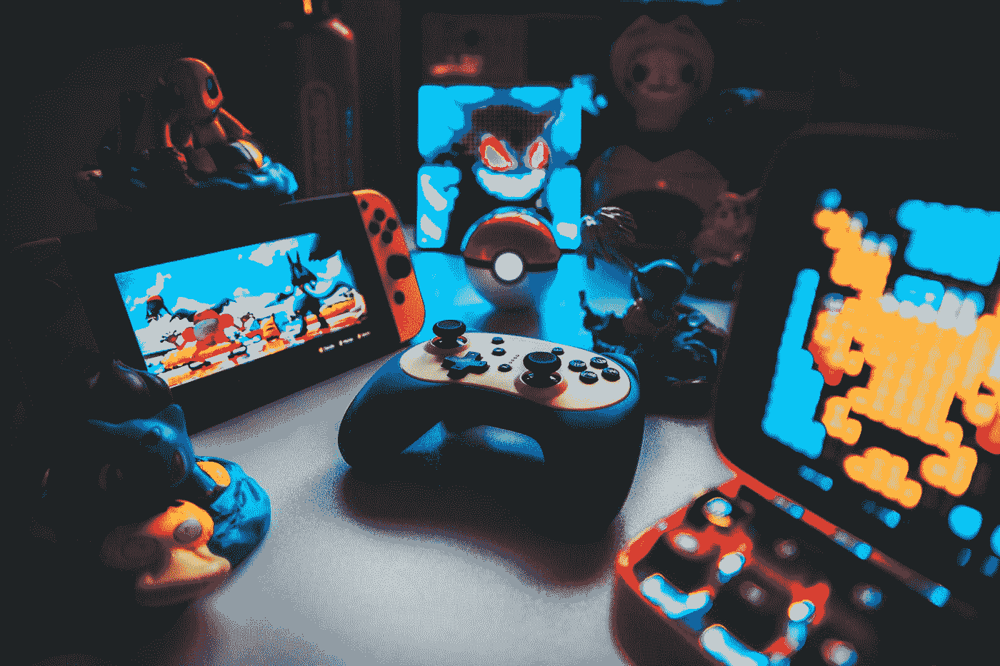

# 电子游戏教会了我如何赚钱

> 原文：<https://medium.com/geekculture/video-games-taught-me-how-to-make-money-76efcfacbe3b?source=collection_archive---------20----------------------->

## 是的——成为一个书呆子实际上是值得的。

Photo by [Branden Skeli](https://unsplash.com/@branden_skeli?utm_source=medium&utm_medium=referral) on [Unsplash](https://unsplash.com?utm_source=medium&utm_medium=referral)

从我记事起，我就一直玩电子游戏。我是在玩我表哥的 N64 长大的，直到我有了自己的 GameCube。十几岁的时候，我慢慢开始玩电脑游戏，现在我玩各种类型的游戏。从第一人称射击游戏到 MMORPGs 再到《超级粉碎兄弟》,我学到了无数可以转化为…