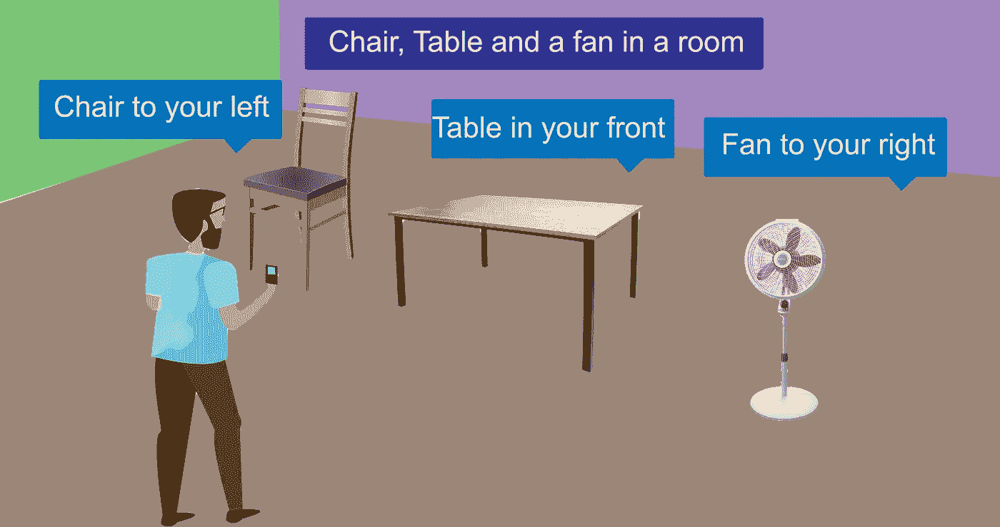
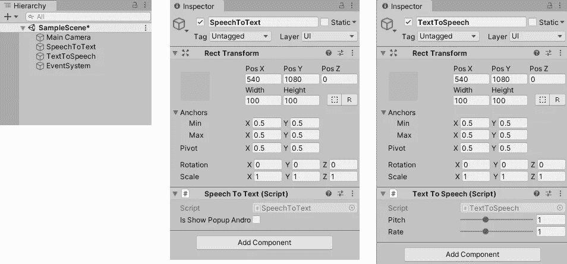
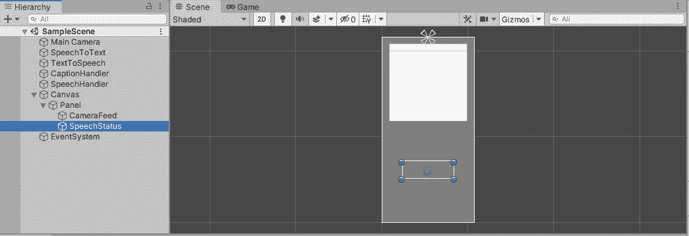
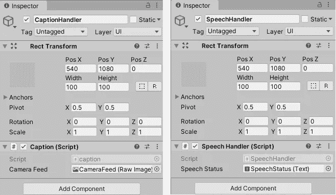

# 虚拟眼睛——为视障人士设计的简单环境描述应用程序

> 原文：<https://medium.com/geekculture/virtual-eyes-a-simple-surrounding-describing-app-for-the-visually-impaired-3ac2af7e99f0?source=collection_archive---------43----------------------->



在过去的几年里，图像字幕对机器学习领域产生了巨大的影响，新的应用每天都在出现。图像字幕是使用人工智能、计算机视觉和机器学习来生成图像描述的能力，类似于人类描述图像内容的方式。在这篇文章中，我将讨论我如何创建一个简单的应用程序，使用图像字幕向视障人士描述周围的环境。

为了提供这款应用的概述，当用户发出语音命令时，它使用手机的主摄像头来捕捉照片，并使用 Azure 计算机视觉服务，该应用生成字幕以及对象的位置数据，并以自然语言与用户交谈。

如果您渴望观看该应用程序的演示，请阅读本文末尾。

## **开发安卓应用**

为了开发这个应用程序，我使用了 Unity 和 Azure 计算机视觉服务。所以，让我们来看看是怎么做到的。

1.  创建 Azure 计算机视觉资源。

我写了一整篇关于如何创建 Azure 计算机视觉资源并在 Unity [中使用其服务的文章。你可以参考它来了解更多关于设置 Azure 的知识，因为我不会详细讨论这个。](/codex/image-captioning-in-unity-android-using-azure-computer-vision-c9424f9d1ab1)

2.创建 Unity Android 应用程序

我首先创建了一个统一 2D 项目，我必须改变一些配置，以适应这个项目，如下所示:

**1。换平台安卓**

(文件->构建设置-> Android ->切换平台)

**2。导入 Newtonsoft DLL 文件并在 Assets 中设置 csc.rsp 文件。**

**3。更改 API 兼容级别**

'编辑->项目设置->播放器->其他设置-> API 兼容级别从'。NET Standard 2.0 '到'。NET 4.x '

在我关于使用 Azure 计算机视觉的 Unity Android 中的[图像字幕的文章](/codex/image-captioning-in-unity-android-using-azure-computer-vision-c9424f9d1ab1)中，已经解释了上述所有任务(并给出了原因)。

**4。设置文本到语音和语音到文本**

为了执行这个任务，我在他的 [Github 库](https://github.com/j1mmyto9/Speech-And-Text-Unity-iOS-Android)上使用了 [j1mmyto9](https://github.com/j1mmyto9) 提供的插件。这个[教程](https://www.youtube.com/watch?v=XRXbVtr1fog)解释了如何在你的 unity 项目中使用上述插件。

我是这样做的:

1.  下载 Github 库并解压文件。
2.  打开“SpeechToText_AppleAPI/Assets/”文件夹，将“Plugins”和“SpeechAndText”文件夹复制到 Unity 项目的 Assets 文件夹中。
3.  创建两个名为“SpeechToText”和“TextToSpeech”的空游戏对象，并将名为“SpeechToText.cs”和“TextToSpeech.cs”的 C#脚本分别作为组件添加到上述游戏对象中。

***注*** *:上面提到的这些名字，要完全按照规定。*

另外，在检查器中取消选中 SpeechToText 脚本的“IsShowPopupAndroid”选项。

它看起来是这样的:



4.创建一个空的游戏对象，并将其命名为“SpeechHandler”(这个名称可以不同)。

5.创建一个名为“SpeechHandler.cs”的 C#脚本，并将其作为组件添加到上面创建的“SpeechHandler”游戏对象中。这个脚本将包含处理语音相关功能的代码。

5.创建一个 C#脚本来管理函数

创建一个名为“caption.cs”的 C#脚本来管理所有其他函数，包括 API 调用。接下来，创建一个名为“captionHandler”的空游戏对象，并将“caption.cs”脚本添加到上面的游戏对象中。

**5。在 Unity 中创建 UI 组件**

创建一个面板，在面板下创建一个 RawImage(设置 z 旋转为-90)和一个 Text gameobject 作为面板的子面板，分别命名为“CameraFeed”和“SpeechStatus”。对了，我从游戏窗口把长宽比改成了 2160x1080 人像。您可能还想调整 UI 元素的大小。

以下是我的设置:



现在，设置过程已经完成。接下来是编码任务。

首先，我将讨论“caption.cs”脚本。

**caption.cs**

该脚本包含以下成员变量:

```
// Add your Computer Vision subscription key and endpoint
static string subscriptionKey = "PASTE_YOUR_COMPUTER_VISION_SUBSCRIPTION_KEY_HERE";//azure endpoint
static string endpoint = "PASTE_YOUR_COMPUTER_VISION_ENDPOINT_HERE";//azure endpoint service accessed
static string captionBase = "vision/v3.2/describe?"; //endpoint to generate image captionsstatic string objectBase = "vision/v3.2/analyze?"; //endpoint to get object locations//UI Components
[SerializeField] private RawImage cameraFeed;//webcamtexture
private WebCamTexture webcamTexture;
```

上述变量用于 Azure 订阅密钥、Azure API 端点、将附加到端点的 captionBase 和 objectBase、RawImage UI 组件和 webcamtexture。

标题库和对象库是我向 azure 请求的功能。“描述”特征包括图像标题，而“分析”特征包括检测到的物体相对于图像的位置。

在这个项目中，我选择了单一设计模式，因此我创建了一个类本身的实例，如下所示。

```
//instance of caption class
private static caption instance;public static caption Instance
{
 get
 {
  if (instance == null)
   {
    instance = FindObjectOfType<caption>();
   }
  return instance;
 }
}
```

接下来，需要在应用程序启动时检查用户权限。这可以通过下面的方法来完成。

```
void CheckPermissin()
{
 if (!Permission.HasUserAuthorizedPermission(Permission.Camera))
 {
  Permission.RequestUserPermission(Permission.Camera);
 }
 if (!Permission.HasUserAuthorizedPermission(Permission.Microphone))
 {
  Permission.RequestUserPermission(Permission.Microphone);
 }
 if(Permission.HasUserAuthorizedPermission(Permission.Camera) && Permission.HasUserAuthorizedPermission(Permission.Microphone))
 {
  //start camera feed if both permissions granted
  startCamera();
  }
}
```

此方法检查用户是否授予了麦克风和摄像机权限，如果没有，则要求用户授予权限。如果两种权限都被授予，该方法将调用“startCamera”方法，该方法启动摄像机并将摄像机源分配给“camera feed”raw image。显然，这对视力受损的人来说没有用，但是为了我们的方便，我已经实现了这一点。

```
void startCamera()
{
 //get all camera devices 
 WebCamDevice[] cam_devices = WebCamTexture.devices; //Set a camera to the webcamTexture
 webcamTexture = new WebCamTexture(cam_devices[0].name, 480, 640, 30); //Set the webcamTexture to the texture of the rawimage
 cameraFeed.texture = webcamTexture;
 cameraFeed.material.mainTexture = webcamTexture; //Start the camera
 webcamTexture.Play();
}
```

接下来出现的问题是我应该在哪里调用“CheckPermission”方法。由于权限检查是异步完成的，应用程序无需等待用户权限就开始运行，从而导致“相机馈送”原始图像上出现白屏，而不是渲染相机馈送。因此，在“start”方法中调用此方法会导致此类错误。因此，我在“OnApplicationFocus”回调中输入了对“CheckPermission”方法的调用，该回调在应用程序每次返回焦点时运行，因此它将重复检查所有权限，直到所有权限都被授予。下面给出了实现这一点的代码。

```
private void OnApplicationFocus(bool focus)
{
 //check for permission
 CheckPermissin();
}
```

接下来，我创建了一个名为‘save image’的 IEnumerator 方法，从摄像机输入中捕获图像，并将图像字节数据传递给另一个处理 API 调用的方法。此方法是 IEnumerator，因为它使用“yield return”来等待当前帧的结束。此外，您会注意到对“RotateTexture”方法的调用，该方法用于将 Texture2D 旋转给定的角度。这个方法可以从[这里](https://www.programmersought.com/article/69288818191/)得到。

SaveImage()方法还接受一个布尔参数“isDescribe ”,如果用户需要图像标题，该参数为 true 如果用户需要位置数据，该参数为 false。

下面给出的是这种方法:

```
public IEnumerator SaveImage(bool isDescribe)
{
 //Create a Texture2D with the size of the rendered image on the screen.
 Texture2D texture = new Texture2D(webcamTexture.width, webcamTexture.height, TextureFormat.ARGB32, false); //wait till end of frame
 yield return new WaitForEndOfFrame(); //save webcam frame to texture
 texture.SetPixels(webcamTexture.GetPixels()); //rotate texture
 texture = RotateTexture(texture, -90);
 texture.Apply(); //check user requirement whether caption or object position 
 if (isDescribe)
 {
  getCaption(texture.EncodeToPNG());
 }
 else
 {
  getObjects(texture.EncodeToPNG());
 }
}
```

接下来，我将讨论从“SaveImage”方法调用的“getCaption”和“getObjects”方法。

“getCaption”方法包含创建最终 uriBase 的代码以及必要的请求参数。然后，该方法将这些数据与图像字节数组一起传递给“MakeRequest”方法，该方法调用 API 并返回数据。接下来，需要处理返回的数据以提取标题，这是通过调用“convertCaption”方法完成的，然后传递给 SpeechHandler(很快就会实现)以朗读标题。

```
public async void getCaption(byte[] imageBytes)
{
 //uri
 string uriBase = endpoint + captionBase; // Request parameters
 var requestParameters = HttpUtility.ParseQueryString(string.Empty);
 requestParameters["maxCandidates"] = "1";
 requestParameters["language"] = "en";
 requestParameters["model-version"] = "latest"; // call makeRequest method to make API call
 String result = await MakeRequest(uriBase, requestParameters, imageBytes); //extract caption
 string convResult = convertCaption(result); //speak caption
 SpeechHandler.Instance.StartSpeaking(convResult);
}
```

与上面的“getCaptions”方法类似的是“getObjects”方法，它有自己的 uriBase 和 request 参数，以及对“MakeRequest”方法和“convertObjects”方法的调用，后者提取位置数据并创建一个句子并将其返回，最后调用 SpeechHandler 说出带有位置数据的句子。

```
public async void getObjects(byte[] imageBytes)
{
 // uri
 string uriBase = endpoint + objectBase; // Request parameters
 var requestParameters = HttpUtility.ParseQueryString(string.Empty);
 requestParameters["visualFeatures"] = "Objects";
 requestParameters["language"] = "en";
 requestParameters["model-version"] = "latest"; // call makeRequest method to make API call
 String result = await MakeRequest(uriBase, requestParameters, imageBytes); //extract position sentence
 string convResult = convertObjects(result); //speak
 SpeechHandler.Instance.StartSpeaking(convResult);
}
```

接下来是“MakeRequest”方法，它包括对 Azure API 的调用，并返回生成的响应。要了解更多关于这种方法的信息，请访问[这里](/codex/image-captioning-in-unity-android-using-azure-computer-vision-c9424f9d1ab1)。下面是“MakeRequest”方法:

```
async Task<String> MakeRequest(string uriBase, NameValueCollection requestParameters, byte[] byteData)
{
 //initialize variable for result
 String responseText = "";
 try
 {
  HttpClient client = new HttpClient(); // Request headers
  client.DefaultRequestHeaders.Add("Ocp-Apim-Subscription-Key", subscriptionKey); // Assemble the URI for the REST API method.
  string uri = uriBase + requestParameters; HttpResponseMessage response; // Request body
  using (var content = new ByteArrayContent(byteData))
  {
   content.Headers.ContentType = new MediaTypeHeaderValue("application/octet-stream"); // Asynchronously call the REST API method.
   response = await client.PostAsync(uri, content); // Asynchronously get the JSON response.
   responseText = await response.Content.ReadAsStringAsync();
  }
 }
 catch
 {
  responseText = "";
 }
 return responseText;
}
```

现在，让我们讨论一下我们之前调用的“convertCaption”和“convertObjects”方法。

“convertCaption”方法基本上从 API 接收响应字符串，将其转换为 JSON 对象，并提取其中包含标题的另一个 JSON 对象。这个标题对象包含一个标题数组，因此首先需要将它解析成一个 JArray，然后提取第一个标题。这是如何做到的:

```
public string convertCaption(string responseText)
{
 //initialize variable for caption
 string textCaption = "";

 try
 {
  //convert result to a dictionary
  var jsonResult = JsonConvert.DeserializeObject<Dictionary<string, dynamic>>(responseText); //obtain captions object from jsonResult
  var captionsObj = jsonResult["description"]["captions"]; //convert captionsObj to JArray
  JArray captionArray = JArray.Parse(captionsObj.ToString()); //get caption string from array
  textCaption = captionArray[0]["text"].ToString();
 }
 catch
 {
  textCaption = "Couldn't get description, Please try again !";
 }
 return textCaption;
}
```

“convertObjects”方法还从 API 获取响应字符串，通过反序列化将其转换为对象，并提取其中的“objects”JSON 对象。然后将该对象转换为 JArray，以访问图像中每个检测到的对象的位置和大小。该方法还包括对“位置”方法的调用，该方法计算对象是在图像的左边、右边还是中间部分。使用此信息，创建了名为左、右和前的 3 个列表，并将相关对象附加到列表中。

最后，为应用程序创建一个句子，说出对象的位置。

这是如何做到的:

```
public string convertObjects(string responseText)
{
 //initialize string to store final sentence
 string objectsText = ""; try
 {
  //convert result to dictionary
  var jsonResult = JsonConvert.DeserializeObject<Dictionary<string, dynamic>>(responseText); //obtain objects
  var objects = jsonResult["objects"]; //obtain width of image
  var width = jsonResult["metadata"]["width"]; //convert width to double
  double imageWidth = double.Parse(width.ToString()); //convert objects to JArray
  JArray objsArray = JArray.Parse(objects.ToString()); //initialize 3 lists to store objects in left, front, right
  List<string> left = new List<string>();
  List<string> front = new List<string>();
  List<string> right = new List<string>(); //for each object in array
  foreach (var item in objsArray)
  {
   //get x value
   double x = double.Parse(item["rectangle"]["x"].ToString()); //get width of object detected
   double w = double.Parse(item["rectangle"]["w"].ToString()); //check where the object is located
   if (position(imageWidth, x, w) == "left")
   {
    left.Add(item["object"].ToString());
   }
   if (position(imageWidth, x, w) == "front")
   {
    front.Add(item["object"].ToString());
   }
   if (position(imageWidth, x, w) == "right")
   {
    right.Add(item["object"].ToString());
   }
  }
  //if lists are not empty, create sentence
  if (!(left.Count == 0))
  {
   objectsText = string.Join(",", left) + " to your left, ";
  }
  if (!(front.Count == 0))
  {
   objectsText = objectsText + string.Join(",", front) + " in your front,  ";
  }
  if (!(right.Count == 0))
  {
   objectsText = objectsText + "and " + string.Join(",", right) + " to your right";
  }
 }
 catch
 {
  objectsText = "Couldn't get position data, Please try again !";
 }
 return objectsText;
}
```

接下来，我们有“位置”方法。如前所述，该方法用于计算特定对象相对于图像位于哪个部分。该方法接受三个参数，即整个图像的宽度、对象的 x 轴起始位置和对象的宽度。

图像分为左、前、右三个部分。将对象的宽度除以一半，并与 x 值相加，以获得对象中点的 x 值。使用该中点，可以确定对象位于图像的哪个部分。这是使用下面的代码完成的:

```
public string position(double width, double x, double w)
{
 //divide image to 3 sections vertically and obtain length of one section
 double oneSection = width / 3;//left section will end from oneSection length
 double left = oneSection;//front section end from 2 * oneSection length
 double front = oneSection * 2;//check if object's middle (x+w/2) is in which section
 if ((x + w / 2.0) < left)
 {
  return "left";
 }
 else if ((x + w / 2.0) <= front)
 {
  return "front";
 }
 else
 {
  return "right";
 }
}
```

**SpeechHandler.cs**

接下来，我将讨论处理文本到语音和语音到文本功能的 SpeechHandler.cs 脚本。

此类包含用于 UI 文本组件、语言代码和布尔变量“isListening”的变量。UI 文本组件用于显示应用程序是否在听语音。这只是为了我们的方便，因为它对视力有障碍的人没有用。“isListening”变量用于跟踪应用程序何时没有监听语音，如果没有，update 方法将检查这一点并启动监听过程。以下是上述变量:

```
//UI text
[SerializeField] private Text speechStatus;//language code constant
const string LANG_CODE = "en-US";//variable to know if app is listening to voice
bool isListening = true;
```

如前所述，该项目遵循单例设计模式，因此，我创建了该类的一个实例，如下所示:

```
private static SpeechHandler instance;public static SpeechHandler Instance
{
 get
 {
  if (instance == null)
  {
   instance = FindObjectOfType<SpeechHandler>();
  }
  return instance;
 }
}
```

配置 TextToSpeech 和 SpeechToText 设置的“Setup”方法设置扬声器和接收器的语言、音调和速率。

```
void Setup(string code)
{
 TextToSpeech.instance.Setting(code, 1, 0.8f);
 SpeechToText.instance.Setting(code);
}
```

接下来，定义一个名为“StartSpeaking”的方法来启动应用程序朗读消息。

```
public void StartSpeaking(string message)
{
 TextToSpeech.instance.StartSpeak(message);
}
```

接下来，定义一个回调函数来处理讲话停止时的操作。这里，我将“isListening”设置为 false，这样 update 方法将从下一帧调用“StartListening”。

```
public void OnSpeakStop()
{
 //set isListening to False
 isListening = false;
}
```

下面给出的是“开始监听”功能。这里，UI 文本组件也被更新。

```
public void StartListening()
{
 SpeechToText.instance.StartRecording();
 speechStatus.text = "Listening...";
}
```

类似地，StopListening 方法停止监听语音并更新 UI 文本组件。

```
public void StopListening()
{
 SpeechToText.instance.StopRecording();
 speechStatus.text = "Stopped Listening";
}
```

接下来是“OnFinalSpeechResult”方法，它根据识别的关键字处理对标题类实例的调用。如果在用户语音输入中识别出“位置”,则调用参数设置为 false 的“保存图像”协程(意味着用户不需要描述，但需要位置数据)。如果在用户输入中检测到“标题”关键字，则会发生相反的情况。如果没有检测到，则将“isListening”变量设置为 false。下面给出的是“OnFinalSpeechResult”方法。

```
void OnFinalSpeechResult(string result)
{
 speechStatus.text = result;try
 {
  //check if 'position' or 'desribe' words in spoken sentence by user
  if (result.ToLower().Contains("placement"))
  {
   //set is Listening to true because otherwise, app will listen to caption spoken by itself from update method
   isListening = true; //stoplistening
   StopListening();//call SaveImage
   StartCoroutine(caption.Instance.SaveImage(false));
  }
  else if (result.ToLower().Contains("caption"))
  {
   //set is Listening to true because otherwise, app will listen to position sentence spoken by itself from update method
   isListening = true; //stoplistening
   StopListening(); //call SaveImage
   StartCoroutine(caption.Instance.SaveImage(true));
  }
  else
  {
   //set isListening to false
   isListening = false;
  }
 }
 catch
 {
 }
}
```

接下来，“OnFinalSpeechResult”和“OnSpeakStop”回调都应该注册到各自的类中。这是在 start 方法中完成的，该方法还调用“Setup”方法和“StartListening”方法。

```
void Start()
{
 //call setup method
 Setup(LANG_CODE); //register onResultCallback
 SpeechToText.instance.onResultCallback = OnFinalSpeechResult; //register onDoneCallback
 TextToSpeech.instance.onDoneCallback = OnSpeakStop; //start listening to voice
 StartListening();
}
```

最后，“更新”方法检查变量“isListening”是否为假，如果是，则调用“StartListening”方法。

```
void Update()
{
 //if not listening, start listening
 if (!isListening)
 {
  StartListening();
 }
}
```

这就完成了这个项目的编码任务。

接下来，在构建应用程序之前，需要将“camera feed”raw image 和“SpeechStatus”文本 UI 组件分别分配给 captionHandler 游戏对象的标题脚本组件和 SpeechHandler 游戏对象的 SpeechHandler 脚本。



这就完成了这个项目的开发。

这是应用程序的演示。

这个项目到此为止。请让我知道你的反馈和建议。谢谢大家！干杯！😀