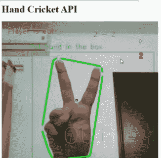
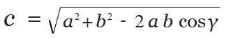
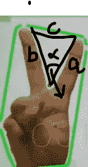
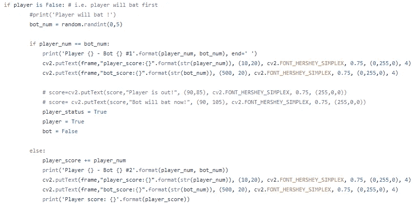
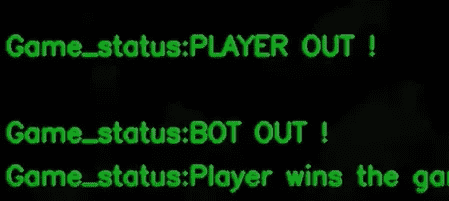
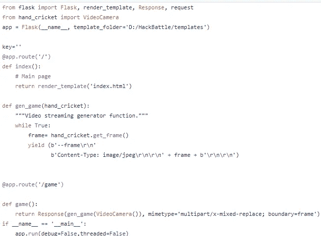
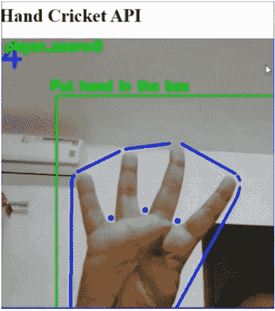

# 使用 OpenCV 的虚拟手板球游戏

> 原文：<https://medium.com/geekculture/virtual-hand-cricket-game-using-opencv-442f71c6961?source=collection_archive---------6----------------------->



Screenshot from the game

使用 OpenCV 和机器学习技术实现的虚拟手板球游戏，使玩家能够通过机器人虚拟地重新体验游戏。

# 目标:

小时候，我们很多人都是和朋友一起玩板球长大的，玩得很开心！在社交距离的时候，我觉得虚拟地玩游戏会很有趣。因此我选择 OpenCV 来实现这个游戏。

在这个游戏中，你有**玩家(或用户)**和**机器人**。该模型将识别玩家显示的数字，机器人将随机生成一个数字。当玩家和机器人打出相同的数字时，击球的用户将出局，另一方试图击败他们。

# **OpenCV**

**OpenCV** (开源计算机视觉库)是一个开源的计算机视觉和机器学习软件库。 **OpenCV** 旨在为计算机视觉应用提供一个公共基础设施，并加速机器感知在商业产品中的**使用**。

# 导入库

*   **cv2:**OpenCV【pip 安装 OpenCV】
*   **numpy:** 用于处理数组以及数学[pip 安装 numpy]
*   **imutils:**便捷功能，使用 OpenCV[pip install imutils]使基本的图像处理功能，如平移、旋转、调整大小变得更加容易

```
import cv2 as cv
import numpy as np
import imutils
```

# **设置初始玩家和机器人分数**

```
player_score = 0 
bot_score = 0 
player = False
bot = True 
player_status = False
bot_status = False
Game_status = “Player Begins”
def check_status(player_score, bot_score): 
  if player_score > bot_score: 
    print(‘* * * Player wins * * *’) 
  else: 
    print(‘* * * Bot wins * * *’)
```

# 检测玩家的手指/分数

为了计算玩家的分数，我们将使用 OpenCV 来检测视频显示过程中的手指数量。我们使用轮廓、遮罩、凸包和缺陷检测来识别它们。

## 面具

*   **hsv** :将 BGR(蓝、绿、红)图像更改为 hsv(色相、饱和度、明度)。
*   **lower _ skin**:HSV 中较低的肤色范围。
*   **upper _ skin**:HSV 中皮肤颜色的上限。
*   **遮罩:**在 HSV 色彩空间的上下像素值范围内检测皮肤。
*   **模糊**:模糊图像以改善遮蔽

```
hsv = cv2.cvtColor(img, cv2.COLOR_BGR2HSV)
lower_skin = np.array([0, 20, 80], dtype=np.uint8)            upper_skin = np.array([20,255,255], dtype=np.uint8)
mask = cv2.inRange(hsv, lower_skin, upper_skin)mask = cv2.dilate(mask,kernel,iterations = 4)                        
mask = cv2.GaussianBlur(mask,(5,5),100).
```

## 轮廓

```
contours,hierarchy= cv2.findContours(mask,cv2.RETR_TREE,cv2.CHAIN_APPROX_SIMPLE)                          if len(contours) > 0:                
  areas = [cv2.contourArea(c) for c in contours]
  max_index = np.argmax(areas)                
  cnt = contours[max_index]
epsilon = 0.0005*cv2.arcLength(cnt,True)            
approx= cv2.approxPolyDP(cnt,epsilon,True)
```

在确定了最大面积并在手上画出轮廓后，我们对其进行近似以得到更精确的轮廓。

## 凸包

```
hull = cv2.convexHull(cnt)
areahull = cv2.contourArea(hull)            
areacnt = cv2.contourArea(cnt)
```

## 计数缺陷(手指)

根据我们已经形成的凸包，我们要识别缺陷。缺陷是属于凸包而不是轮廓的点。


Defects explained, image from: [https://medium.com/analytics-vidhya/hand-detection-and-finger-counting-using-opencv-python-5b594704eb08](/analytics-vidhya/hand-detection-and-finger-counting-using-opencv-python-5b594704eb08)

```
hull = cv2.convexHull(approx, returnPoints=False)          
defects = cv2.convexityDefects(approx, hull)
```

计数缺陷:

```
#code for finding no. of defects due to fingers            
for i in range(defects.shape[0]):               
 s,e,f,d = defects[i,0]                
 start = tuple(approx[s][0])                
 end = tuple(approx[e][0])                
 far = tuple(approx[f][0]) 
```

# 余弦定理

我们用余弦定理计算了手指的数量。

在三角学中，余弦定律将三角形边的长度与其中一个角的余弦联系起来。

**公式**



使用这个定理和 OpenCV 的凸性缺陷，我们正在检测和计数手指。凸度缺陷返回一个数组，其中每行包含以下值:起点、终点、最远点和到最远点的近似距离。

```
# find length of all sides of triangle                
 a = math.sqrt((end[0] - start[0])**2 + (end[1] - start[1])**2)       
 b= math.sqrt((far[0] - start[0])**2 + (far[1] - start[1])**2)                 
 c = math.sqrt((end[0] - far[0])**2 + (end[1] - far[1])**2)                                # apply cosine rule here                
 angle = math.acos((b**2 + c**2 - a**2)/(2*b*c)) * 57if angle <= 90:                    
  count_defect += 1                    
  cv2.circle(img, far, 5, (255,0,0), -1)#draw lines around hand                
cv2.line(img,start, end, (255,0,0), 3) 
```



Finding defects using Cosine Theorem

最后，将缺陷数+ 1 赋予玩家的分数

```
count_defect += 1
**player_num = count_defect**
```

## 计算机器人得分并显示

当玩家没有击球时，将随机函数分配给机器人得分，并比较得分和显示。

如果玩家先击球，将玩家在每次迭代中的得分相加。



否则，相应地更新机器人分数。



Score Display

# 烧瓶 API

要将模型连接到烧瓶，有 3 个步骤:

1.  添加摄像机功能

```
class VideoCamera(object):
   def __init__(cap):        
#real time video capture        
      cap.video = cv2.VideoCapture(0, cv2.CAP_DSHOW)    
   def __del__(cap):        
      cap.video.release()            
   def get_frame(cap):        
      try:
```

2.App.py

将 VideoCamera 函数的输出添加到 flask app route 函数，并导入必要的请求。



3.index.html

创建一个模板文件夹，并添加一个内容相似的 index.html 文件。将函数中的视频提要作为图像标签添加到 HTML 中。如果你想在 HTML 页面上添加更多的细节。

```
<html>
  <head>
    <title>Hand Cricket API</title>
  </head>
  <body>
    <h1>Hand Cricket API</h1>
    
  </body>
</html>
```



API- Score Display During a Game

也可以查看我的 **GitHub 仓库**中的全部代码，并开始回购:【https://github.com/HarshiniR4/Virtual-Hand-Cricket】T2

**如果你喜欢这个博客，请留下你的星星！**

## 编码快乐！

**参考文献:**

*   [https://medium . com/analytics-vid hya/hand-detection-and-finger-counting-using-opencv-python-5b 594704 EB 08](/analytics-vidhya/hand-detection-and-finger-counting-using-opencv-python-5b594704eb08)
*   [https://github.com/HarshDave0/OpenCV-hand-gesture-Cricket](https://github.com/HarshDave0/OpenCV-hand-gesture-Cricket)
*   [https://github.com/desertfury/flask-opencv-streaming](https://github.com/desertfury/flask-opencv-streaming)