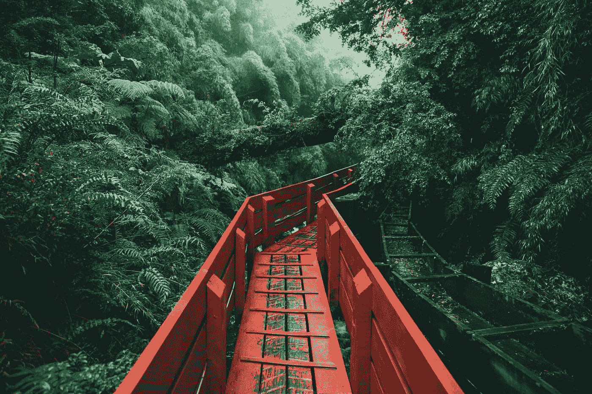

# 虚拟土地是新的前沿。不要错过

> 原文：<https://medium.com/geekculture/virtual-land-is-the-new-frontier-dont-miss-out-f6b6c072a857?source=collection_archive---------17----------------------->

## 欢迎新世界

Photo by [J. Balla Photography](https://unsplash.com/@jballa?utm_source=unsplash&utm_medium=referral&utm_content=creditCopyText) on [Unsplash](https://unsplash.com/s/photos/land?utm_source=unsplash&utm_medium=referral&utm_content=creditCopyText)

我们理所当然地认为土地和财产是有形资产——你可以触摸和看到的东西——但是财产的概念并不像我们想的那样直观。

这是美洲原住民对土地所有权的看法:

> *我们的土地比你们的钱更有价值。它将* …