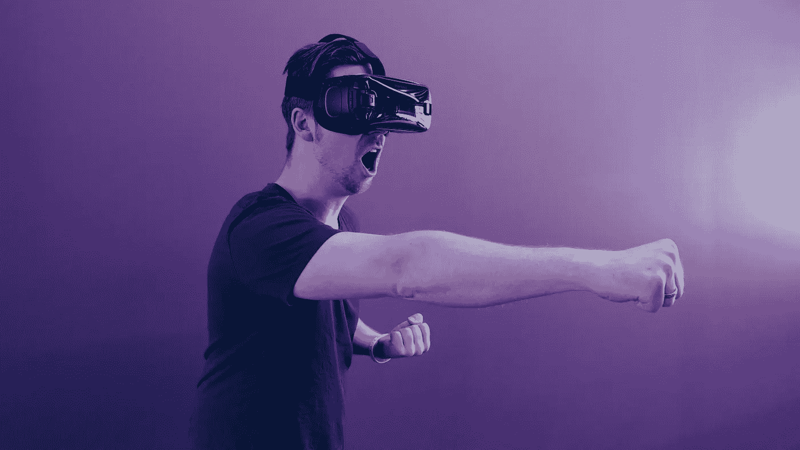

# 虚拟现实已准备好成为新的现实，但实现其大胆的主张将是一项艰巨的工作

> 原文：<https://medium.com/geekculture/virtual-reality-d160015a91d0?source=collection_archive---------37----------------------->

## 从 1:1 比例的虚拟地球到伪装成卡通形象的虚拟会议，交付沉浸式下一代虚拟体验的竞赛已经开始，并充满了一些相当雄心勃勃的主张。

你典型的早晨是什么样子的？

你醒来发现你已经迟到了。但不用担心，你只需戴上耳机，瞧！你就在会议室里，戴上你的爱探险的朵拉帽，准备去开会。半分钟后，你的老板走进来，穿着一身牛仔服装。你们聊得很开心，在等待同事的时候，决定把会议桌变成舒适的沙发，坐在上面浏览最新消息。

我同意，你的早晨，就此而言，我的，看起来一点也不像。如果我们在开会时醒来晚了，那么我们可能会迟到。关于它没有两种方法。但是，如果，我重复一遍，*如果我们的早晨也像那样会怎么样？为了探索“如果”,以及其他一千个“为什么”,全球各地的人们和公司都在建设和投资虚拟现实**。***

> 为什么人们不能传送到他们想去的任何地方？

这是 Oculus VR 创始人 Palmer Luckey 问过自己的问题。虽然我们还没有完全实现，但虚拟现实技术已经取得了长足的进步。脸书 jump 在 2014 年以 20 亿美元收购了耳机初创公司 Oculus VR，从而开始了这个行业的演变。扎克伯格承诺，这项技术将“让你体验不可能”。这推动了对 VR 初创公司的投资和收购浪潮，而索尼和 HTC 等其他科技企业集团也宣布进入该领域。

然而，这种关于 VR 的炒作，被吹捧为明天的技术，并没有持续多久。最初开发的头戴式耳机使用起来又笨重又麻烦，更不用说考虑到它们提供的低劣体验而言极其昂贵。此外，他们需要被拴在强大的计算机上，这些计算机可以跟上这种技术所需的密集实时计算，以使体验更加流畅。

今天，经过后来的多次修改和更新，VR 头戴设备已经能够消除困扰第一代的大部分问题。虚拟会议只是虚拟现实技术派上用场的众多途径之一。这个清单很长，而且预计在未来几年里会越来越长。为了让你有个概念，下面的列表只是冰山一角:

*   **旅行**:这可能是 VR 头戴设备最常见的使用案例。舒适地坐在家里，这是游览冰岛壮观的北极光或威尼斯标志性的河流巡游的最便捷和最划算的方式。或者，如果幻想出现，你也可以去月球旅行(不需要巨大的飞跃)！
*   **游戏**:2020 年[半条命:ALyx](https://www.half-life.com/en/alyx) 的发布是这一类别中最值得一提的。它给游戏带来了一种全新的动态，这在屏幕上是不可能的。但你可能没有听说过这一点的原因是因为 VR 游戏是一个新兴的行业，玩家主要受到缺乏现金和空间(最小约 6.5 英尺×5 英尺)的限制。
*   **设计和开发**:从汽车工业到房地产，虚拟现实通常被用来在建造最终产品之前设想最终产品，以消除蓝图中不明显的古怪之处。
*   零售:虚拟现实技术使用户能够在最终下单之前试穿和试验不同的商品，无论是衣服、鞋子还是手袋，而无需去实体店。

现在，虽然这个列表可以继续下去，让我们探索一个全新的类别，其中虚拟现实正在发挥作用，并可能在字面上的全球范围内。是的，如果你还没猜到的话，我说的是元宇宙——脸书创造终极社交联系的大胆新举措。

> 我们将有效地从人们认为我们主要是一家社交媒体公司转变为一家元宇宙公司。

——马克·扎克伯格在接受《The Verge》采访时表示

据首席执行官称，元宇宙将是一个由虚拟现实驱动的虚拟世界，人们可以聚集在一起，参加活动，就像在现实世界中一样。你可以和你的朋友开派对，发现其他用户创建的地方，甚至工作！目前正在开发中，扎克伯格在财报电话会议上表示，脸书的目标是通过让硬件尽可能便宜来增加用户群，并通过虚拟经济货币化来创造收入。

Earth 2 (from https://earth2.io)

元宇宙的概念并不新鲜。其他这样的“元经文”已经存在。地球 2 是最显著的例子。这是一个 1:1 比例的地球虚拟复制品，其中"*剖面地图上的真实世界地理位置对应于用户生成的数字虚拟环境。这些环境可以拥有、购买、出售，并在不久的将来进行深度定制*。《地球 2》经历了前所未有的增长，许多 T4 玩家已经花大价钱拿到了令人垂涎的瓷砖形式的虚拟不动产。

堡垒之夜背后的流行视频游戏公司 Epic Games 也有自己的元宇宙野心。他们的理由是游戏玩家倾向于拥有性能强大的电脑，因此已经具备了进入这个新世界的能力。

既然我们已经瞥见了通往终极元宇宙的竞赛，它对我们的现实到底意味着什么？真实的现实，你我居住的现实。

如果创造 metaverses 的未来主义计划感觉是反乌托邦的，并想象出一个孩子戴着虚拟现实耳机的照片，对周围的世界一无所知，那么你可能不会太离谱。在这个时代，人们通过玻璃屏幕交流而不是面对面的交谈，虚拟现实可能看起来像是一个更加孤立的世界的一个极其危险的斜坡。然而，这一现实仍需数年甚至数十年才能实现。正如元宇宙福音派人士迅速指出的那样，更严重的一点是，无论哪个实体赢得元宇宙竞选，都将在本质上成为一个全新宇宙的守门人和统治者，并将不可避免地引导公众提高自己的底线。

元经文最终以何种形式“具体化”现在还无法预测。他们仍处于不稳定的早期阶段。同时，你和我，早上的会议不要迟到。

*万一我们是第一次见面*

嗨，我是 Shahryar，职业是软件工程师，激情是博客作者。我正试图围绕激励和授权的技术建立有意义的对话。如果你喜欢它的内容，可以考虑按一下鼓掌按钮。你可以谈谈你对这个故事的想法，或者如果你有任何建议和忠告，请联系我，这里是 T2。

**免责声明**

*   我与博客中提到的任何公司或实体都没有关联或附属关系。
*   任何链接、嵌入媒体或对外部网站的引用都不是付费/附属链接，仅作为引用提及。
*   不要将任何提及的软件/硬件产品作为购买建议。
*   记住要经常做自己的研究。