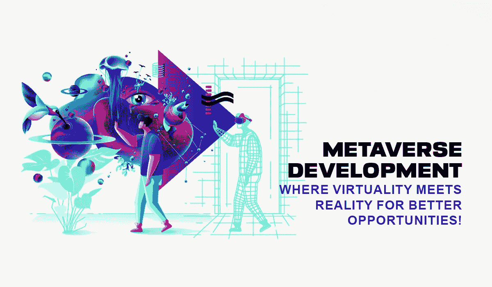
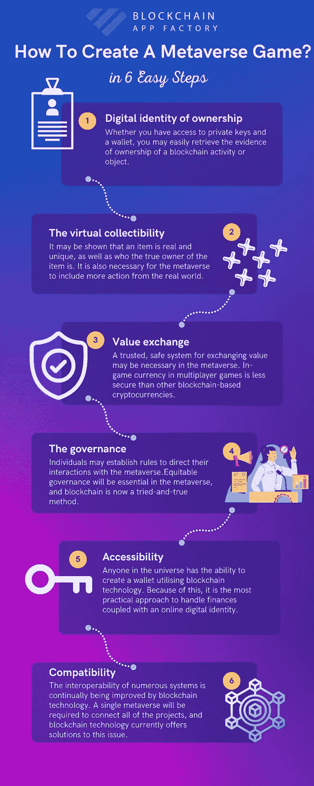

# 元宇宙发展-完全指南

> 原文：<https://medium.com/geekculture/virtual-world-nft-metaverse-world-development-f4a375f60ced?source=collection_archive---------10----------------------->

## 这里我们解释了虚拟世界 NFT 开发和 Metavese 开发。

Metaverse Development

虚拟世界 NFT [**房地产元宇宙**](https://bit.ly/3SONjqU) 是房地产行业的最新趋势，而且没有停止的迹象。在过去的几年里，房地产市场确实发生了相当大的变化。向技术的转变让房地产专业人士接受了数字世界所能提供的一切。这种转变的发生得益于疫情时期房地产市场的不稳定。

NFT 的发展以及区块链和加密货币的广泛采用让许多人提出了一个问题。那个问题就是:房地产行业的未来是怎样的？

人工智能的兴起和更多可用的自动化解决方案为房地产行业的未来创造了许多奇迹。投资者、企业家和代理商想知道这个行业即将发生的转变以及它将带来的变化。

本文重点介绍一种可能的未来，即 [**NFT 房地产**](https://bit.ly/3RFXtch) 。这种可能性听起来有些牵强，但已经有了一些基础。

## NFT 房地产是元宇宙——一个新的房地产利基？

**NFT Real Estate Metaverse**

现在，虚拟财产交易是最热门的话题，它们吸引了大量投资。

2021 年 2 月，一块 [**虚拟土地**](https://bit.ly/3SONjqU) 以近两百万美元成交。这笔交易是这个领域的第一笔大交易，老板解释了他们决定背后的原因。地主看到了这块地产的潜力，决定利用它。

 [## 在元宇宙购买土地的综合指南！

### 在过去的十年里，区块链世界已经被充满希望的创新所点缀，并产生了影响…

medium.com](/blockchain-biz/a-comprehensive-guide-to-buy-land-in-the-metaverse-3177b8484a4c) 

此次房地产销售标志着 NFT 房地产元宇宙**历史上最大的数字土地规模。**

**数字土地销售和元宇宙概念似乎与房地产行业相去甚远。然而，这些概念正在进入房地产世界。以共和地产为例来看；该公司正在购买实体公寓，现在计划推出一项独特的活动。这个仅限受邀者参加的活动旨在寻找希望购买虚拟土地的投资者。该公司计划购买几个 NFT 房地产元宇宙财产，并将其转换成虚拟商店，酒店等。**

> **"[参加我们的元宇宙演示！！！！！！！！！！！！！！！！！！！！！！！！！！！!"](https://bit.ly/3Mg4i2V)**

**房地产经纪人也看到了这里的潜力，并正在利用它。几个代理商正在购买元宇宙的土地，并打算出售。有的甚至放了一个 [**实体土地**](https://bit.ly/3SONjqU) 的数字复制品，上市销售。**

**有对虚拟土地和虚拟世界开发的需求。公司、企业和组织希望挖掘这种潜力并获得回报。**

**一些投资者称之为新的淘金热。在每个人都走向数字化的时代，拥有一片虚拟土地的承诺是一个诱人的想法。当然，不能保证人们能够访问这些数字土地。然而，这并没有阻止狂热分子尽可能地攫取土地。因此，新一代人可能会在元宇宙购买他们的第一栋房子。**

## **打下基础**

****

**Virtual World NFT Groundwork**

**然而，NFT 元宇宙房地产公司要实现这一目标，还有大量的工作要做。目前，评论家说，目前的元宇宙 NFT 房地产是新奇的销售，是由炒作和投机驱动的。其他批评家指出，任何类型的房地产都需要一定程度的尽职调查。这一步骤确保了安全性，并维护了卖家和买家之间的信任。**

**很多批评来自于房地产行业。这些批评者看不到改变他们过时但有利可图的模式对大众有益的价值。**

**然而，NFT 房地产元宇宙承诺有能力民主化的财产所有权。这一消息开启了多年来将大多数人排除在外的行业。通常情况下，房地产价值因其与商店、社区和服务机构的距离而异。目前，还不知道虚拟世界是否会遵循同样的概念，因为玩家可以随时随地旅行。**

** [## 您企业的元宇宙发展路线图

### 虚拟和增强现实的概念只在科幻小说中出现过。但是，随着…的引入

newusamarket.com](https://newusamarket.com/metaverse-development-roadmap-boost-your-business-to-the-next-level/) 

## 谁是虚拟世界开发领域最大的玩家？

目前，有几个公司，企业，组织和游戏进入这一趋势。然而，最著名的名字是

*   **地球 2**
*   [**沙盒**](https://bit.ly/3MnQWlu)
*   [**轴协无穷**](https://bit.ly/3Mk64jS)
*   [**下放**](https://bit.ly/3MeeHMI)
*   **Somnium**

## 结论

接下来的几年将会有大量资金注入 NFT 的基础设施。这一收入将支持其他使用情形，并实现可见的分类帐。这种数字分类账可以促进类似于收藏品和艺术品的单个资产的独特表示。智能合约必须改进并考虑到可扩展性、功能性和速度。对于 NFT 的粉丝和 NFT 的批评者来说，监管仍然是一个紧迫的问题。

 [## 元宇宙的商业应用是什么？

### 如果你是一个想为自己开发一个元宇宙平台的企业家，这可能是最明智的决定…

www.developerupdates.com](https://www.developerupdates.com/blog/be-a-part-of-a-trillion-dollar-market-of-metaverse-with-metaverse-development) 

尽管如此，元宇宙显示出巨大的发展潜力。它甚至可能成为人类未来的一种新的生活方式。因此，提前 开始计划或考虑 [**在元宇宙开展业务是有益的。任何对元宇宙持观望态度的人都应该做出决定。对一个公司来说，与一个虚拟世界开发公司合作，并在其他人之前开始创建虚拟业务是有益的。这样，他们就可以利用市场，享受市场带来的好处。**](https://bit.ly/3SONjqU)

# 与元宇宙相关的常见问题

## W 元宇宙是什么&如何发展自己的元宇宙？

 [## 什么是元宇宙，如何发展你自己的元宇宙？

### 让我们更深入地了解一下元宇宙发展，以及它如何帮助你的企业赚大钱。

medium.com](/security-token-offering/how-metaverse-development-can-be-your-key-to-a-rewarding-business-venture-12982fa379e8) 

## 元宇宙使用的关键技术是什么？

 [## 元宇宙使用的关键技术是什么？

### 元宇宙的发展为你的未来提供了一个巨大的机会，它的许多特点会吸引更多的人。

www.developerupdates.com](https://www.developerupdates.com/blog/metaverse-development-unveiling-the-world-full-of-incredible-opportunities-right-from-the-home) 

## 开发元宇宙要花多少钱？

 [## 开发元宇宙要花多少钱？

### NFT 已经成为未来万物独立的关键组成部分。有了 Web3，为您进入……

techcrams.com](https://techcrams.com/metaverse-development-solutions-the-navigator-towards-your-web3-journey/) 

## 在元宇宙，国家森林公园的作用是什么？

 [## 在元宇宙，非正规金融服务的重要作用是什么？

### 一个拥有 3D 世界的沉浸式网络被称为元宇宙，它允许用户玩游戏，工作…

blog.cryptostars.is](https://blog.cryptostars.is/what-is-the-important-role-of-nfts-in-the-metaverse-cab7824b85ed) 

## 元宇宙如何改变博彩业？

 [## 游戏收益——元宇宙用他们的创意推动了游戏产业的发展

### 由于元宇宙在游戏中的广泛应用，游戏玩家现在对虚拟世界的体验非常不同…

www.linkedin.com](https://www.linkedin.com/pulse/game-gain-metaverse-boosts-gaming-industry-creative-darly-dixon/) 

## 如何创建一个元宇宙游戏？

## 有哪些不可忽视的顶级元宇宙开发公司？

 [## 不容忽视的顶级元宇宙开发公司！

### “元宇宙”已经成为今年的流行语，多家企业推出了各自版本的…

www.finextra.com](https://www.finextra.com/blogposting/22964/top-metaverse-development-companies-that-cannot-be-ignored) 

## 元宇宙的解决方案是什么？

 [## 元宇宙解决方案——开启虚拟欲望世界的最佳场所

### 元宇宙解决方案提供了一种从现状出发展望未来的方式。的…

www.linkedin.com](https://www.linkedin.com/pulse/metaverse-solution-the-best-place-unlocking-world-virtual-darly-dixon/) 

## Web3 开发人员中的元宇宙开发语言趋势是什么？

 [## 2022 年 Web3 开发者中的顶级元宇宙开发语言趋势！

### 元宇宙对世界来说是一个革命性的发现，尽管它的潜力只被挖掘了一点点，所以…

medium.com](/geekculture/top-metaverse-development-languages-trending-among-web3-developers-in-2022-8f25372fbec) 

## 元宇宙如何影响医疗保健行业？

 [## 利用虚拟现实医疗保健解决方案统治未来的医疗领域！

### 医疗保健已被各种全球性组织列为基本要求。在保证质量的同时…

medium.datadriveninvestor.com](https://medium.datadriveninvestor.com/make-use-of-virtual-reality-healthcare-solutions-to-reign-in-tomorrows-medical-field-96e22ba347c3) 

## 元宇宙 3D 开发解决方案是什么？

 [## 围绕元宇宙三维空间开发的商业炒作令人震惊。原因如下！

### 虚拟世界、虚拟化身和增强现实不再是好莱坞的科幻故事。元宇宙制作了这个…

blog.cryptostars.is](https://blog.cryptostars.is/the-business-hype-around-metaverse-3d-space-development-is-astonishing-heres-why-8775257638f8) 

## 元宇宙排名前五的项目是什么？

 [## 2022 年最值得关注的五大元宇宙项目！

### darly Dixon 2022 年 9 月 12 日由区块链和各种基于现实的技术(VR/AR)支持的虚拟领域…

bigsnewsnetwork.com](https://bigsnewsnetwork.com/news/7464/top-5-metaverse-projects-in-2022-that-might-roar-valiantly/)**