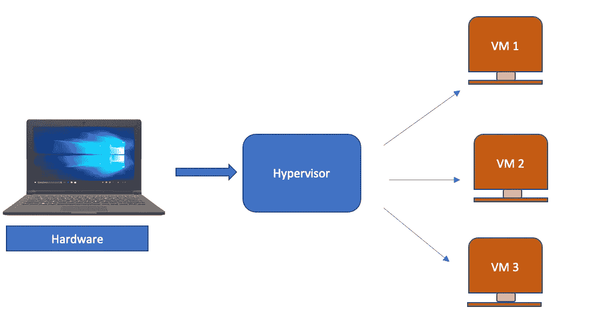
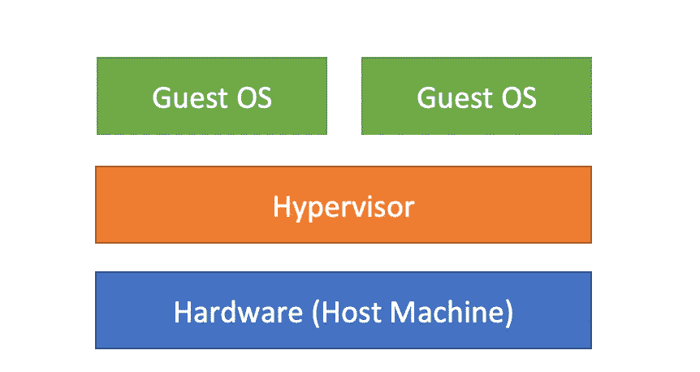
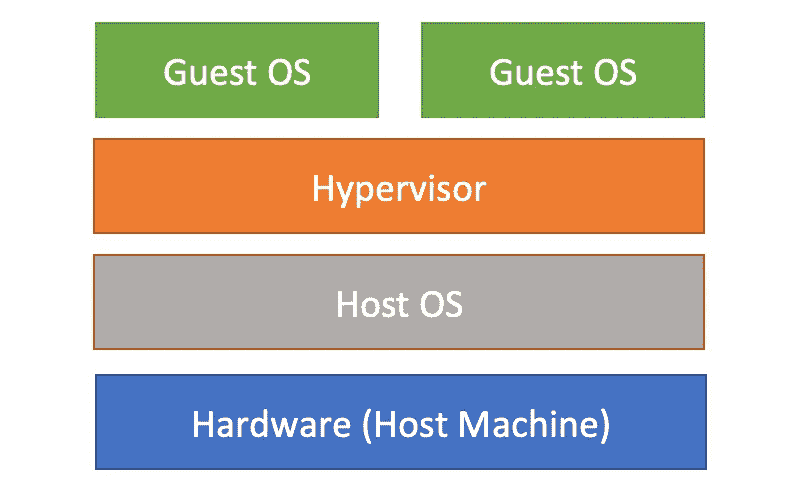

# “虚拟化”和“虚拟机管理程序”

> 原文：<https://medium.com/geekculture/virtualization-and-hypervisors-232e6080cdf9?source=collection_archive---------47----------------------->

开始使用虚拟机需要知道的所有信息

Photo by [Efe Kurnaz](https://unsplash.com/@efekurnaz?utm_source=medium&utm_medium=referral) on [Unsplash](https://unsplash.com?utm_source=medium&utm_medium=referral)

作为一名软件工程师，我们听到虚拟化或 VMs 或 Docker 的次数比听到自己的名字还多。但这并不像听起来那么复杂。今天，我们将讨论您需要了解的关于虚拟机和虚拟机管理程序的所有内容和方式。

那么什么是虚拟化呢？

简单来说就是某个东西软件化或者虚拟化的过程。这可以是操作系统、计算、存储、网络或应用程序。让这一切成为可能的是**虚拟机管理程序**。

**什么是管理程序？**

虚拟机管理程序是使用物理主机的资源创建和运行虚拟机(VM)的硬件、软件或固件。它是一种模拟器。虚拟机管理程序在其上运行一个或多个虚拟机的系统称为主机，每个虚拟机都是来宾机。

主机的资源由虚拟机管理程序提取，并分配给它创建的不同虚拟机。

**管理程序的类型**

通常有两种类型的虚拟机管理程序。

1.  **类型 1 或本机或“裸机”虚拟机管理程序**
2.  **第 2 类或托管或“嵌入式”虚拟机管理程序**

展望未来，我将交替使用这些术语，以便您能习惯它们。

**类型 1 或本机虚拟机管理程序**

**Type 1 or Native or “bare metal” hypervisor**

类型 1 虚拟机管理程序直接安装在物理服务器或您的硬件之上。这不需要加载任何底层操作系统。这些是最常用和最安全的。

**例如** VMware vSphere / ESXi、VMware vSphere / ESXi、KVM

**第二类或嵌入式虚拟机管理程序**

**Type 2 or Hosted or “embedded” hypervisors**

第 2 类虚拟机管理程序在主机服务器和虚拟机管理程序之间有一层主机操作系统。这就是这些被称为托管虚拟机管理程序的原因。它们比本机虚拟机管理程序有更高的延迟。

**例如** Oracle Virtual Box、微软虚拟 PC、VMWare Workstation

既然我们现在对虚拟机管理程序有了基本的了解，那么现在让我们来了解一下虚拟机。

那么什么是虚拟机呢？

虚拟机可以简单地说是基于软件的计算机。它们拥有您的主机所拥有的一切，如操作系统、应用程序、网络功能等。最重要的是，它们独立于其他虚拟机运行。如果您的主机上有 2 或 3 个虚拟机，那么您实际上是在运行多台具有相同或不同操作系统的计算机。所以，你可以在一台电脑上运行 windows，在另一台电脑上运行 Linux 或者 raspberry pi。这让我想起了《盗梦:D》

Photo by [Szabo Viktor](https://unsplash.com/@vmxhu?utm_source=medium&utm_medium=referral) on [Unsplash](https://unsplash.com?utm_source=medium&utm_medium=referral)

这些虚拟机所需的所有资源都由虚拟机管理程序从您的主机上提供。它划分了内存、硬盘空间等。，并在这些虚拟机之间共享。

由于这些虚拟机是独立的，它们几乎可以立即在不同的虚拟机管理程序之间轻松移动，并且可以像在您的主机上一样轻松启动。

既然我们已经了解了关于虚拟机的所有这些事情，那么虚拟机有什么好处呢？

1.  **提高生产力:**要尝试新机器或在特定环境下工作，只需点击几下鼠标就能运行虚拟机。
2.  **降低运营成本和资本:**减少物理硬件，因为多个虚拟机可以在一台主机上运行
3.  **速度和敏捷:**启动一个 VM 非常快。你所需要的只是一个可用的免费软件，它就完成了。
4.  **最大限度减少停机时间，甚至不停机:**即使您的主机停机，您的虚拟机也可以快速轻松地迁移到新主机上。

在当今的环境中，虚拟机和虚拟机管理程序是软件工程师最好的伙伴。类型 1 和类型 2 实际上都处于各自独立的领域。

如果你想了解更多，下面的链接可以帮助你。

维基管理程序:[https://en.wikipedia.org/wiki/Hypervisor](https://en.wikipedia.org/wiki/Hypervisor)

维基虚拟化:[https://en.wikipedia.org/wiki/Virtualization](https://en.wikipedia.org/wiki/Virtualization)

快乐学习:)