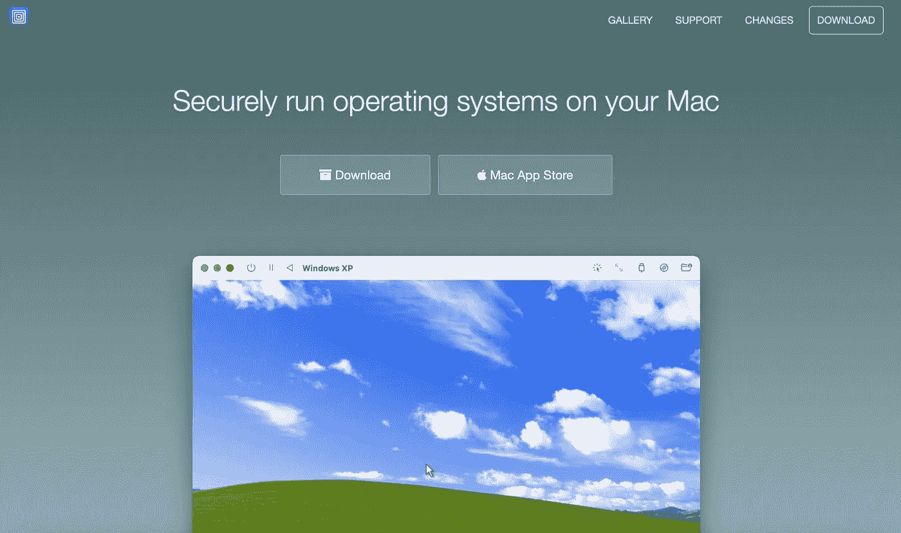
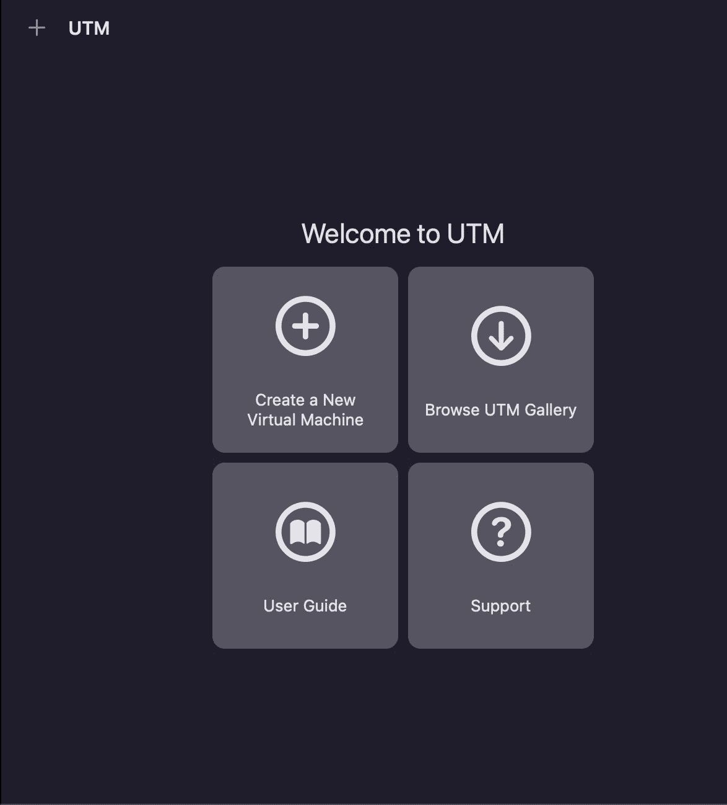
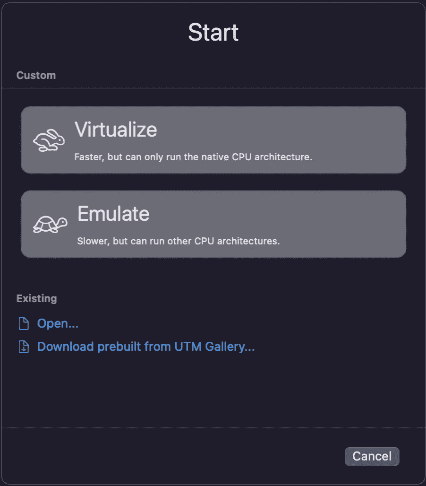
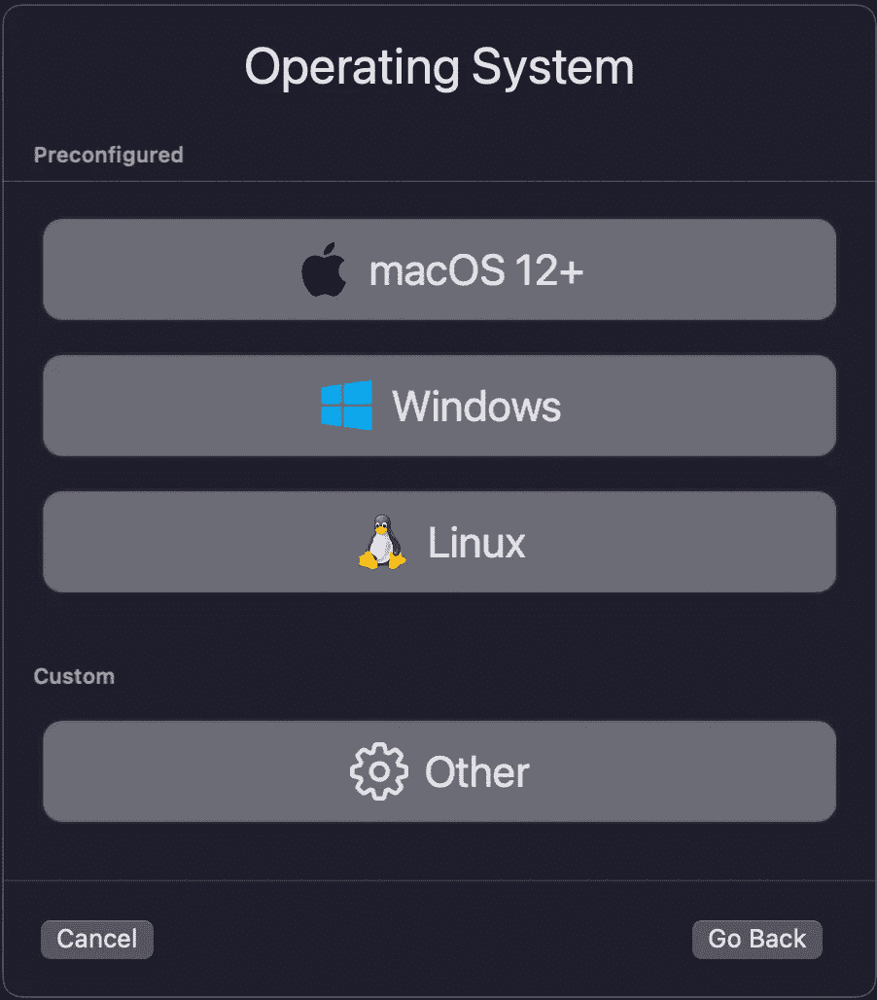
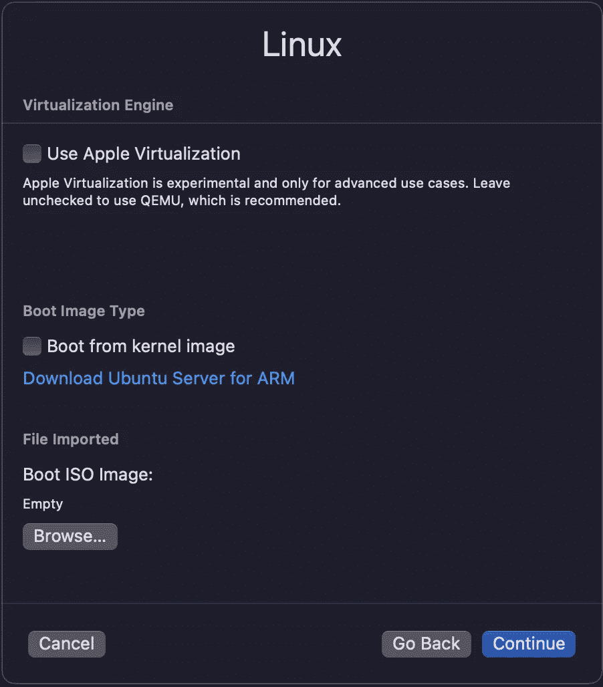
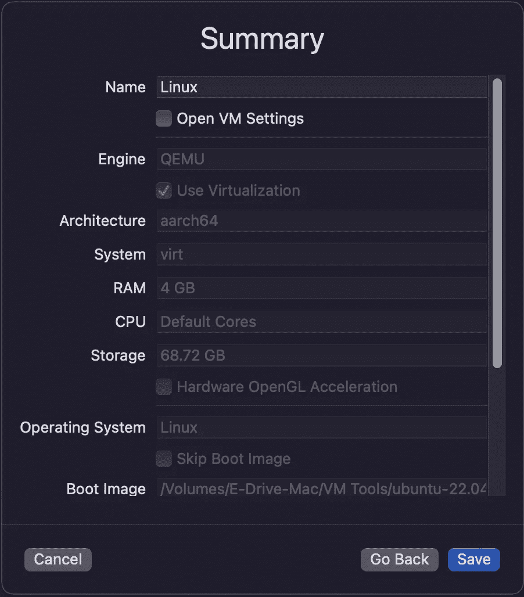
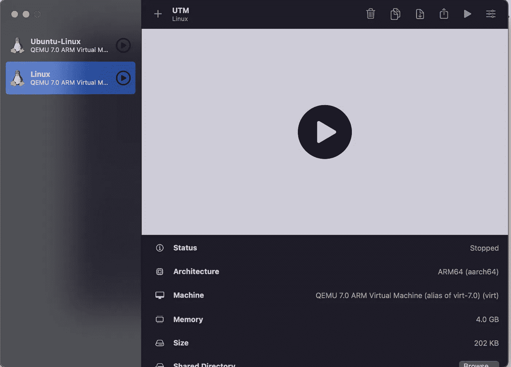

# 苹果 Mac M1 上的虚拟化

> 原文：<https://medium.com/geekculture/virtualization-on-apple-mac-m1-4cbfb809bb89?source=collection_archive---------1----------------------->


Photo by [Lennart Uecker](https://unsplash.com/es/@lennartuecker?utm_source=medium&utm_medium=referral) on [Unsplash](https://unsplash.com?utm_source=medium&utm_medium=referral)

有了新的苹果 M1 处理器，我们现在有了一台非常强大的机器，但由于这种架构是技术上的一个新里程碑，我们现在很难使用 ARM 架构，因为我们使用的许多工具目前都不可用。

许多开发者和喜欢在 MAC 硬件上使用其他操作系统的人面临的一个更大的问题是虚拟化。由于提供大多数虚拟化软件的所有指定公司都没有开发出支持 ARM 架构的新版本。

但是我最近在网上找到了解决这个问题的方法。

UTM 采用苹果的虚拟机管理程序虚拟化框架，以接近原生速度在苹果芯片上运行 ARM64 操作系统。在英特尔 MAC 上，x86/x64 操作系统可以虚拟化。此外，在 Apple Silicon 上运行 x86/x64 以及在 Intel 上运行 ARM64 时，可以使用较低的性能仿真。

进入 [https://mac.getutm.app](https://mac.getutm.app) 点击下载。



下载后，安装 UTM 虚拟机并启动它。

也可以从这里下载在这个虚拟机上运行的 Ubuntu ARM 服务器镜像:【https://ubuntu.com/download/server/arm 

启动 UTM 虚拟机后，您将进入下面的屏幕。



UTM Virtual Machine

点击创建一个新的虚拟机，然后将出现以下屏幕。



单击虚拟化，将出现以下屏幕。



选择 Linux 并继续。



点击浏览导入上面下载的 ubuntu arm 镜像，点击继续。之后，继续 Linux 配置，并在下面的屏幕上点击保存。



此后，您将看到如下屏幕。因为我已经安装了图像，所以你可以在左边看到两个图像，但是对你来说只有一个。点击屏幕中间的播放按钮。



之后，继续在你的虚拟机上安装 ubuntu。

安装完成后，您需要重新启动虚拟机。为此，首先您必须弹出您已导入的图像媒体。点击右上角的 cd 按钮，然后点击弹出。之后，点击顶部的反向播放按钮，重启机器。

这将安装控制台版本。要安装 GUI，请在安装控制台版本时遵循以下步骤。

运行以下命令，下载系统的任何未决更新。

```
**sudo apt update**
```

现在我们将安装 tasksel，它将帮助我们获得 ubuntu 的 GUI。

```
**sudo apt install tasksel****sudo tasksel install ubuntu desktop**
```

上面的命令将为您下载 ubuntu GUI。如果失败，只需重新运行该命令。

```
**sudo reboot**
```

现在重启后你会看到 ubuntu 的 GUI。

干杯:D