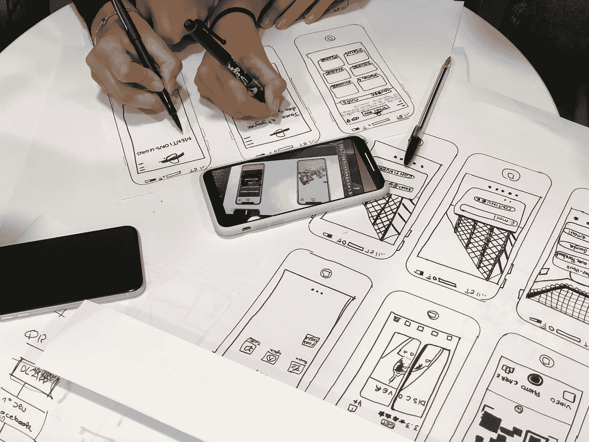

# 用户界面设计的视觉元素

> 原文：<https://medium.com/geekculture/visual-elements-of-ui-design-4191cb648623?source=collection_archive---------7----------------------->

## UI 设计视觉元素的伟大指南。

Photo by [Amélie Mourichon](https://unsplash.com/@amayli?utm_source=medium&utm_medium=referral) on [Unsplash](https://unsplash.com?utm_source=medium&utm_medium=referral)

用户界面设计是网页设计最重要的方面之一。它是为计算机系统或应用程序创建用户界面的过程，可以分为五个主要部分:用户输入、显示、导航、交互和反馈。在这篇文章中，我们将看看如何设计有效的视觉…