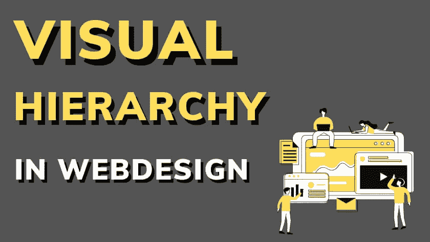
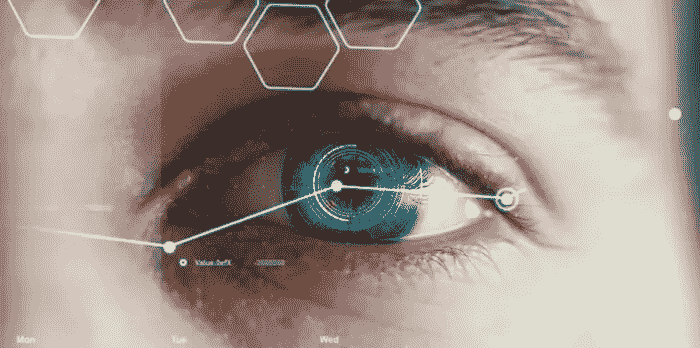
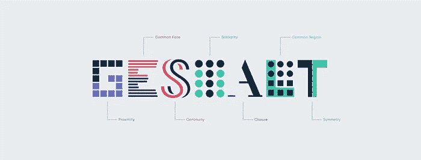
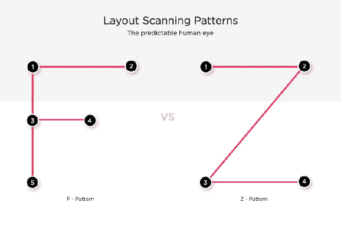
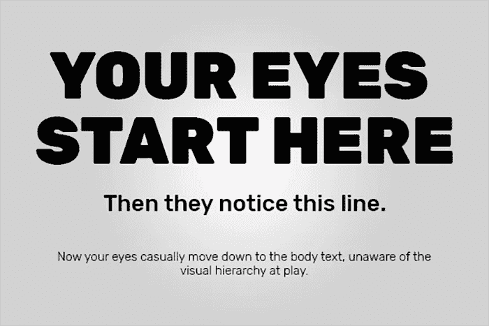
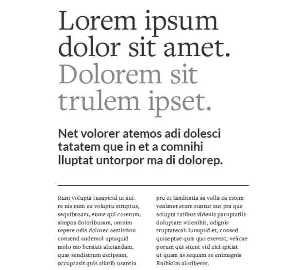
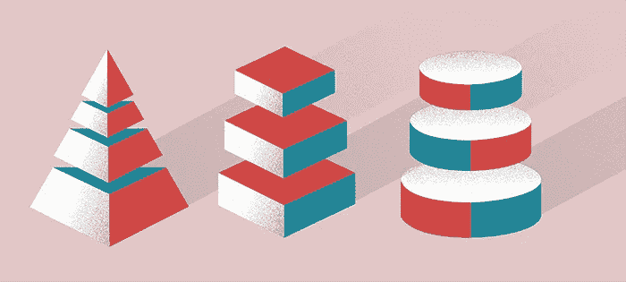
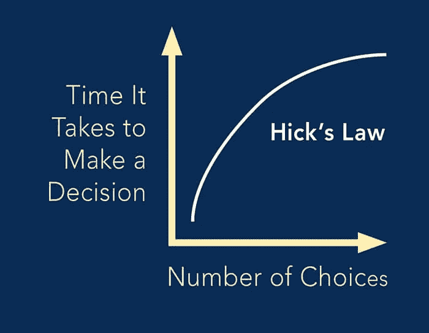
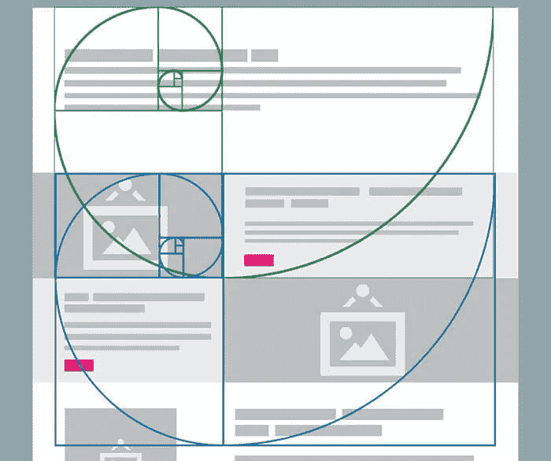

# 网页设计中的视觉层次

> 原文：<https://medium.com/geekculture/visual-hierarchy-in-web-design-6561e04f6e15?source=collection_archive---------2----------------------->

# 什么是视觉层次？

视觉层次是人们在页面上处理信息的顺序。这是一个对元素进行优先排序的系统，以便于理解。没有一个视觉层次或设计结构，用户可能会不知所措，结果是什么都不懂。设计就是视觉传达。一旦你理解了人眼是如何处理这些信息的，你会发现自己能够更好、更有效地安排你的元素。

# 格式塔原则

网页设计中视觉层次的大部分规则来自格式塔原则。格式塔心理学是由奥地利和德国心理学家马克斯·韦特海默、沃尔夫冈·克勒和库尔特·考夫卡首先提出的。格式塔是一个德语单词。最接近的翻译是“整体”、“模式”或“形式”。这个心理学理论解释了人们是如何感知设计元素的。从[格式塔原则](https://www.web-designlondon.co.uk/the-psychology-of-design-perception-in-the-digital-age/)中最重要的一点是，你应该把你的页面组织成一个整体，而不是一个个独立的部分。

这并不意味着你不应该关注细节。请记住，即使你有最有吸引力的 CTA，但你的整个页面是一团乱麻，没有一个良好的视觉层次，你可能不会获得大量的点击和转换。

其中一些原则包括:

接近——接近是构图的一个基本原则。它指出紧密放置的元素看起来是相关的。当我们将一些元素放在一起时，我们给观众一个清晰的信号，即这些对象是相关的。接近原则有助于设计者使内容更适合快速浏览和理解。

相似性——相似性法则表明，具有相似视觉外观的元素似乎是相关的。同时，因为我们的大脑倾向于将相似的事物分组在一起，所以我们也会注意到与该组不相似的事物(这种不相似被称为“异常”)。一个异常自然会吸引观众的注意力，因为它不同于群体中的其他人。

重复——重复是基于共同区域的格式塔法则。根据这一规则，如果元素共享一个具有明确边界的区域，则它们倾向于被分组感知。视觉元素的重复创造了统一性，从而提高了识别度。我们这端视觉上重复的选择让读者更容易浏览这一页。

# 人眼和扫描模式

人眼以可预测的方式工作。它会自动被吸引到某些感兴趣的地方。有些确实取决于个人，但大多数人都遵循可预测的趋势，他们如何看待一切，包括网站。

印刷页面和数字页面都有共同的层次模式。这些模式是基于我们的眼睛在看到新的一页时的运动。

人们通常遵循两种不同类型的扫描模式，您也可以在自己的设计中利用这种模式:“F”，主要用于大量使用文本的博客页面和文章，“Z”，适用于不以块状段落形式呈现信息的网站或广告。

f 模式——在有更多文本的设计中，我们从左到右扫描顶部，然后从左向下，寻找我们想知道的线索。找到一个，我们就向右扫描。

z 模式——在没有太多文字的设计中，我们的眼睛从左上到右上开始扫描，然后斜着向下到左下，停在右下。

# 尺寸或比例等级

这个很简单:人们首先阅读大的东西。

尺寸建立了一个等级体系，较大的物品更能吸引注意力，因此看起来是最重要的。尺寸是一个非常基本但至关重要的原则，它可以赋予元素比其他元素更大的重要性，并有助于将观众的目光吸引到某个特定的区域。通过增加元素的比例，您可以立即吸引观众的注意力。但是，您要小心，不要放大太多的元素，或者以可能降低屏幕上其他元素重要性的方式增加尺寸。

字号通常用于正文中，以标识有意义的主题、标题或重要的引用，使最重要的最大，并从那里按比例缩小。请记住，太多的尺码组合会让人感到困惑，所以建立一个基本的尺码结构是一个好主意。次要内容，如标签，应该更小，这样它们就不会与更重要的信息竞争。

# 印刷层次

排版层次是一种组织类型的系统，它在数据中建立了重要性顺序，使读者能够轻松找到他们要找的内容并浏览内容。它有助于将读者的视线引导到一个章节的开始和结束，同时使用户能够根据整个文本中风格的一致使用来隔离某些信息。

那么我们如何将[排版](https://www.web-designlondon.co.uk/choose-right-typography-web-design/)层次融入到我们的网站设计中呢？最简单的方法是将你的排版分成三个不同的层次:

第一级(标题)——你的第一级排版是页面上最重要的内容。你希望你的读者首先看到什么？首先吸引你注意的通常是大而粗的字体。

第二级(副标题)——第二级字体没有第一级字体突出，但它有助于在视觉上将内容分成不同的部分。把二级排版想象成副标题；为读者提供他们将要阅读的内容的线索。

第三层(正文)——这是你希望你的读者最终到达的地方。如果他们对你的一级和二级排版感兴趣，他们可能会到达三级。把第三层想象成你信息的核心。在这里你可以更详细地介绍你的产品、服务或主题，通常用较小的字体。关于三级字体，最重要的是要记住它必须是一种易于阅读的字体，因为它通常比一级或二级字体要小得多。

# 使用颜色和对比的视觉层次

颜色是光谱。颜色的密度是由光的波长决定的。

颜色可以像尺寸和重量一样用来强调设计中的元素。明亮的颜色通常比暗淡、不饱和的颜色更能吸引观众的注意力。

颜色在移动应用程序设计中尤为重要，小屏幕限制了你使用其他策略的能力，如尺寸差异和宽间距。

一个成功的设计依靠对比来带来视觉上的兴趣。对比可以有多种形式:通过颜色选择、字体风格、图案、温度、饱和度和价值。也让设计不至于显得单调、平淡。

为了用对比建立视觉层次，让焦点从设计的其他部分中突出出来。

# 纹理层次

当人们谈论关于视觉层次的“纹理”时，他们不是指图像纹理效果。更确切地说，这种“纹理”指的是页面上空间、文本和其他细节的整体安排或模式。

纹理是不同的，它们是装饰性的。尽管纹理主要影响美观，但是在你的设计中加入纹理会影响层次。纹理可以创造视觉趣味，将用户的注意力吸引到布局的某些部分。

# 希克定律和空白

另一种吸引注意力的方法是给内容足够的空间来呼吸。负空间是视觉设计的一个重要组成部分，它和正空间一样重要。

希克定律的原则之一适用于[网页设计](https://www.web-designlondon.co.uk/5-web-design-tips-for-financial-website-design/)。它说当我们增加选择的数量时，做决定所需的时间也会增加。除此之外，选择越多，越容易什么都不选。

简单来说，通过理解希克定律，你可以用足够的空白空间来安排你的页面，避免造成认知超载。这将减少你的用户花在弄清楚你的网站上的时间，将他们直接引向你的 CTA，从而提高转化率。

# 黄金比例与网页设计

黄金比例是一个数学比例，大约等于 1.6180。它在自然界中很常见，在经典设计理论中被用来创造平衡的构图。你也可以将黄金比例应用到网页设计中。通过更具结构性的动态布局轻松吸引注意力。

古希腊人是第一批发现自然界中美丽的不对称现象的人。他们用希腊字母 phi 表示这种现象，但今天我们称之为黄金比例。

伦敦网站设计中心的黄金比例也被用来平衡大量文本内容，创造层次结构，将用户的注意力吸引到特定的区域。

# 结论

层次结构是网站设计过程中的一个重要部分，但在决定层次结构和风格之前，了解内容的主题和你要传达的内容也很重要。

在某些情况下，您可以自由地使用上面列出的任何层次方法，但在其他情况下，您可能会被限制在特定的空间或背景类型的对比度中。

最好的行动计划是评估哪种方法适合这种情况，并采用那些有意义的方法。最终目标是以有组织的方式呈现内容，便于人眼处理。

这篇文章最初发表在伦敦的[网页设计上。](https://www.web-designlondon.co.uk/)