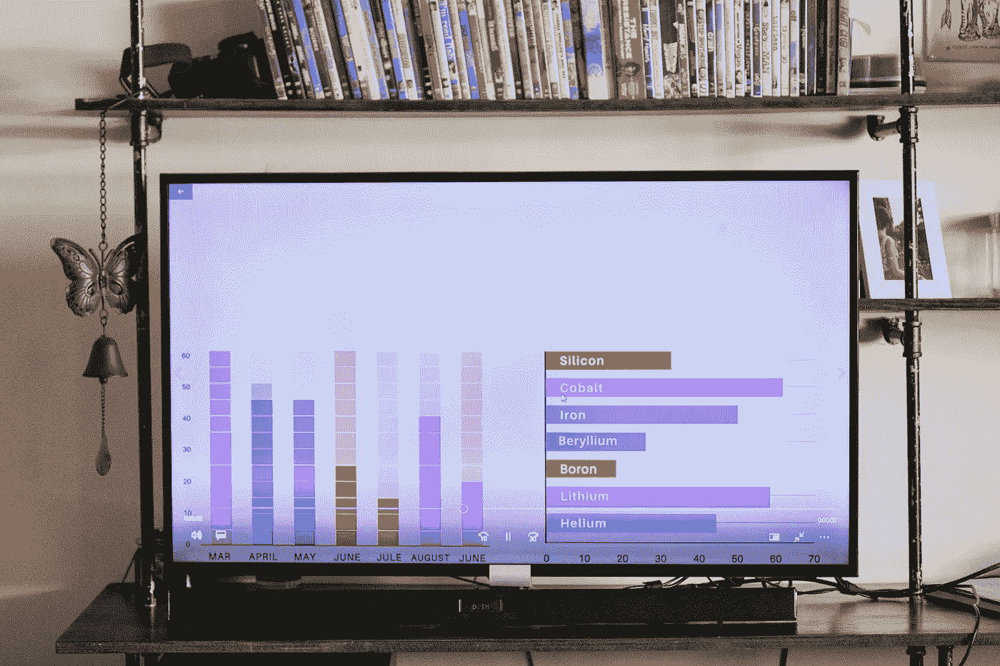
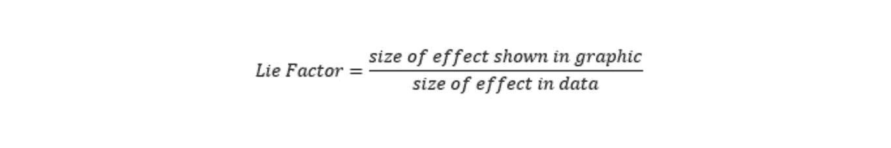
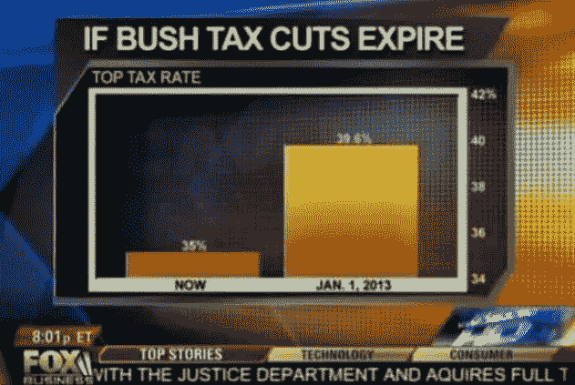
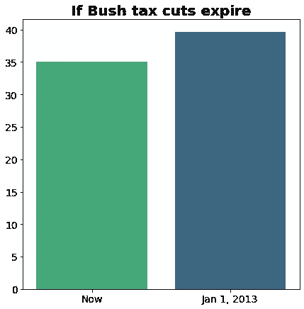
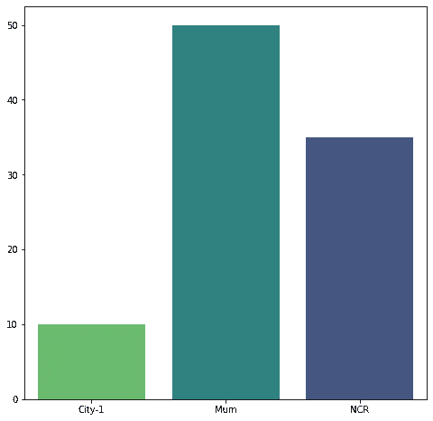
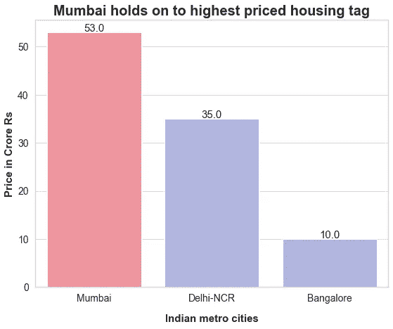
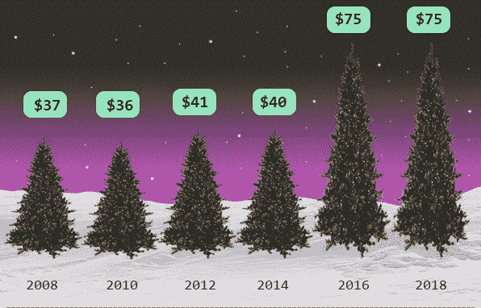

# 视觉化。正确的方法。

> 原文：<https://medium.com/geekculture/visualisations-the-right-way-9e91f050e5f6?source=collection_archive---------9----------------------->

毫无疑问，一张图胜过千言万语。我们倾向于轻松理解视觉表现，而不是阅读文本。无论在哪个领域，使用图形等视觉表示工具进行有效的交流都是当今非常需要的技能。

Source: [www.pexels.com](http://www.pexels.com)

本文旨在理解如何按照 Tufte 的规则最好地表示数据。
爱德华·塔夫特是统计学家，也是耶鲁大学的教授。他发展了图形完整性的六个原则，这些原则在数据可视化领域被广泛遵循。本文探讨了谎言因子的概念，以及如何使用 Tufte 的原则来更好地管理谎言因子的影响。

## **谎言因素**

理解谎言因素是继续这篇文章的关键。该图的唯一目的是正确地表示数据。谎言因子是指图表中的影响在多大程度上没有反映数据中的影响。更简单地说，如果某个特性的数据发生了 2 倍的变化，图表应该描绘出相同的效果，仅此而已。我们将谎言因子定义为**图形中效果的*大小与数据中效果的大小之比。***

现在，lie 因子的值为 1 意味着图和数据中的效果是相同的，这是理想情况。任何高于或低于 1 的值都意味着对数据感知方式的偏离。
下例描述了三个热门网站的流量百分比。

Source: [https://infolific.com/technology/internet/seo-lie-factor/](https://infolific.com/technology/internet/seo-lie-factor/)

乍一看，似乎 MSN 和雅虎的流量都是谷歌的近两倍，但仔细观察，我们注意到它们之间的流量差异只有 0.06%。
计算此图的 lie 因子。

*数据中效果的大小:*(0.35–0.30)/0.30 =**16.67%**
*图中效果的大小:*

(0.36–0.26) = 0.1

(0.1–0.06) = 0.04

(0.1 — 0.04) / 0.04 = **150 %**

***谎言因子:*** 150 / 16.67 = 9

9 的谎言因子证明了我们的发现，并证实了这个图表可能会误导读者。

# 原则

Tufte 的所有原则都有助于减少谎言因素，但只要有正当理由，偶尔变通一下一些规则也是允许的。以下是我们将详细讨论的原则。

**比例:*在图形本身的表面上实际测量的数字表示，应该与测量的数字量成正比。***

这实质上意味着图中所示的数字比例和真实值应该相等。如果我们有两个柱状图，每个柱状图代表一个特定州的选民人数，那么柱状图的长度应该代表相同比例的选民的数值。看看下面来自福克斯新闻的片段，描述了基于布什总统决定的最高税率。从图中可以看出，这一决定可能会导致税率从当前值增加数倍。

现在，观察下图，图中遵循了比例规则，柱的长度表示与数据相同的数值。我们看到这种增长是名义上的，并不是如上图所示的大变化。

**清晰:*清晰、详细、彻底的标签应用于消除图形失真和歧义。在图形上写出数据的解释。标注数据中的重要事件。***

看看这个图表，很难理解这个图表到底想要描述什么。没有一个清晰的标题，或者轴的标签，任何图形都不能设置清晰描述故事所需的上下文。任何关键事件都应该在图表中指出，以传达图表的主要信息。请记住，以适当的单位显示比例，以便更好地理解。

通过清晰地标记图表，有助于提高可读性，并使人们清楚地理解图表试图表达的信息。请注意我们是如何按降序对条形进行排序的，以便于找到最高值，我们用红色表示“Mumbai”的值，进一步吸引人们对图形主要信息的注意。每个条形顶部提到的值进一步提供了平均价格确切值的详细信息。

**数据驱动:** ***显示数据变异，而不是设计变异*** *。*

尽管在图形上发挥创意很棒，但我们有时会走极端。我们忘记了数据应该是图形的焦点，而不是设计的焦点。下图旨在总结历年来圣诞树的价格。这个图形看起来很棒，但是树的价格上涨的主要信息可以通过使用条形图而不是以设计为中心的图形来更好地传达。在分析时，有明确定义的级别和网格有助于理解价格的变化，而不必根据视觉进行估计。

Source: [https://thehustle.co/the-economics-of-christmas-trees/](https://thehustle.co/the-economics-of-christmas-trees/)

**标准化:*在货币的时间序列显示中，紧缩的和标准化的货币计量单位几乎总是比名义单位好。***

正如前面清晰的例子中所讨论的，在图表中使用单位是关键。考虑在图表中比较美国、印度和英国的 GDP 的情况，用这三个国家的货币来衡量它们的 GDP 是不正确的。为了比较 GDP，我们需要建立一个标准，在这种情况下，用美元来衡量这些国家的 GDP 会给出一个公平的比较。同样，当基于人口进行比较时，比如说 Covid 对不同国家的影响。比较每 1000 人中受影响的人数提供了正确的情况，而不是比较整个人口。

**合适的维度:*所描绘的承载信息(可变)的维度数量不应超过数据中的维度数量。***

所描述的携带信息的维数不应超过数据中的维数。在 2d 图形中，图形的维度是轴的数量，在本例中是两个。数据的维度是它所代表的不同变量。该值应该大于图形的尺寸。这确保了图表传达了更广泛、更全面的信息。根据经验，避免 3d 图形，因为它们往往会错误地表示数据。

**语境化:*图形不得断章取义地引用数据。***

最后一个原则是在表示数据时提供正确的上下文。这一原则依赖于你希望从数据中传达什么，通过举一个例子可以很好地理解。如果我们分析一只股票的表现，它可能是股票价格在上周下跌，因此人们可能会得出股票表现不佳的结论。但如果我们分析去年的股价，我们可能会发现它确实表现得很好。因此，在选择时间框架时，决定我们希望描绘什么样的故事变得至关重要。在此基础上，如果我们希望显示一个事件引起的变化程度，选择一个更大的时间范围将是有益的。这将提供更多来自过去的数据点和更好的背景。

遵循这些原则有助于控制谎言因素，并确保图形从数据中描绘出正确的故事。
下次你负责设计可视化时，围绕这些原则构建它，结果将是一个以最佳方式描述数据的图形。

我希望这篇文章是有益的，请分享这篇文章并为之鼓掌以示对我工作的认可。
欢呼观想奇才！