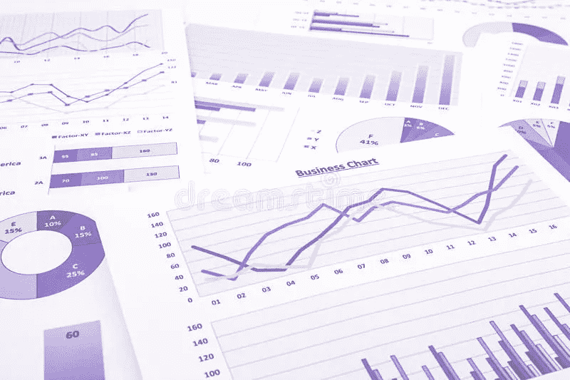
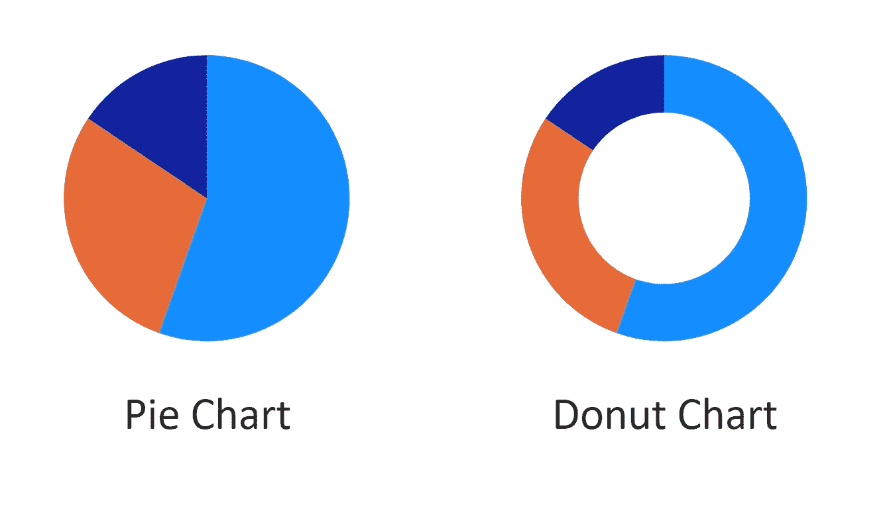
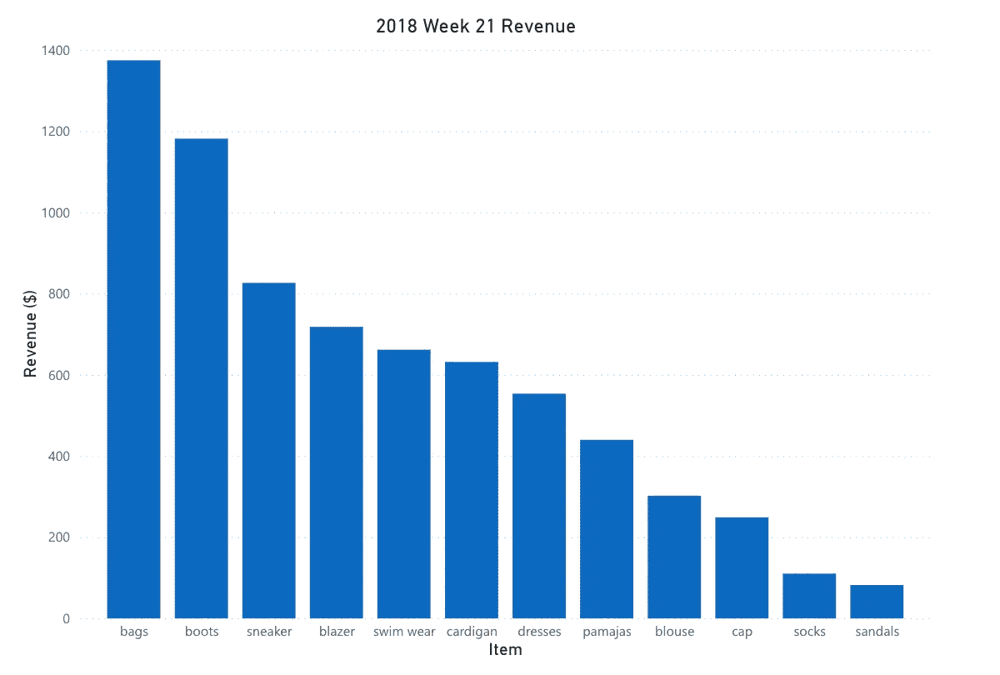
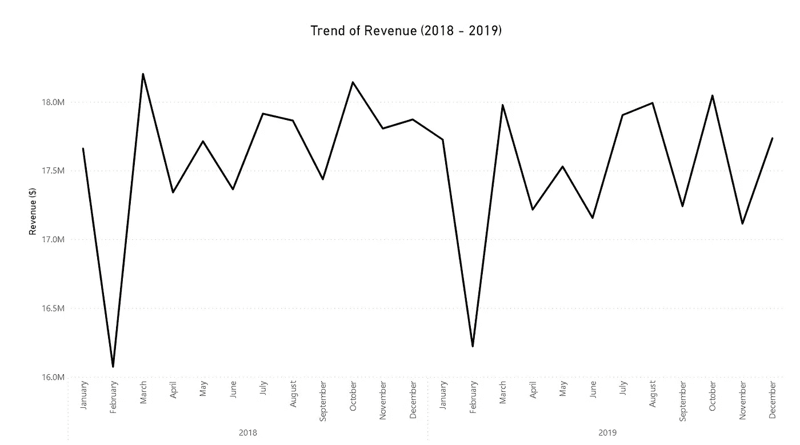
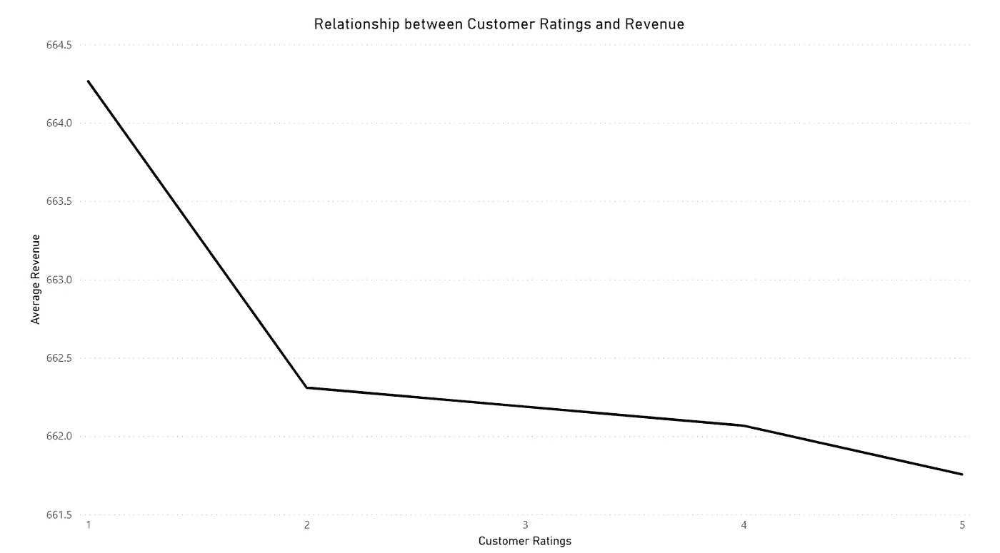
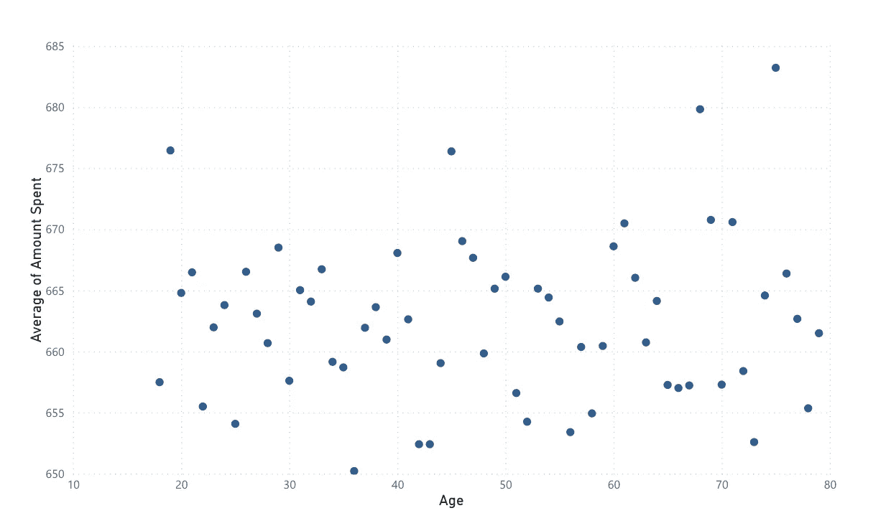

# 为组织可视化数据，第一部分:基本概念

> 原文：<https://medium.com/geekculture/visualising-data-for-organisations-279e68a3204?source=collection_archive---------52----------------------->

Various data visualisations on a piece of paper | Image from [Vinstock](https://www.dreamstime.com/vinnstock_info) via [Dreamstime](https://www.dreamstime.com/stock-photo-purple-business-charts-graphs-data-report-summarizing-back-marketing-research-management-budget-planning-project-image42773070#res26615551)

数据已经成为一种非常普通的商品，每个组织都以某种形式(原始的或经过处理的)创建或使用数据。由于其共性，分析这些数据变得越来越重要。几乎每个组织都需要数据分析来帮助理解和关注组织业务流程和活动的某些方面*。*它还指导组织做出明智的决策，以提高收入和生产率。分享这种分析的最好方式是通过观想。一张图片可以讲述一百万个故事，数据可视化也不例外。为了讲述正确的故事，使用正确的视觉效果非常重要。

**我们如何可视化数据？**

在我们深入研究如何为我们的数据选择合适的视觉效果之前，让我们看看如何可视化我们的数据，以及如何选择合适的工具来可视化我们的数据。

可以使用许多工具来可视化数据，这些工具中的大多数分为以下几组:

*   电子表格应用程序(例如，Excel、Numbers)
*   商业智能应用程序(例如 Tableau、Power BI)
*   编程语言(例如，Python、R、JavaScript)
*   图形编辑应用程序(例如 Adobe Illustrator)

选择合适的工具来可视化您的数据在很大程度上还取决于:

*   你的数据的来源和数量；数据从哪里来，有多大。
*   可视化的目标；一些组织更喜欢某些工具，因为它们与他们正在使用的其他工具非常匹配。
*   你想要如何呈现观想；有些工具比其他工具更适合某些类型的可视化风格。

现在，在我们继续之前，让我给你介绍一下可视化数据中使用的最基本的视觉效果:**图**和**图**。

***图表 vs 图形***

尽管它们可以互换使用，但图表和图形并不是一回事。

图表是没有数轴的视觉效果(例如，饼图、圆环图)。

Circle charts with the same proportions | Image by Author

图表是至少有一个数轴的视觉效果(如条形图)

Bar graph of sales for a week | Image by Author

***什么时候用什么目测***

现在让我们来看看一些最常见的图形和图表，以及何时使用它们。

**条形图**

它有助于将各种类别与一个数字变量进行比较。这个图表可以用来回答这个问题，2018 年一家超市的各种产品的销售额是多少？

使用条形图的一些提示:

*   最佳实践是从数轴上的零开始绘制条形图，以准确显示数据的影响。
*   除了基于周期的类别(年、月、时间等)或视觉效果旨在显示一段时间内的关系之外，最好的做法是从最短的条形到最长的条形对条形进行分组，反之亦然；然后你**必须**按时间顺序排列小节。
*   对于按字母顺序排列的条形图，建议给最大和最小的条形图以不同的颜色，以使它们更容易被注意到。
*   当比较包含多个部分的类别时，将类别中的部分分组并绘制它们有时会比使用堆积条形图更容易阅读和理解。

**圆形图表(饼形&圆环图)**

它们有助于比较单个类别的各个部分。这张图表可以用来回答这个问题；袜子的利润有百分之几是通过卖黑袜子获得的？

使用圆形图的一些提示:

*   理想情况下，使用圆形图来比较 2-3 个部分，因为有时在不显示其值的情况下，从视觉上很难看出 4 个以上部分之间的差异。
*   当涉及到很多部分时，它可以帮助指出组成类别的大块的部分。

**线图**

它有助于显示数值变量随时间变化的趋势。它也可以用来显示两个数值变量之间的关系。这个图表可以用来回答问题；2018-2019 年获得的营收趋势如何？顾客在产品上花费的金额和他们给出的评价有什么关系？

Line chart showing a trend over time | Image by Author

Line chart showing a trend between two variables | Image by Author

使用折线图的一些提示:

*   当有大量数据点时，使用它更准确，否则条形图或散点图更适合，这取决于使用案例。

**散点图**

它有助于显示两个数值变量之间的关系和趋势。这个图表可以用来回答这个问题:顾客的年龄和在一家店消费的金额有什么关系？

Scatter graph showing the relationship between numerical variables | Image by Author

使用散点图的一些提示:

*   它更适合于显示数值变量之间的关系和发现数据中的异常值。

## 结论

数据具有影响组织绩效的力量，因此必须恰当地表现出来。

> 非常重要的是要注意，有时视觉上令人愉快的东西可能并不准确地代表数据。

虽然其他因素也有助于数据的正确可视化，但第一步是选择正确的视觉效果来更准确地传达数据中的事实。