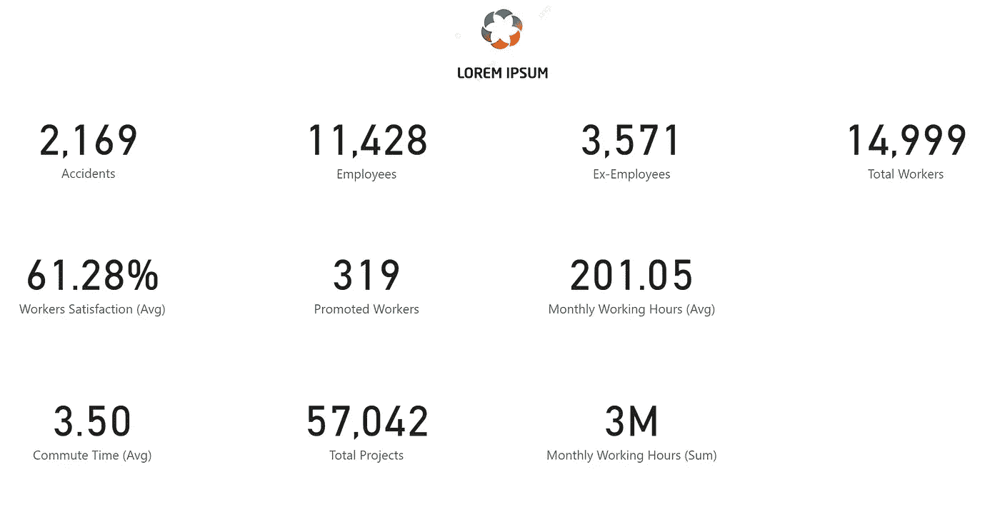
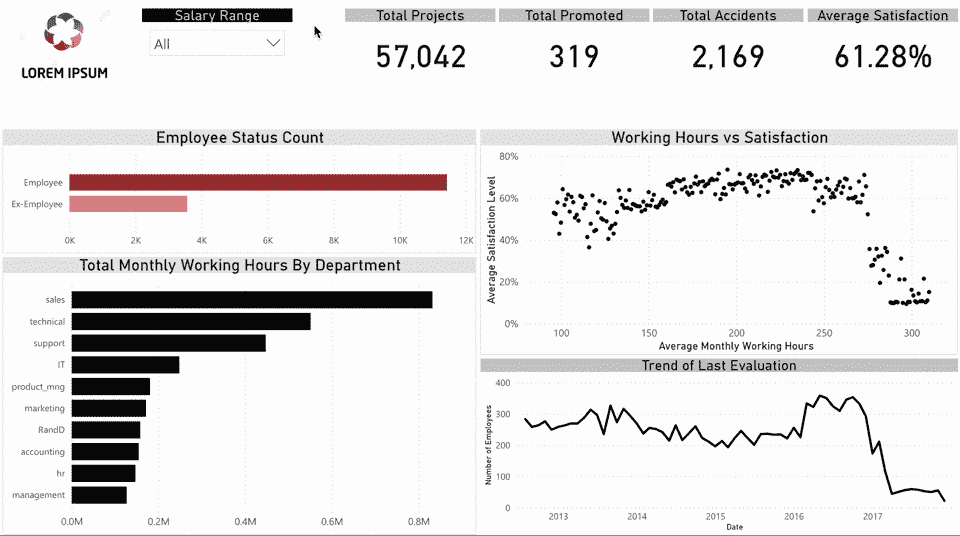
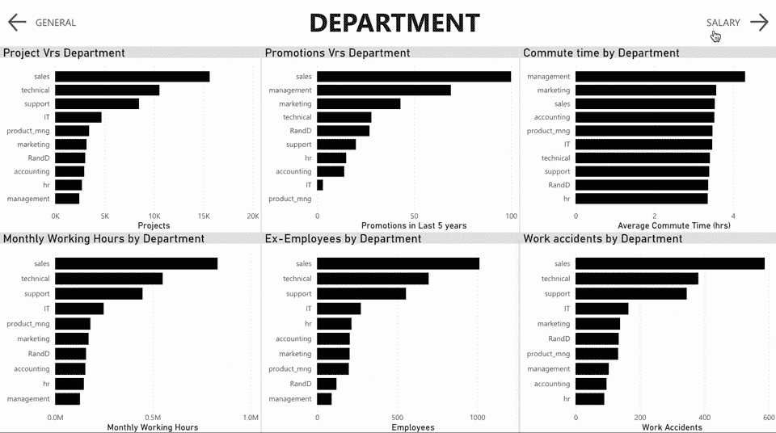

# 组织的可视化数据，第二部分:仪表板

> 原文：<https://medium.com/geekculture/visualising-data-for-organisations-5b6b0dcdcfef?source=collection_archive---------19----------------------->

Example of a data dashboard | Photo by [Luke Chesser](https://unsplash.com/@lukechesser?utm_source=medium&utm_medium=referral) on [Unsplash](https://unsplash.com?utm_source=medium&utm_medium=referral)

每个企业都受到不止一个因素的影响:各种外部和内部因素。对这些因素的性能的测量可以使企业主洞察到应该关注哪些因素来增加他们的企业利润和生产力。为此，可以利用仪表板。仪表板是一个画布，包含旨在让用户了解特定目标和/或绩效指标的数据。

Car Dashboard | Photo by [Nick Fewings](https://unsplash.com/@jannerboy62?utm_source=medium&utm_medium=referral) on [Unsplash](https://unsplash.com?utm_source=medium&utm_medium=referral)

在数据可视化中，仪表板由各种视觉效果组成，这些视觉效果讲述各个故事，但组合在一起可以让用户了解特定的目标。

仪表板对于每个企业来说都是一个重要且必要的工具，因为它们可以让决策者了解影响其业务的因素，同时还能够向需要的查看者提供一般信息。

不同情况下有不同类型的仪表板:

*   **静态仪表板**仅显示查看者需要关注的关键特性和指标。

Static Dashboard | Image by Author

*   **交互式仪表盘**允许观众与仪表盘上的视觉效果互动，了解各种元素或类别如何相互影响。

Interactive Dashboard | gif from Author

*   **导航仪表板**允许查看者在仪表板的不同页面或部分中导航。这种仪表板通常有页面，根据数据的不同部分讲述不同的故事。

Navigational Dashboard | gif from Author

不同类型的仪表板可以根据您需要显示的内容进行组合。例如，导航仪表板可以由包含交互式和静态仪表板元素的页面组成。

既然我们已经知道了可以为我们的业务构建的仪表板类型，下一步就是要知道如何组合视觉效果来构建这些仪表板。根据我的经验，这里有一些建议，可以确保你建立一个清晰的仪表板，讲述正确的故事:

## 1.了解客户的需求。

在你开始创建视觉效果之前，了解客户需要仪表板讲述的故事是很重要的。这要么需要您执行一些探索性的数据分析，要么从分析中收集见解，并用合适的视觉效果显示出来。我们还需要理解数据可视化的基本概念，以帮助我们将客户的需求转化为正确的视觉效果。

## 2.选择合适的视觉效果，并恰当地安排它们。

仪表板由不同的视觉效果组成，因此每个视觉效果的位置和大小是需要注意的重要因素。

在大多数地区，仪表板通常像文本一样阅读:从左到右，从上到下。最重要的视觉效果可以放在左上角，以吸引更多的注意力。

视觉效果的大小也会影响我们对数据的理解。具有不同大小的多个圆形图表的仪表板可能会使查看者将较大的圆形解释为比较小的圆形承载更多的价值。也不可能以较小的尺寸展示一些视觉效果，因为在那些尺寸下它们变得更难(如果不是不可能的话)解释。

试着在创建仪表板之前先画出草图，以避免过多的视觉效果。一个混乱的仪表板会让人很难阅读它上面显示的信息，这违背了仪表板的主要目的。

无论您决定创建哪种类型的仪表板，确保所使用的视觉效果都不代表相同的数据是很重要的。始终选择准确解释数据的视觉效果，而不是使用多个视觉效果来解释同一个数据故事。

## 3.正确标记您的视觉效果

在我们的仪表板上添加了必要的视觉效果后，我们必须给它们贴上适当的标签，以便更容易理解它们代表了什么。每个视频至少应该有一个清晰的标题，告诉观众这个视频代表了什么。如果标题不足以帮助观看者理解，视觉中使用的任何轴也可以被命名。

## 4.颜色和调色板。

在数据可视化中，颜色不仅用于美化仪表板，还用于表示数据类别，使查看者更容易注意到它们。我们可以用不同的颜色突出显示部分数据，比如条形图中的最高和最低条，以引起人们的注意。

有时，我们的仪表板可能有很多分类数据，对每个类别使用不同的颜色会使我们的仪表板更难阅读。为了避免这种情况，我们可以使用调色板，这是一组不同的颜色组合成的仪表板。调色板可以减少仪表板上对比色的数量。为了避免让我们的仪表板看起来像毫无意义的彩虹，我们也可以将不同的类别放在不同的页面上，并保持它们的颜色。

在构建仪表板时，简单性是关键，因为我们的目标是让我们的查看者即使在导航和与仪表板的元素交互之后，也能一眼看到他们需要的信息。因此，能够构建一个既美观又易于理解的仪表板是很重要的。