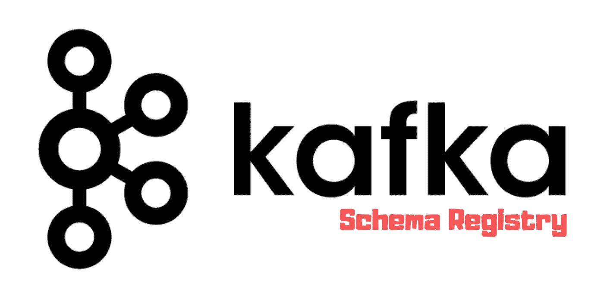
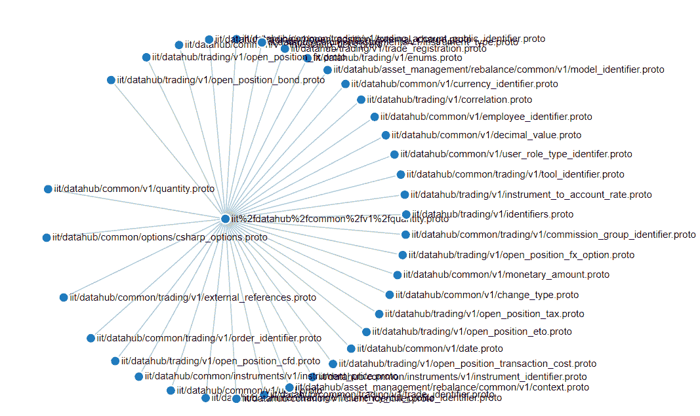

# 可视化模式注册表

> 原文：<https://medium.com/geekculture/visualising-schema-registry-9cbafe89e56?source=collection_archive---------34----------------------->



现在，如果您想在 Kafka 集群中使用模式，Schema Registry 是一个很好的工具。它跟踪不同的版本，允许模式之间的兼容性，支持不同的格式类型(json、avro、protobuf 等等)。

如果在这一点上，所有这些对你来说都是一个大问号，那么在继续之前，查看一下汇合文档[第](https://docs.confluent.io/platform/current/schema-registry/index.html)页。

那么，为什么还要可视化模式注册呢？好问题。该项目结合了一些技术乐趣和在 Schema Registry 中可视化依赖关系的需求。在当前的项目中，我们已经决定使用 [Protobuf](https://developers.google.com/protocol-buffers) 作为模式提供者的选择。我们创建了一个“公共”Protobuf 库，描述了与业务词汇相匹配的基本和复杂类型。有了这些类型，每个团队都可以在他们的领域内根据需要构建更复杂的模式。开始的时候一切都很好，直到它变成一只有更多依赖的野兽。


Where does it start and end right ?

“那又怎么样？”我听到你在想。现在到了棘手的部分，一个开发人员走到您的办公桌前(或邮件中),说他/她想删除一个模式，但是存在依赖关系，现在卡住了。由你来纠缠这个烂摊子。

# 你好图表

上述问题可以作为一个[图形](https://en.wikipedia.org/wiki/Graph_(abstract_data_type)#:~:text=In%20computer%20science%2C%20a%20graph,of%20graph%20theory%20within%20mathematics.)问题来解决。Schema Registry 中的每个条目都可以看作一个节点，它们之间的关系可以看作一条边。

为了可视化这种情况，我选择使用 [D3.js](https://d3js.org/) ，它有一些很好的方式来可视化你的图表。

太好了，我们有问题，我们有解决问题的方法，让我们建立我们的 API。

# Python API

我决定用 python 来构建解决方案，因为我可以利用 [NetworkX](https://networkx.org/) 来解决我的绘图问题。API 本身是用 [FastAPI](https://fastapi.tiangolo.com/) 编写的，这是一个用于编写 REST API 的现代框架。

我们将看到两个端点。第一个端点将创建图形并以 JSON 格式返回结构。

第二个端点仅用于演示目的，但允许您在本地 webbrowser 中可视化图形，而无需编写任何前端代码。

```
@app.post("/viz_topic", response_class=JSONResponse)
async def viz_topic(viz_subject_name: VizTopicSubjectInput):      result = viz_sr_topic(subject_name=viz_subject_name, sr_base_url=schema_registry_base_url)    
return result @app.get("/show/{graph_id}", response_class=HTMLResponse)
return templates.TemplateResponse("graphd3.html", {"request": request, "graph_id": graph_id})
```

好了，我们有了终点，让我们开始解决实际问题。

## Python 与模式注册中心的交互

虽然 Schema Registry 有 java 和 scala 的本地库，但它没有 python 的本地库。这意味着我们完全停留在使用 API 调用模式注册表上。为了尽可能保持简洁，我构建了一个类，它公开了我需要的端点。

```
class SchemaRegistry():
    def __init__(self, base_url):
        self.base_url = base_url
        self.protocol = urlparse(self.base_url).schemedef get_protocol(self):
        """
        Returns the protocol of a given URL
        :return: str: Protocol
        """
        return self.protocoldef get_subject_versions_url(self, subject_name):
        """
        Creates the URL to retrieve the subject versions
        :param subject_name: str: Name of the subject
        :return: str
        """
        return self.base_url + "/subjects/{}/versions/".format(subject_name)
...
```

## 已经建立了图表

对吗？！好了，现在我们已经有了一些辅助组件，我们可以开始构建我们的图表了。这个想法是，开发人员提供一个主题，我们希望显示该主题的所有依赖关系。首先，我们初始化一个 NetworkX 图形组件。虽然 NetworkX 支持[不同类型的](https://networkx.org/documentation/stable/auto_examples/index.html)图，但我还是选择了标准类型。

```
def viz_sr_topic(subject_name, sr_base_url):
    """
    This function will, for a given subject, query schema registry and generate a networkx graph from it.
    :param subject_name: str: Name of the subject as in SR
    :param sr_base_url: str: Full URL of SR
    :return: none
    """
    G = nx.Graph()
    versions = None
    subject = subject_name.subjectname
    persist_uuid = uuid.uuid4() if subject_name.persist else Nonetry:
        if len(subject) == 0:
            raise MissingSubjectNameException()
        else:
            G.add_node(subject)
```

基本节点将被设置为我们指定的主题，因此接下来我们将检索依赖项。为了实现这一目标，我们必须做几件事:

*   检索给定主题的所有版本
*   对于所有版本，获取模式引用 id
*   如果我们已经找到一个有效的模式引用 id，解析附加到它的模式并添加名称作为引用。边缘将是参考和主题之间的链接

```
for version in json.loads(versions.text):
 version_response = do_url_request(
  request_url=sr.get_references_url(subject_name=subject, version_id=version),
  sr_protocol=sr.get_protocol())
 if version_response.status_code == 200:
  for refId in json.loads(version_response.text):
   schema_response = do_url_request(request_url=sr.get_schema_by_id_url(schema_id=refId),
            sr_protocol=sr.get_protocol())
   if schema_response.status_code == 200:
    result = json.loads(schema_response.text)
    for ref in result["references"]:
     G.add_edge(subject, ref["name"])
     G.add_node(ref["name"])
```

## 最后一步:想象它

如前所述，这只是为了演示的目的而添加的，我坚信这种类型的工作应该在一个适当的前端框架中完成。

您可能已经注意到，我们允许用户向 API 提供一个标志来持久化解决方案，这在我们的例子中意味着在后端保存 json 对象。

当所有的处理完成后，我们最终返回结果，这是一个包含所有边和依赖节点的 JSON 结构。如果设置了 persist 标志，我们还将输出一个 ID 作为有效负载的一部分，并将这个 ID 作为文件名保存在 json 对象中。

```
data = json_graph.node_link_data(G)
if persist_uuid is None:
 return {"data": data, "uuid": ""}
else:
 with open('static/' + str(persist_uuid) + '.json', 'w') as f:
  json.dump(data, f, indent=4)return {"data": data, "uuid": persist_uuid}
```

所以现在是时候使用我们的第二个端点了。进入你的浏览器，输入以下网址“http://localhost/show/

FastAPI 允许您使用“TemplateResponse”，它可以返回一个 html 页面。在我们的例子中，这意味着我们首先需要创建一个包含 D3.js 库的 html 页面来可视化数据。

我们使用 d3.json 函数从保存在第一个 API 调用中的文件中加载数据。

```
d3.json("{{ url_for('static',path='.') }}/{{ graph_id }}.json", function(error, graph)
```

当调用结束时，浏览器将呈现您的输出。最终产品是一个动态图形，您可以在其中拖动不同的节点。



Static screenshot of d3.js visualization

# HTTPS 启用的模式注册表

在大多数情况下，您的模式注册中心将启用 HTTPS(如果没有，请确保它是启用的😱).因为我们使用请求包来调用模式注册中心端点，所以可以将证书指定为调用的一部分。

在函数“do_url_request”中，我们将检查 url 是否使用 HTTPS，如果是，我们将检查环境变量“CERT_FILE_PATH”是否包含证书。如果您在没有这个环境变量的情况下进行 HTTPS 调用，我们将引发一个自定义错误，因为我们知道这将永远不会导致成功的调用。

```
def do_url_request(request_url, sr_protocol):
    """
    Helper function to handle requests for Schema registry. If https is used, a valid cerificate must be present
    :param request_url: str: URL endpoint you are trying to reach
    :param sr_protocol: str: Protocol (http or https)
    :return: requests.Response
    """
    if sr_protocol == "http":
        return requests.get(url=request_url, headers={'content-type': 'application/json'})
    else:
        if "CERT_FILE_PATH" in os.environ:
            return requests.get(url=request_url, headers={'content-type': 'application/json'},verify=os.getenv("CERT_FILE_PATH"))
        else:
            raise MissingCertFilePath()
```

# 想在 Docker 上运行这个吗？

我把它作为解决方案的一部分。如果您想将整个设置作为 Docker 解决方案运行，您可以。从项目的根目录，您可以运行以下命令

```
docker build -t schema_registry_visualizer -f Docker/Dockerfile .
```

# 结论

这个项目是一个商业问题的一部分，但结合了一些技术方面，使它对开发者来说也很有趣。像往常一样，整个解决方案可以在我的 [github 页面](https://github.com/Ycallaer/schema_registry_viz)上找到，文档在 README.md 和代码中。希望你喜欢这个小故事，并在这个过程中学到了一些东西。