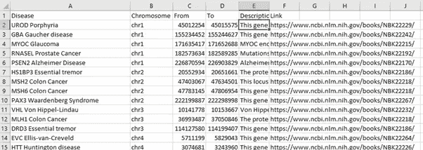
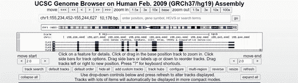
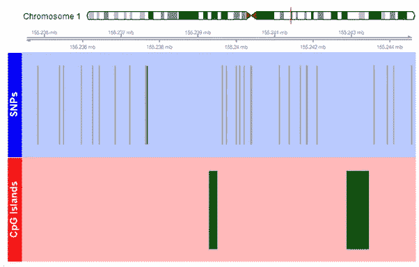

# 可视化疾病和人类基因组的交叉

> 原文：<https://medium.com/geekculture/visualising-the-intersection-of-disease-and-the-human-genome-a11f96f85ddb?source=collection_archive---------26----------------------->

**亲自尝试一下**
本文是一个交互式网络应用的综述，它允许你可视化不同疾病的 CpG 岛和 SnP 位点。你可以点击这里的应用[来测试你选择的疾病。](https://cloud.wdss.io/genome)

# 介绍

始于 90 年代初，人类基因组计划(HGP)是一项国际研究合作，试图对智人的所有基因进行测序和绘图。HGP 于 2003 年完成，为药物发现的重大发展铺平了道路。

2000 年，加州大学圣克鲁斯分校(UCSC)和 HGP 的合作者开始致力于创建一个免费的公共访问人类基因组组件。直到今天，它仍然是开放的，并且有许多特征可以用来将人类基因组的信息与疾病联系起来。

发现单核苷酸多态性(SnPs)和 CpG 岛通常位于疾病周围。SnP 是人与人之间最常见的遗传变异。它们平均每 1000 个核苷酸出现一次(总共大约 400 万个 SNP)。例如，SnP 可以在某段 DNA 中用核苷酸胸腺嘧啶(T)取代核苷酸胞嘧啶。CpG 岛很重要，因为它们代表了基因组中的一些区域，由于某种原因，这些区域在进化过程中受到保护，免受甲基化突变的影响(这往往会将 CpG 对中的 G 变成 A)。通常，他们指出基因间 DNA 的一个重要片段的存在，例如在转录因子结合的基因启动子区域中发现的片段。在癌症中，启动子 CpG 岛的超甲基化导致基因表达缺失的频率是突变的 10 倍。

# 构建一个可视化

国家生物技术信息中心(NCBI)包含许多疾病在人类基因组中的位置信息。这些位置被整理到一个电子表格中，还有一个相关疾病更多信息的链接。

根据从 NCBI 获得的疾病位置，使用 UCSC 基因组浏览器上的 API，使用 SnP 和 CpG 岛轨迹，收集关于 SnP 位点和 CpG 岛的信息。

GViz 是一个 R 的生物导体包，用于显示基因组位置，产生 SnP 位点和 CpG 岛的可视化图形。

SnP 轨迹上的线显示了具有至少 1%的次要等位基因频率的位点，并被定位到参考基因组装配中的单个位置。CpG 岛上突出显示的区域是 GC 含量高于 50%且超过 200bp 的区域。染色体上的红线突出显示疾病所在的区域，轨道上能够看到的是突出显示区域内的数据。

面临的一个重大挑战是，由于制作基因组图谱需要大量数据，一旦选择了一种疾病，API 就需要花费大量时间来收集数据。这意味着它不太理想，因为用户不想等待很长一段时间。解决这个问题的方法是在电子表格中预先生成每种疾病的图表，这意味着图表可以即时显示。

未来对该程序的改进可能包括但不限于缓存收集的数据，而不是预先生成绘图。这将与另一项被考虑的改进一起很好地工作，即疾病电子表格与 NCBI 数据库连接，该数据库包含每一种已知的疾病，并有可能识别更多的疾病。这将意味着该程序可以随时更新进入数据库的新疾病，而不需要人工更新。

*本文最初由* [约书亚·马吉拉](https://www.linkedin.com/in/joshua-magiera-55b362174/) *撰写。由* [*多米尼卡·daraż*](https://www.linkedin.com/in/dominika-dara%C5%BC-b13335162/)*提供的图片替代文本。*

*文章由-NC-SA 4.0* 授权 [*CC*](https://creativecommons.org/licenses/by-nc-sa/4.0/)