# 仅可视化！不够。如何在 Python 中进行二元统计检验

> 原文：<https://medium.com/geekculture/visualization-only-not-enough-how-to-carry-out-bivariate-statistical-test-in-python-fc8238b896c?source=collection_archive---------9----------------------->

## 在将预测值包含在模型中之前，以统计方式测试双变量的预测值特征


Photo by [Battlecreek Coffee Roasters](https://unsplash.com/@battlecreekcoffeeroasters?utm_source=medium&utm_medium=referral) on [Unsplash](https://unsplash.com?utm_source=medium&utm_medium=referral)

你知道吗？使用箱线图、散点图和其他可视化工具很棒，但不足以确认两个变量(目标要素(Y)和每个预测要素(X))之间的关系。

我知道你可能会问，为什么？

嗯，因为统计学家可能会说，你在样本中看到的视觉模式并不是你的样本所代表的人群中真正获得的。具体来说，她/他可能会说——“你所看到的实际上是偶然发生的，所以很有可能，当从同一人群中分别抽取相似特征的样本时，你可能不会再看到这种可视化所表明的关系”

**那么，在这种情况下，克服统计或统计人员造成的混乱的最佳做法是什么？**

> ***黄金标准****——*使用数据可视化工具(图表/双向表)将两个特征之间可能存在的关系或关联可视化，然后进行统计测试，从统计上确认视觉模式所暗示的是真是假

在本文中，我们将陈述在确认目标特征(Y)和每个预测变量(X)之间存在关系/关联时，使用不同双变量统计检验的适当标准；并演示如何用 python 实现它。

本文将涵盖以下几个部分:

> ***1。二元推理分析概念和框架的快速概述***
> 
> ***2。*数据源概述**
> 
> ***3。应用不同推断二元统计检验的规则***
> 
> ***4。如何在 Python*** 中进行二元推理分析

# **1。二元推理分析概念和框架的快速概述**

双变量分析是对两个变量的经验分析，以确定它们之间是否存在关系或关联。它有两个部分，描述部分和推理部分。描述性部分涉及使用散点图、箱线图和数字列表(交叉列表等)等图形的关系可视化。推理部分涉及统计方法在测试和确定关系中的应用。下图突出显示了组件的分层系统。

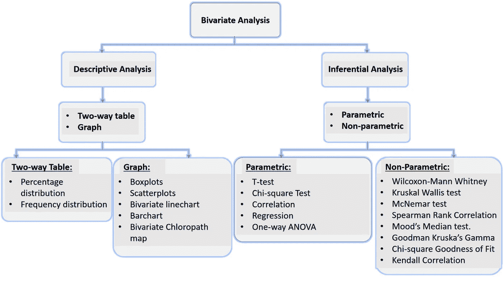

**Conceptual framework of Bivariate Analysis. Image by Akiode Ayobami**

在这项研究中，我们将只关注双变量框架的推理部分。描述性成分的广泛描述可以在我的相关早期文章— [**可视化中找到，不足以暗示关系；用统计测试**确认一下](/analytics-vidhya/visualization-not-enough-to-assess-relationship-between-2-variables-combine-with-statistical-test-2a32a2c99153)

## **1.1。二元推理分析**

这是统计方法在确定两个变量/特征之间是否存在关系、关联或差异方面的应用。有两种类型，即参数型和非参数型。

**1.1.1 参数双变量分析:**当两个变量所在总体的分布为正态分布或钟形时使用。尽管根据中心极限定理，当样本的样本量至少为 30 或更多时，仍然可以使用参数方法。但是，有一些统计方法可以用来检验正态性，例如——夏皮罗-维尔克检验、达戈斯蒂诺的 k 平方检验、安德森-达令检验、利列福斯检验、雅尔克-贝塔检验、科尔莫戈罗夫-斯米尔诺夫检验和卡方检验。

**1.1.2 非参数双变量分析:**当两个变量所来自的总体的分布未知或不呈正态分布时使用。尽管它也主要被考虑用于非参数的小样本数据集。有一些统计测试属于非参数规则。这个统计测试可以在上面的双变量分析框架图中看到。就像参数统计检验一样，在任何情况下使用的非参数统计检验取决于变量/特征的类型。

# **2。数据源概述**

本文中使用的数据是 2013 年尼日利亚人口和健康调查(DHS)收集的免费二手数据，称为 NDHS 2013。DHS 是在发展中国家进行的一项具有全国代表性的调查。在尼日利亚，这项调查通常每 5 年进行一次；覆盖尼日利亚所有州，包括首都。本次分析的受访者数据是奥贡州的数据。

如需从 DHS 计划获取任何国家级的免费数据，请访问 [**DHS 计划**](https://dhsprogram.com/data/dataset_admin/login_main.cfm?CFID=6656492&CFTOKEN=ce6ca5b288d60002-2AFF6515-C723-702A-D46EDCBB32A8BDBD) ，注册并申请。

# **3。应用不同推断二元统计检验的规则**

选择与双变量可视化相匹配的适当的统计检验取决于两个因素:样本的参数状态和涉及的变量类型。

下表简要说明了每个二元推断统计量必须满足的两个参数状态和变量类型标准

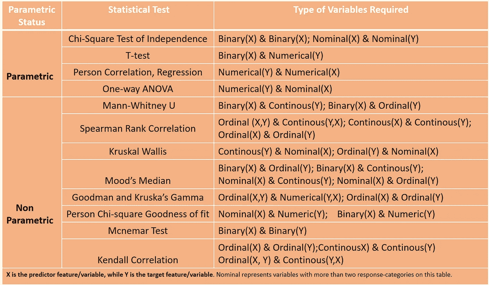

**Table 3.1: Statistical test Parametric and type of variable compatibility Table. Image by Akiode Ayobami**

# **4。如何在 Python 中进行二元推理分析**

在本节中，我们将展示如何在 python 中执行双变量分析，首先是参数方法，然后是非参数方法。

首先，我们将通过 Jupyter 笔记本将数据导入并加载到 python 中

```
import pandas as pd
path=r'B:\..\..\Ogun_NDHS_2013.dta'
Ogun_ndhs2013=pd.read_stata(path)
```


尽管该数据框中有 4617 个特征(变量)和 630 行(观测值)，但我们在分析中只需要 9 行。因此，我们将只在数据帧中保留 9。

```
Variables_needed=['v313','v025', 'v012', 'v013', 'v203', 'v205', 'v218', 'v106', 'v190'] # These are the only variables neededOgun_ndhs2013=Ogun_ndhs2013[Variables_needed]
Ogun_ndhs2013.shape
Ogun_ndhs2013.head(9)
```

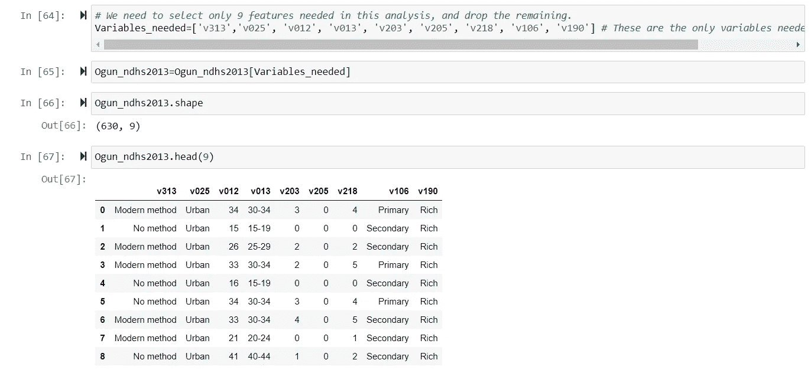

## 4.1.python 中的参数推断双变量分析

**4.1.1 独立性卡方检验:**这是一种双变量参数方法，用于检验标称目标特征(自变量)和预测特征(因变量)之间的关联。偶发事件的单元格不能少于 5。如果存在这种情况(单元格值≤5)，则应使用费希尔精确检验。

在我们分析的这个实例中，我们的名义目标特征将是——当前避孕方法(v313 ),而我们的名义预测特征将是——居住地类型(v025)

我们将导入所有需要的库和模块

```
import numpy as np
from scipy.stats import chi2_contingency
from scipy.stats import chi2
```

我们将运行预测器和目标特征的频率分布，并将 v313 从 4 响应类别重新编码为 3 响应类别特征。

```
Ogun_ndhs2013 ['v025'].value_counts()
Ogun_ndhs2013 ['v313'].value_counts()#We will v313 recode into: No method, Modern Method, and Others
v313_recode =  { "v313": 
                             {"No method": 'No method',  
                              "Modern method": 'Modern method',  
                              "Traditional method": 'Others',  
                              "Folkloric method": 'Others'}
             }Ogun_ndhs2013.replace(v313_recode, inplace=True)
```

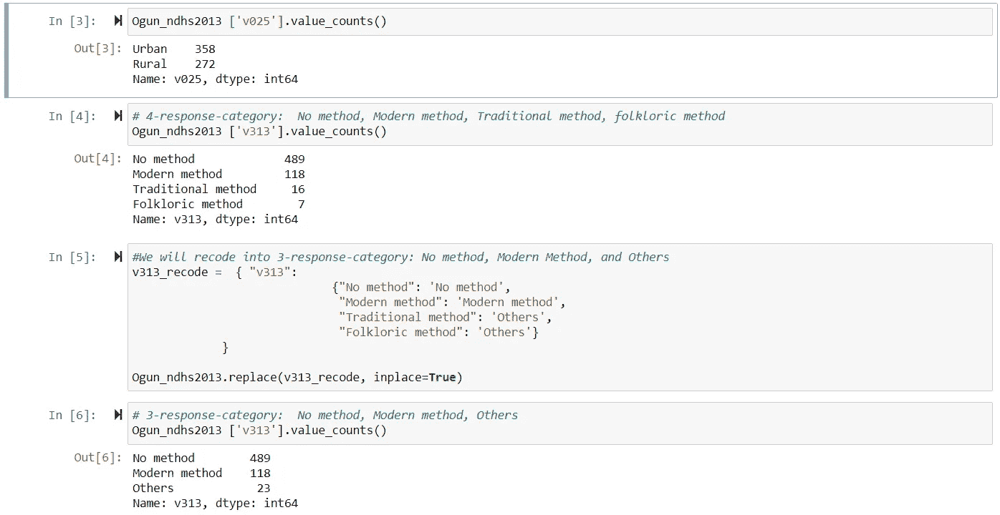

制作预测要素(v025)和目标要素(v313)的交叉表(双向表),并计算卡方统计及其相关的 p 值

```
#Develop crosstabulation needed for chi-square statistic and p_value computation
tab0=pd.crosstab(index=Ogun_ndhs2013.v313, columns=Ogun_ndhs2013.v025)
print(tab0)#compute the chis-quare statistic and p_value
chi2, p, dof, expected=chi2_contingency(tab0.values)
print('Chi-square statistic is %0.3f,  p_value is %0.3f' %(chi2,p))
```

卡方统计值为 0.001，p 值=0.9。由于 p _ value > 0.05 这两个特征之间没有联系。

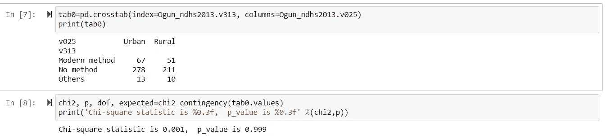

**4.1.2 均值差异的 T-检验:**这是一种双变量参数方法，用于检验在二元预测特征(自变量)的两个响应类别之间，数值目标特征(因变量)的均值是否存在显著差异。

T 检验主要有三种类型，即:
a .单样本 T 检验
b .两个独立样本 T 检验
c .配对样本 T 检验

在这种情况下，数字目标要素将是-年龄(v012)，而二元预测要素将是-居住地类型(v025)

**均值差异的 4.1.2.1 单样本 T 检验**:这是一种双变量参数方法，用于检验数字目标特征的均值和假设值之间是否存在显著差异。假设值通常代表总体值或已知值。例如，如果尼日利亚全国人口普查显示，尼日利亚人的平均年龄是 30 岁，这可能被认为是假设值。您可以从尼日利亚的一个州收集数据样本，并使用单样本 t 检验来查看该州人口的平均年龄是否与全国值(30)有显著差异。

对于我们的分析，使用我们的奥贡 2013 年 NDHS 数据，我们将奥贡州育龄妇女的总体平均年龄作为假设值。通过单样本 t 检验，我们将检验奥贡农村地区育龄妇女的平均年龄是否与该州妇女的假设总体平均年龄有显著差异。

在大多数情况下，假设值是预先已知的。事实上，它可能已经在文献或实践社区中被记录下来。

导入所需的库和数据集

```
#import Ogun NDHS 2013 dataset into pandas
import pandas as pd
path=r'B:\..\..\Ogun_NDHS_2013.dta'
Ogun_ndhs2013=pd.read_stata(path)Variables_needed=['v313','v025', 'v012', 'v013', 'v203', 'v205', 'v218', 'v106', 'v190'] # These are the only variables neededOgun_ndhs2013=Ogun_ndhs2013[Variables_needed]import numpy as np
from scipy import stats
from scipy.stats import ttest_1samp
```

仅计算奥贡州和奥贡州农村地区育龄妇女的平均年龄。

```
#Overall Mean age of women in Ogun state Ogun_state_mean_age=Ogun_ndhs2013['v012']
Ogun_state_mean_age.mean(), Ogun_state_mean_age.std() #Mean age of women in rural areas of Ogun stateage_rural=Ogun_ndhs2013[(Ogun_ndhs2013['v012']>=15) & (Ogun_ndhs2013['v025']== "Rural")]
age_rural=age_rural['v012']
age_rural.mean(), age_rural.std()
```

计算单样本 t 检验统计量及其相关的 p 值

```
stats.ttest_1samp(rural_age,31)
```

单样本 t 检验统计值为 2.06，p_value=0.03。自 p _ value【4.1.2.2 两个独立样本均值差异的 t 检验:这是一种双变量参数方法，用于测试独立的二元预测特征的两个响应类别之间的数值目标特征(因变量)的均值是否存在显著差异。

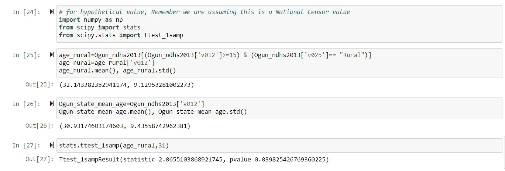

注意，之所以称之为独立样本，是因为这两种反应类型的观察结果应该是互斥的。例如，居住地变量类型的响应类别是相互排斥的，因为回答者可以是农村或城市，但不能同时是农村和城市。

在这种情况下，数字目标要素将是-年龄(v012)，而二元预测要素将是-居住地类型(v025)

我们将采用奥贡州农村和城市地区育龄妇女的平均年龄。使用两个独立样本的 t 检验，我们将检验奥贡农村地区和城市地区育龄妇女的平均年龄是否有显著差异。

导入所需的库和数据集

计算奥贡州城乡地区育龄妇女的平均年龄。

```
#import Ogun NDHS 2013 dataset into pandas
import pandas as pd
path=r'B:\..\..\Ogun_NDHS_2013.dta'
Ogun_ndhs2013=pd.read_stata(path)Variables_needed=['v313','v025', 'v012', 'v013', 'v203', 'v205', 'v218', 'v106', 'v190'] # These are the only variables neededOgun_ndhs2013=Ogun_ndhs2013[Variables_needed]import numpy as np
from scipy import stats
from scipy.stats import ttest_ind
```

计算独立样本 t 检验统计量和 p 值

```
#Overall Mean age of women in urban areas  Ogun stateage_urban=Ogun_ndhs2013[(Ogun_ndhs2013['v012']>=15) & (Ogun_ndhs2013['v025']== "Urban")]
age_urban=age_urban['v012']
age_urban.mean(), age_urban.std()#Mean age of women in rural areas of Ogun stateage_rural=Ogun_ndhs2013[(Ogun_ndhs2013['v012']>=15) & (Ogun_ndhs2013['v025']== "Rural")]
age_rural=age_rural['v012']
age_rural.mean(), age_rural.std()
```

农村和城市被调查者平均年龄的两个独立样本 t 检验统计值为 2.82，p_value=0.004。自 p _ value<0.05; there is a significant mean difference between the mean age of rural and urban respondents.

```
stats.ttest_ind(age_rural,age_urban)
```

**4.1.2.3 配对样本 t 检验均值差异检验**:这是一种双变量参数方法，用于检验在两个不同时间从同一组受访者或观察值中收集的同一变量是否存在显著的均值差异。

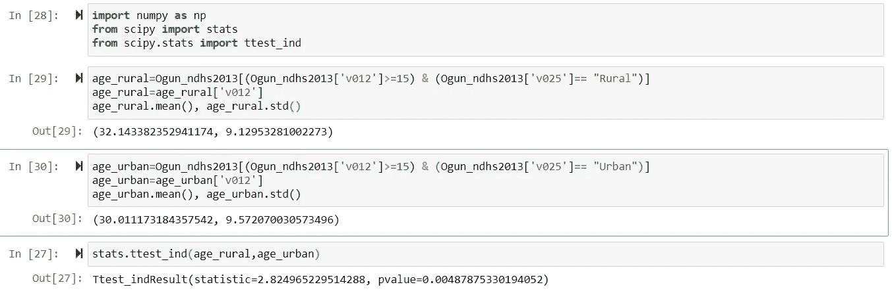

让我们举两个场景例子——

第一种情况:您可能想要测试一组学生在大学第一年的生物化学平均分与他们在第二年的生物化学平均分是否不同。

第二种情况:你可能想测试一组孩子的写作平均分和同一组孩子的阅读平均分是否不同。

我们将在分析中使用两个相似的特征，来反映如何使用配对样本 t 检验。不与受访者生活在一起的受访者女儿的数量(v 203)；以及与受访者生活在一起的受访者女儿的数量(v205)。我们将测试与她一起生活的被调查者的女儿的平均数是否不同于那些不与她一起生活的被调查者的平均数。

导入所需的库和数据集

从奥贡 NDHS 2013 年数据中提取 v205 和 v203 作为系列

```
#import Ogun NDHS 2013 dataset into pandas
import pandas as pd
path=r'B:\..\..\Ogun_NDHS_2013.dta'
Ogun_ndhs2013=pd.read_stata(path)Variables_needed=['v313','v025', 'v012', 'v013', 'v203', 'v205', 'v218', 'v106', 'v190'] # These are the only variables neededOgun_ndhs2013=Ogun_ndhs2013[Variables_needed]import numpy as np
from scipy import stats
from scipy.stats import ttest_rel
```

计算配对样本 t 检验统计量和 p 值

```
daughter_home=Ogun_ndhs2013['v205']
daughter_away=Ogun_ndhs2013['v203']
```

配对样本 t 检验统计值为 9.84，p_value=0.00。自 p_value <0.05; there is a significant mean difference between the mean number of respondents’ daughters that live at home and those that are living away.

```
ttest_rel(daughter_home,daughter_away, nan_policy='omit')# The omit means that ignore pairs with missing values in the #analysis. 
#Other options are: propagate (the default argument). With this, if #there are missing pairs or one part of a pair, the program will #return "nan")
```

**4.1.3 Pearson 相关关系检验:**这是一种双变量参数方法，用于检验两个数值变量、预测值和目标特征之间是否存在线性关系。相关值的范围从-1 到 0(零)到+1。如果相关统计的值在 1 和 0 之间，那么两个变量之间的关系是正的，在上下文中，这意味着当一个变量增加时，另一个也在增加，如果一个变量减少，另一个也在减少。如果相关统计的值是负的，也就是说，如果它的值在 0 和-1 之间，那么这两个变量具有负的关系。从上下文来看，这意味着当一个变量增加时，另一个变量减少，反之亦然。如果相关统计值为零，即如果其值为 0，则两个变量没有关系(线性)。从上下文来看，这意味着一个方面的增加或减少与另一方面的增加或减少无关。

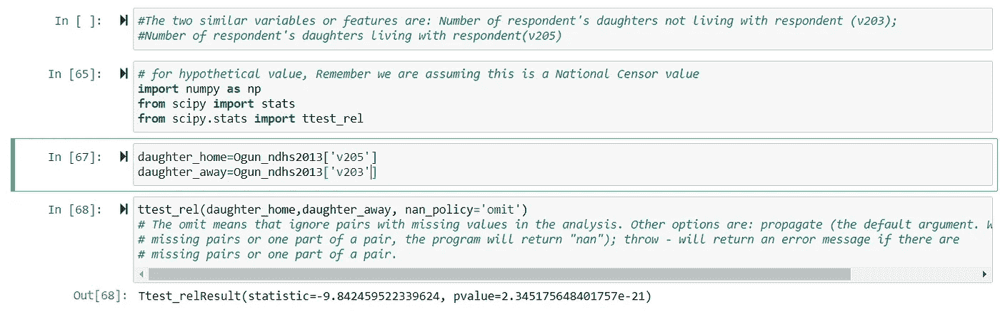

请注意，相关统计量通常被称为相关系数，用 r 表示。让我们给出两个适合使用相关统计量的场景示例。

在这种情况下，数值预测要素将是-年龄(v012)，而数值目标要素将是-活孩子数(v218)

导入所需的库和数据集

从奥贡 NDHS 2013 数据中取出 v012 和 v218 作为系列

```
#import Ogun NDHS 2013 dataset into pandas
import pandas as pd
path=r'B:\..\..\Ogun_NDHS_2013.dta'
Ogun_ndhs2013=pd.read_stata(path)Variables_needed=['v313','v025', 'v012', 'v013', 'v203', 'v205', 'v218', 'v106', 'v190'] # These are the only variables neededOgun_ndhs2013=Ogun_ndhs2013[Variables_needed]import numpy as np
from scipy import stats
from scipy.stats import pearsonr
```

计算皮尔逊相关统计量及其相关的 p 值

```
Age_X=Ogun_ndhs2013['v012']
No_Living_Chid_Y=Ogun_ndhs2013['v218']
```

皮尔逊相关统计值为 0.7，p_value=0.00。自 p_value <0.05; there is a significant strong positive relationship between the age of respondents and the number of their living children.

```
stats.pearsonr(Age_X, No_Living_Chid_Y)
```

**4.1.4 线性关系的回归检验:**这是一种双变量参数方法，用于计算和估计存在于两个数值特征(目标特征(Y))之间的线性回归线；预测特征(X))，其被发现是相关的。
回归线用— Y= **M** X+ **C** 表示。它用于计算两个基本参数，即:
1。 **M** ，称为回归线的**梯度或斜率**。它被定义为 X 每增加一个单位 Y 值的增加(Y 的变化/X 的变化)
2。 **C** ，称为回归线的**截距**。它被定义为 X=0 时 Y 的值。

在这种情况下，数值预测要素将是-年龄(v012)，而数值目标要素将是-活孩子数(v218)

导入所需的库和数据集

从奥贡 NDHS 2013 数据中取出 v012 和 v218 作为系列

```
#import Ogun NDHS 2013 dataset into pandas
import pandas as pd
path=r'B:\..\..\Ogun_NDHS_2013.dta'
Ogun_ndhs2013=pd.read_stata(path)Variables_needed=['v313','v025', 'v012', 'v013', 'v203', 'v205', 'v218', 'v106', 'v190'] # These are the only variables neededOgun_ndhs2013=Ogun_ndhs2013[Variables_needed]import numpy as np
from scipy import stats
from scipy.stats import linregress
```

计算回归统计量和 p 值

```
Age_X=Ogun_ndhs2013['v012']
No_Living_Chid_Y=Ogun_ndhs2013['v218']
```

回归系数为 0.155，p_value=0.00。由于 p_value <0.05; the change in the number of children living with respondents for every unit increase in the age of respondents is significant. Also, R-squared=0.49 means, 49% of the variance observed in the Target feature(number of children living with respondents) is explained by the variance of the Predictor feature(age of respondents)

```
slope, intercept, r_value, p_value, std_err = stats.linregress(Age_X, No_Living_Chid_Y)# r squared is the coefficient of determination, and tells stands between 0 and 1
print ("r-squared:", r_value**2)
```

**4.1.4 单向方差分析(ANOVA):** 这是一种双变量参数方法，用于测试在标称预测特征/变量(具有两个以上的响应类别)的响应类别中，数值目标特征(独立变量)的平均值是否存在显著差异。T 检验和 ANOVA 之间的区别在于，T 检验中的预测特征是两个响应类别的分类特征，而 ANOVA 中的预测特征有两个以上的响应类别。

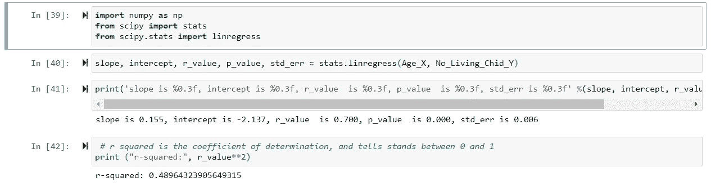

在这种情况下，数值预测特征将是年龄(v012)，而数值目标特征将是回答者的教育状况(v106)

导入所需的库和数据集

根据受教育程度计算受访者的年龄分布

```
#import Ogun NDHS 2013 dataset into pandas
import pandas as pd
path=r'B:\..\..\Ogun_NDHS_2013.dta'
Ogun_ndhs2013=pd.read_stata(path)Variables_needed=['v313','v025', 'v012', 'v013', 'v203', 'v205', 'v218', 'v106', 'v190'] # These are the only variables neededOgun_ndhs2013=Ogun_ndhs2013[Variables_needed]import numpy as np
from scipy import stats
from scipy.stats import f_oneway
```

计算单因素方差分析统计量和 p 值

```
#Age distribution of respondents that have no educationOnly_NoEducation=Ogun_ndhs2013[(Ogun_ndhs2013['v106']=='No education') & (Ogun_ndhs2013['v012']>=15)]
NoEducation_educ_age=Only_NoEducation['v012']#Age distribution of respondents that have primary educationOnly_primary_education=Ogun_ndhs2013[(Ogun_ndhs2013['v106']=='Primary') & (Ogun_ndhs2013['v012']>=15)]
primary_educ_age=Only_primary_education['v012']#Age distribution of respondents that have secondary educationOnly_secondary_education=Ogun_ndhs2013[(Ogun_ndhs2013['v106']=='Secondary') & (Ogun_ndhs2013['v012']>=15)]
secondary_educ_age=Only_secondary_education['v012']#Age distribution of respondents that have higher educationOnly_Higher=Ogun_ndhs2013[(Ogun_ndhs2013['v106']=='Higher') & (Ogun_ndhs2013['v012']>=15)]
Higher_educ_age=Only_Higher['v012']
```

ANOVA 统计值为 16.4，p_value=0.00。由于 p_value <0.05, there is a mean age difference, at least between two respondents by educational status.

```
f_oneway(secondary_educ_age,primary_educ_age, NoEducation_educ_age, Higher_educ_age)
```

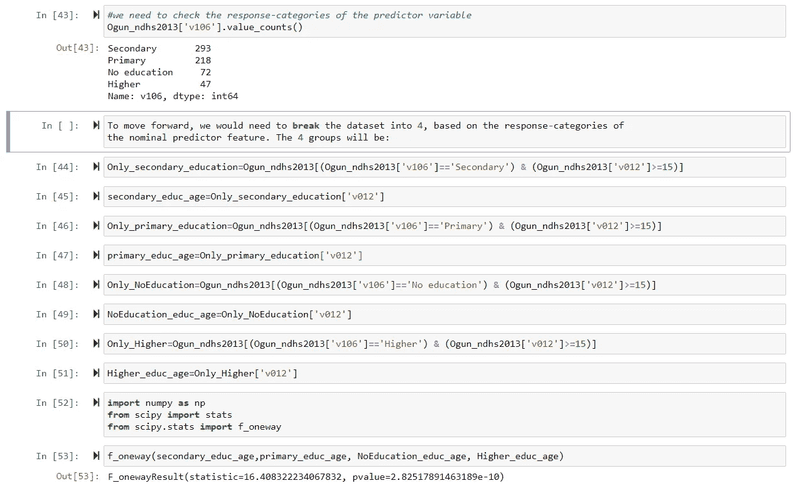

4.2\. Non-parametric Inferential Bivariate Analysis

## **4.2.1 Man-Whitney U 检验:**这是一种非参数方法，类似于双样本独立样本 t 检验，只是在数据是有序的或排序的情况下使用。当没有假设(区间或序数)预测值特征为正态分布或分布未知时，它可用作独立样本 t 检验的替代。当观察值仅为 8 时，仍可使用 Mann-Whitney U 检验。虽然曼恩-惠特尼 U 检验的统计功效比 t 检验小；它在更多扭曲数据的情况下更强，包括那些具有高异常值的数据。Whitney-Manny 假设正在比较的两个样本的方差相等，否则即使数据是有序的，也可能不适合使用。

Mann-Whitney 的零假设是:从一个样本中随机抽取的观察值大于从另一个样本中随机抽取的观察值的概率是 0.5。简单来说，零假设提出两个样本的中位数相等或相同。

在我们分析的这个实例中，目标要素将是-年龄(v012)，而二元预测要素将是-居住地类型(v025)。

导入所需的库和数据集

从 Ogun NDHS 2013 年数据中获取按居住地类型划分的受访者年龄分布，作为系列

```
#import Ogun NDHS 2013 dataset into pandas
import pandas as pd
path=r'B:\..\..\Ogun_NDHS_2013.dta'
Ogun_ndhs2013=pd.read_stata(path)Variables_needed=['v313','v025', 'v012', 'v013', 'v203', 'v205', 'v218', 'v106', 'v190'] # These are the only variables neededOgun_ndhs2013=Ogun_ndhs2013[Variables_needed]import numpy as np
from scipy import stats
from scipy.stats import mannwhitneyu
```

计算 Mann_whitney U 检验统计量及其相关的 p 值

```
#Rural respondents' age data as seriesage_urban=Ogun_ndhs2013[(Ogun_ndhs2013['v012']>=15) & (Ogun_ndhs2013['v025']== "Urban")]
age_urban=age_urban['v012']
 age_urban.std()#Urban respondents' age data as seriesage_rural=Ogun_ndhs2013[(Ogun_ndhs2013['v012']>=15) & (Ogun_ndhs2013['v025']== "Rural")]
age_rural=age_rural['v012']
 age_rural.std()
```

曼-惠特尼统计值为 42368，p_value=0.002。因为 p_value <0.05; so there is a significant age difference between women in urban and rural areas.

```
stats.mannwhitneyu(age_rural,age_urban)
```

**4.2.2 Spearman 等级相关**:这是一种非参数方法，类似于皮尔逊相关统计。该统计数据称为 Spearman 等级系数，用于测量两个变量(预测要素(X)和目标要素(Y))之间关系的强度和方向。为了实现，它要求两个变量中的任何一个都具有顺序属性，因此它们可以是顺序的，也可以是连续的(间隔、比率)。相似等级的特征将具有高的 Spearman 等级相关系数，反之亦然。

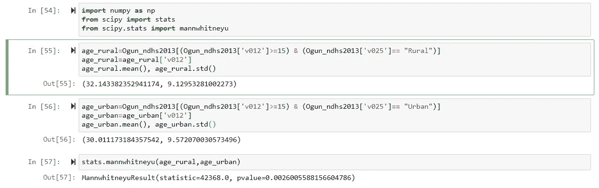

Pearson 相关的统计能力比 spearman 秩相关强，但是，它适用于两个变量的分布不正态或偏斜的情况。

此外，spearman 等级相关测量两个变量之间的单调关系，而 Pearson 统计测量两个变量之间的线性关系。单调关系的度量使用-1 到+1 的范围，如 spearman 相关系数。spearman 的 p 值在样本量为 500 或更多时更可靠。当样本量为 8 时，检验零假设的 Spearman 秩相关的统计可靠性至少是可以接受的。虽然您仍然可以对少于 8 个样本大小的数据进行 spearman 等级相关，但是它的统计功效接近于零。

Spearman 秩相关的零假设是:两个特征之间没有单调关联。单调关系是指两个变量以恒定的速率向同一方向或相反方向移动。

我们将使用—年龄(v012)作为预测特征，使用—存活儿童数量(v218)作为目标特征，假设他们的分布是偏斜的或未知的，但不是正态的。

导入所需的库和数据集

从奥贡 NDHS 2013 年数据中提取 v012 和 v218 作为系列

```
#import Ogun NDHS 2013 dataset into pandas
import pandas as pd
path=r'B:\..\..\Ogun_NDHS_2013.dta'
Ogun_ndhs2013=pd.read_stata(path)Variables_needed=['v313','v025', 'v012', 'v013', 'v203', 'v205', 'v218', 'v106', 'v190'] # These are the only variables neededOgun_ndhs2013=Ogun_ndhs2013[Variables_needed]import numpy as np
from scipy import stats
from scipy.stats import spearmanr
```

计算 Spearman 等级相关统计量及其相关的 p 值

```
Age_X=Ogun_ndhs2013['v012']
No_Living_Chid_Y=Ogun_ndhs2013['v218']
```

spearman 等级相关统计值为 0.72，p 值=0.00。因为 p _ value<0.05; there is a significant positive monotonic relationship between the age of women and their number of living children.

```
stats.spearmanr(Age_X, No_Living_Chid_Y)
```

**4 . 2 . 3 Kruskal Wallis**:这是一种非参数方法，类似于方差分析(ANOVA)，当预测特征(X)有两个以上的响应类别时，它是 Mann-Whitney 检验的替代方法。当每个响应类别至少有 5 个观察值时，Kruskal 遵循卡方分布。它计算预测特征的每个响应类别的目标特征(Y)的中值，然后比较它们是否相同。值得注意的是，Kruskal Wallis 也用于比例参数比较。

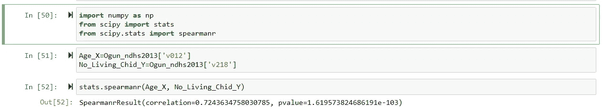

注意，Kruskal Wallis 假设响应类别的方差是相同的。在方差假设不成立的情况下，应该使用情绪统计。

Kruskal-Wallis 的零假设是:目标特征的响应类别的预测特征的中值相同或相等。

我们将使用在计算单向方差分析(单向 ANOVA)中使用的两个变量，假设它们的分布是偏斜的、未知的，但不是正态的。

在这种情况下，数值预测特征将是年龄(v012)，而数值目标特征将是回答者的教育状况(v106)

导入所需的库和数据集

从 Ogun NDHS 2013 年数据中获取按受教育程度分类的受访者年龄分布，作为系列

```
#import Ogun NDHS 2013 dataset into pandas
import pandas as pd
path=r'B:\..\..\Ogun_NDHS_2013.dta'
Ogun_ndhs2013=pd.read_stata(path)Variables_needed=['v313','v025', 'v012', 'v013', 'v203', 'v205', 'v218', 'v106', 'v190'] # These are the only variables neededOgun_ndhs2013=Ogun_ndhs2013[Variables_needed]import numpy as np
from scipy import stats
from scipy.stats import kruskal
```

计算 Kruskal Wallis 统计量和 p 值

```
#Age distribution of respondents that have no education
Only_NoEducation=Ogun_ndhs2013[(Ogun_ndhs2013['v106']=='No education') & (Ogun_ndhs2013['v012']>=15)]
NoEducation_educ_age=Only_NoEducation['v012']#Age distribution of respondents that have primary education
Only_primary_education=Ogun_ndhs2013[(Ogun_ndhs2013['v106']=='Primary') & (Ogun_ndhs2013['v012']>=15)]
primary_educ_age=Only_primary_education['v012']#Age distribution of respondents that have secondary education
Only_secondary_education=Ogun_ndhs2013[(Ogun_ndhs2013['v106']=='Secondary') & (Ogun_ndhs2013['v012']>=15)]
secondary_educ_age=Only_secondary_education['v012']#Age distribution of respondents that have higher education
Only_Higher=Ogun_ndhs2013[(Ogun_ndhs2013['v106']=='Higher') & (Ogun_ndhs2013['v012']>=15)]
Higher_educ_age=Only_Higher['v012']
```

克鲁斯卡尔瓦利斯统计值为 46.33，p_value=0.00。自 p_value <0.05; there is a significant difference in median age among, at least, two women educational groups.

```
stats.kruskal(secondary_educ_age,primary_educ_age, NoEducation_educ_age, Higher_educ_age)
```

**4.2.4 起。情绪中值测试**:这是一种非参数方法，用于测试有序目标特征(Y)在两个或多个标称/二元预测特征(X)的响应类别中是否具有相同的中值。也就是说，它测试目标特征(Y)的响应类别的中值在标称/二元预测特征(X)的不同响应类别中是否相同。

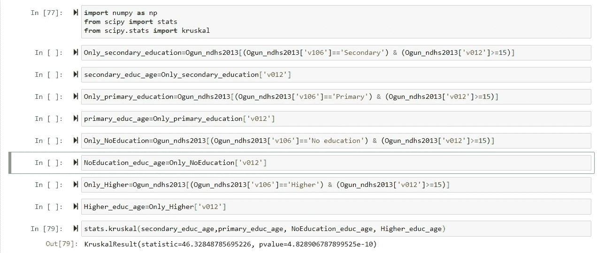

计算情绪中值测试要求计算目标特征的总体中值。然后，目标特征的中值也通过预测特征的响应类别来计算。然后将每个响应类别的中值与总体中值进行比较。基于每个响应类别的大中值和中值之间的比较结果形成列联表。
列联表的值用于计算情绪中位数检验统计量及其 p 值。这种计算方法使得 mood 中位数检验不同于 Mann-Whitney 和 Kruskal-Wallis 中位数检验。

情绪中位数强于惠特尼-曼尼和克鲁斯卡尔-沃利斯的数据，有离群值。Kruskal-Wallis 和 Mann-Whitney 都比 mood 中位数检验具有更强的统计能力，适用于中等规模到更大规模的样本数据，反之亦然。情绪中位数也适用于同质性不成立的情况，如 Kruskal-Wallis 假设的同质性

情绪中值的零假设是:目标特征的响应类别的预测特征的中值相对于总体平均值是相同或相等的

在这种情况下，我们会假设年龄是一个序数特征，因为在一些现实生活中，它被认为是序数。

在这种情况下，预测特征将是年龄(v012)，而目标特征将是回答者的教育状况(v106)

导入所需的库和数据集

从 Ogun NDHS 2013 年数据中获取按受教育程度分类的受访者年龄分布，作为系列

```
#import Ogun NDHS 2013 dataset into pandas
import pandas as pd
path=r'B:\..\..\Ogun_NDHS_2013.dta'
Ogun_ndhs2013=pd.read_stata(path)Variables_needed=['v313','v025', 'v012', 'v013', 'v203', 'v205', 'v218', 'v106', 'v190'] # These are the only variables neededOgun_ndhs2013=Ogun_ndhs2013[Variables_needed]import numpy as np
from scipy import stats
from scipy.stats import median_test
```

计算情绪中值统计和 p 值

```
#Age distribution of respondents that have no education
Only_NoEducation=Ogun_ndhs2013[(Ogun_ndhs2013['v106']=='No education') & (Ogun_ndhs2013['v012']>=15)]
NoEducation_educ_age=Only_NoEducation['v012']#Age distribution of respondents that have primary education
Only_primary_education=Ogun_ndhs2013[(Ogun_ndhs2013['v106']=='Primary') & (Ogun_ndhs2013['v012']>=15)]
primary_educ_age=Only_primary_education['v012']#Age distribution of respondents that have secondary education
Only_secondary_education=Ogun_ndhs2013[(Ogun_ndhs2013['v106']=='Secondary') & (Ogun_ndhs2013['v012']>=15)]
secondary_educ_age=Only_secondary_education['v012']#Age distribution of respondents that have higher education
Only_Higher=Ogun_ndhs2013[(Ogun_ndhs2013['v106']=='Higher') & (Ogun_ndhs2013['v012']>=15)]
Higher_educ_age=Only_Higher['v012']
```

情绪中位数统计值为 29.72，p_value=0.00。自 p_value <0.05; there is a significant difference in the median age, at least, among two women educational groups or samples.

```
stat, p, med, tbl = median_test(secondary_educ_age,primary_educ_age, NoEducation_educ_age, Higher_educ_age)
```

**4.2.5。古德曼和克鲁斯卡的伽马:**这是一种非参数方法，衡量两个排名变量之间的关联，它只是评估两个排名变量之间的排名相关性。

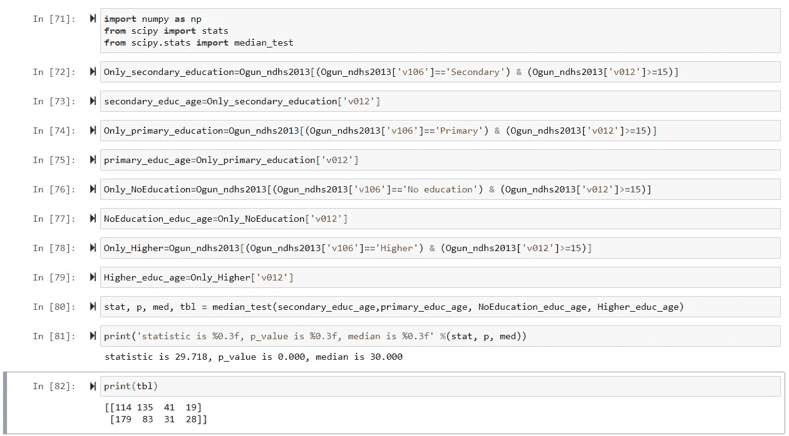

对于要使用的 Goodman 和 Kruskal 伽马统计，必须满足两个假设，即:两个变量必须是有序的，并且两个变量之间的关系必须是单调的。单调关系是指两个变量以恒定的速率向同一方向或相反方向移动。通常不可能用统计方法来估计单调关系，但图表可以粗略地直观地显示出来。相比之下，对于线性关系；这两个变量以相同或相反的方向运动，但速度不同。

Goodman 和 Kruska 的 gamma 可用于替代 Spearman 秩相关、Wilcoxon 双样本检验以及两个变量的观察值具有并列秩值时的符号检验。并列秩是指两个不同样本的观测值具有相同的秩值。

古德曼和克鲁斯卡的伽马统计值为-1 表示负相关；而 Goodman 和 Kruska 的γ统计的+1 值表示正相关。零值意味着没有关系。

值得注意的是，目前 python 中没有用于计算 Goodman 和 Kruska 伽马统计量的包或库。我们将使用 P.Stikker 开发的函数来解决这个问题。Stikker 的方法与 STATA Goodman 和 Kruskal 的方法输出进行了比较，发现是相同的。请注意，P.Stikker 的原文在这里已被修改，以适应我们的需要。

在这种情况下，序数预测要素将是-分类年龄(v013)，而序数目标要素将是-受访者的财富指数(v190)

从 python 中导入所需的库，并添加 P.Stikker 开发的函数

添加 P.Stikker 的 Gamma 和 Kruskals 开发的 python 函数

```
#import Ogun NDHS 2013 dataset into pandas
import pandas as pd
path=r'B:\..\..\Ogun_NDHS_2013.dta'
Ogun_ndhs2013=pd.read_stata(path)Variables_needed=['v313','v025', 'v012', 'v013', 'v203', 'v205', 'v218', 'v106', 'v190'] # These are the only variables neededOgun_ndhs2013=Ogun_ndhs2013[Variables_needed]import numpy as np
from scipy import stats
from scipy.stats import norm
```

评估这两个特征，看是否需要预处理

```
def goodmanKruskalgamma(data, row_feature, column_feature):
    myCrosstable = pd.crosstab(data[row_feature], data[column_feature])

    nRows = myCrosstable.shape[0]
    nCols = myCrosstable.shape[1]

    C = [[0 for x in range(nCols)] for y in range(nRows)]# top left part
    for i in range(nRows):
        for j in range(nCols):
            h = i-1
            k = j-1        
            if h>=0 and k>=0:            
                for p in range(h+1):
                    for q in range(k+1):
                        C[i][j] = C[i][j] + list(myCrosstable.iloc[p])[q]# bottom right part                    
    for i in range(nRows):
        for j in range(nCols):
            h = i+1
            k = j+1        
            if h<nRows and k<nCols:            
                for p in range(h, nRows):
                    for q in range(k, nCols):
                        C[i][j] = C[i][j] + list(myCrosstable.iloc[p])[q]

    D = [[0 for x in range(nCols)] for y in range(nRows)]# bottom left part
    for i in range(nRows):
        for j in range(nCols):
            h = i+1
            k = j-1        
            if h<nRows and k>=0:            
                for p in range(h, nRows):
                    for q in range(k+1):
                        D[i][j] = D[i][j] + list(myCrosstable.iloc[p])[q]# top right part                    
    for i in range(nRows):
        for j in range(nCols):
            h = i-1
            k = j+1        
            if h>=0 and k<nCols:            
                for p in range(h+1):
                    for q in range(k, nCols):
                        D[i][j] = D[i][j] + list(myCrosstable.iloc[p])[q]P = 0
    Q = 0
    for i in range(nRows):
        for j in range(nCols):
            P = P + C[i][j] * list(myCrosstable.iloc[i])[j]
            Q = Q + D[i][j] * list(myCrosstable.iloc[i])[j]

    GKgamma = (P - Q) / (P + Q)

    n = myCrosstable.sum().sum()

    Z1 = GKgamma * ((P + Q) / (n * (1 - GKgamma**2)))**0.5

    forASE_R = 0
    forASE_SPSS = 0
    for i in range(nRows):
        for j in range(nCols):
            forASE_R = forASE_R + list(myCrosstable.iloc[i])[j] * (Q * C[i][j] - P * D[i][j])**2
            forASE_SPSS = forASE_SPSS + list(myCrosstable.iloc[i])[j] * (C[i][j] - D[i][j])**2ASE_R = 4 * (forASE_R)**0.5 / (P + Q)**2
    ASE_SPSS = 2 * (forASE_SPSS - (P - Q)**2 / n)**0.5 / (P + Q)        
    Z_R = GKgamma / ASE_R
    Z_SPSS = GKgamma / ASE_SPSS

    from scipy.stats import norm

    p1 = norm.sf(Z1)
    p2_R = norm.sf(Z_R)
    p3_SPSS = norm.sf(Z_SPSS)

    return print('gamma statistic is %0.3f, p_value for R is %0.3f, ASE for R is %0.3f, p_value for spss is %0.3f, ASE for spss is %0.3f' %(GKgamma,p2_R,Z_R,p3_SPSS,Z_SPSS))
```

预处理财富指数(v190)通过重新编码为三个响应类别(富裕、中等、贫穷)，目前有五个响应类别(最富裕、较富裕、中等、较贫穷和最贫穷)

```
Ogun_ndhs2013['v013'].value_counts()Out[4]:25-29    122
30-34    108
35-39     88
15-19     88
20-24     82
40-44     80
45-49     62
Name: v013, dtype: int64Ogun_ndhs2013['v190'].value_counts()Richest    237
Richer     237
Middle     114
Poorer      40
Poorest      2
Name: v190, dtype: int64
```

计算伽玛和克鲁斯卡尔统计所需的交叉表

```
#We will recode into: Rich, Middle, and Poor
recode_v190 =  { "v190": 
                             {"Richest": 'Rich',  
                              "Richer": 'Rich',  
                              "Middle": 'Middle',  
                              "Poorer": 'Poor' ,
                              "Poorest": 'Poor'}
             }Ogun_ndhs2013.replace(recode_v190, inplace=True)#v190 was recoded into same feature, that's into v190
#New v190 after pre-processingOgun_ndhs2013['v190'].value_counts()
Rich      474
Middle    114
Poor       42
Name: v190, dtype: int64
```

计算伽玛和克鲁斯卡尔统计量和 p 值

```
myCrosstable = pd.crosstab(Ogun_ndhs2013['v013'], Ogun_ndhs2013['v190'])
myCrosstable
```

伽玛和克鲁斯卡尔统计值为-0.122，p_value=0.98。由于 p _ value > 0.05 这两个特征之间没有联系。

```
goodmanKruskalgamma(Ogun_ndhs2013, 'v013', 'v190')
```

**4.2.6 卡方拟合优度检验:**这是一种非参数方法，用于检验分类变量的响应类别的观察比例或频率是否完全不同于其预期值。也就是说，它测试观察值的分布是否符合任何理论分布(二项式、多项式)。这类似于我们如何测试一个特征的均值是否与单样本 T 检验中的假设均值相同。注意，每个响应类别的频率值至少应为 5。

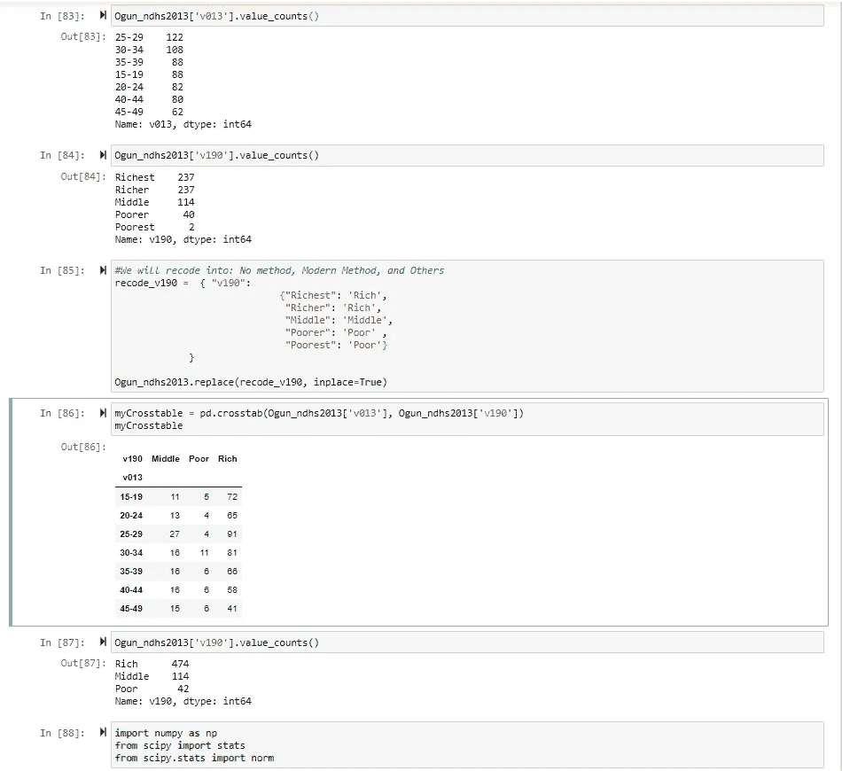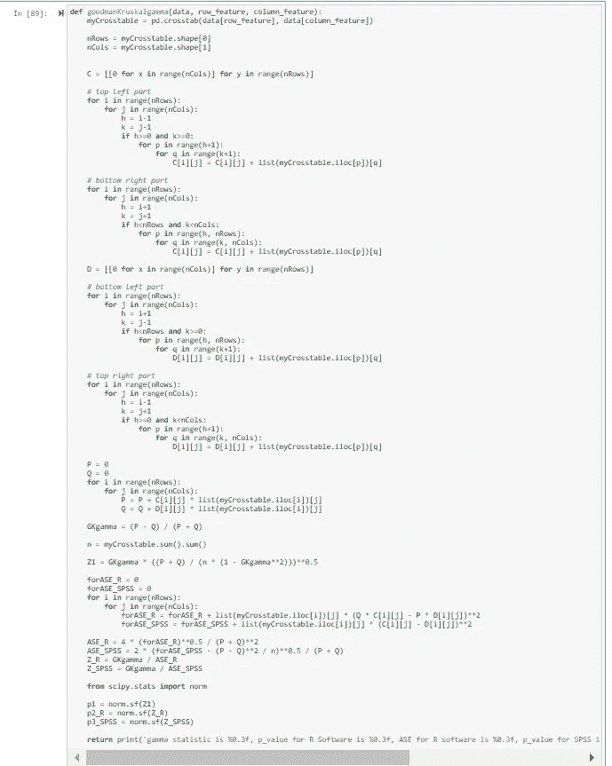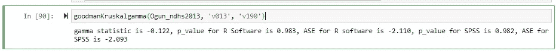

通常，python 中的卡方拟合优度测试命令的设置是—卡方(f_obs，f_exp=None，ddof=0，axis=0)，其中 f_obs 是每个响应类别中的观察值，f_exp 是每个响应类别中的预期观察值。默认情况下，假设它们是一致的，并且是期望值的平均值。axis:f _ OBS 和 f_exp 的广播结果的轴，沿着该轴应用测试。如果轴为 None，f_obs 中的所有值都被视为一个数据集。默认值为 0。

在这种情况下，我们将使用 v313(当前正在使用一种方法)作为目标分类特征，而预测值特征将是 v025(一种居住地类型)

导入所需的库和数据集

指出两个特征的频率(v313，v025)

```
#import Ogun NDHS 2013 dataset into pandas
import pandas as pd
path=r'B:\..\..\Ogun_NDHS_2013.dta'
Ogun_ndhs2013=pd.read_stata(path)Variables_needed=['v313','v025', 'v012', 'v013', 'v203', 'v205', 'v218', 'v106', 'v190'] # These are the only variables neededOgun_ndhs2013=Ogun_ndhs2013[Variables_needed]X_y=Ogun_ndhs2013[['v313','v025']]import sklearn as svm
from sklearn.feature_selection import chi2
```

对这两个特征进行特征工程——将它们的响应类别转换成数值，并合并一些响应类别

```
# None of the value is less than 5
Ogun_ndhs2013 ['v313'].value_counts()
No method             489
Modern method         118
Traditional method     16
Folkloric method        7
Name: v313, dtype: int64X_y['v025'].value_counts()
Urban    358
Rural    272
Name: v025, dtype: int64
```

计算拟合检验统计量和 p 值的卡方优度

```
#We will recode v313 into 2-response-category designated as 1 and 0v313_recode =  { "v313": 
                             {"No method": 0,  
                              "Modern method": 1,  
                              "Traditional method": 0,  
                              "Folkloric method": 0}
             }X_y.replace(v313_recode, inplace=True)#frequency distribution of v313 after feature engineeringX_y['v313'].value_counts()
0    512
1    118
Name: v313, dtype: int64#We will recode v025 into 2-response-category designated as 1 and 2
v025_recode =  { "v025": 
                             {"Urban": 1,  
                              "Rural": 2}
             }X_y.replace(v025_recode, inplace=True)#frequency distribution of v025 after feature engineering
X_y['v025'].value_counts()
1    358
2    272
Name: v025, dtype: int64
```

拟合优度检验统计值为 0.00002121，p_value=0.99632516。由于 p _ value > 0.05 观察值与预期值不符。

```
# state X and yX = X_y.drop('v313',axis=1)
y = X_y['v313']#compute the statistic and p_value
chi_scores = chi2(X,y)
print('statistic=%.3f, p-value=%.3f' % (chi_scores[0], chi_scores[1]))
```

**4.2.7 麦克内马检验**:这是一种非参数方法，用于检验来自总体的同一个二元变量的两个比例是否相同。它也被称为同质性或一致性检验，因为它有助于检查同一二元变量在干预后是否发生了变化。基本上，它回答了这样一个问题——在做了与某件事有关的事情之后，某个现象有变化吗？本质上，它用于评估干预对人群的效果或影响。它用于前后测试研究设计、病例对照研究和配对研究。
它类似于配对样本 t 检验，但针对的是目标二元特征度量，而不是目标连续特征。

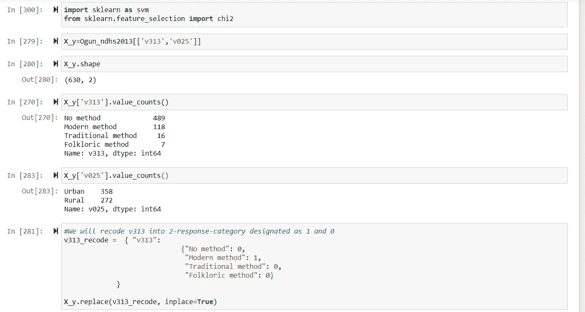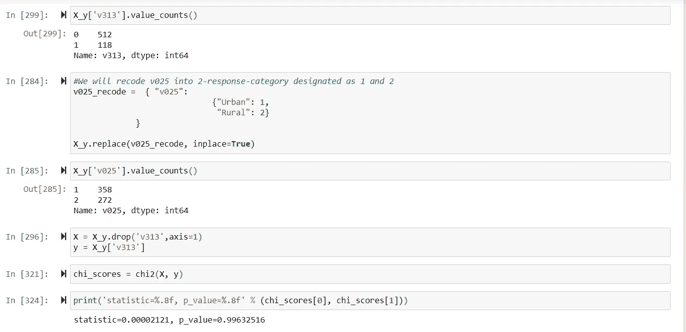

例如，你可以测试在辅导制度化后，通过考试的比例是否有所增加。此外，你可能想测试在计划生育广播 jingo 播出后，使用避孕方法的妇女比例是否增加。

对于 Mcnemar 检验，必须有一个目标二元特征和一个预测二元特征。另外，样本数据应该从总体中随机选取。Mcnemar 检验需要一个 2X2 列联表来检查二元变量的边际同质性。麦克纳玛检验所需的最小样本量为 10。

科克伦的 Q 检验是麦克内马检验的一个更广泛的变体。它用于确定三个或更多相关组之间的二分因变量是否存在差异。

注:如果列联表不是 2x2。那么 exact 将为 false。如果列联表是 2*2 或平方列联表，则使用二项式分布进行估计。如果列联表不是 2*2，则使用卡方分布。卡方是大样本量的检验统计分布的近似值。因此，如果 exact 为 false，则检验统计量为卡方统计量，否则为二项式统计量。

因为对于 Mcnemar 检验，我们主要感兴趣的是评估在不同时间评估的相同二元(二分法)特征/变量的变化；2013 年的 NDHS 是横向的。我们将使用单个变量并修改它来实现我们的分析和说明目标。

导入所需的库和数据集

对于这个分析，我们将预处理 v313 变量并从中创建两个变量。一个作为前测，另一个作为后测

```
#import Ogun NDHS 2013 dataset into pandas
import pandas as pd
path=r'B:\..\..\Ogun_NDHS_2013.dta'
Ogun_ndhs2013=pd.read_stata(path)Variables_needed=['v313','v025', 'v012', 'v013', 'v203', 'v205', 'v218', 'v106', 'v190'] # These are the only variables neededOgun_ndhs2013=Ogun_ndhs2013[Variables_needed]import numpy as np
import statsmodels as sm
import statsmodels.stats as sms
from statsmodels.stats.contingency_tables import mcnemar
```

从 v313 创建预测试功能

```
import numpy as np
from scipy import stats
from scipy.stats import norm
```

从 v313 创建后测试功能

```
#We would use variable - v313Ogun_ndhs2013 ['v313'].value_counts(normalize=True) * 100No method             77.619048
Modern method         18.730159
Traditional method     2.539683
Folkloric method       1.111111
Name: v313, dtype: float64#create a pretest feature Ogun_ndhs2013['pre_test_using_modern_method']=Ogun_ndhs2013['v313']#We will recode into: Yes, No. Only Modern method is yes
pre_recode =  { "pre_test_using_modern_method": 
                             {"No method": 'No',  
                              "Modern method": 'Yes',  
                              "Traditional method": 'No',  
                              "Folkloric method": 'No'}
             }Ogun_ndhs2013.replace(pre_recode, inplace=True)# check the created the pretest feature again
Ogun_ndhs2013['pre_test_using_modern_method'].value_counts(normalize=True) * 100No     81.269841
Yes    18.730159
Name: pre_test_using_modern_method, dtype: float64
```

创建测试前和测试后特征的列联表

```
Ogun_ndhs2013['post_test_using_modern_method']=Ogun_ndhs2013['v313']Ogun_ndhs2013['post_test_using_modern_method'].value_counts(normalize=True) * 100
No method             77.619048
Modern method         18.730159
Traditional method     2.539683
Folkloric method       1.111111
Name: post_test_using_modern_method, dtype: float64#We will recode into: Yes, No. Modern and Tradtional methods are yespost_recode =  { "post_test_using_modern_method": 
                             {"No method": 'No',  
                              "Modern method": 'Yes',  
                              "Traditional method": 'Yes',  
                              "Folkloric method": 'Yes'}
             }Ogun_ndhs2013.replace(post_recode, inplace=True)# check the created post-test feature againOgun_ndhs2013['post_test_using_modern_method'].value_counts(normalize=True) * 100No     77.619048
Yes    22.380952
Name: post_test_using_modern_method, dtype: float64
```

计算麦克纳玛统计量和 p 值

```
post_test_using_modern_method   No  Yes
pre_test_using_modern_method           
No                             489   23
Yes                              0  118
```

麦克纳玛统计值为 0.0000，p_value=0.00000。自 p_value <0.05; There is a significant increase in the proportion of women using modern contraceptives.

```
result=mcnemar(tab0, exact=True)# summarize the finding
print('statistic=%.3f, p-value=%.3f' % (result.statistic, result.pvalue))
```

**4.2.8 Kendall Tau 相关性**:这是一种非参数方法，衡量两个序数变量如何对应。当样本很小且并列等级很多时，它是 spearman 等级相关的替代方法。所涉及的特征必须是有序的或连续的。虽然不是严格的要求，但是两个特征之间的单调关系使得肯德尔τ相关适合使用。就像 Pearson 和 spearman 等级相关一样，相关值的范围从-1 到 0(零)到+1。如果相关统计的值在 1 和 0 之间，那么两个变量之间的关系是正的，在上下文中，这意味着当一个变量增加时，另一个也在增加，如果一个变量减少，另一个也在减少。如果相关统计的值是负的，也就是说，如果它的值在 0 和-1 之间，那么这两个变量具有负的关系。从上下文来看，这意味着当一个变量增加时，另一个变量减少，反之亦然。如果相关统计值为零，即如果其值为 0，则两个变量没有关系。

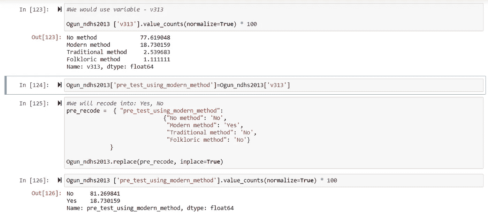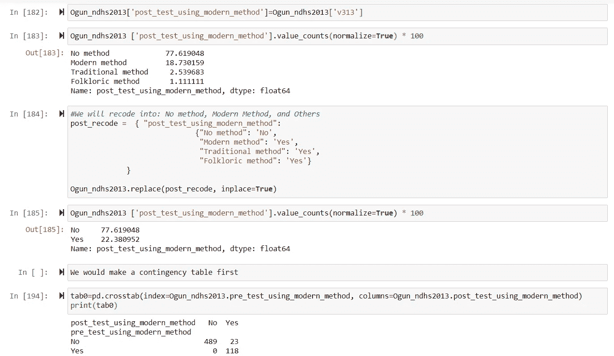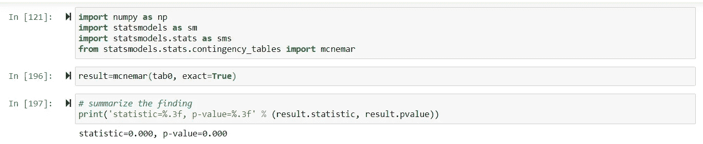

有三种类型的 Kendall Tau 相关性:Kendall Tau-a、Kendall Tau-b 和 Kendall Tau-c，也称为 Stuart 的 Tau-c。虽然它们的值很接近，但它们的值在-1 到+1 范围内的标准化使它们有点不同。当肯德尔τ-a 和肯德尔τ-b、肯德尔τ-c 的秩不并列(并列秩)时，它们是近似的。当预测值特征为二元时，Mann-Whitney U 检验与 Kendall 的 tau 检验相同。

我们将使用在计算 spearman 等级相关系数中使用的两个变量，假设它们的分布是偏斜的或未知的，具有比 spearman 等级更小的尺寸，并且是单调的。

在这种情况下，数值预测要素将是-年龄(v012)，而数值目标要素将是-活孩子数(v218)

导入所需的库和数据集

从奥贡 NDHS 2013 数据中取出 v012 和 v218 作为系列

```
#import Ogun NDHS 2013 dataset into pandas
import pandas as pd
path=r'B:\..\..\Ogun_NDHS_2013.dta'
Ogun_ndhs2013=pd.read_stata(path)Variables_needed=['v313','v025', 'v012', 'v013', 'v203', 'v205', 'v218', 'v106', 'v190'] # These are the only variables neededOgun_ndhs2013=Ogun_ndhs2013[Variables_needed]import numpy as np
from scipy import stats
from scipy.stats import kendalltau
```

计算肯德尔τ相关统计量及其相关的 p 值

```
Age_X=Ogun_ndhs2013['v012']
No_Living_Chid_Y=Ogun_ndhs2013['v218']
```

肯德尔τ相关统计值是 0.57，p_value=0.00000。自 p_value <0.05; There exists a significant relationship between the age of respondents and the number of living children.

```
stats.kendalltau(Age_X, No_Living_Chid_Y)tau, p_value = kendalltau(Age_X, No_Living_Chid_Y)
tau, p_value
```

The Jupyter notebook used for this analysis is available[**此处**](https://github.com/ayobamiakiode/My-projects/blob/master/Bivariate%20Statistical%20Methods%20Analysis%20%20in%20Python%20.ipynb)

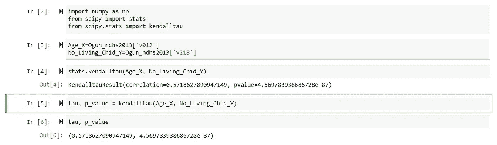

关键要点:

## 将实施双变量可视化作为确认两个特征之间存在关系的唯一方式，在统计学上是不够的。

1.  使用双变量统计测试解决了可视化显示的关系偶然发生的可能性。
2.  双变量统计检验的类型取决于目标和预测要素的类型(分类、数值)、样本大小以及要素的参数性质(参数、非参数)。
3.  对于预测值和目标要素之间的统计测试，如果 p 值小于或等于 0.05 (p 值≤0.05)，则预测值要素可包含在建模中，否则(p 值> 0.05)，预测值要素不应包含在目标要素的建模中。
4.  中心极限定理支持对样本大小≥30 的要素使用参数化方法。
5.  这就对了。希望你觉得这有用？请放下您的评论，在 LinkedIn 上关注我，地址为 [Ayobami Akiode LinkedIn](https://www.linkedin.com/in/ayobami-akiode-38528839/)

**参考文献**

[https://www.real-statistics.com](https://www.real-statistics.com)

特色-我们的统计指南列表|最新统计

 [## 我们有各种各样的 SPSS 统计指南来帮助您分析数据，从更直接的到更…

### statistics.laerd.com

统计学如何:我们其余人的基本统计学！](https://statistics.laerd.com/features-tests.php) [](https://www.statisticshowto.com/) [## 寻找初级统计帮助？你来对地方了。统计怎么有 1000 多条…

### www.statisticshowto.com

Numpy 和 Scipy 文档- Numpy 和 Scipy 文档](https://www.statisticshowto.com/) [](https://docs.scipy.org/) [## 欢迎光临！这是 Numpy 和 Scipy 的文档。

### docs.scipy.org

sci kit-学习](https://docs.scipy.org/) [](https://scikit-learn.org/) [## “我们使用 scikit-learn 来支持前沿基础研究[...]" "我认为这是我设计过的最棒的 ML 套装…

### scikit-learn.org

斯蒂佩特](https://scikit-learn.org/) [](https://www.youtube.com/stikpet) [## 这个频道用来播放一些关于统计学和 SPSS 的教学视频。我的旧视频不包含任何…

### www.youtube.com

维基百科(一个基于 wiki 技术的多语言的百科全书协作计划ˌ也是一部用不同语言写成的网络百科全书ˌ 其目标及宗旨是为全人类提供自由的百科全书)ˌ开放性的百科全书](https://www.youtube.com/stikpet) [](https://www.wikipedia.org/) [## 维基百科是一个免费的在线百科全书，由世界各地的志愿者创建和编辑，由维基媒体托管…

### www.wikipedia.org

www.wikipedia.org](https://www.wikipedia.org/)