# 使用 ITK 快照可视化和检查用于机器学习的 3D 医学图像

> 原文：<https://medium.com/geekculture/visualize-and-examine-3d-medical-images-for-machine-learning-using-itk-snap-55a6b9c2c5ae?source=collection_archive---------3----------------------->

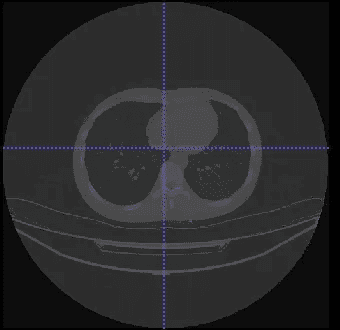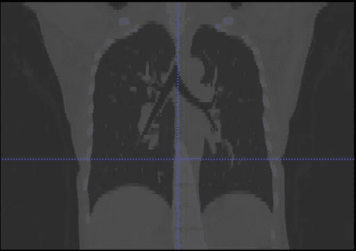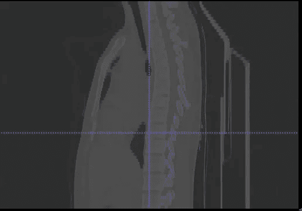

在医疗保健中，**机器学习和深度学习技术的使用急剧增加，特别是在使用医疗图像方面，如 **CT 扫描、MRI 扫描、PET 图像**来训练诊断预测、ROI 分割等算法。**

在选择算法和建立模型之前，必须熟悉他们正在处理的数据。一般来说，医疗数据是在 [*NIfTI(。nii)*](https://nifti.nimh.nih.gov/) ，或者[*DICOM(。*DCM)](https://docs.fileformat.com/image/dicom/)文件格式。与 2D 影像相比，3D 影像难以可视化，并且还包含可以提取的元数据。

[**ITK 快照**](http://www.itksnap.org/pmwiki/pmwiki.php) 是处理 3D 医学图像最流行的工具之一，支持大多数文件格式。就是 ***免费******开源******多平台*** 。

*Fig 1 : Visualization with ITK Snap [*[*source*](http://www.itksnap.org/pmwiki/pmwiki.php)*]*

# **设置 ITK 快照**

要使用 ITK 快照，请在此处安装[的最新版本。根据您的操作系统选择版本。成功安装后，打开应用程序。](http://www.itksnap.org/pmwiki/pmwiki.php?n=Downloads.SNAP3)

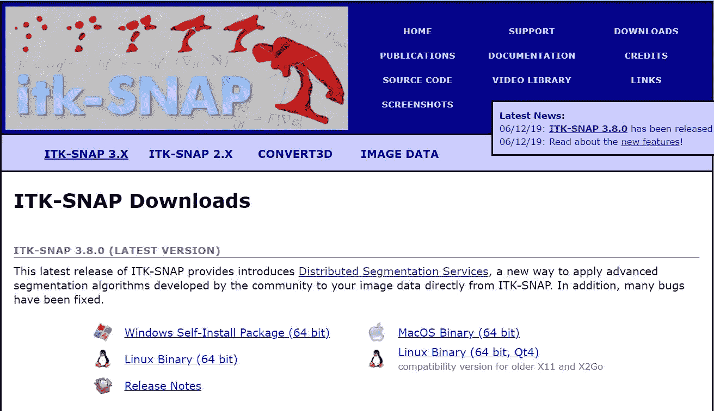

Fig 2 : ITK-SNAP Installation

下一步将是上传你的三维图像到 ITK 快照。

在这个例子中，我们使用了**新冠肺炎受影响肺部的 CT 扫描**。你可以从[**这里**](https://drive.google.com/file/d/1ZtoAM5_HWasBuBjBYgb05AQ8C4UTuSwH/view?usp=sharing) 下载 NIfTI(.nii.gz)图片。因为它们的尺寸很大，所以通常以压缩的形式提供。ITK 可以自动提取 NifTI 文件(。nii)从压缩的(. nii.gz)格式。

**上传 3D 图像**

1.  通过以下方式打开图像

*   使用键盘快捷键 **CTRL+G .**
*   通过**文件导航- >打开主图像。**
*   直接使用右下角的**打开图像**按钮。

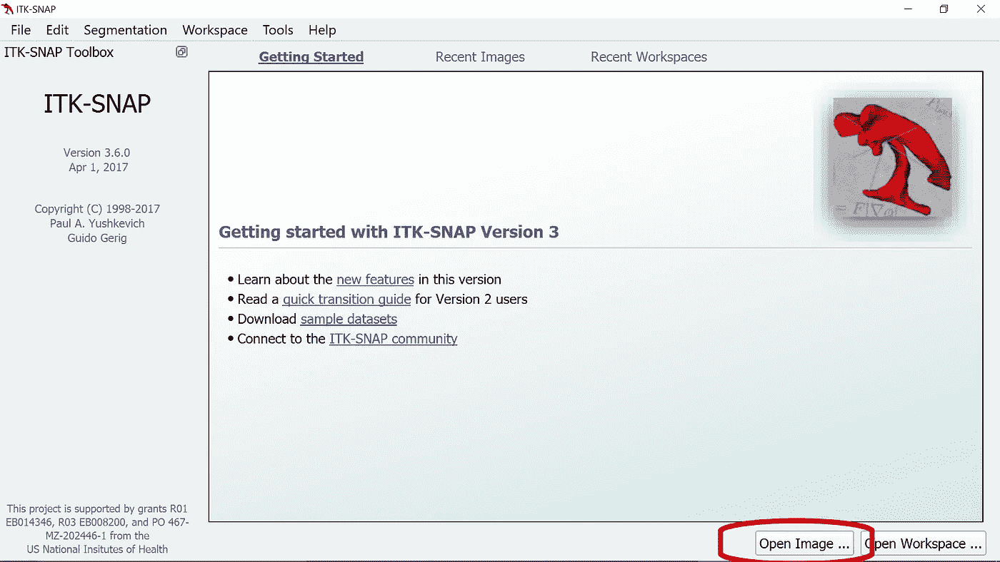

Fig 3: ITK-SNAP landing page

2.浏览本地计算机上的图像，然后按下一步。该格式将被自动识别，但是如果需要可以调整。

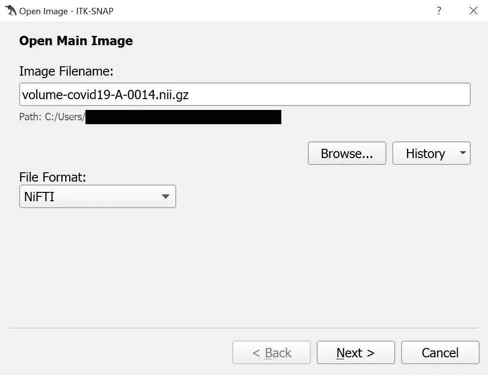

Fig 4 : Selecting Image

3.您将被导航到**图像摘要**页面。这为我们提供了图像元数据的重要信息。

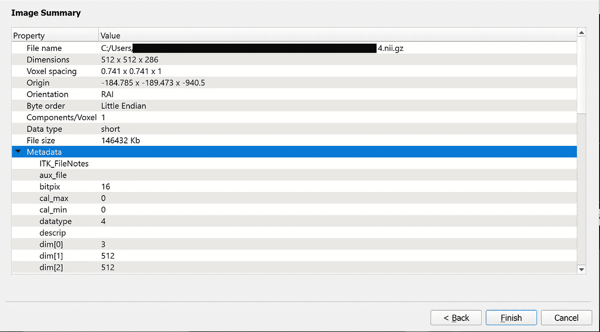

Fig 5 : Image Summary

4.浏览完图像信息后，点击**完成**。将出现如下所示的窗口。

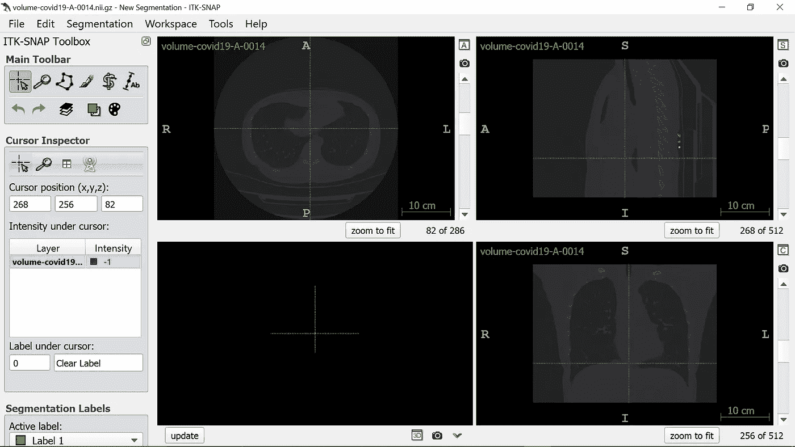

Fig 6 : 3D Visualization of Lung CT Scan

## 解读可视化

现在有趣的部分来了。物体的 3D 表示由沿着一个轴采集的彼此靠近的 ***2D 切片*** 的集合构建。

*   **体素:**切片中的每一个像素都代表从一个小体积中采集的**光强** : *像素变成* [***体素***](https://svi.nl/VoXel) *。*
*   **体积:**体积(3D)图像，表示作为三个空间坐标的函数的**物理量。在数字体积图像中，每个样本(体素)代表在特定位置测量的这个量。**
*   **切片:**图像由包含感兴趣对象的 2D 切片的空间序列构成。一个**切片**被表示为一个像素 (X 和 Y 坐标)的**图像矩阵。**切片号**表示 Z 坐标。**

在 ITK-SNAP 中，从图 6*中可以看到，每个卷都显示了 4 个面板。*

*   ***这些面板中的三个**通过图像显示**正交切片**。*
*   *第四个**第四个**位于**左下方**，显示分割的**三维视图。***

*让我们把注意力集中在切片窗口上。三个切片窗口在正交的**轴向**、**冠状面**和**矢状面**中显示图像体积的三个视图。*

> *请注意，滚动条位于每个切片窗口的旁边。在每个滚动条下有一个**切片计数器**，它显示所显示切片的索引和垂直于切片方向的切片总数。*

*   ***轴面:**又称**横面或水平面**，与地面平行，将车身分为**顶部和**底部。他们是 ***x-z* 位面**。*

*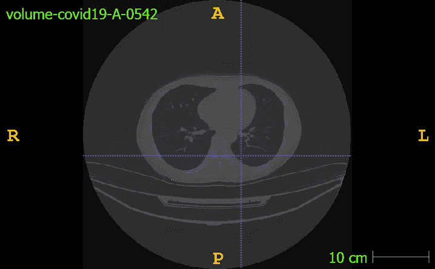*

*Fig 7: Axial view of Lung*

*   ***矢状面** **:** 又称**侧平面**，将身体分为**左右两半**，是一个 **y *-z* 平面**。也就是说，矢状面正好穿过身体左半部分和右半部分的中间。*

*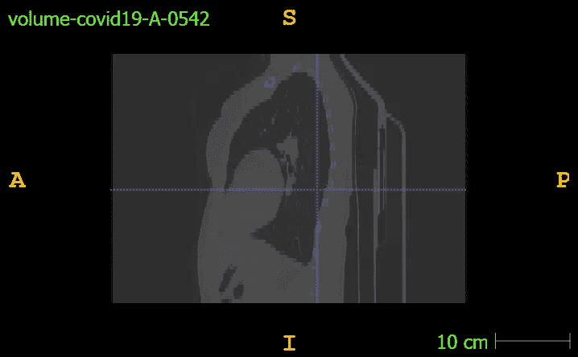*

*Fig 8: Sagittal view of Lung*

*   ***冠状面:**也就是**额面**，将身体分为**前部和**(也叫背侧和腹侧或后前)部分，是 ***x-y* 平面**。*

*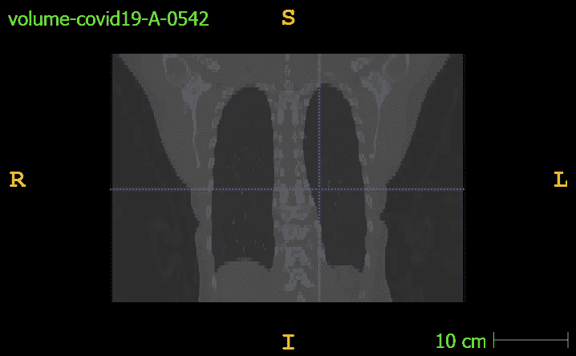*

> *视图是链接的，在一个窗口中导航也会调整其他窗口中的相应位置，从而提供无缝体验。*

*如果数据集为您提供了掩膜或标注，它们可以覆盖在 3D 扫描上并适当可视化。例如，您可以从[这里](https://drive.google.com/file/d/1T_5d3qevPbNZ-I-5vLJtbnba8CXNNzXR/view?usp=sharing)下载我们 CT 扫描的气道标签。*

*进入**分割- >打开分割**，浏览并选择您的掩膜。如果遮罩用于工作空间中的图像，则尺寸必须相同。确认后，分割可以在同一个工作空间清晰可视化。*

*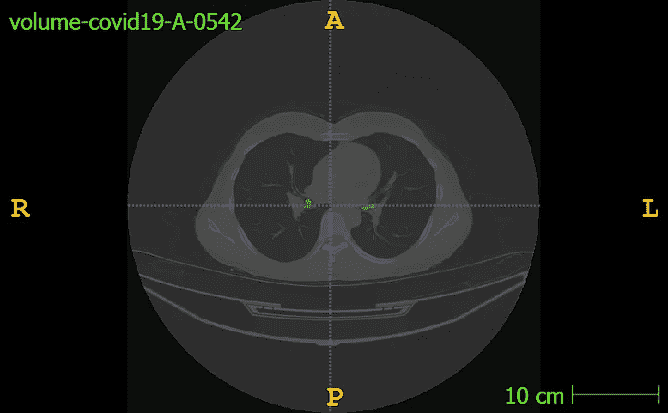**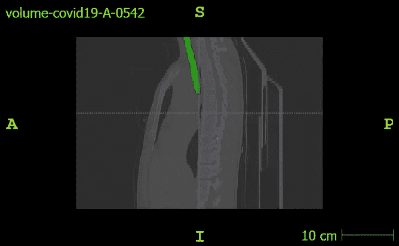**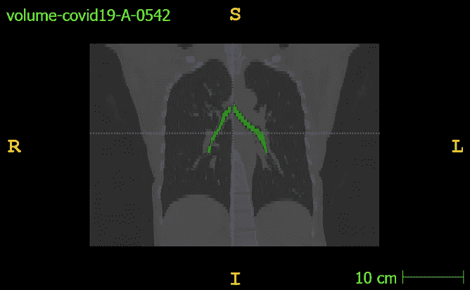*

*Fig 10 Segmented Trachea in all 3 views*

*总之，ITK 快照有助于我们理解和探索我们正在处理的 3D 数据，并有助于决策过程。如果任务是分割，可以使用 ITK 快照来测试生成的掩模，以查看所需的感兴趣区域是否被适当地分割。*

# *参考*

*   *[http://www.itksnap.org/](http://www.itksnap.org/)*
*   *[https://svi.nl/ThreeDeeImage](https://svi.nl/ThreeDeeImage)*
*   *[http://DICOM . NEMA . org/medical/DICOM/current/output/chtml/part 10/chapter _ 7 . html](http://dicom.nema.org/medical/dicom/current/output/chtml/part10/chapter_7.html)*
*   *[https://nifti.nimh.nih.gov/](https://nifti.nimh.nih.gov/)*